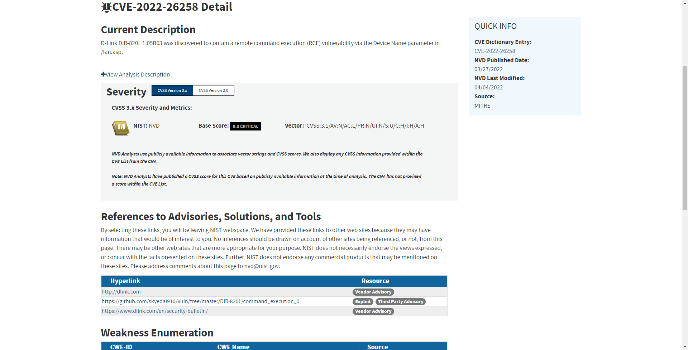
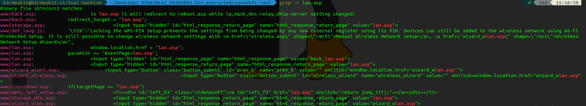
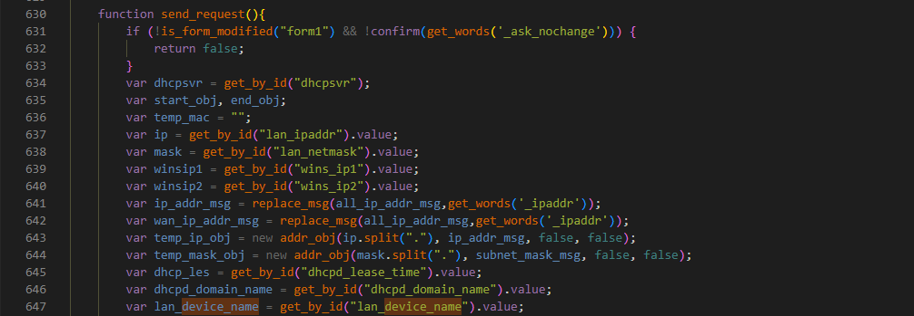
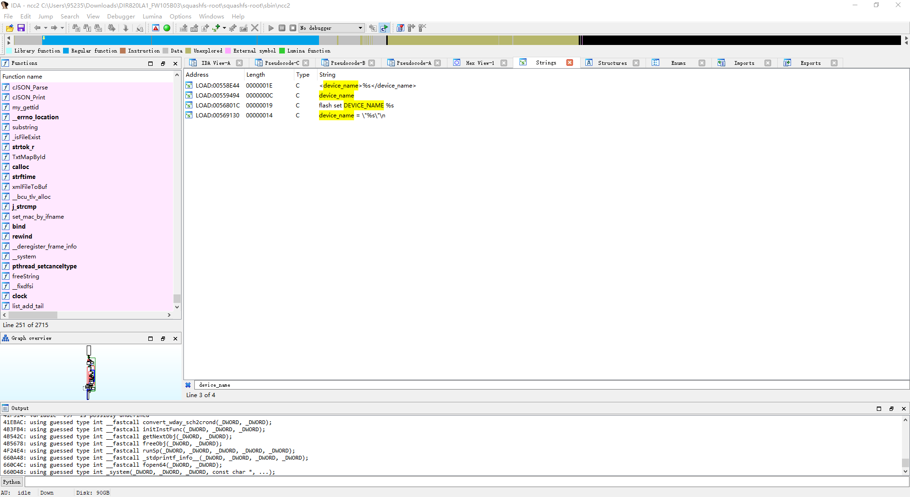
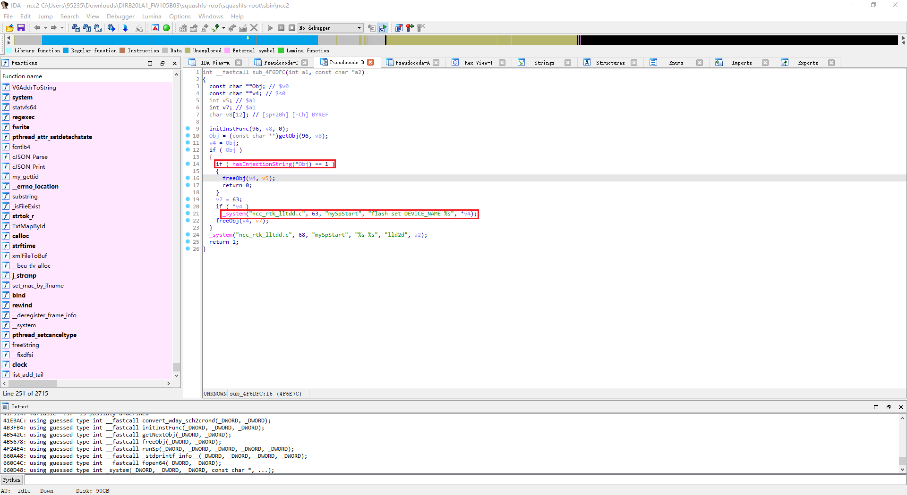
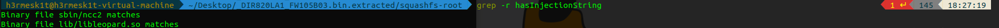
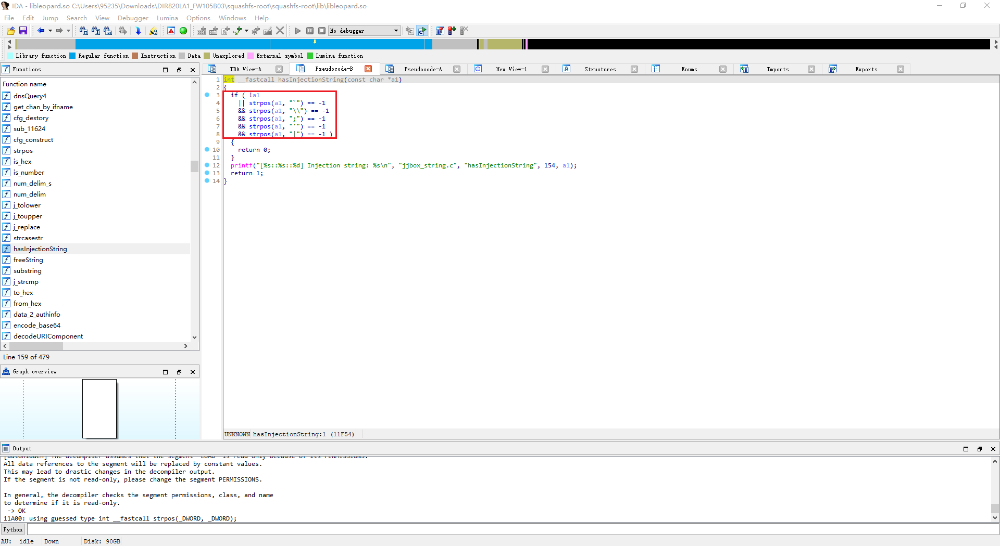
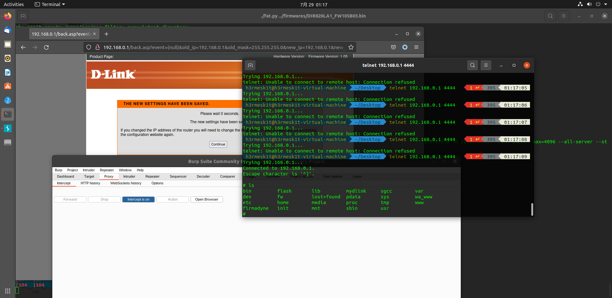

# D-Link DIR-820L

Author: H3rmesk1t

Data: 2022.07.28

# CVE-2022-26258
## Vulnerability Information
Vulnerability information description: D-Link DIR-820L 1.05B03 was discovered to contain a remote command execution (RCE) vulnerability via the Device Name parameter in /lan.asp.

Firmware download address: http://www.dlinktw.com.tw/techsupport/download.ashx?file=2663.

## Vulnerability Analysis
First separate the firmware and see where `lan.asp` is called based on the vulnerability description information.

According to the vulnerability description information, the `device_name` field appears many times in `lan.asp`.

Analyze the binary file `ncc2` and search for `device_name`.

Follow up on the function `sub_4F6DFC`, you can see that the function will first call the `hasInjectionString` function to verify `Obj`, and then call `_system` to execute the command.

Globally find where the `hasInjectionString` function is, and further analyze the `libleopard.so` binary file based on the search results.

You can see that the `hasInjectionString` function filters backticks, `\`, `;`, `'`, `|`.

## Vulnerability reappears
In the previous `hasInjectionString` function `\n` was not filtered, which led to the injection of the `lanHostCfg_DeviceName_1.1.1.0` parameter command, `payload`: `aa%0Atelnetd%20-l%20%2Fbin%2Fsh%20-p%204444%0A`.

