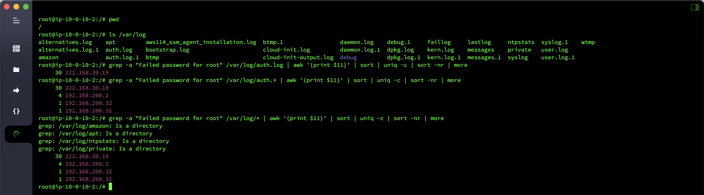
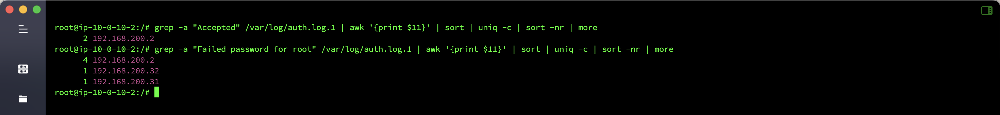
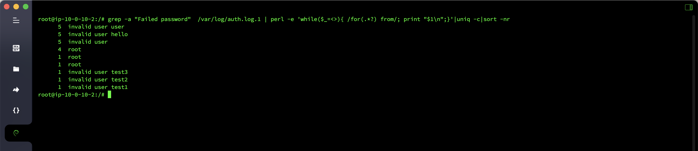
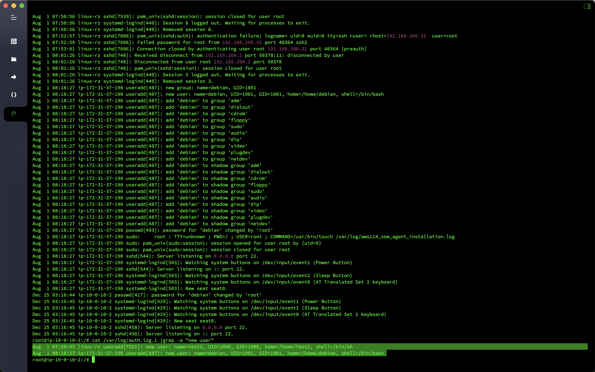

# Emergency response-Linux log analysis

## Overview
- Target machine name: `Linux` log analysis
- Target machine account password: `root`/`linuxrz`
- Question information
  - How many `IP``root` accounts in the blasting host `ssh`, if there are multiple uses`,` split
  - What is the `IP` that successfully logged in with `ssh` blasting? If there are multiple uses`,` split
  - What is the explosion user name dictionary? If there are multiple uses `,` segmentation
  - How many times have the successful login `IP` been blasted in total
  - After the hacker logs into the host, he creates a new backdoor user, what is the user name

## analyze

Check the log of the failure of the root account of the blasting host `ssh` and found that there are a total of three `IPs` that are blasting.

```bash
grep -a "Failed password for root" /var/log/auth.* | awk '{print $11}' | sort | uniq -c | sort -nr | more
```



Check the log of the successful root account of the blasting host `ssh` and found that an IP` was blasted successfully, and it was blasted four times in total.

```bash
grep -a "Accepted" /var/log/auth.log.1 | awk '{print $11}' | sort | uniq -c | sort -nr | more
```

```bash
grep -a "Failed password for root" /var/log/auth.log.1 | awk '{print $11}' | sort | uniq -c | sort -nr | more
```



Let’s count what user names are used to blast, there are a total of six.

```bash
grep -a "Failed password" /var/log/auth.log.1 | perl -e 'while($_=<>){ /for(.*?) from/; print "$1\n";}'|uniq -c|sort -nr
```



The server has created two new backdoor users, with user names `test2` and `debian` respectively.

```bash
cat /var/log/auth.log.1 |grep -a "new user"
```



## Flag

- How many `IP``root` accounts in the blasting host `ssh`, if there are multiple uses`,` split: `flag{192.168.200.2,192.168.200.32,192.168.200.31}`
- What is the `IP` that successfully logged in with `ssh` blasting. If there are multiple uses`, `segment: `flag{192.168.200.2}`
- What is the explosion user name dictionary? If there are multiple uses `,`segment: `flag{user,hello,root,test3,test2,test1}`
- How many times have the successful login `IP` been blasted: `flag{4}`
- After the hacker logs into the host, a new backdoor user is created. What is the user name: `flag{test2}`