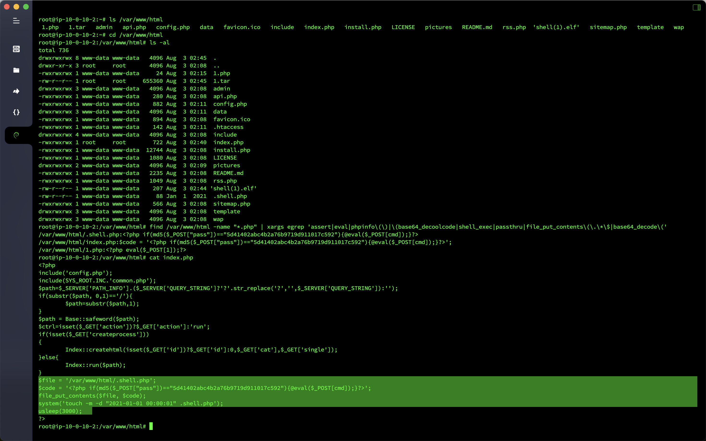
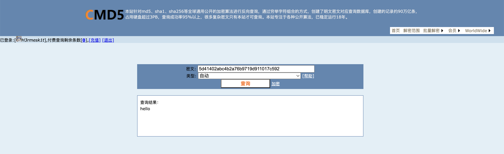
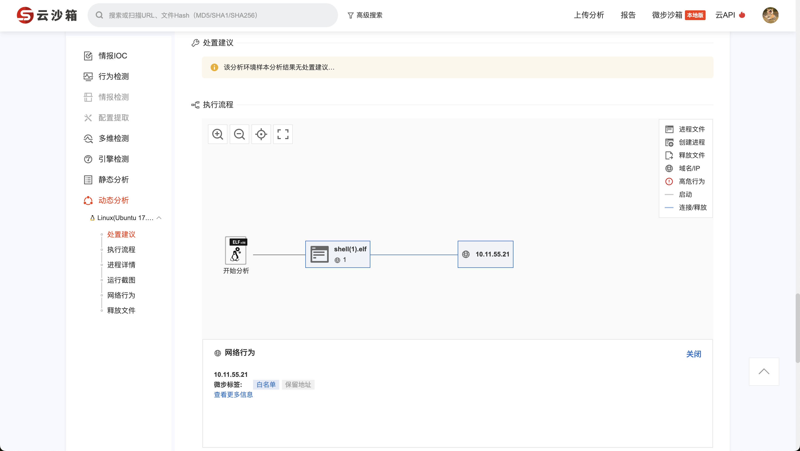
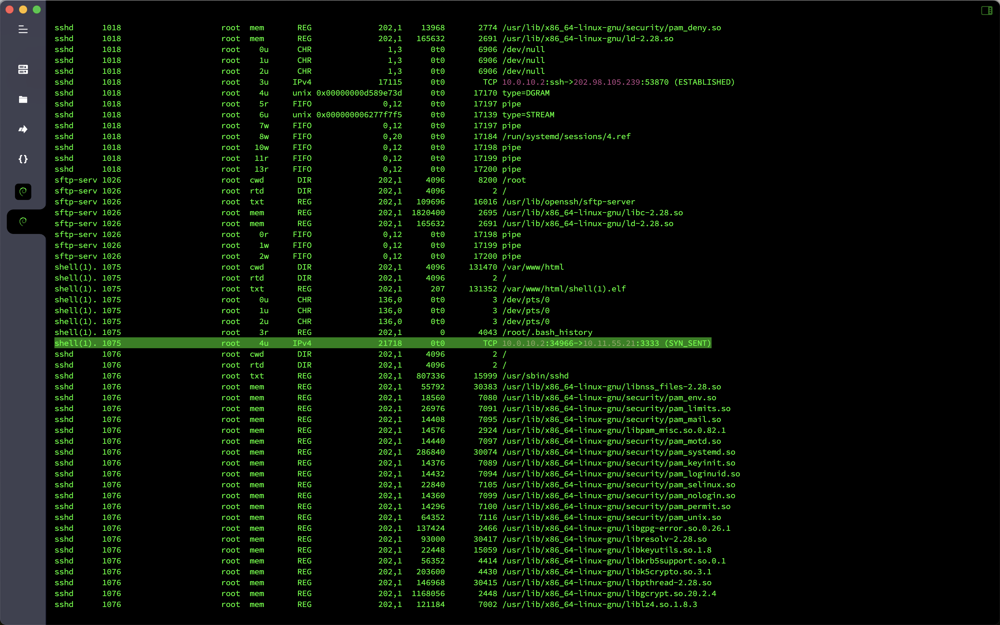

# Emergency response - Linux intrusion investigation

## Overview
- Target machine name: `Linux` intrusion inspection
- Target machine account password: `root`/`linuxruqin`
- Question information
  - The `web` directory exists in Trojan. Please find the password of the Trojan to submit
  - The server is suspected to have an immortal horse. Please find the password of the immortal horse to submit it.
  - Which file is generated by the Immortal Horse? Please submit the file name
  - The hacker left the Trojan file, please find out the hacker's server `ip` submitted
  - The hacker left the Trojan file, please find out the listening port enabled by the hacker server to submit

## analyze

There are multiple `PHP`Trojans in the `WEB` directory, where `1.php` is a sentence Trojan, `index.php` is an immortal horse, and `.shell.php` is a sentence Trojan generated by an immortal horse.

```bash
find /var/www/html -name "*.php" | xargs egrep 'assert|eval|phpinfo\(\)|\(base64_decoolcode|shell_exec|passthru|file_put_contents\(\.\*\$|base64_decode\('
```



Solution to the `MD5` value in the Trojan, which is `hello`.



I found an elf file in the `WEB` directory, and threw it into the `Check` in the Weibu Cloud Sandbox. I confirmed that it was a backdoor return file. The `IP` of the `10.11.55.21`.



Try running the `shell.elf` file in the virtual machine, then check the network connection information, and find that the `3333` port of the hacker server is connected.



## Flag

- The `web` directory exists in the Trojan horse. Please find the password of the Trojan to submit: `flag{1}`
- The server is suspected to have an immortal horse. Please find the password of the immortal horse to submit: `flag{hello}`
- Which file is generated by the Immortal Horse? Please submit the file name: `flag{index.php}`
- The hacker left the Trojan file, please find out the hacker's server `ip` commit: `flag{10.11.55.21}`
- The hacker left the Trojan file, please find out the listening port enabled by the hacker server to submit: `flag{3333}`