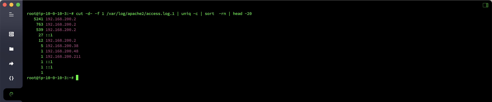
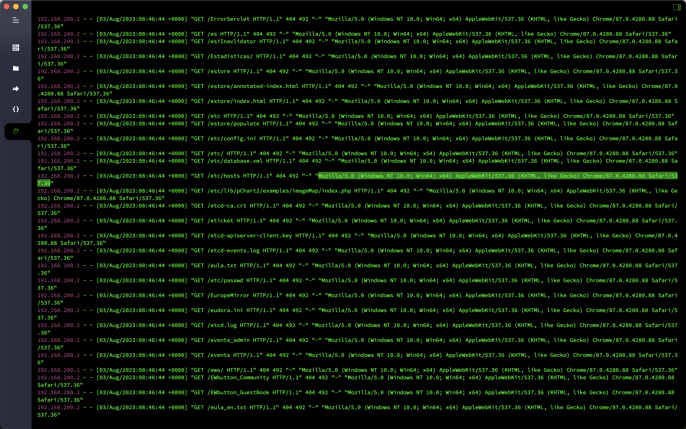

# Log Analysis-Apache Log Analysis

## Overview
- Target machine name: `Apache` log analysis
- Target machine account password: `root`/`apacherizhi`
- Question information
  - The most visited `IP` on the day of submission, i.e. the hacker `IP`
  - What is the browser fingerprint used by hackers? `md5` for submitting fingerprints
  - View the number of times the `index.php` page has been visited and the number of submissions
  - Check how many times the hacker `IP` has visited and how many submissions
  - View how many `IP` visits and the number of submissions are there in this hour at `8`` August 03, 2023

## analyze

Check the access log of `Apache` and count the accessed `IP`. The most visited IP that day is `192.168.200.2`

```bash
cut -d- -f 1 /var/log/apache2/access.log.1 | uniq -c | sort -rn | head -20
```



Check out the request header information of the hacker. The browser fingerprint is `Mozilla/5.0 (Windows NT 10.0; Win64; x64) AppleWebKit/537.36 (KHTML, like Gecko) Chrome/87.0.4280.88 Safari/537.36`.


```bash
cat /var/log/apache2/access.log.1 | grep -a '192.168.200.2'
```



The `index.php` page has been visited `27` in total.

```bash
cat /var/log/apache2/access.log.1 | grep "/index.php" | wc -l
```

Hacker `IP` has visited `6555` in total

```bash
awk '{++S[$1]} END {for (a in S) print a,S[a]}' /var/log/apache2/access.log.1
```

`8`2023``8``03``2023`, there will be `5` IPs` access within one hour

```bash
awk '{print $4,$1}' /var/log/apache2/access.log.1 | grep 03/Aug/2023:08 | awk '{print $2}'| sort | uniq | wc -l
```


## Flag

- The most visited `IP` on the day of submission, i.e. the hacker `IP`: `flag{192.168.200.2}`
- What is the browser fingerprint used by the hacker? `md5` of the fingerprint submitted: `flag{2d6330f380f44ac20f3a02eed0958f66}`
- View the number of times the `index.php` page has been visited, the number of submissions: `flag{27}`
- Check how many times the hacker `IP` has visited, and the number of submissions: `flag{6555}`
- View how many `IP` visits are there in this hour at `8` on August 03, 2023, and the number of submissions: `flag{5}`