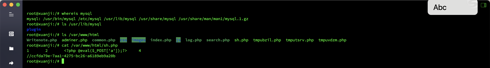
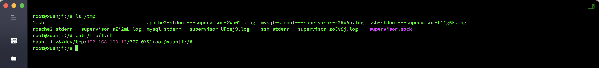
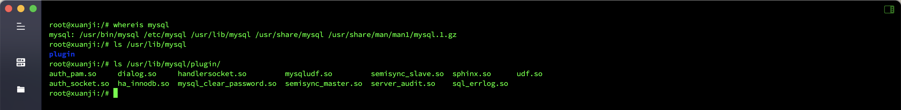
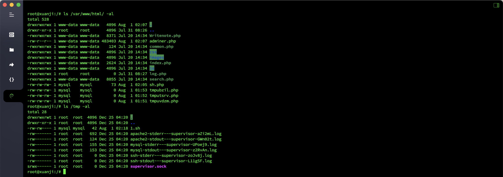

# Log Analysis - MySQL Emergency Response

## Overview
- Target machine name: `MySQL` Emergency Response
- Target machine account password: `root`/`xjmysql`
- Question information
  - The `shell` that the hacker wrote for the first time
  - Hackers rebound `shell``ip`
  - `md5` of the full path to the hacker's escalation file
  - Permissions obtained by hackers

## analyze

Check the `WEB` directory. The first time the hacker writes the `shell` is `/var/www/html/sh.php`.

Found the rebound `Shell` file in the `tmp` directory, the `IP` of the rebound `Shell` is `192.168.100.13`

Since it is `MySQL`, it is guessed that it is `UDF`' promotion. First look for the plug-in path of `MySQL`. The path of the raising file is `/usr/lib/mysql/plugin/udf.so`.

View file permissions, `mysql`.

## Flag

- The first time the hacker writes `shell`: `flag{ccfda79e-7aa1-4275-bc26-a6189eb9a20b}`
- Hacker rebounds `shell`' `ip`: `flag{192.168.100.13}`
- `md5` of the full path of the hacker's escalation file: `flag{b1818bde4e310f3d23f1005185b973e7}`
- Permissions obtained by hackers: `flag{mysql}`