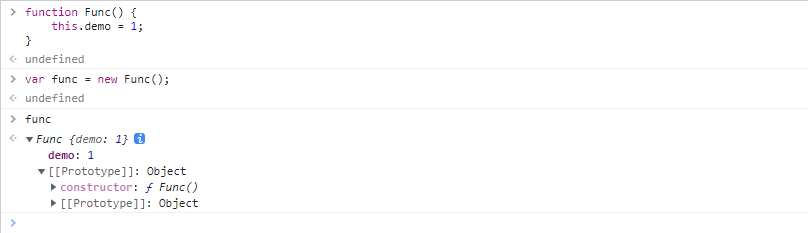
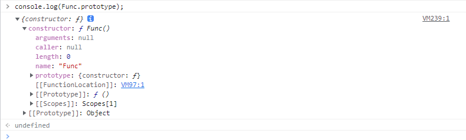
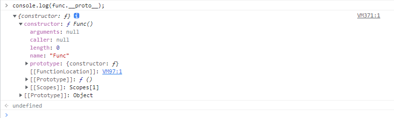
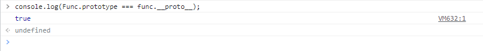
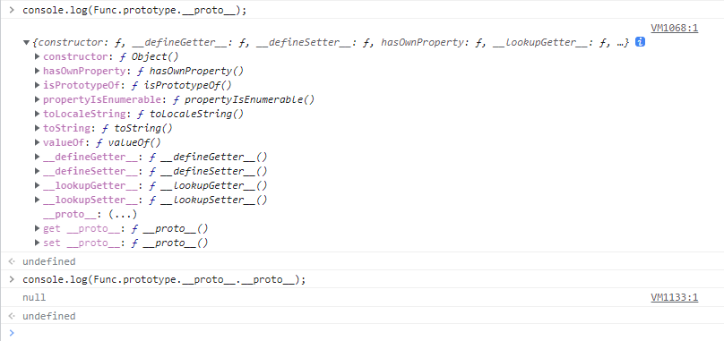
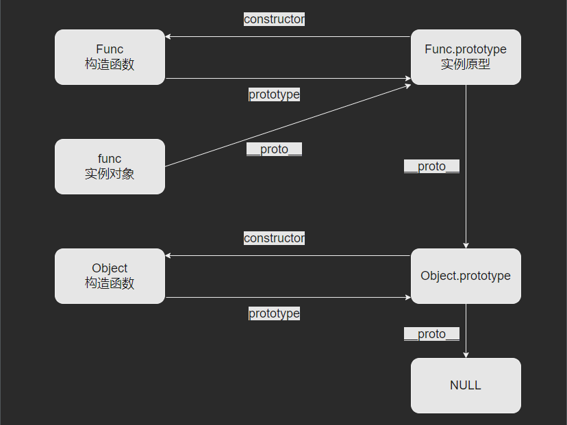
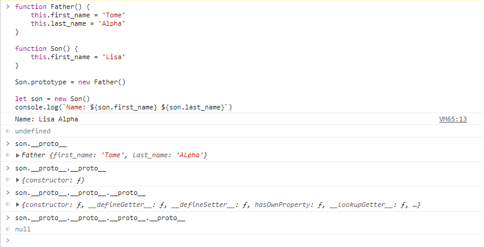
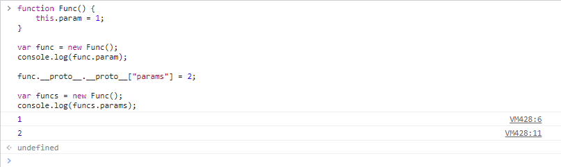
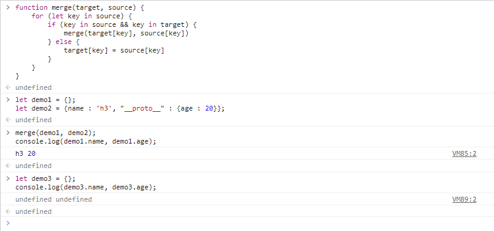
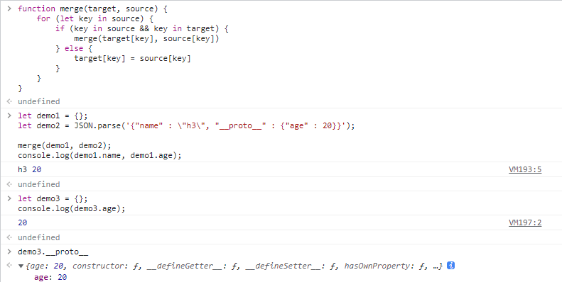

# A brief discussion on JavaScript prototype chain pollution

Author: H3rmesk1t

Data: 2022.04.24

# Pre-knowledge
## JavaScript classes and instances
In JavaScript, the constructor is equivalent to a class and can be instantiated. If you want to define a class, it needs to be defined in the way of defining the constructor. In JavaScript, the object instance is created through the `new` keyword or the `Object.create()` method.

```javascript
function Func() {
    this.demo = 1;
}

var func = new Func();
```

<div align=center></div>

## JavaScript's prototype and __proto__
### Prototype
All JavaScript objects inherit properties and methods from a prototype object `prototype`. Each function/class of JavaScript has a `prototype` attribute, which is used to point to the prototype of the constructor.

For example, the previous `Func` function, its `prototype` property points to the prototype itself of the constructor.

<div align=center></div>

### __proto__ attribute
Each instance object of JavaScript has a `__proto__` attribute that points to the prototype of the instance object. For example, in the previous `Func` function, its instance object `func` has the `__proto__` attribute. When accessing this attribute, you can see that it points to the prototype of the `func` instance object.

<div align=center></div>

### Summarize
An instance object is generated by a function, and the `__proto__` property of the instance object is pointing to the `prototype` property of the function.

<div align=center></div>

And during the call process, whether it is calling the `__proto__` property of the instance object or the `prototype` property of the constructor/class, they all have a `__proto__` property pointing to `Object`, and then calling the `__proto__` property down is to call `Object.__proto__`, whose value is `null`.

<div align=center></div>

# JavaScript prototype chain inheritance
## Prototype Chain
Prototype chain: Since `__proto__` is a property that any `JavaScript` object has, and everything in `JavaScript` is an object, a chain connected with `__proto__` will be formed, and the `__proto__` will be accessed recursively until the end point is `null`. The prototype chains of the `Func` constructor and `func` instance object used above are as follows:

```javascript
func -> Func.prototype -> Object.prototype -> null
```

Prototype chain of array:

```javascript
array -> Array.prototype -> Object.prototype -> null
```

Prototype chain of date:

```javascript
data -> Date.prototype -> Object.prototype -> null
```

Prototype chain of function:

```javascript
func -> function.prototype -> Object.prototype -> null
```

The structure diagram of the prototype chain is shown in the following figure:

<div align=center></div>

Here `func` is an instance object, and `Func.prototype` is a prototype. The prototype accesses the prototype object through `__proto__`. The instance object inherits the properties of the prototype and its prototype object.

## Inherited search process
When calling the object properties, the attribute will be searched. If there is no itself, it will be searched in `__proto__`, that is, it will be searched in the explicit prototype of the constructor. If the attribute is not available in the constructor, because the constructor is also an object and there is also `__proto__`, then it will be searched in the explicit prototype of `__proto__` until `null`. This process well shows that the prototype is the basis of inheritance. For example, the following code, the `Son` class inherits the `last_name` property of the `Father` class, and the final output is `Name: Lisa Alpha`.

```javascript
function Father() {
    this.first_name = 'Tome'
    this.last_name = 'Alpha'
}

function Son() {
    this.first_name = 'Lisa'
}

Son.prototype = new Father()

let son = new Son()
console.log(`Name: ${son.first_name} ${son.last_name}`)
```

When the object `son` is called `son.last_name`, the JavaScript engine will actually perform the following operations:
 - Look for `last_name` in object `son`.
 - If not found, look for `last_name` in `son.__proto__`.
 - If it still cannot be found, continue looking for `last_name` in `son.__proto__.__proto__`.
 - Search in turn until the end of `null` is found. For example, the `__proto__` of `Object.prototype` is `null`.

<div align=center></div>

# JavaScript prototype chain pollution mechanism
Accessing an object's properties in JavaScript can be accessed using `param1.param2.param3` or `praram1["param2"]["param3"]`. Since objects are unordered, when accessing objects in the second way, you can only use the specified subscript to access them. Therefore, we can access its prototype object through `param1["__proto__"]`. Protochain contamination generally occurs when the key names or attribute names of objects or arrays are controllable and are assignment statements.

In actual application scenarios, when the attacker controls and modifies the prototype of an object, it will affect all objects from the same class and parent class as the object. This attack method is prototype chain pollution.

Understand the prototype chain pollution mechanism from the code level, the code is as follows:

```javascript
function Func() {
    this.param = 1;
}

var func = new Func();
console.log(func.param);

func.__proto__.__proto__["params"] = 2;

var funcs = new Func();
console.log(funcs.params);
```

<div align=center></div>

# JavaScript prototype chain pollution application scenarios
As mentioned above, prototype chain pollution generally occurs when the key names or attribute names of objects or arrays are controllable and are assignment statements. Therefore, it is generally possible to set the `__proto__` value, that is, the `JavaScript` prototype chain pollution is prone to occur in scenarios where the key names of arrays (objects) can be controlled. There are mainly two types of them:
 - Object `merge`, that is, the operation of merging array objects.
 - Object `clone`, the kernel is to transfer the object to be operated into an empty object.

Taking the object `merge` as an example, Refer to [P God Article](https://www.leavesongs.com/PENETRATION/javascript-prototype-pollution-attack.html#:~:text=%E5%8E%9F%E5%9E%8B%E9%93%BE%E6%B1%A1%E6%9F%93%E3%80%82-,0x04%20%E5%93%A The `merge` function used in A%E4%BA%9B%E6%83%85%E5%86%B5%E4%B8%8B%E5%8E%9F%E5%9E%8B%E9%93%BE%E4%BC%9A%E8%A2%AB%E6%B1%A1%E6%9F%93%EF%BC%9F,-%E5%9C%A8%E5%AE%9E%99%85%E5%BA%94%E7%94%A8):

```javascript
function merge(target, source) {
    for (let key in source) {
        if (key in source && key in target) {
            merge(target[key], source[key])
        } else {
            target[key] = source[key]
        }
    }
}
```

During the merge process, there is an assignment operation `target[key] = source[key]`. Therefore, when controlling the key `target`
The prototype chain can be contaminated when it is `__proto__`. The example `Payload` is as follows:

```javascript
let demo1 = {};
let demo2 = {name : 'h3', "__proto__" : {age : 20}};

merge(demo1, demo2);
console.log(demo1.name, demo1.age);

let demo3 = {};
console.log(demo3.name, demo3.age);
```

<div align=center></div>

You can see that the `Payload` has not been polluted successfully, because in the process of creating `demo2` in JavaScript, `proto` already represents the prototype of `demo2`. When traversing all key names of `demo2`, you get `[name, age]`, and `proto` is not a `key`, and naturally the prototype of `Object` will not be modified. At this time, you need to change the part of the `demo2` instance object to `JSON` format, and the modified `Payload` is as follows:

```javascript
let demo1 = {};
let demo2 = JSON.parse('{"name" : \"h3\", "__proto__" : {"age" : 20}}');

merge(demo1, demo2);
console.log(demo1.name, demo1.age);

let demo3 = {};
console.log(demo3.age);
```

<div align=center></div>

As you can see, the newly created `demo3` object also has the `age` attribute, indicating that `Object` has been polluted. This is because, in the case of `JSON` parsing, `__proto__` will be considered a real "key name" and does not represent a "prototype", so this key will exist when traversing `demo2`. The `merge` operation is the most common operation that may control the key name, and it can be most attacked by the prototype chain. Many common libraries have this problem.

# refer to
 - [In-depth understanding of JavaScript Prototype pollution attack](https://www.leavesongs.com/PENETRATION/javascript-prototype-pollution-attack.html#0x02-javascript)