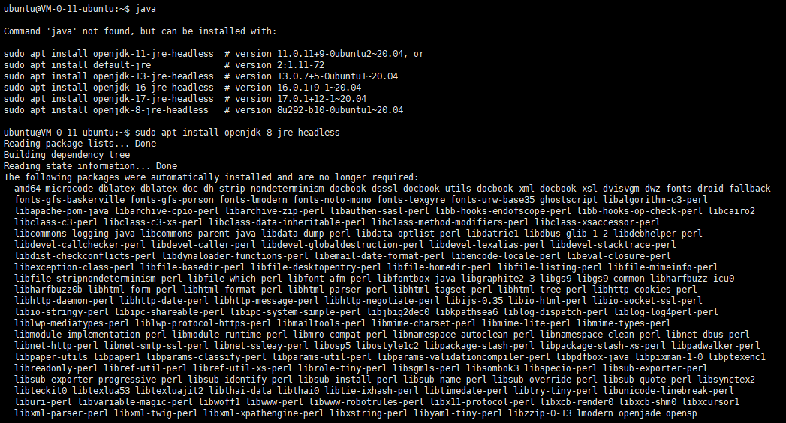
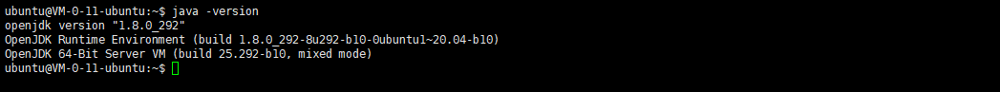
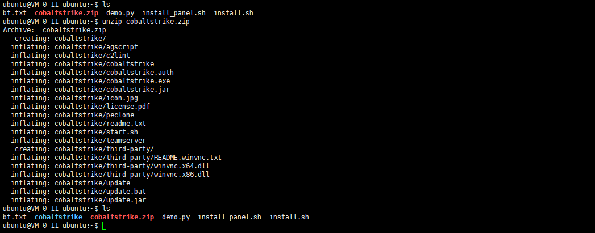
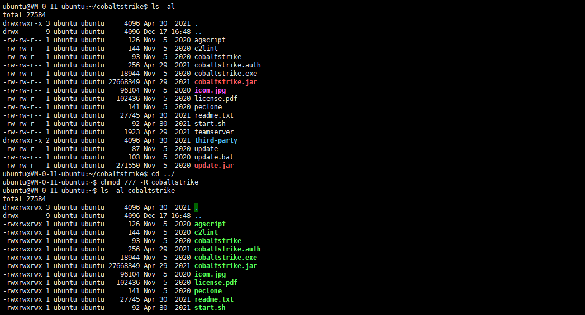
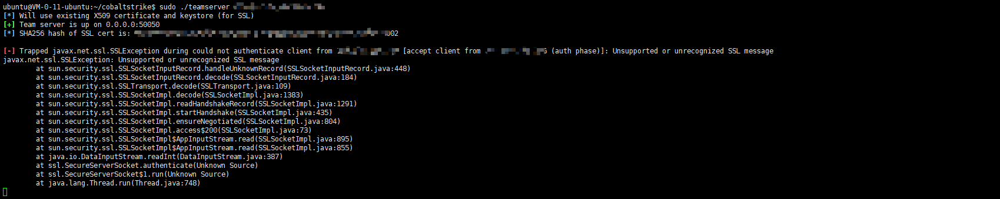
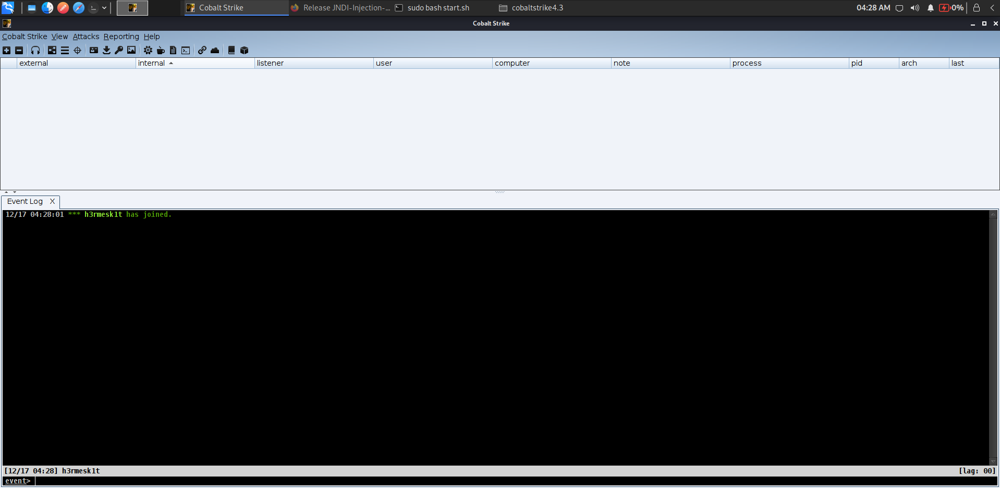

# VPS to build CobaltStrike

# Preface
When studying `CobaltStrike` and even `Metasploit`, they are in the intranet environment, and when testing something, they are in the intranet environment and have no public network address; or when setting up a boundary host, it is necessary to set up a `CobaltStrike` on it, this article records the problem of setting up a `CobaltStrike` server on `vps` to solve some problems with setting up a single point of host.

# Introduction to Cobalt Strike
`Cobalt Strike` is a penetration testing tool developed by the United States. It is often called `CS` by the industry. It has multiple protocol hosts online methods, integrating functions such as raising rights, credential export, port forwarding, `socket` proxy, `office` attack, file bundling, phishing, etc.

`Cobalt Strike` is composed of `3` parts: TeamServer, Client, Server
> * Server: The hosted host is a server that has been implanted in the backdoor and obtained permissions. It represents the attacked party. `Server` will contact `TeamServer`
> * Client: The client, that is, the attacking machine, represents the attacking party, and the Client will contact the TeamServer.
> * TeamServer: Team Collaboration Server, which can manage multiple `beacon` sessions. The same `beacon` session can be used by multiple `Clinet`. One `beacon` session is equivalent to a collaborative document, which can be operated by multiple people.

It should be noted that there is only one server, while there can be multiple clients, and the team can perform distributed group operations. The client can run on `Windows`, but the server must run on `Linux`, and both require a `Java` environment.

#Environmental construction
## JDK environment construction
Since CobaltStrike is a Java development, it requires a Java environment to be used on Windows or Linux. Therefore, first install the JDK environment

Check whether `java` has been installed. If it is not installed, select the required version according to the prompts to install it.

Verify that the installation is successful

## CobaltStrike Installation
Here is a [download link] of `CobaltStrike4.3.7` (https://anonfiles.com/D9F854E7u0/cobaltstrike4.3_7z), and the decompression password is: `H3rmesk1t`

Upload `CobaltStrike` to `vps`

Enter the directory and give `teamserver` `777` permission

Start the server: ./teamserver vps ip connection password
The client connects based on the server information

If the connection is denied, please enable the port `sudo ufw allows 50050`